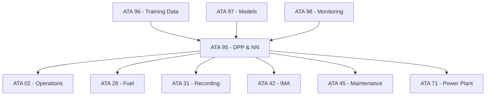

# 95-00-05-00-004_Cross_ATA_Interface_Map

## Document Information
- **Document ID**: 95-00-05-00-004
- **Type**: Document (D)
- **Section**: META (00)
- **Title**: Cross-ATA Interface Map
- **Status**: Draft
- **Version**: 0.1.0
- **Last Updated**: 2025-11-17

## Purpose

This document maps the interfaces between ATA 95 (Neural Networks & Digital Product Passport) and other ATA chapters, ensuring comprehensive system integration.

## Interface Mapping Matrix

### ATA 02 - Operations Information
| Interface ID | Description | Type | Status |
|-------------|-------------|------|--------|
| 95-00-05-03-005 | Operations data feed to DPP | Data | Active |
| 95-02-IF-001 | Flight phase detection | Model | Planned |
| 95-02-IF-002 | Performance metrics logging | Data | Active |

### ATA 28 - Fuel System (H₂)
| Interface ID | Description | Type | Status |
|-------------|-------------|------|--------|
| 95-00-05-03-006 | H₂ consumption data | Data | Active |
| 95-28-IF-001 | Tank level prediction | Model | In Development |
| 95-28-IF-002 | Fuel quality monitoring | Data | Active |

### ATA 31 - Recording Systems
| Interface ID | Description | Type | Status |
|-------------|-------------|------|--------|
| 95-00-05-03-007 | Data recording interface | Data | Active |
| 95-31-IF-001 | Event logging API | System | Active |
| 95-31-IF-002 | Model inference recording | Data | Active |

### ATA 42 - Integrated Modular Avionics
| Interface ID | Description | Type | Status |
|-------------|-------------|------|--------|
| 95-00-05-03-008 | IMA integration | System | Active |
| 95-42-IF-001 | ARINC 664 AFDX mapping | System | Active |
| 95-42-IF-002 | Compute resource allocation | System | In Development |

### ATA 45 - Maintenance Systems
| Interface ID | Description | Type | Status |
|-------------|-------------|------|--------|
| 95-00-05-03-009 | Predictive maintenance data | Data | Active |
| 95-45-IF-001 | Maintenance event tracking | System | Active |
| 95-45-IF-002 | Component health prediction | Model | In Development |

### ATA 71 - Power Plant (Fuel Cells)
| Interface ID | Description | Type | Status |
|-------------|-------------|------|--------|
| 95-71-IF-001 | Fuel cell performance data | Data | Active |
| 95-71-IF-002 | Power optimization model | Model | In Development |
| 95-71-IF-003 | Degradation prediction | Model | Planned |

### ATA 96 - Neural Network Training Data
| Interface ID | Description | Type | Status |
|-------------|-------------|------|--------|
| 95-96-IF-001 | Training data pipeline | Data | Active |
| 95-96-IF-002 | Data lineage tracking | Data | Active |
| 95-96-IF-003 | Dataset versioning | System | Active |

### ATA 97 - Neural Network Models
| Interface ID | Description | Type | Status |
|-------------|-------------|------|--------|
| 95-97-IF-001 | Model registry interface | System | Active |
| 95-97-IF-002 | Model deployment API | System | Active |
| 95-97-IF-003 | Model versioning | System | Active |

### ATA 98 - NN Runtime Monitoring
| Interface ID | Description | Type | Status |
|-------------|-------------|------|--------|
| 95-98-IF-001 | Runtime monitoring data | Data | Active |
| 95-98-IF-002 | Performance metrics API | System | Active |
| 95-98-IF-003 | Drift detection interface | Model | In Development |

## Interface Dependencies

## Interface Criticality

### Safety-Critical Interfaces
- 95-42-IF-001: ARINC 664 AFDX mapping (DO-178C DAL A)
- 95-28-IF-001: Tank level prediction (Safety monitoring)
- 95-98-IF-003: Drift detection (Runtime safety)

### Performance-Critical Interfaces
- 95-42-IF-002: Compute resource allocation
- 95-71-IF-002: Power optimization model
- 95-97-IF-002: Model deployment API

### Data-Critical Interfaces
- 95-96-IF-002: Data lineage tracking (Certification)
- 95-31-IF-002: Model inference recording (Audit)
- 95-98-IF-001: Runtime monitoring data (Safety)

## Related Documents

- [95-00-05-00-005_Interface_Traceability_Matrix](./95-00-05-00-005_Interface_Traceability_Matrix.csv)
- [95-00-05-00-006_Interface_Registry](./95-00-05-00-006_Interface_Registry.json)
- [95-00-03_Requirements](../../95-00-03_Requirements/)

## Approval

- **Author**: AMPEL360 Systems Integration Team
- **Reviewer**: TBD
- **Approver**: TBD

---

*This document is part of the AMPEL360 BWB H₂ Hy-E Q100 project documentation.*
*Copyright © 2025 AMPEL360 Project Contributors*
