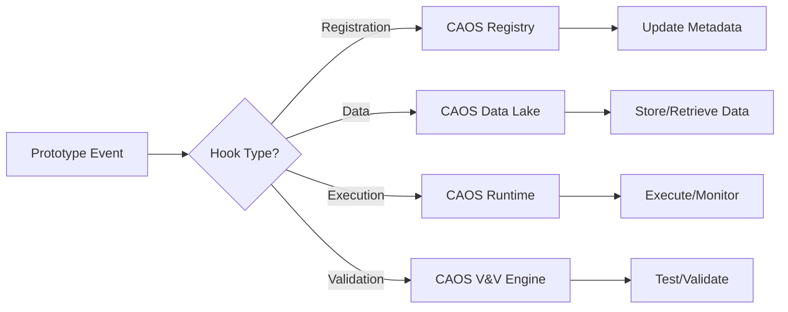

# 95-00-08-00-007_CAOS_Prototyping_Hooks

## Document Information

- **Document ID**: 95-00-08-00-007
- **Title**: CAOS Prototyping Hooks
- **Version**: 1.0
- **Status**: Active
- **Date**: 2025-11-17
- **Author**: AMPEL360 Documentation WG
- **Related Documents**: 
  - 95-00-08-00-001_Prototyping_Strategy
  - 95-00-08-10-005_Integration_with_CAOS_and_MCP

---

## 1. Purpose

This document defines the integration points (hooks) between the **CAOS (Continuous Airworthiness Operations System)** and the Prototyping framework. CAOS is the AI-powered operations platform that orchestrates the entire AMPEL360 system, and these hooks ensure seamless integration of prototypes into the broader operational ecosystem.

---

## 2. CAOS Overview

**CAOS (Continuous Airworthiness Operations System)** is the fourth pillar of AMPEL360, complementing CAD, CAE, and CAM. It provides:

- **Digital Twin Operations**: Real-time simulation and prediction
- **Predictive Maintenance**: AI-driven maintenance scheduling
- **Operational Intelligence**: Data-driven decision support
- **Lifecycle Management**: From design to retirement

---

## 3. Prototyping Hooks Architecture

### 3.1 Hook Categories

Prototyping hooks are organized into **four categories**:

1. **Registration Hooks**: Prototype lifecycle events
2. **Data Hooks**: Data exchange between prototypes and CAOS
3. **Execution Hooks**: Runtime integration for prototypes
4. **Validation Hooks**: Automated testing and validation

### 3.2 Hook Invocation Model



---

## 4. Registration Hooks

### 4.1 Hook: `prototype.register`

**Triggered when**: A new prototype is initiated

**Payload**:
```json
{
  "hook": "prototype.register",
  "timestamp": "2025-11-17T10:30:00Z",
  "prototype_id": "MP-ALPHA-ATA95-001-v0.3",
  "owner": "alice.smith@ampel360.com",
  "type": "Model Prototype",
  "stage": "Alpha",
  "maturity_level": "ML1",
  "metadata": {
    "requirements": ["REQ-95-00-03-001"],
    "tags": {"domain": "prediction", "ml_framework": "TensorFlow"}
  }
}
```

**CAOS Action**:
- Register prototype in CAOS Prototype Registry
- Create monitoring dashboard
- Allocate resources (if needed)
- Notify stakeholders

---

### 4.2 Hook: `prototype.status_change`

**Triggered when**: Prototype status or maturity level changes

**Payload**:
```json
{
  "hook": "prototype.status_change",
  "timestamp": "2025-11-17T11:45:00Z",
  "prototype_id": "MP-ALPHA-ATA95-001-v0.3",
  "old_status": "In Progress",
  "new_status": "Testing",
  "old_maturity": "ML1",
  "new_maturity": "ML2"
}
```

**CAOS Action**:
- Update prototype metadata
- Trigger maturity level gate review (if applicable)
- Update resource allocation
- Notify PRB

---

### 4.3 Hook: `prototype.retire`

**Triggered when**: Prototype is retired or terminated

**Payload**:
```json
{
  "hook": "prototype.retire",
  "timestamp": "2025-11-17T15:00:00Z",
  "prototype_id": "MP-ALPHA-ATA95-001-v0.3",
  "reason": "Superseded by production model",
  "lessons_learned": "https://docs.ampel360.com/lessons/MP-001"
}
```

**CAOS Action**:
- Archive prototype data
- Release resources
- Store lessons learned
- Update traceability matrices

---

## 5. Data Hooks

### 5.1 Hook: `prototype.data_ingest`

**Triggered when**: Prototype ingests data from CAOS Data Lake

**Payload**:
```json
{
  "hook": "prototype.data_ingest",
  "timestamp": "2025-11-17T12:00:00Z",
  "prototype_id": "MP-ALPHA-ATA95-001-v0.3",
  "data_source": "caos://data-lake/flight-data/2025-11",
  "data_type": "parquet",
  "volume_mb": 1024,
  "purpose": "training"
}
```

**CAOS Action**:
- Log data access
- Enforce data governance policies
- Track data lineage
- Update usage metrics

---

### 5.2 Hook: `prototype.data_publish`

**Triggered when**: Prototype publishes data to CAOS Data Lake

**Payload**:
```json
{
  "hook": "prototype.data_publish",
  "timestamp": "2025-11-17T13:30:00Z",
  "prototype_id": "MP-ALPHA-ATA95-001-v0.3",
  "data_destination": "caos://data-lake/prototypes/MP-001/results",
  "data_type": "json",
  "volume_mb": 50,
  "description": "Model inference results"
}
```

**CAOS Action**:
- Store data in Data Lake
- Index data for search
- Enforce retention policies
- Update metadata

---

### 5.3 Hook: `prototype.metrics_report`

**Triggered when**: Prototype reports performance metrics

**Payload**:
```json
{
  "hook": "prototype.metrics_report",
  "timestamp": "2025-11-17T14:00:00Z",
  "prototype_id": "MP-ALPHA-ATA95-001-v0.3",
  "metrics": {
    "accuracy": 0.87,
    "precision": 0.85,
    "recall": 0.89,
    "inference_time_ms": 125,
    "model_size_mb": 45
  }
}
```

**CAOS Action**:
- Store metrics in time-series database
- Update monitoring dashboard
- Trigger alerts (if thresholds exceeded)
- Generate reports

---

## 6. Execution Hooks

### 6.1 Hook: `prototype.execution_start`

**Triggered when**: Prototype execution starts (e.g., training, inference)

**Payload**:
```json
{
  "hook": "prototype.execution_start",
  "timestamp": "2025-11-17T09:00:00Z",
  "prototype_id": "MP-ALPHA-ATA95-001-v0.3",
  "execution_type": "training",
  "runtime_env": "caos://runtime/cloud-sandbox-03",
  "expected_duration_min": 120,
  "resources": {
    "gpus": 2,
    "memory_gb": 32
  }
}
```

**CAOS Action**:
- Allocate resources (GPUs, memory)
- Monitor execution
- Log start time
- Enable real-time tracking

---

### 6.2 Hook: `prototype.execution_complete`

**Triggered when**: Prototype execution completes

**Payload**:
```json
{
  "hook": "prototype.execution_complete",
  "timestamp": "2025-11-17T11:00:00Z",
  "prototype_id": "MP-ALPHA-ATA95-001-v0.3",
  "execution_type": "training",
  "status": "success",
  "actual_duration_min": 115,
  "output_artifacts": ["caos://artifacts/MP-001/model.h5"]
}
```

**CAOS Action**:
- Release resources
- Store artifacts
- Log completion
- Update execution history

---

### 6.3 Hook: `prototype.execution_error`

**Triggered when**: Prototype execution fails

**Payload**:
```json
{
  "hook": "prototype.execution_error",
  "timestamp": "2025-11-17T10:30:00Z",
  "prototype_id": "MP-ALPHA-ATA95-001-v0.3",
  "execution_type": "training",
  "error_message": "Out of memory",
  "error_log": "caos://logs/MP-001/error-20251117.log"
}
```

**CAOS Action**:
- Release resources
- Store error logs
- Notify prototype owner
- Trigger incident response (if critical)

---

## 7. Validation Hooks

### 7.1 Hook: `prototype.validation_request`

**Triggered when**: Prototype requests automated validation

**Payload**:
```json
{
  "hook": "prototype.validation_request",
  "timestamp": "2025-11-17T12:00:00Z",
  "prototype_id": "MP-ALPHA-ATA95-001-v0.3",
  "validation_type": "unit_tests",
  "test_suite": "caos://tests/MP-001/unit-tests"
}
```

**CAOS Action**:
- Execute test suite
- Collect results
- Generate report
- Store in V&V database

---

### 7.2 Hook: `prototype.validation_complete`

**Triggered when**: Automated validation completes

**Payload**:
```json
{
  "hook": "prototype.validation_complete",
  "timestamp": "2025-11-17T12:30:00Z",
  "prototype_id": "MP-ALPHA-ATA95-001-v0.3",
  "validation_type": "unit_tests",
  "status": "passed",
  "results": {
    "total_tests": 50,
    "passed": 48,
    "failed": 2,
    "coverage_percent": 85
  },
  "report_url": "caos://reports/MP-001/validation-20251117.html"
}
```

**CAOS Action**:
- Update validation status
- Notify prototype owner
- Update dashboard
- Store report

---

## 8. Integration with MCP (Model Context Protocol)

### 8.1 MCP Overview

**MCP (Model Context Protocol)** is the standard for communicating context between AI models and tools. CAOS uses MCP to:
- Share prototype metadata with AI assistants
- Enable natural language queries about prototypes
- Facilitate automated documentation generation

### 8.2 MCP Hook: `prototype.context_export`

**Triggered when**: Prototype context is exported for MCP

**Payload**:
```json
{
  "hook": "prototype.context_export",
  "timestamp": "2025-11-17T14:00:00Z",
  "prototype_id": "MP-ALPHA-ATA95-001-v0.3",
  "mcp_server": "caos://mcp/prototype-server",
  "context": {
    "name": "Flight Path Prediction Model",
    "description": "NN model for predicting flight path deviations",
    "maturity": "ML1",
    "owner": "alice.smith@ampel360.com",
    "documentation": "caos://docs/MP-001"
  }
}
```

**CAOS Action**:
- Export context to MCP server
- Enable AI assistant queries
- Update documentation

---

## 9. Hook Configuration

### 9.1 Enabling Hooks

Hooks are configured in the prototype's `caos.yaml` file:

```yaml
caos:
  hooks:
    enabled: true
    endpoint: "https://caos.ampel360.com/api/v1/hooks"
    authentication: "Bearer ${CAOS_API_KEY}"
    retry_policy:
      max_retries: 3
      backoff: exponential
    filters:
      - prototype.register
      - prototype.status_change
      - prototype.metrics_report
      - prototype.execution_start
      - prototype.execution_complete
      - prototype.validation_complete
```

### 9.2 Hook Security

All hooks are secured using:
- **Authentication**: Bearer tokens or API keys
- **Authorization**: Role-based access control (RBAC)
- **Encryption**: TLS 1.3 for all communications
- **Audit**: All hook invocations logged

---

## 10. Monitoring and Debugging

### 10.1 Hook Status Dashboard

CAOS provides a dashboard for monitoring hook activity:
- **Total Hooks Invoked**: Daily/weekly/monthly counts
- **Hook Success Rate**: Percentage of successful invocations
- **Average Latency**: Time from trigger to completion
- **Failed Hooks**: List of failed invocations with error details

### 10.2 Debugging Failed Hooks

Failed hooks can be debugged using:
- **Hook Logs**: Detailed logs in CAOS logging system
- **Replay Mechanism**: Re-invoke failed hooks with original payload
- **Alerting**: Automatic notifications for critical failures

---

## 11. Best Practices

1. **Use Hooks for Critical Events**: Not every prototype action needs a hook
2. **Keep Payloads Small**: Include only essential data; reference larger data by URL
3. **Handle Failures Gracefully**: Implement retry logic and fallback mechanisms
4. **Test Hooks Early**: Validate hook integration during prototype development
5. **Monitor Hook Performance**: Ensure hooks don't introduce latency bottlenecks

---

## 12. References

- **95-00-08-00-001**: Prototyping Strategy
- **95-00-08-10-005**: Integration with CAOS and MCP
- **CAOS Documentation**: https://docs.ampel360.com/caos

---

## Document Control

| Version | Date | Author | Changes |
|---------|------|--------|---------|
| 1.0 | 2025-11-17 | AMPEL360 Documentation WG | Initial version |

---

**End of Document**
