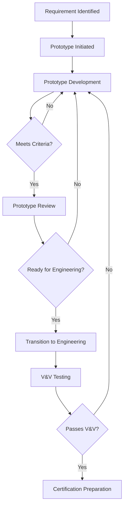

# 95-00-08-00-001_Prototyping_Strategy

## Document Information

- **Document ID**: 95-00-08-00-001
- **Title**: Prototyping Strategy
- **Version**: 1.0
- **Status**: Active
- **Date**: 2025-11-17
- **Author**: AMPEL360 Documentation WG
- **Related Documents**: 
  - 95-00-06_Engineering (Engineering Models)
  - 95-00-07_V_AND_V (Verification & Validation)
  - 95-00-10_Certification

---

## 1. Purpose

This document defines the overarching strategy for prototyping Neural Network (NN) systems within the **Digital Product Passport (DPP)** framework of ATA Chapter 95. It establishes the methodology, governance, and lifecycle integration of prototypes as they transition from experimental concepts to production-ready systems.

---

## 2. Scope

The prototyping strategy applies to:

- **Model prototypes**: Early NN architectures, baseline models, and advanced model experiments
- **Data & pipeline prototypes**: Synthetic data generation, preprocessing pipelines, and quick iteration frameworks
- **Runtime sandboxes**: Offline environments, shadow mode testing, and edge/embedded prototypes
- **System integration prototypes**: Interfaces with other ATA systems (02, 28, 31, 42, 45)
- **HMI & explainability prototypes**: User interfaces, dashboards, and human factors studies
- **DPP & blockchain prototypes**: On-chain data, smart contracts, and traceability flows
- **Hardware rigs & HIL prototypes**: Lab test rigs, hardware-in-the-loop setups
- **Lab & ground demos**: Internal and external demonstrations
- **Flight & operational trials**: Pre-certification operational testing
- **Prototype tooling & automation**: Notebooks, CI/CD for prototypes, auto-documentation

---

## 3. Prototyping Philosophy

### 3.1 Core Principles

1. **Fail Fast, Learn Fast**: Prototypes are exploratory by nature; rapid iteration is encouraged
2. **Safety-First**: Even in prototypes, safety constraints from ATA 95-00-02 apply
3. **Traceability from Day One**: Every prototype must be logged, versioned, and linked to requirements
4. **Incremental Maturity**: Prototypes progress through defined maturity levels (see 95-00-08-00-006)
5. **Seamless Handover**: Clear transition criteria to Engineering (95-00-06) and V&V (95-00-07)

### 3.2 Prototyping Stages

```
Concept → Prototype → Engineering Model → V&V → Certification
    ↓          ↓              ↓              ↓         ↓
 Ideation   Experimentation  Production-Ready  Tested  Certified
```

---

## 4. Strategic Objectives

1. **Accelerate Innovation**: Enable rapid experimentation with NN architectures and data pipelines
2. **De-Risk Development**: Identify technical and integration challenges early
3. **Validate Requirements**: Test functional and non-functional requirements in controlled environments
4. **Demonstrate Feasibility**: Provide evidence to stakeholders (regulators, investors, operators)
5. **Optimize Resources**: Avoid over-engineering by prototyping before committing to full development

---

## 5. Prototyping Lifecycle Integration

### 5.1 Relationship with Engineering (95-00-06)

- **Input from Engineering**: Baseline models, simulation parameters, design constraints
- **Output to Engineering**: Validated prototypes, performance metrics, feasibility reports
- **Transition Criteria**: Prototype must meet engineering acceptance criteria (see 95-00-08-00-002)

### 5.2 Relationship with V&V (95-00-07)

- **Input from V&V**: Test scenarios, acceptance criteria, safety requirements
- **Output to V&V**: Prototype test results, failure modes, lessons learned
- **Transition Criteria**: Prototype must pass V&V readiness gates (see 95-00-08-00-002)

### 5.3 Relationship with Certification (95-00-10)

- **Early Engagement**: Prototypes provide early evidence for certification planning
- **Compliance Check**: Prototypes are evaluated against regulatory requirements (EASA, FAA)
- **Documentation**: Prototype reports feed into certification artifacts

---

## 6. Key Stakeholders

| Stakeholder | Role | Responsibility |
|------------|------|----------------|
| **Data Scientists** | Model Prototyping | Develop and experiment with NN architectures |
| **ML Engineers** | Pipeline Prototyping | Build data pipelines and training workflows |
| **System Engineers** | Integration Prototyping | Interface prototypes with ATA systems |
| **UX/HF Specialists** | HMI Prototyping | Design and test user interfaces |
| **Blockchain Developers** | DPP Prototyping | Implement on-chain traceability |
| **Test Engineers** | Hardware & HIL Prototyping | Set up test rigs and HIL environments |
| **Flight Test Team** | Operational Prototyping | Conduct flight trials and collect data |
| **Certification Authority** | Oversight | Provide guidance on regulatory compliance |

---

## 7. Prototyping Workflow



---

## 8. Risk Management

### 8.1 Prototype-Specific Risks

| Risk | Mitigation |
|------|------------|
| **Prototype doesn't generalize** | Use realistic data, cross-validate on multiple datasets |
| **Safety violations** | Apply safety constraints from 95-00-02 even in prototypes |
| **Resource over-commitment** | Time-box prototype phases, use maturity gates |
| **Poor documentation** | Use auto-documentation tools (see 95-00-08-10) |
| **Lack of traceability** | Mandatory logging in Prototype Registry (see 95-00-08-00-005) |

### 8.2 Risk Tracking

All prototype risks are tracked in the **Prototype Risk Register** (see ASSETS in subsections 03–09).

---

## 9. Metrics and KPIs

| Metric | Target | Purpose |
|--------|--------|---------|
| **Prototype Cycle Time** | < 4 weeks per iteration | Measure speed of experimentation |
| **Transition Rate to Engineering** | > 30% | Measure quality of prototypes |
| **V&V Pass Rate (first attempt)** | > 70% | Measure prototype maturity |
| **Regulatory Feedback Incorporation** | 100% | Ensure compliance |
| **Prototype Traceability** | 100% | Audit readiness |

---

## 10. Governance

- **Prototype Review Board**: Meets bi-weekly to review prototype progress
- **Gate Reviews**: Required at each maturity level transition (see 95-00-08-00-006)
- **Audit Trail**: All prototypes logged in Prototype Registry (95-00-08-00-005)
- **Compliance Check**: Regular reviews against safety and regulatory requirements

---

## 11. Next Steps

1. Review and approve this strategy document
2. Establish Prototype Review Board
3. Define prototype maturity levels (see 95-00-08-00-006)
4. Create Prototype Registry (see 95-00-08-00-005)
5. Train teams on prototyping governance and tools

---

## 12. References

- **95-00-02**: Safety & AAI
- **95-00-03**: Requirements
- **95-00-06**: Engineering
- **95-00-07**: V_AND_V
- **95-00-08-00-002**: Prototyping Governance and Criteria
- **95-00-08-00-006**: Prototype Maturity Levels
- **95-00-10**: Certification

---

## Document Control

| Version | Date | Author | Changes |
|---------|------|--------|---------|
| 1.0 | 2025-11-17 | AMPEL360 Documentation WG | Initial version |

---

**End of Document**
