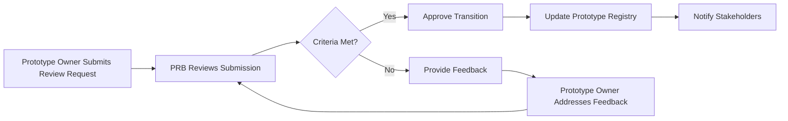

# 95-00-08-00-002_Prototyping_Governance_and_Criteria

## Document Information

- **Document ID**: 95-00-08-00-002
- **Title**: Prototyping Governance and Criteria
- **Version**: 1.0
- **Status**: Active
- **Date**: 2025-11-17
- **Author**: AMPEL360 Documentation WG
- **Related Documents**: 
  - 95-00-08-00-001_Prototyping_Strategy
  - 95-00-08-00-006_Prototype_Maturity_Levels

---

## 1. Purpose

This document establishes the governance framework and acceptance criteria for prototyping activities within ATA Chapter 95. It defines roles, responsibilities, review processes, and the criteria required for prototypes to transition between maturity levels and into production engineering.

---

## 2. Governance Structure

### 2.1 Prototype Review Board (PRB)

**Composition**:
- Chair: Chief AI/ML Engineer
- Members:
  - Lead Data Scientist
  - Lead ML Engineer
  - System Integration Lead
  - Safety & AAI Representative
  - V&V Lead
  - Certification Liaison

**Responsibilities**:
- Review and approve prototype initiation
- Conduct maturity gate reviews
- Approve transitions to Engineering and V&V
- Escalate risks and issues
- Ensure compliance with safety and regulatory requirements

**Meeting Cadence**: Bi-weekly, with ad-hoc reviews as needed

### 2.2 Prototype Owners

Each prototype must have a designated **Prototype Owner** responsible for:
- Day-to-day prototype development
- Documentation and traceability
- Communication with PRB
- Risk management
- Transition planning

---

## 3. Prototype Lifecycle Gates

### 3.1 Gate 0: Prototype Initiation

**Entry Criteria**:
- Requirement or opportunity identified
- Initial feasibility assessment completed
- Resources allocated (team, budget, timeline)

**Exit Criteria**:
- Prototype charter approved by PRB
- Prototype registered in Prototype Registry (95-00-08-00-005)
- Initial risk assessment completed

**Deliverables**:
- Prototype Charter
- Resource Allocation Plan
- Risk Register Entry

---

### 3.2 Gate 1: Concept Validation

**Entry Criteria**:
- Basic prototype implemented
- Initial experiments completed

**Exit Criteria**:
- Concept feasibility demonstrated
- Technical approach validated
- Safety constraints identified and addressed
- Prototype moves to Maturity Level 1 (see 95-00-08-00-006)

**Deliverables**:
- Concept Validation Report
- Experiment Results
- Updated Risk Register

---

### 3.3 Gate 2: Engineering Readiness

**Entry Criteria**:
- Prototype at Maturity Level 2 or higher
- Performance metrics meet baseline targets
- Integration with key systems demonstrated

**Exit Criteria**:
- Engineering acceptance criteria met (see Section 4)
- Documentation complete
- Transition plan to 95-00-06_Engineering approved

**Deliverables**:
- Engineering Handover Package
- Transition Plan
- Lessons Learned Report

---

### 3.4 Gate 3: V&V Readiness

**Entry Criteria**:
- Prototype at Maturity Level 3 or higher
- Engineering review completed
- Test cases defined

**Exit Criteria**:
- V&V acceptance criteria met (see Section 5)
- Test results demonstrate compliance
- Transition plan to 95-00-07_V_AND_V approved

**Deliverables**:
- V&V Handover Package
- Test Results
- Compliance Matrix

---

## 4. Engineering Acceptance Criteria

For a prototype to transition to **95-00-06_Engineering**, it must meet the following criteria:

### 4.1 Technical Criteria

| Criterion | Description | Validation Method |
|-----------|-------------|-------------------|
| **Performance** | Meets or exceeds baseline performance targets | Benchmark testing |
| **Scalability** | Demonstrates ability to scale to production volumes | Load testing |
| **Robustness** | Handles edge cases and failure modes gracefully | Stress testing |
| **Integration** | Interfaces correctly with ATA systems | Integration testing |
| **Resource Efficiency** | Meets computational and memory constraints | Profiling |

### 4.2 Documentation Criteria

| Criterion | Description | Validation Method |
|-----------|-------------|-------------------|
| **Architecture Documentation** | Model architecture, data flow, and system design documented | Document review |
| **Codebase Quality** | Code is modular, tested, and maintainable | Code review |
| **Hyperparameter Documentation** | All hyperparameters and configurations documented | Configuration audit |
| **Data Lineage** | Data sources, preprocessing steps, and versioning documented | Lineage review |

### 4.3 Safety & Compliance Criteria

| Criterion | Description | Validation Method |
|-----------|-------------|-------------------|
| **Safety Analysis** | Hazard analysis completed (see 95-00-02) | Safety review |
| **Regulatory Alignment** | Compliance with EASA/FAA requirements validated | Compliance checklist |
| **Traceability** | All requirements traced to prototype implementation | Traceability matrix |

---

## 5. V&V Acceptance Criteria

For a prototype to transition to **95-00-07_V_AND_V**, it must meet the following criteria:

### 5.1 Test Readiness

| Criterion | Description | Validation Method |
|-----------|-------------|-------------------|
| **Test Cases Defined** | Complete set of test cases covering functional and non-functional requirements | Test plan review |
| **Test Environment Ready** | Test environment set up and validated | Environment audit |
| **Baseline Metrics Established** | Baseline performance metrics documented | Metrics review |

### 5.2 Quality Criteria

| Criterion | Description | Validation Method |
|-----------|-------------|-------------------|
| **Code Coverage** | Minimum 80% code coverage for critical components | Coverage report |
| **Bug Density** | < 1 critical bug per 1000 lines of code | Bug tracking |
| **Performance Consistency** | Performance variance < 10% across test runs | Statistical analysis |

### 5.3 Compliance Criteria

| Criterion | Description | Validation Method |
|-----------|-------------|-------------------|
| **Safety Requirements Met** | All safety requirements from 95-00-02 validated | Safety audit |
| **Regulatory Requirements Met** | All regulatory requirements validated | Compliance audit |
| **Explainability** | Model decisions are explainable (see 95-00-08-05) | Explainability review |

---

## 6. Prototype Review Process

### 6.1 Review Workflow

### 6.2 Review Checklist

For each gate review, the PRB uses a standardized checklist to evaluate:

1. **Technical Soundness**: Is the prototype technically sound and fit-for-purpose?
2. **Safety Compliance**: Does the prototype meet safety requirements?
3. **Documentation Completeness**: Is all required documentation available?
4. **Risk Management**: Are risks identified, assessed, and mitigated?
5. **Resource Utilization**: Is the prototype on schedule and within budget?
6. **Stakeholder Alignment**: Are stakeholders informed and aligned?

---

## 7. Prototype Rejection and Termination

### 7.1 Rejection Criteria

A prototype may be rejected at any gate if:
- Technical feasibility is not demonstrated
- Safety risks cannot be mitigated
- Resource constraints cannot be met
- Business case no longer valid

### 7.2 Termination Process

1. PRB documents rejection reasons
2. Lessons learned are captured
3. Prototype Registry is updated with status "Terminated"
4. Resources are reallocated
5. Stakeholders are notified

---

## 8. Continuous Improvement

### 8.1 Feedback Loop

- **Quarterly Reviews**: PRB reviews prototyping process effectiveness
- **Lessons Learned**: Captured from each prototype and shared across teams
- **Process Updates**: Governance framework updated based on feedback

### 8.2 Metrics Tracking

The following metrics are tracked to assess governance effectiveness:

| Metric | Target | Review Frequency |
|--------|--------|------------------|
| **Gate Review Cycle Time** | < 5 business days | Monthly |
| **Rejection Rate** | < 20% | Quarterly |
| **Re-work Rate** | < 30% | Quarterly |
| **Documentation Completeness** | > 95% | Monthly |

---

## 9. Compliance and Audit

### 9.1 Audit Requirements

All prototype activities are subject to internal and external audits. Required audit artifacts include:

- Prototype Registry (95-00-08-00-005)
- Gate Review Minutes
- Risk Registers
- Traceability Matrices
- Test Results

### 9.2 Audit Frequency

- **Internal Audits**: Quarterly
- **External Audits**: Annually (or as required by regulatory authorities)

---

## 10. Roles and Responsibilities Summary

| Role | Responsibilities |
|------|------------------|
| **Prototype Review Board** | Governance, gate reviews, approvals |
| **Prototype Owner** | Day-to-day management, documentation, risk management |
| **Data Scientist** | Model development, experimentation |
| **ML Engineer** | Pipeline development, infrastructure |
| **System Engineer** | Integration, interfaces with ATA systems |
| **Safety & AAI Rep** | Safety analysis, compliance |
| **V&V Lead** | Test planning, validation |
| **Certification Liaison** | Regulatory alignment, certification planning |

---

## 11. References

- **95-00-02**: Safety & AAI
- **95-00-03**: Requirements
- **95-00-06**: Engineering
- **95-00-07**: V_AND_V
- **95-00-08-00-001**: Prototyping Strategy
- **95-00-08-00-005**: Prototype Registry
- **95-00-08-00-006**: Prototype Maturity Levels

---

## Document Control

| Version | Date | Author | Changes |
|---------|------|--------|---------|
| 1.0 | 2025-11-17 | AMPEL360 Documentation WG | Initial version |

---

**End of Document**
