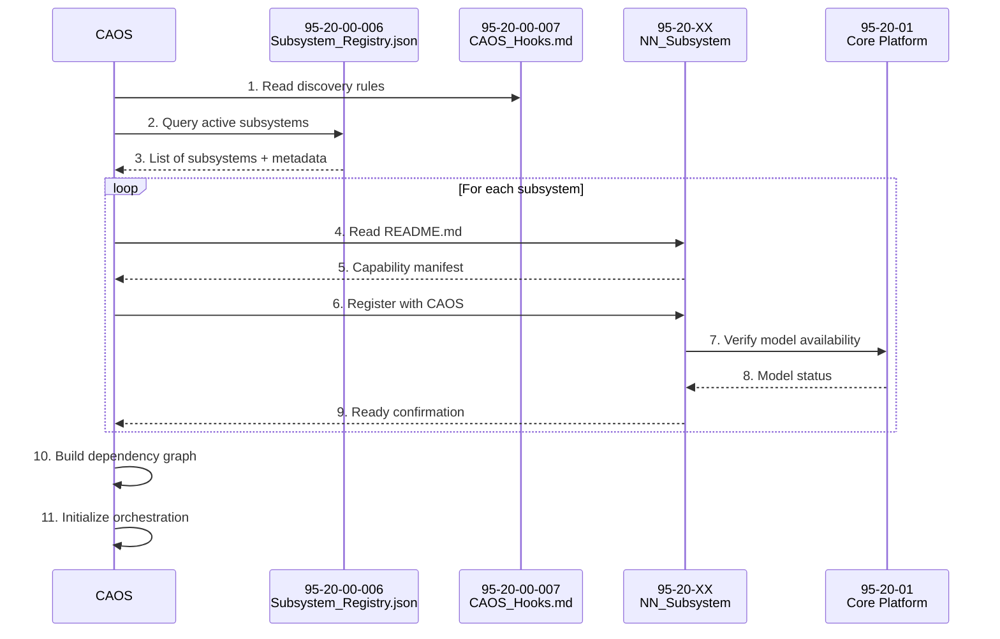

# 95-20-00-002 — Subsystems Integration Map

## Document Information

- **Document ID**: 95-20-00-002
- **Title**: Neural Network Subsystems Integration Map
- **Version**: 1.0
- **Date**: 2025-11-17
- **Status**: Active
- **Classification**: Technical Reference

## Purpose

This document provides a comprehensive integration map showing how NN subsystems interface with:
- Parent ATA chapters
- Core platform infrastructure (95-20-01, 95-20-02)
- Other NN subsystems
- Aircraft systems
- CAOS/MCP ecosystem

## Integration Architecture Overview

```
┌────────────────────────────────────────────────────────────────┐
│                    CAOS/MCP Layer                              │
│  ┌──────────────────────────────────────────────────────────┐  │
│  │  CAOS Core • MCP Server • Fleet Intelligence             │  │
│  └──────────────────────────────────────────────────────────┘  │
└────────────────────────────────────────────────────────────────┘
                              ↕
┌────────────────────────────────────────────────────────────────┐
│              95-20 NN Subsystems Ecosystem                      │
│  ┌──────────────────────┐  ┌────────────────────────────┐      │
│  │  95-20-01            │←→│  95-20-02                  │      │
│  │  NN Core Platform    │  │  NN DPP Blockchain         │      │
│  └──────────────────────┘  └────────────────────────────┘      │
│           ↕                          ↕                          │
│  ┌─────────────────────────────────────────────────────┐       │
│  │      ATA-Specific NN Subsystems                     │       │
│  │  21 • 27 • 28 • 31 • 42 • 45 • 49 • 53 • 57 • 70 • 80│       │
│  └─────────────────────────────────────────────────────┘       │
└────────────────────────────────────────────────────────────────┘
                              ↕
┌────────────────────────────────────────────────────────────────┐
│              Target Aircraft Systems (ATA XX)                   │
│    Environmental • Flight • Fuel • IMA • Maintenance • etc.    │
└────────────────────────────────────────────────────────────────┘
```

## Core Platform Integration

### 95-20-01: NN Core Platform

**Integration Points**:

| Interface | Connected Subsystems | Protocol | Data Flow |
|-----------|---------------------|----------|-----------|
| **Model Registry** | All 95-20-XX | REST API | Bidirectional |
| **Inference Runtime** | All 95-20-XX | gRPC | Request/Response |
| **Monitoring Hub** | All 95-20-XX | Prometheus | Pull metrics |
| **Version Control** | 95-00-11 | Git/DVC | Sync |
| **CAOS Interface** | CAOS Core | WebSocket | Bidirectional |

**Data Flows**:
- **Outbound**: Model artifacts, runtime configs, monitoring dashboards
- **Inbound**: Inference requests, performance metrics, alerts

### 95-20-02: NN DPP Blockchain

**Integration Points**:

| Interface | Connected Systems | Protocol | Data Flow |
|-----------|------------------|----------|-----------|
| **Provenance Chain** | All 95-20-XX | Smart Contract | Write-once |
| **Query Interface** | 95-00-12, Cert Auth | GraphQL | Read-only |
| **Smart Contracts** | 95-20-01 | Ethereum | Bidirectional |
| **Evidence Store** | 95-90 Schemas | IPFS | Append-only |

**Blockchain Events**:
- `ModelRegistered`: New model added to registry
- `ModelDeployed`: Model deployed to aircraft
- `ModelRetired`: Model removed from service
- `ValidationCompleted`: V&V evidence recorded

## ATA-Specific Subsystem Integration

### 95-20-21: NN_ECS ↔ ATA 21 (Environmental Control)

**Parent ATA Integration**:
- **Input Sensors**: Temperature, pressure, humidity, CO₂ (ATA 21-30)
- **Control Outputs**: HVAC setpoints, fan speeds (ATA 21-40)
- **Data Schema**: `ATA21_Sensor_Data_v1.json` (95-90)

**Dependencies**:
- **95-20-01**: Model deployment, inference runtime
- **95-20-42**: IMA partition for compute
- **95-20-45**: Performance monitoring for maintenance

**Integration Artifacts**:
- `95-20-21-A-002_Interface_Diagram.svg`
- `95-20-21-005_Integration_with_ATA_21.md`

### 95-20-27: NN_Flight_Controls ↔ ATA 27 (Flight Controls)

**Parent ATA Integration**:
- **Input Sensors**: Air data, accelerometers, gyros (ATA 27-10)
- **Control Outputs**: Control surface commands (ATA 27-30)
- **Safety**: Monitors conventional control laws (ATA 27-40)

**Dependencies**:
- **95-20-01**: DAL-A inference runtime
- **95-20-57**: Wing structural data
- **95-20-70**: Thrust vector data

**Critical Interfaces**:
- **Failover**: <10ms switch to conventional laws
- **Monitoring**: Continuous validation of outputs
- **Backup**: Hardware redundancy (triple-redundant compute)

### 95-20-28: NN_Fuel_System ↔ ATA 28 (Fuel - H₂)

**Parent ATA Integration**:
- **Input Sensors**: Tank level, temperature, pressure (ATA 28-10)
- **Control Outputs**: Pump control, valve positions (ATA 28-30)
- **Safety**: Boiloff management, leak detection (ATA 28-60)

**Dependencies**:
- **95-20-70**: Fuel demand predictions
- **95-20-80**: Power availability for cryogenic systems
- **95-20-45**: Tank health monitoring

**H₂-Specific Considerations**:
- Cryogenic temperature modeling
- Boiloff rate prediction (physics-informed NN)
- Integration with CO₂ battery loop (ATA 28-50)

### 95-20-31: NN_Recording_Systems ↔ ATA 31 (Recording)

**Parent ATA Integration**:
- **Input Data**: All aircraft parameters (ARINC 717)
- **Output**: Compressed data, event annotations (FDR/CVR)
- **Anomaly Alerts**: To 95-20-45 maintenance

**Dependencies**:
- **95-20-01**: Inference for real-time anomaly detection
- **95-20-42**: AFDX traffic for data acquisition
- **All subsystems**: Health monitoring data

**Data Compression**:
- Lossless for critical parameters (flight controls, fuel)
- Lossy acceptable for cabin parameters
- 10:1 compression ratio overall

### 95-20-42: NN_IMA_Integration ↔ ATA 42 (IMA)

**Parent ATA Integration**:
- **Hardware**: IMA modules (ATA 42-10)
- **Network**: AFDX fabric (ATA 42-20)
- **OS**: ARINC 653 partitions (ATA 42-30)

**Dependencies**:
- **95-20-01**: Provides NN runtime to all partitions
- **All 95-20-XX**: Hosts compute resources

**Resource Allocation**:
| Subsystem | Partition | Memory | CPU % | Priority |
|-----------|-----------|--------|-------|----------|
| 95-20-27 | P1 | 256 MB | 30% | DAL-A |
| 95-20-28 | P2 | 128 MB | 15% | DAL-B |
| 95-20-21 | P3 | 64 MB | 10% | DAL-C |
| 95-20-45 | P4 | 128 MB | 20% | DAL-C |

### 95-20-45: NN_Maintenance ↔ ATA 45 (Maintenance Systems)

**Parent ATA Integration**:
- **Input**: Health data from all systems
- **Output**: Maintenance predictions, RUL estimates
- **Interface**: OOOI data (Out-Off-On-In)

**Dependencies**:
- **All 95-20-XX**: Collects performance metrics
- **95-20-31**: Historical event data
- **95-20-02**: Provenance for audit

**Predictive Maintenance Workflow**:
1. Collect sensor data from all subsystems
2. Run ensemble models (LSTM + Random Forest)
3. Predict failures 500 FH ahead
4. Generate work orders for 95-00-11_Operations

### 95-20-49: NN_APU ↔ ATA 49 (APU)

**Parent ATA Integration**:
- **Input**: APU parameters (temp, vibration, fuel flow)
- **Output**: Performance predictions, health scores

**Dependencies**:
- **95-20-45**: Maintenance predictions
- **95-20-80**: Power load coordination

### 95-20-53: NN_Structures ↔ ATA 53 (Fuselage)

**Parent ATA Integration**:
- **Input**: Strain gauges, acoustic sensors (SHM)
- **Output**: Load distribution maps, fatigue estimates

**Dependencies**:
- **95-20-27**: Flight loads data
- **95-20-45**: Structural health for maintenance

**GNN Architecture**:
- Mesh-based graph neural network
- Nodes = strain gauge locations
- Edges = structural connections
- Updates = load propagation

### 95-20-57: NN_Wing_Systems ↔ ATA 57 (Wings)

**Parent ATA Integration**:
- **Input**: Wing strain, accelerometers, cameras
- **Output**: Flutter warnings, ice detection, load alleviation

**Dependencies**:
- **95-20-27**: Coordinate control surface actions
- **95-20-53**: Wing-fuselage load transfer
- **95-20-30**: Ice protection system (ATA 30)

**Critical Interfaces**:
- **Flutter Detection**: LSTM predicts 10s ahead → immediate control response
- **Ice Detection**: Computer vision on wing cameras → anti-ice activation

### 95-20-70: NN_Propulsion ↔ ATA 70-79 (Propulsion)

**Parent ATA Integration**:
- **Input**: Engine sensors, fuel cell parameters (ATA 71, 73)
- **Output**: Performance predictions, thrust commands

**Dependencies**:
- **95-20-28**: Fuel availability and quality
- **95-20-80**: Electrical power from fuel cells
- **95-20-45**: Engine health monitoring

**Fuel Cell Optimization**:
- Real-time efficiency maximization
- Load balancing across cell stacks
- Integration with battery storage (95-20-80)

### 95-20-80: NN_Energy_Systems ↔ ATA 80 (Electrical)

**Parent ATA Integration**:
- **Input**: Power loads, battery SOC/SOH, bus voltages
- **Output**: Load shedding recommendations, charging profiles

**Dependencies**:
- **95-20-70**: Fuel cell power generation
- **95-20-28**: H₂ fuel availability
- **All subsystems**: Power demand forecasting

**Energy Management**:
- Predict power demand 5 minutes ahead
- Optimize battery charging/discharging cycles
- Coordinate with APU (95-20-49) for backup power

## Cross-Subsystem Dependencies

### Dependency Matrix

| From ↓ \ To → | 01 | 02 | 21 | 27 | 28 | 31 | 42 | 45 | 49 | 53 | 57 | 70 | 80 |
|---------------|----|----|----|----|----|----|----|----|----|----|----|----|-----|
| **95-20-01** | - | ✓ | ✓ | ✓ | ✓ | ✓ | ✓ | ✓ | ✓ | ✓ | ✓ | ✓ | ✓ |
| **95-20-02** | ✓ | - | ✓ | ✓ | ✓ | ✓ | ✓ | ✓ | ✓ | ✓ | ✓ | ✓ | ✓ |
| **95-20-21** | ✓ | ✓ | - | - | - | ✓ | ✓ | ✓ | - | - | - | - | ✓ |
| **95-20-27** | ✓ | ✓ | - | - | ✓ | ✓ | ✓ | ✓ | - | ✓ | ✓ | ✓ | - |
| **95-20-28** | ✓ | ✓ | - | - | - | ✓ | ✓ | ✓ | - | - | - | ✓ | ✓ |
| **95-20-31** | ✓ | ✓ | ✓ | ✓ | ✓ | - | ✓ | ✓ | ✓ | ✓ | ✓ | ✓ | ✓ |
| **95-20-42** | ✓ | ✓ | ✓ | ✓ | ✓ | ✓ | - | ✓ | ✓ | ✓ | ✓ | ✓ | ✓ |
| **95-20-45** | ✓ | ✓ | ✓ | ✓ | ✓ | ✓ | ✓ | - | ✓ | ✓ | ✓ | ✓ | ✓ |
| **95-20-49** | ✓ | ✓ | - | - | - | ✓ | ✓ | ✓ | - | - | - | - | ✓ |
| **95-20-53** | ✓ | ✓ | - | ✓ | - | ✓ | ✓ | ✓ | - | - | ✓ | - | - |
| **95-20-57** | ✓ | ✓ | - | ✓ | - | ✓ | ✓ | ✓ | - | ✓ | - | - | - |
| **95-20-70** | ✓ | ✓ | - | - | ✓ | ✓ | ✓ | ✓ | - | - | - | - | ✓ |
| **95-20-80** | ✓ | ✓ | ✓ | - | ✓ | ✓ | ✓ | ✓ | ✓ | - | - | ✓ | - |

**Legend**: ✓ = Direct dependency

See `95-20-00-003_Cross_ATA_Dependencies.csv` for detailed dependency information.

## CAOS/MCP Integration

### CAOS Discovery Flow



### MCP Server Endpoints

Each subsystem exposes standardized MCP endpoints:

```json
{
  "subsystem_id": "95-20-27",
  "name": "NN_Flight_Controls",
  "mcp_endpoints": {
    "capability": "/.well-known/mcp/capability.json",
    "health": "/health",
    "inference": "/v1/predict",
    "metrics": "/metrics",
    "models": "/v1/models"
  },
  "protocols": ["REST", "gRPC"],
  "authentication": "mTLS"
}
```

## Integration with 95-00-13 (Component Registry)

All NN subsystems trace to physical/logical components:

| Subsystem | Component Type | Registry Entry | Criticality |
|-----------|---------------|----------------|-------------|
| 95-20-01 | Compute Module | 95-00-13-C-001 | DAL-A |
| 95-20-27 | Flight Computer | 95-00-13-C-027 | DAL-A |
| 95-20-28 | Fuel Controller | 95-00-13-C-028 | DAL-B |
| 95-20-42 | IMA Cabinet | 95-00-13-C-042 | DAL-B |
| ... | ... | ... | ... |

**Traceability Flow**:
1. NN Subsystem (95-20-XX) ← Model Card (ASSETS/)
2. Model Card → Component (95-00-13-C-XXX)
3. Component → Requirements (95-00-03)
4. Requirements → V&V (95-00-07)
5. V&V → Certification Evidence (95-00-10)

## Integration with 95-10 (Operations)

### Operational Procedures

| Procedure | Subsystems Involved | Documentation |
|-----------|---------------------|---------------|
| **Pre-flight Check** | All | 95-10-001 |
| **Model Version Verification** | 95-20-01, 95-20-02 | 95-10-020 |
| **In-flight Monitoring** | All | 95-10-030 |
| **Post-flight Analysis** | 95-20-31, 95-20-45 | 95-10-040 |
| **Model Update Procedure** | 95-20-01, CAOS | 95-10-050 |

### Operations Data Flow

```
Pre-flight → 95-20-01 verifies model versions with 95-20-02
Flight → All subsystems log to 95-20-31
Post-flight → 95-20-45 analyzes performance
Maintenance → Model updates via 95-10-050
```

## Integration with 95-00-11 (EIS Versions)

### Version Control Linkage

| EIS Version | Active Models | Certification Baseline | Notes |
|-------------|---------------|------------------------|-------|
| v1.0 | All models v1.x | CS-25 Amendment 27 | Initial certification |
| v1.1 | 95-20-27 v2.0 | Updated flutter model | Minor change |
| v2.0 | All models v2.x | EASA MOC SC-AI | Major update |

**Configuration Management**:
- Each aircraft tail number → EIS version → Model bundle
- Changes require CCB approval (95-00-14_META)
- Rollback procedures documented in 95-10

## Data Flow Architecture

### End-to-End Data Flow Example: Predictive Maintenance

```
Aircraft Sensors (ATA XX)
    ↓ [ARINC 429/717]
95-20-42 (IMA Data Acquisition)
    ↓ [Ethernet/AFDX]
95-20-01 (Inference Runtime)
    ↓ [gRPC]
95-20-45 (Maintenance Predictor)
    ↓ [REST]
95-20-31 (Logging)
    ↓ [IPFS]
95-20-02 (DPP Evidence)
    ↓ [Smart Contract]
Blockchain (Audit Trail)
    ↓ [GraphQL]
Ground Systems (Maintenance Planning)
```

## Interface Specifications

### Standard Data Formats

All subsystems use standardized schemas from 95-90:

- **Sensor Data**: `95-90-001_Sensor_Data_Schema_v1.json`
- **Model Output**: `95-90-002_Model_Output_Schema_v1.json`
- **Monitoring Metrics**: `95-90-003_Metrics_Schema_v1.json`
- **Events**: `95-90-004_Event_Schema_v1.json`

### API Versioning

- API versions follow semantic versioning: `vMAJOR.MINOR`
- Backward compatibility maintained for MINOR updates
- MAJOR updates require EIS version change

## Safety Considerations

### Failure Modes & Integration

| Failure Mode | Affected Subsystems | Mitigation | Integration Point |
|--------------|---------------------|------------|-------------------|
| **Model Degradation** | Any | Fallback to conventional | 95-20-01 monitoring |
| **Compute Resource Exhaustion** | All | Priority-based scheduling | 95-20-42 IMA |
| **Network Congestion** | All | Traffic shaping | 95-20-42 AFDX |
| **Sensor Failure** | Dependent subsystems | Sensor fusion | Parent ATA |

### Integration Testing

- **Unit Tests**: Each subsystem independently
- **Integration Tests**: Subsystem pairs (95-20-XX ↔ ATA XX)
- **System Tests**: Full aircraft simulation
- **Flight Tests**: Incremental capability enablement

## References

- [95-20-00-001_Subsystems_Overview.md](./95-20-00-001_Subsystems_Overview.md) — Architecture overview
- [95-20-00-003_Cross_ATA_Dependencies.csv](./95-20-00-003_Cross_ATA_Dependencies.csv) — Dependency details
- [00_META/95-20-00-005_Subsystems_Traceability_Matrix.csv](./00_META/95-20-00-005_Subsystems_Traceability_Matrix.csv) — Requirements traceability
- [95-00-13_Subsystems_Components](../95-00_GENERAL/95-00-13_Subsystems_Components/) — Component registry
- [95-10_Operations](../95-10_Operations/) — Operational procedures
- [ARINC 653](https://www.arinc.com/cf/store/documentList.cfm?CATID=arinc&TYPE=) — IMA partitioning standard
- [EASA MOC SC-AI](https://www.easa.europa.eu/document-library/general-publications/means-compliance-special-condition-sc-ai) — AI certification

## Document Control

- **Author**: AMPEL360 Systems Integration Team
- **Reviewer**: Chief Systems Engineer
- **Approver**: Technical Director
- **Change Log**:
  - 2025-11-17: v1.0 — Initial release

---

**Classification**: Technical Reference  
**Distribution**: Internal + Integration Partners
