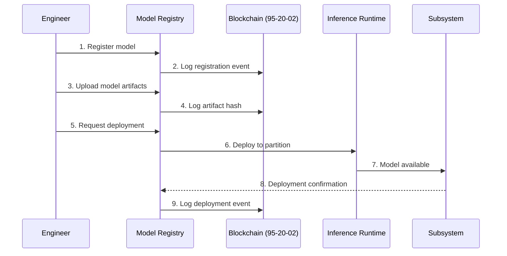
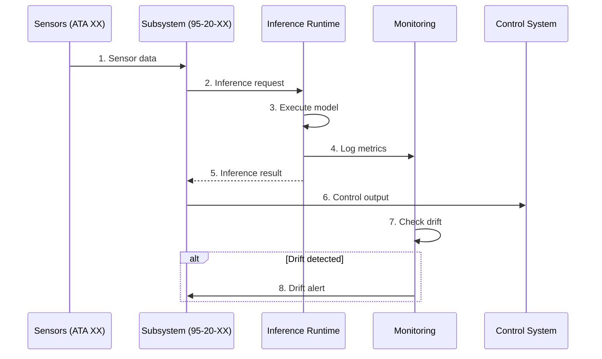

# 95-20-01-001 — NN Core Platform Architecture

## Document Information

- **Document ID**: 95-20-01-001
- **Subsystem**: 95-20-01 (NN Core Platform)
- **Title**: Platform Architecture
- **Version**: 1.0
- **Date**: 2025-11-17
- **Status**: Active
- **Classification**: Technical Reference

## Purpose

This document describes the architecture of the Neural Network Core Platform, which provides foundational infrastructure for all AMPEL360 NN subsystems including model registry, inference runtime, and monitoring framework.

## Architecture Overview

The NN Core Platform follows a layered architecture:

```
┌─────────────────────────────────────────────────────────┐
│                  Application Layer                       │
│  (95-20-21, 95-20-27, 95-20-28, ..., 95-20-80)         │
└─────────────────────────────────────────────────────────┘
                          ↕
┌─────────────────────────────────────────────────────────┐
│               Core Platform Services                     │
│  ┌──────────────┐ ┌──────────────┐ ┌─────────────────┐ │
│  │ Model        │ │ Inference    │ │ Monitoring      │ │
│  │ Registry     │ │ Runtime      │ │ Framework       │ │
│  └──────────────┘ └──────────────┘ └─────────────────┘ │
└─────────────────────────────────────────────────────────┘
                          ↕
┌─────────────────────────────────────────────────────────┐
│               Infrastructure Layer                       │
│  ┌──────────────┐ ┌──────────────┐ ┌─────────────────┐ │
│  │ IMA Compute  │ │ AFDX Network │ │ Storage         │ │
│  │ (95-20-42)   │ │ (95-20-42)   │ │ (95-20-02)      │ │
│  └──────────────┘ └──────────────┘ └─────────────────┘ │
└─────────────────────────────────────────────────────────┘
```

## Core Components

### 1. Model Registry

**Purpose**: Centralized catalog of all neural network models

**Key Features**:
- Model versioning (semantic versioning)
- Metadata management (architecture, parameters, performance)
- Dependency tracking
- Certification status
- Deployment history

**Implementation**:
```python
class ModelRegistry:
    def register_model(self, model_id, metadata):
        """Register a new model"""
        pass
    
    def get_model(self, model_id, version=None):
        """Retrieve model by ID and optional version"""
        pass
    
    def list_models(self, filters=None):
        """List models with optional filtering"""
        pass
    
    def update_status(self, model_id, status):
        """Update model status (e.g., active, deprecated)"""
        pass
```

**Data Schema**: See `ASSETS/95-20-01-A-003_Platform_Config_Schema.json`

### 2. Inference Runtime

**Purpose**: High-performance execution environment for model inference

**Supported Frameworks**:
- ONNX Runtime (primary)
- TensorRT (GPU acceleration)
- OpenVINO (Intel optimization)

**Execution Modes**:
- **Synchronous**: Blocking inference for time-critical applications
- **Asynchronous**: Non-blocking inference for batch processing
- **Streaming**: Continuous inference for time-series data

**Performance Requirements**:
| Criticality | Max Latency | Throughput | Jitter |
|-------------|-------------|------------|--------|
| DAL-A | <10ms | 1000 inf/s | <1ms |
| DAL-B | <100ms | 500 inf/s | <10ms |
| DAL-C | <1s | 100 inf/s | <100ms |
| DAL-D | <5s | 50 inf/s | N/A |

**API**:
```python
class InferenceRuntime:
    def load_model(self, model_id, partition):
        """Load model into specified IMA partition"""
        pass
    
    def predict(self, model_id, input_data):
        """Perform synchronous inference"""
        pass
    
    def predict_async(self, model_id, input_data, callback):
        """Perform asynchronous inference"""
        pass
    
    def predict_stream(self, model_id, input_stream):
        """Perform streaming inference"""
        pass
```

### 3. Monitoring Framework

**Purpose**: Real-time performance tracking and drift detection

**Monitored Metrics**:
- **Inference Performance**: Latency, throughput, queue depth
- **Model Quality**: Prediction accuracy, confidence scores
- **Resource Usage**: CPU, memory, GPU utilization
- **Drift Detection**: Input distribution shift, output drift

**Alerting**:
- Threshold-based alerts (e.g., latency > 10ms)
- Anomaly detection alerts (e.g., unexpected input patterns)
- Health status changes (e.g., model degradation)

**Dashboard**: Grafana integration with Prometheus metrics

**API**:
```python
class MonitoringFramework:
    def log_metric(self, subsystem_id, metric_name, value):
        """Log a metric value"""
        pass
    
    def get_metrics(self, subsystem_id, time_range):
        """Retrieve metrics for time range"""
        pass
    
    def check_drift(self, model_id, input_data):
        """Check for input/output drift"""
        pass
    
    def get_health_status(self, subsystem_id):
        """Get current health status"""
        pass
```

## Integration Points

### Integration with 95-20-02 (Blockchain)

Every model lifecycle event is logged to the blockchain:
- Model registration
- Model deployment
- Model retirement
- Validation results

```python
# Example integration
await blockchain.log_event({
    "event_type": "model_deployed",
    "model_id": "CFD_Surrogate_v2.1",
    "subsystem": "95-20-27",
    "timestamp": "2025-11-17T21:30:00Z",
    "evidence_hash": "0x7a3b...9f2e"
})
```

### Integration with 95-20-42 (IMA)

Core Platform runs on IMA infrastructure:
- **Partition P0**: Core services (highest priority)
- **Memory**: 512 MB dedicated
- **CPU**: 10% baseline + dynamic allocation
- **Network**: AFDX endpoint for all subsystems

### Integration with Application Subsystems

All application subsystems (95-20-21 through 95-20-80) use Core Platform APIs:

```python
# Example from 95-20-27 (Flight Controls)
from core_platform import InferenceRuntime, ModelRegistry

# Load model from registry
model = registry.get_model("CFD_Surrogate", version="2.1")

# Perform inference
result = runtime.predict(model.id, sensor_data)

# Log metrics
monitoring.log_metric("95-20-27", "inference_latency", result.latency)
```

## Deployment Architecture

### IMA Partition Layout

```
┌────────────────────────────────────────┐
│ IMA Cabinet                            │
│                                        │
│  ┌──────────────────────────────────┐ │
│  │ Partition P0 (Core Platform)     │ │
│  │ - Model Registry Service         │ │
│  │ - Inference Orchestrator         │ │
│  │ - Monitoring Agent               │ │
│  │ Resources: 512MB, 10% CPU        │ │
│  └──────────────────────────────────┘ │
│                                        │
│  ┌──────────────────────────────────┐ │
│  │ Partition P1 (95-20-27)          │ │
│  │ Resources: 256MB, 30% CPU        │ │
│  └──────────────────────────────────┘ │
│                                        │
│  ┌──────────────────────────────────┐ │
│  │ Partition P2 (95-20-28)          │ │
│  │ Resources: 128MB, 15% CPU        │ │
│  └──────────────────────────────────┘ │
│                                        │
│  ... (Partitions P3-P10)               │
└────────────────────────────────────────┘
```

### Network Architecture

```
Core Platform (P0)
    ↕ AFDX Virtual Link
95-20-27 (P1) ← Flight Control Data
    ↕
95-20-28 (P2) ← Fuel System Data
    ↕
... (Other Subsystems)
```

## Data Flow

### Model Deployment Flow



### Inference Flow



## Performance Characteristics

### Throughput

- **DAL-A models**: 1000 inferences/second
- **DAL-B models**: 500 inferences/second
- **DAL-C models**: 100 inferences/second
- **DAL-D models**: 50 inferences/second

### Latency

Target latencies by criticality:
- **DAL-A**: <10ms (99.99th percentile)
- **DAL-B**: <100ms (99.9th percentile)
- **DAL-C**: <1s (99th percentile)
- **DAL-D**: <5s (95th percentile)

### Reliability

- **Availability**: 99.999% (five nines)
- **MTBF**: >10,000 flight hours
- **Failover**: <10ms for DAL-A, <100ms for DAL-B

## Safety & Certification

### Design Assurance Level

**DAL-A** (Catastrophic failure impact)

Rationale: Core Platform hosts all DAL-A models (95-20-27, 95-20-57, 95-20-70). Failure would impact flight-critical systems.

### Compliance

- **DO-178C Level A**: Software development
- **DO-333**: Model-based development and verification
- **ARINC 653**: Partitioning and resource management
- **EASA MOC SC-AI**: AI/ML specific guidance

### Verification & Validation

See `95-00-07_V_AND_V` for complete test procedures.

Key test areas:
- Model registry correctness
- Inference runtime determinism
- Monitoring accuracy
- Failover behavior
- Resource isolation (ARINC 653)

## Configuration Management

### Version Control

All Core Platform components are version controlled:
- Software: Git (integrated with 95-00-11)
- Models: DVC (Data Version Control)
- Configuration: Ansible

### Configuration Files

See `ASSETS/95-20-01-A-003_Platform_Config_Schema.json`

Example configuration:
```json
{
  "platform_version": "1.0.0",
  "inference_runtime": {
    "framework": "onnx",
    "device": "cpu",
    "threads": 4,
    "optimization": "latency"
  },
  "model_registry": {
    "backend": "postgresql",
    "cache_size": "256MB"
  },
  "monitoring": {
    "metrics_interval": "10s",
    "drift_threshold": 0.1
  }
}
```

## Future Enhancements

### Planned Features (v2.0)

1. **Federated Learning**: Fleet-wide model updates
2. **AutoML**: Automated model retraining
3. **Edge Optimization**: Model quantization and pruning
4. **Multi-GPU Support**: Parallel inference for heavy models

### Research Areas

- Quantum-inspired optimization (integration with ATA 42-60)
- Neuromorphic computing hardware
- On-device learning (continual learning)

## References

- [95-20-01-002_Model_Registry.md](./95-20-01-002_Model_Registry.md) — Detailed registry specification
- [95-20-01-003_Inference_Runtime.md](./95-20-01-003_Inference_Runtime.md) — Runtime implementation
- [95-20-01-004_Monitoring_Framework.md](./95-20-01-004_Monitoring_Framework.md) — Monitoring details
- [ASSETS/95-20-01-A-001_Platform_Architecture.drawio](./ASSETS/95-20-01-A-001_Platform_Architecture.drawio) — Architecture diagram
- [ARINC 653](https://www.arinc.com/) — Partitioning standard
- [ONNX Runtime](https://onnxruntime.ai/) — Inference framework

## Document Control

- **Author**: AMPEL360 Core Platform Team
- **Reviewer**: Chief AI Architect
- **Approver**: Technical Director
- **Change Log**:
  - 2025-11-17: v1.0 — Initial architecture specification

---

**Classification**: Technical Reference  
**Distribution**: Internal + Certification Authorities
