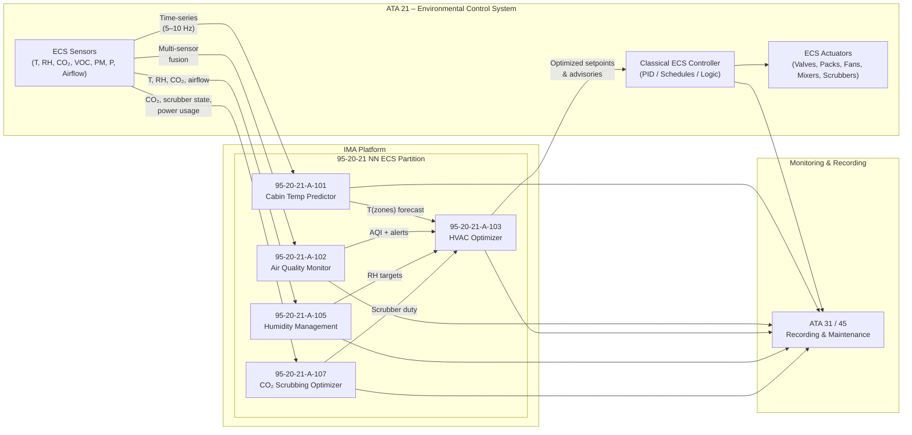

# 95-20-21-A-002 — ECS NN System Architecture (Mermaid)

```mermaid
flowchart LR
    %% 95-20-21 ECS NN System – Logical Architecture

    subgraph ATA21["ATA 21 – Environmental Control System"]
        SENS["ECS Sensors\n(T, RH, CO₂, VOC, PM, P, Airflow)"]
        ACT["ECS Actuators\n(Valves, Packs, Fans, Mixers, Scrubbers)"]
        ECSCTL["Classical ECS Controller\n(PID / Schedules / Logic)"]
    end

    subgraph IMA["IMA Platform\n(ARINC 653 Partitions)"]
        subgraph NN_ECS["95-20-21 NN ECS Partition"]
            TEMP_NN["95-20-21-A-101\nCabin Temp Predictor"]
            AQ_NN["95-20-21-A-102\nAir Quality Monitor"]
            HVAC_OPT["95-20-21-A-103\nHVAC Optimizer"]
            HUM_NN["95-20-21-A-105\nHumidity Management"]
            CO2_OPT["95-20-21-A-107\nCO₂ Scrubbing Optimizer"]
        end
    end

    subgraph MON["Monitoring & Recording"]
        MON31["ATA 31 / 45\nRecording & Maintenance"]
    end

    SENS -->|"Time-series\n(5–10 Hz)"| TEMP_NN
    SENS -->|"Multi-sensor\nfusion"| AQ_NN
    SENS -->|"T, RH, CO₂, airflow"| HUM_NN
    SENS -->|"CO₂, scrubber state,\npower usage"| CO2_OPT

    TEMP_NN -->|"T(zones) forecast"| HVAC_OPT
    AQ_NN -->|"AQI + alerts"| HVAC_OPT
    HUM_NN -->|"RH targets"| HVAC_OPT
    CO2_OPT -->|"Scrubber duty"| HVAC_OPT

    HVAC_OPT -->|"Optimized setpoints\n& advisories"| ECSCTL
    ECSCTL --> ACT

    TEMP_NN --> MON31
    AQ_NN --> MON31
    HVAC_OPT --> MON31
    HUM_NN --> MON31
    CO2_OPT --> MON31
    ECSCTL --> MON31
```
