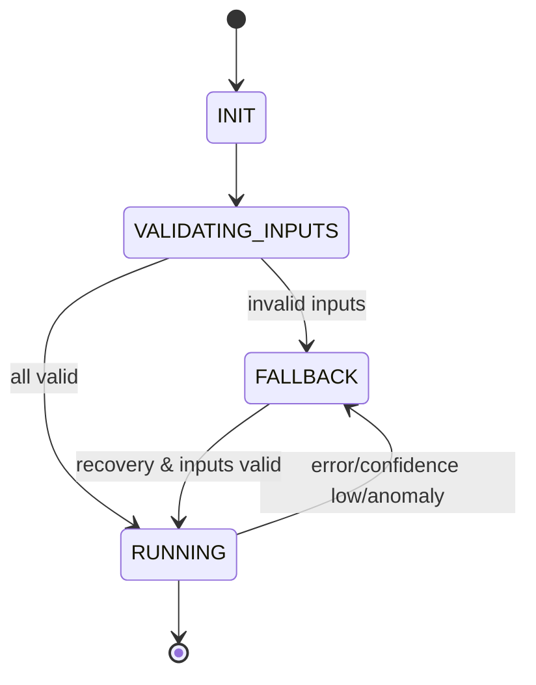

# **95-20-21 — Software Design Standards (SDS)**

### ECS Neural Network Subsystem (NN_ECS)

**Document ID**: 95-20-21-SDS
**Version**: 1.0
**Status**: WORKING
**Certification Level**: DO-178C **Level C**
**Subsystem**: 95-20-21 NN_ECS
**Last Updated**: 2025-11-19

---

# **1. Purpose**

This Software Design Standard (SDS) defines the **rules, constraints, and methods** governing the design of all software elements that implement the ECS Neural Network subsystem (95-20-21 NN_ECS).

The SDS ensures that:

* All software is designed in compliance with **DO-178C Level C**
* All NN models are deterministically integrated
* All wrappers, validation layers, and monitoring logic meet aircraft certification requirements
* All design artefacts remain **traceable**, **verifiable**, and **auditable**
* All software modules align with the **Software Development Plan (SDP)** and **Software Requirements Specification (SRS)**

---

# **2. Scope**

This SDS applies to:

* ONNX model integration and wrappers
* Input validation pipelines
* Output envelope logic
* Confidence & anomaly triggers
* Real-time processing logic
* Data ingest modules
* Logging & recorder interfaces
* Inference runtime management
* Memory management and resource policy
* Any ECS-related NN model (A-101 → A-107)

---

# **3. Applicable Documents**

| Doc              | Description                                  |
| ---------------- | -------------------------------------------- |
| PSAC             | Software Aspects of Certification            |
| SCMP             | Software Configuration Management Plan       |
| SQAP             | Software Quality Assurance Plan              |
| SVP              | Software Verification Plan                   |
| SDP              | Software Development Plan                    |
| SRS              | Software Requirements Specification          |
| DO-178C          | Software Considerations for Airborne Systems |
| DO-331           | Model-Based Development                      |
| DO-330           | Tool Qualification                           |
| SC-AI            | EASA Special Condition for AI                |
| FAA AI Assurance | AI-Enabled Systems Guidance                  |
| ATA 95 DPP       | Digital Product Passport Framework           |

---

# **4. General Design Principles**

All ECS NN software shall follow the principles:

### **4.1 Determinism**

* No dynamic memory allocation during runtime
* No non-deterministic algorithms
* No threads spawned dynamically
* No randomness (random seeds must be fixed)

### **4.2 Bounded Resource Use**

* CPU, memory, and stack usage must be bounded
* Inference time < **10 ms** with jitter < **±1 ms**

### **4.3 Fail-Safe Behaviour**

* Any error triggers fallback logic
* NN outputs never directly command actuators
* Safety envelopes applied after inference

### **4.4 Full Traceability**

All elements must be traceable to:

```
SRS → SDS → LLR → Source Code → ONNX → Tests → Evidence → Certification Bundle
```

### **4.5 Simplicity & Reviewability**

The design must support independent verification, including:

* Readable control flow
* No obfuscated logic
* Modular and stateless design where possible

### **4.6 Compatibility with DO-331**

When using model-based artefacts (e.g., ONNX):

* Architecture must be documented
* Dataflow must be explicit
* Model-generated code must be reviewed
* Transforms must be version-controlled

---

# **5. Software Architecture Standards**

### **5.1 Layered Architecture**

All ECS NN models shall follow this layered architecture:

```
┌──────────────────────────────────────┐
│ APPLICATION LAYER (ECS Systems)      │
└──────────────────────────────────────┘
            ⇅ validated setpoints
┌──────────────────────────────────────┐
│ NN WRAPPER & VALIDATION LAYER        │  ← DAL-C logic
├──────────────────────────────────────┤
│ - Input validation                   │
│ - Range checks                       │
│ - Timestamp checks                   │
│ - Safety envelopes                   │
│ - Confidence gating                  │
│ - Fallback trigger logic             │
└──────────────────────────────────────┘
            ⇅ deterministic tensors
┌──────────────────────────────────────┐
│ ONNX INFERENCE RUNTIME (trusted)     │  ← DAL-C integration
├──────────────────────────────────────┤
│ - ONNX model                         │
│ - Pre/post-processing ops            │
└──────────────────────────────────────┘
```

### **5.2 Module Structure**

Each model directory must contain:

```
Models/
 ├── Source/              ← Python reference implementation
 ├── Configs/             ← Training configs (.yaml)
 ├── Trained/             ← ONNX, weights, deployment logs
 ├── Scripts/             ← Validators, inspectors, tests
 └── Docs/                ← SDS/SRS/PSAC attachments
```

---

# **6. Input Validation Standards**

All NN inputs **must be verified prior to inference**.

### **6.1 Validate type**

Each input tensor must match:

* Tensor type == FLOAT32
* Shape == ONNX-declared signature
* Batch size == 1 unless explicitly allowed

### **6.2 Validate ranges**

Ranges come from Model Cards. Example:

```
cabin_temp_zones: [-40, 50] °C
external_temp:    [-60, 50] °C
passenger_count:  [0, 220]
hvac_power:       [0, 50] kW
airflow_rate:     [0, 1000] m³/min
```

Out-of-range → fallback.

### **6.3 Validate freshness**

Max age: **250 ms**.

### **6.4 Validate source indicators**

Inputs shall include:

* Validity bit
* Timestamp
* Sensor health status

Invalid → fallback.

---

# **7. Output Processing Standards**

### **7.1 Safety Envelope Enforcement**

Outputs must be clipped to ATA-21 approved boundaries.

### **7.2 Confidence Threshold**

If `confidence[i] < threshold`, the model's output for that channel shall be suppressed.

### **7.3 Anomaly Detection**

If anomaly flag = TRUE:

* Output = safe default
* Trigger fallback
* Log event

---

# **8. Exception, Error & Fallback Handling**

### **8.1 Mandatory fallback conditions**

Fallback must trigger when:

| Condition          | Example             |
| ------------------ | ------------------- |
| Runtime error      | ONNX session error  |
| Input invalid      | Out-of-range temp   |
| Confidence too low | < 0.5               |
| Timestamp old      | > 250 ms            |
| Output anomaly     | Out-of-distribution |
| Memory issue       | > 50 MB             |
| Timing violation   | inference > 10ms    |

### **8.2 Fallback Output Behaviour**

```
Temperature Predictor → steady temp estimation  
AQ Monitor → safe "Normal" class  
HVAC Optimizer → nominal energy setting  
Pressure NN → deterministic ATA-21 curve  
Humidity NN → fixed setpoint  
CO₂ Scrubber NN → nominal duty cycle  
```

---

# **9. State Machine Design**

All NN wrappers share the same DAL-C state machine:



---

# **10. Timing & Performance Design Standards**

### **10.1 Execution Budget**

* Inference time budget = **10 ms max**
* Wrapper max time = **3 ms**
* Jitter < **1 ms**

### **10.2 Scheduling**

* NN invoked at **10 Hz**
* Must complete before next cycle
* Late frames → fallback

---

# **11. Memory & Resource Standards**

### **11.1 Prohibited Memory Behaviour**

* No dynamic allocation inside runtime loop
* No recursion
* No unbounded buffers
* No leaks

### **11.2 Resource Limits**

* Total RAM < **50 MB**
* Stack per task < **256 KB**
* File I/O prohibited during operation

---

# **12. Logging & Recorder Interface Standards**

### **12.1 Log Mandatory Fields**

Every inference cycle logs:

* Timestamp
* Inputs
* Outputs
* Confidence values
* Anomaly indicators
* Fallback transitions
* System status bits

### **12.2 Recorder Interface (ATA-31)**

Logs must be suitable for:

* Flight data analysis
* Training data enrichment
* Certification audits
* Incident reconstruction

---

# **13. NN Integration Standards**

### **13.1 ONNX Metadata Requirements**

Each ONNX file must include:

* model_id
* version
* dal_level
* provenance hash
* training set hash
* hyperparameters
* created_by
* certification_status

### **13.2 Naming Standards**

Example:

```
temp_predictor_v1.2.onnx
air_quality_monitor_v1.0.onnx
hvac_optimizer_v2.1.onnx
```

---

# **14. Code Style Standards**

### **14.1 Python (Reference Models)**

* PEP-8 compliant
* Type annotations required
* No side-effects in module import
* Deterministic code (no randomness without fixed seed)
* All functions <= 80 lines unless documented

### **14.2 C/C++ (IMA Integration)**

(Todo — depending on language used)

---

# **15. Design Review Requirements**

### **15.1 Peer Review**

All design artefacts must undergo:

* Independent review
* LLR conformance check
* DO-178C checklist compliance

### **15.2 AI-Generated Artefact Review**

Any document or code generated with AI must be:

* Reviewed by a human
* Approved before release
* Logged in DPP (ATA 95)

---

# **16. Document Control**

* **Version**: 1.0
* **Status**: WORKING
* **Owner**: AMPEL360 ML Engineering Team
* **AI Assistance**: ChatGPT + GitHub Copilot
* **Prompted by**: *Amedeo Pelliccia*
* **Approval**: Pending Certification Authority


