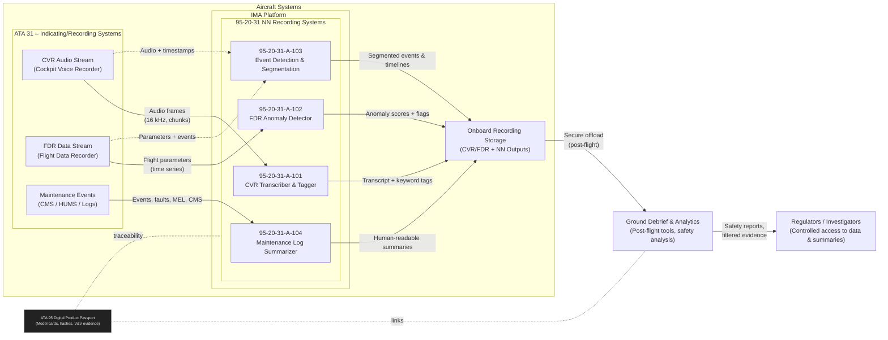

# 95-20-31 NN Recording Systems – Diagrams

This directory contains **system architecture diagrams, interface views, and other visual documentation** for the NN Recording Systems (ATA 95-20-31), supporting **ATA 31 – Indicating/Recording Systems**.

---

## 1. System Architecture Diagram

- **File**: `95-20-31_System_Architecture.pdf`  
- **Status**: TO BE CREATED  
- **Tools**: Draw.io, Visio, or equivalent professional diagramming tool  

**Intended content (minimum scope):**

- Overall NN Recording Systems architecture
- CVR / FDR / maintenance-recording data flows
- Interactions between:
  - CVR Transcription & Tagging NN
  - FDR Anomaly Detector NN
  - Event Detection & Segmentation NN
  - Maintenance Log Summarizer NN
- Integration points with **ATA 31** and, where applicable, **ATA 45** (central maintenance)
- IMA partition allocation and boundaries (ARINC 653)
- Interfaces to storage, replay, and ground debriefing tools

The final diagram should be consistent with the ATA 95-00-00 GENERAL governance model and the Digital Product Passport (DPP) for neural networks.

---

## 2. Textual Reference (Placeholder)

Until the graphical architecture is produced, a **textual representation** of the system architecture and component responsibilities is available in:

- [`95-20-31-001_Recording_Systems_NN_Overview.md`](../../95-20-31-001_Recording_Systems_NN_Overview.md)

That document should be treated as the **single source of truth** for:

- NN function list and IDs  
- High-level responsibilities and interfaces  
- Cross-ATA integration statements

The future PDF diagram must remain consistent with this overview.

---

## 3. Document Control

- **Document**: 95-20-31 NN Recording Systems – Diagrams README  
- **Version**: 1.0  
- **Status**: WORKING  
- **Location**: `ASSETS/Diagrams/` under `95-20-31_NN_Recording_Systems`  
- **Last Updated**: 2025-11-18  

**AI Assistance & Authorship**

- **AI Tools Used**:
  - GitHub Copilot  
  - ChatGPT  
- **Prompted by**: **Amedeo Pelliccia**  
- **Note**:  
  This file was drafted with AI assistance for documentation structure and hyperlink
  suggestions. Content is subject to human review, validation, and approval under the
  AMPEL360 document control process before being used for certification or regulatory
  submissions.

