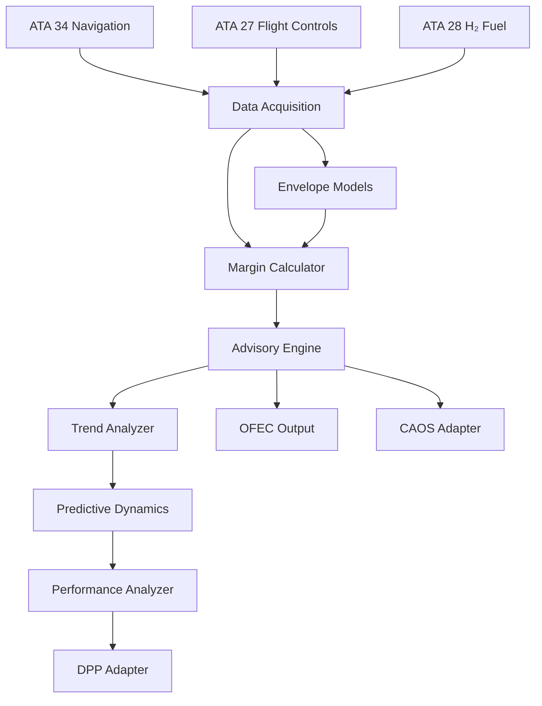

# Envelope Analytics Architecture

## Document Control

| Field | Value |
|-------|-------|
| **Document ID** | OFEC-97-40-40-AR-001 |
| **Version** | 1.0 |
| **Status** | DRAFT |

---

## 1. Architecture Overview

The Envelope Analytics subsystem implements a layered architecture separating data acquisition, computation, and output formatting.

```
┌─────────────────────────────────────────────────────────────────────────┐
│                         ENVELOPE ANALYTICS                              │
├─────────────────────────────────────────────────────────────────────────┤
│                                                                         │
│  ┌─────────────────────────────────────────────────────────────────┐   │
│  │                     PRESENTATION LAYER                          │   │
│  │  ┌─────────────┐  ┌─────────────┐  ┌─────────────────────────┐  │   │
│  │  │  OFEC       │  │  CAOS       │  │  DPP Adapter            │  │   │
│  │  │  Output     │  │  Adapter    │  │                         │  │   │
│  │  └─────────────┘  └─────────────┘  └─────────────────────────┘  │   │
│  └─────────────────────────────────────────────────────────────────┘   │
│                                    ▲                                    │
│  ┌─────────────────────────────────┴───────────────────────────────┐   │
│  │                     APPLICATION LAYER                           │   │
│  │  ┌─────────────┐  ┌─────────────┐  ┌─────────────────────────┐  │   │
│  │  │  Advisory   │  │ Performance │  │  Predictive             │  │   │
│  │  │  Engine     │  │ Analyzer    │  │  Dynamics               │  │   │
│  │  └─────────────┘  └─────────────┘  └─────────────────────────┘  │   │
│  └─────────────────────────────────────────────────────────────────┘   │
│                                    ▲                                    │
│  ┌─────────────────────────────────┴───────────────────────────────┐   │
│  │                     COMPUTATION LAYER                           │   │
│  │  ┌─────────────┐  ┌─────────────┐  ┌─────────────────────────┐  │   │
│  │  │  Margin     │  │  Envelope   │  │  Trend                  │  │   │
│  │  │  Calculator │  │  Models     │  │  Analyzer               │  │   │
│  │  └─────────────┘  └─────────────┘  └─────────────────────────┘  │   │
│  └─────────────────────────────────────────────────────────────────┘   │
│                                    ▲                                    │
│  ┌─────────────────────────────────┴───────────────────────────────┐   │
│  │                     DATA ACQUISITION LAYER                      │   │
│  │  ┌─────────────┐  ┌─────────────┐  ┌─────────────────────────┐  │   │
│  │  │  Navigation │  │  Flight     │  │  H₂ Fuel                │  │   │
│  │  │  Adapter    │  │  Controls   │  │  Adapter                │  │   │
│  │  └─────────────┘  └─────────────┘  └─────────────────────────┘  │   │
│  └─────────────────────────────────────────────────────────────────┘   │
│                                                                         │
└─────────────────────────────────────────────────────────────────────────┘
```

---

## 2. Component Descriptions

### 2.1 Data Acquisition Layer

| Component | Responsibility | Input Source |
|-----------|----------------|--------------|
| Navigation Adapter | Receive attitude, airspeed, altitude | ATA 34 |
| Flight Controls Adapter | Receive surface positions, config | ATA 27 |
| H₂ Fuel Adapter | Receive tank pressure, temperature | ATA 28 |

### 2.2 Computation Layer

| Component | Responsibility | Algorithm |
|-----------|----------------|-----------|
| Margin Calculator | Compute all margin types | Real-time calculation |
| Envelope Models | Provide limit references | Lookup + interpolation |
| Trend Analyzer | Detect parameter trends | Moving average + gradient |

### 2.3 Application Layer

| Component | Responsibility | Output |
|-----------|----------------|--------|
| Advisory Engine | Generate advisories | Advisory level + message |
| Performance Analyzer | Aggregate performance data | Statistics + events |
| Predictive Dynamics | Forecast envelope state | Predictions + confidence |

### 2.4 Presentation Layer

| Component | Responsibility | Format |
|-----------|----------------|--------|
| OFEC Output | Format telemetry | CBOR-encoded messages |
| CAOS Adapter | Format events | CAOS event schema |
| DPP Adapter | Format records | DPP record schema |

---

## 3. Data Flow



---

## 4. Design Patterns

### 4.1 Observer Pattern
Used for event notification between components (e.g., exceedance events).

### 4.2 Strategy Pattern
Used for interchangeable margin calculation algorithms.

### 4.3 Factory Pattern
Used for creating model instances based on aircraft configuration.

---

## 5. Concurrency Model

| Aspect | Implementation |
|--------|----------------|
| Threading | Single main loop + async I/O |
| Scheduling | Priority-based task queue |
| Synchronization | Lock-free queues for data passing |

---

## 6. Error Handling

| Error Type | Handling Strategy |
|------------|-------------------|
| Input fault | Mark data as invalid, use last-known-good |
| Calculation error | Log error, skip sample |
| Communication failure | Buffer locally, retry |
| System error | Graceful degradation, alert |

---

## Document Control

- Generated with the assistance of AI (GitHub Copilot), prompted by **Amedeo Pelliccia**.
- Status: **DRAFT** – Subject to human review and approval.
- Repository: `AMPEL360-BWB-H2-Hy-E`
- Last AI update: _2025-11-28_.
