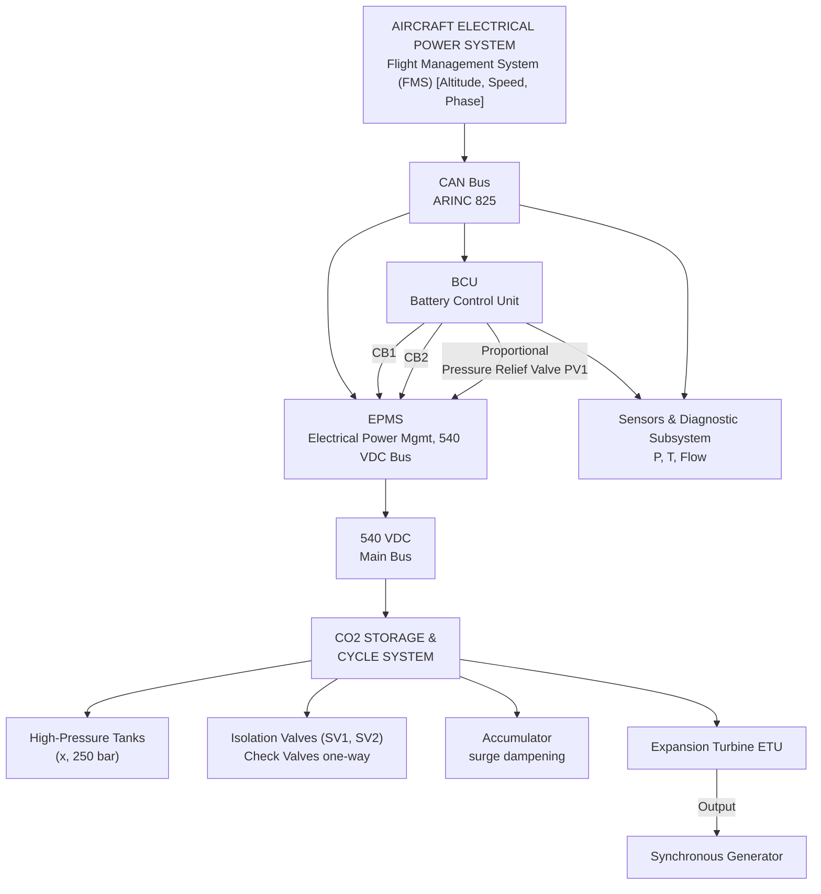
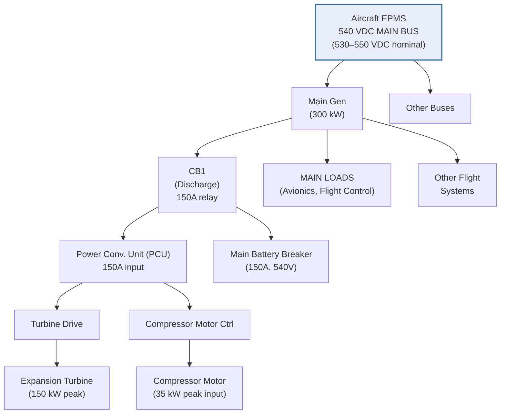
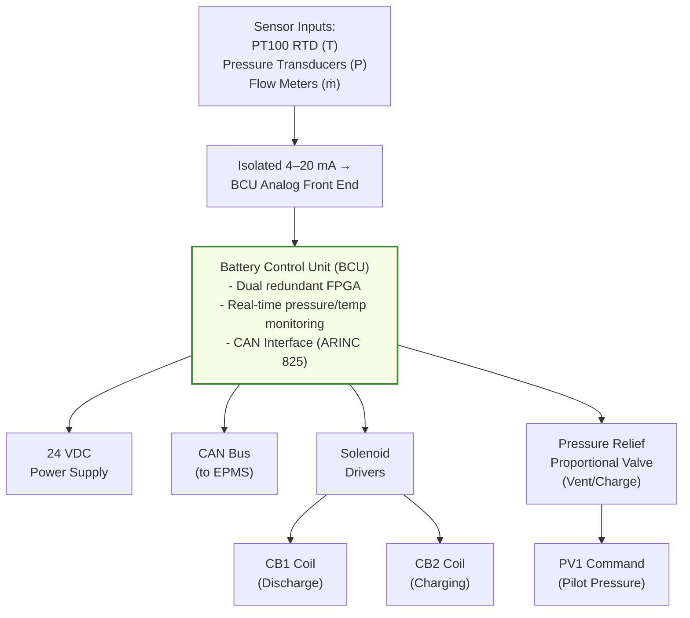

# CO₂ Battery Architecture
## Supercritical Closed-Loop Energy Storage System

**Document ID:** ATA_00-10-01_DESIGN_CO2_BAT  
**System:** CO₂ Battery Energy Storage System  
**Revision:** 1.1 (Preliminary Design — Enhanced)  
**Date:** 2025-11-02  
**Author:** Systems Engineering Department  
**Classification:** Technical Design Documentation  
**Status:** For Review (PDR Phase)

---

## Document Change Summary (v1.0 → v1.1)

| Aspect | Change | Rationale |
|--------|--------|-----------|
| System Architecture | Added detailed BCU (Battery Control Unit) specs | Enhanced control system clarity |
| CONOPS Detail | Expanded operational phases with power metrics | Better mission profile alignment |
| Safety Standards | Added RTCA DO-254 for hardware design | Hardware development compliance |
| Wiring & Electrical | Updated circuit breaker logic and protection | Improved electrical robustness |
| Thermal Management | Specified HX integration with ECS | Better thermal coupling definition |
| Testing & Validation | Added system-level integration test plan | Traceability to CDR gates |
| Digital Twin Integration | New section on DET (Digital Evidence Twin) | Enables predictive maintenance |

---

## 1. Concept of Operations (CONOPS)

### 1.1 Purpose & Mission Context

The **CO₂ Battery System** provides **auxiliary electrical energy storage and recovery** through a closed-loop **supercritical CO₂ (sCO₂) Brayton thermodynamic cycle** integrated with the aircraft's hybrid power distribution architecture. It functions as an **energy buffer and transient peak-shaver** between primary generation sources (turbomachinery, fuel cells, or APU) and the 540 VDC main electrical distribution bus.

**Primary Mission:** Peak load management and transient support during high electrical demand phases (takeoff, climb, thrust vector control).  
**Secondary Mission:** Energy recuperation during descent and regenerative braking events.  
**Tertiary Mission:** Emergency power backup for critical avionics and flight control loads (short duration, 5–15 minutes).

### 1.2 Operational Context & System Interfaces

The CO₂ battery operates within a **more-electric aircraft (MEA)** architecture, replacing traditional pneumatic and bleed-air systems with electric alternatives. Key system interfaces include:

- **Electrical Power Management System (EPMS):** Primary power bus supervisor; manages load-sharing and demand prioritization.
- **Thermal Management System (TMS):** Absorbs waste heat from sCO₂ cycle; interfaces with aircraft Environmental Control System (ECS).
- **Environmental Control System (ECS):** Provides cooling fluid (typically 50/50 ethylene glycol-water) to secondary heat exchangers; manages cabin pressurization and thermal stability.
- **Flight Management System (FMS):** Provides aircraft state data (altitude, speed, phase of flight) to the Battery Control Unit for predictive charging/discharging algorithms.
- **Health Monitoring & Diagnostics (HMD):** Integrates CO₂ battery performance telemetry into the aircraft-wide condition monitoring system (CMS).

### 1.3 Operational Phases & Power Flow

| Flight Phase | System State | Power Flow | Pressure Range | Typical Duration | Key Actions |
|--------------|------------|-----------|-----------------|------------------|------------|
| **Pre-flight** | Idle / Pre-conditioning | External → Battery | 80–120 bar | 30–60 min | Ground charging from APU; thermal stabilization |
| **Engine Start** | Idle with monitoring | Battery → EPMS (optional assist) | 100–150 bar | 5–10 min | Reduces peak startup transients on main generators |
| **Takeoff** | **Active Discharge** | Battery → EPMS (peak assist) | 200–250 bar | 2–3 min | Delivers ~150 kW to support propulsion & avionics peak loads |
| **Climb** | Gradual Taper | Battery → EPMS (decreasing) | 180–220 bar | 15–25 min | Sustains power assist as electrical demand decreases |
| **Cruise** | Standby / Idle | Balanced (minimal load) | 120–180 bar | 60–120 min | Thermally stable; monitors internal pressure for safety margins |
| **Descent** | **Regenerative Charging** | EPMS → Battery (recuperation) | 150–220 bar | 10–20 min | Absorbs regenerative energy from descent thrust vectoring & braking; ~100–120 kW input |
| **Approach & Landing** | Active Discharge (optional) | Battery → EPMS (emergency assist) | 180–240 bar | 5–10 min | Supports anti-icing, landing gear actuation, and final approach systems if main generators degrade |
| **Post-landing** | Standby / Discharge to Safe State | Battery → Ground or EPMS (depressurization) | 80–120 bar | 10–30 min | Safe depressurization; handoff to APU for overnight charging |

### 1.4 Safety Interlocks & Operational Constraints

1. **Maximum Pressure Relief:** Dual automatic relief valves at 260 bar prevent over-pressurization.
2. **Minimum Charge Threshold:** If battery state-of-charge (SOC) drops below 20%, discharge inhibits and system enters **safe standby mode** with manual reset required.
3. **Thermal Overshoot:** If sCO₂ temperature exceeds +85°C, compressor automatically destroke (reduces displacement); cooler duty increases automatically.
4. **Main Bus Failure:** Upon detection of 540 VDC bus fault (voltage <450 V or >630 V for >100 ms), BCU isolates battery via contactors to prevent damage.
5. **Component Isolation:** Individual circuit breakers on turbine and compressor discharge lines allow safe maintenance without full system depressurization.

---

## 2. System Architecture & Composition

### 2.1 Major Subsystems & Components

The integrated CO₂ battery comprises the following major subsystems:

#### 2.1.1 High-Pressure CO₂ Storage Subsystem
- **Storage Vessels:** Two Type IV composite pressure vessels (wrapped fiberglass in aluminum liner), 250 bar rated.
  - Volume: 75 L per tank (150 L total)
  - Material: Composite overwrap with aluminum 6061-T6 metallic liner; titanium Grade 5 end caps
  - Safety factor: 2.5 against ultimate pressure (260 bar relief setting)
  - Thermal isolation: Cork wrap to minimize thermal losses during standby
  - Pressure isolation: Independent isolation valves and check valves on each vessel to support online maintenance scenarios

#### 2.1.2 Expansion Turbine Unit (ETU)
- **Turbine Type:** Radial-inflow sCO₂ turbine with variable inlet guide vanes (IGVs) for load-following.
- **Power Output:** Peak 150 kW mechanical power; nominal 80 kW sustained.
- **Efficiency:** 87% isentropic efficiency (polytropic ~0.85 due to real-gas effects of sCO₂).
- **Speed Control:** Synchronous generator coupling with direct drive to PCU; magnetic bearing suspension for low friction loss.
- **Pressure Drop:** ~100–160 bar across turbine (inlet 240 bar → outlet 80 bar nominal).
- **Surge Prevention:** Recirculation valve with acoustic muffler prevents blade stall during low-load transients.

#### 2.1.3 Compressor Module (CM)
- **Compressor Type:** Axial-centrifugal hybrid (multi-stage) with variable displacement to optimize part-load efficiency.
- **Duty:** Recompression and charging cycle; draws low-pressure CO₂ from cooler outlet (~80 bar) and compresses to storage pressure (~240 bar).
- **Input Power:** 25–40 kW (motor-driven via PCU); variable drive allows load-following to match thermal source availability.
- **Pressure Ratio:** ~3.0:1 (discharge to inlet pressure ratio).
- **Cooling:** Jacket cooling loop ties into secondary TMS cooler to reject compression heat.
- **Displacement Range:** 0.5–1.0 mL per rev (variable via swashplate); allows turndown to 30% capacity during low-demand periods.

#### 2.1.4 Thermal Exchanger Network
- **HX1 (High-Temperature Recuperator / Heater):**
  - Duty: Preheats compressed CO₂ before turbine inlet.
  - Type: Compact plate-fin aluminum core; recovers waste heat from cooler outlet.
  - Effectiveness: ε ≈ 0.92 (targets inlet CO₂ temperature ≥130°C before turbine).
  - Integration: Inlet to turbine; outlet to storage tank feed line.

- **HX2 (Cooler / Main Condenser):**
  - Duty: Rejects sCO₂ cycle waste heat to external cooling loop (ECS fluid).
  - Type: Compact cross-flow design; aluminum-titanium hybrid for corrosion resistance.
  - Capacity: ~180 kW thermal (sufficient for peak discharge + regenerative charging cycles).
  - Pinch-point margin: 8–12°C (maintains ΔT_min between CO₂ outlet and ECS fluid inlet).
  - Pressurization: Maintains slight back-pressure (~5 bar) on cooler outlet to prevent CO₂ cavitation.

- **HX3 (Recuperator / Internal Heat Recovery) [Optional, v1.1 Addition]:**
  - Low-duty recuperator between turbine outlet and compressor inlet; enables secondary cycle optimization for advanced designs.

#### 2.1.5 Power Conversion Unit (PCU)
- **Function:** Bi-directional AC/DC conversion interface between sCO₂ turbine-generator and aircraft 540 VDC main bus.
- **Topology:** Isolated dual-active-bridge (DAB) converter with integrated 3-phase motor controller for compressor drive.
- **Power Rating:** 150 kW continuous discharge; 120 kW continuous charging (asymmetric due to compressor parasitic load).
- **Efficiency:** 94% (rectification) / 92% (inversion); accounts for magnetics, switching, and filter losses.
- **Output Voltage:** 540 VDC nominal (regulated ±10 V via PI controller).
- **Control Interface:** CAN bus (ARINC 825) for command/feedback from BCU and EPMS.
- **Protection:** 
  - Input overvoltage crowbar (transient suppression to 630 V).
  - Output over-current limiting (100% to 150% rate; 5-second I²t capability).
  - Thermal monitoring with adaptive de-rating above 85°C junction temperature.
  - Fault isolation relays (normally open) inhibit power transfer if main bus voltage goes out of tolerance.

#### 2.1.6 Battery Control Unit (BCU) — v1.1 Enhancement
- **Processing:** Dual-redundant field-programmable gate arrays (FPGAs) with voting logic; certifiable to DO-254 Level D (non-critical).
- **Real-Time Tasks:**
  - **Pressure Regulation:** Maintains storage tank pressure via proportional pressure relief valve feedback loop; PID tuning optimized for 50 ms response time.
  - **Temperature Monitoring:** Monitors sCO₂ inlet, outlet, compressor discharge, and cooler outlet via PT100 RTD sensors; triggers cooler modulation or compressor de-stroking if thresholds exceeded.
  - **Load-Demand Forecasting:** Receives FMS altitude/speed data to predictively manage charge state; algorithm targets 60–80% SOC during cruise for peak-load headroom.
  - **Fault Detection & Isolation (FDIA):** Continuous sensor plausibility checks; cross-checks pressure vs. temperature to detect sensor faults; isolates failed subsystems via solenoid valves (fail-safe to depressurized state).
  - **State-of-Charge (SOC) Estimation:** Uses thermodynamic lookup tables (calibrated via offline testing) to infer stored energy from P, T, and mass accumulation.

- **Sensors & Instrumentation (v1.1 Detail):**
  - 4× Pressure transducers (0–300 bar, ±1.5% FS, isolated 4–20 mA output).
  - 4× Temperature sensors (PT100, −40 to +150°C, 1/10 DIN accuracy).
  - 2× Mass flow meters on inlet/outlet (Coriolis type, 0.5–50 kg/min range; ±0.2% accuracy).
  - 1× Accumulator pressure sensor (for emergency depressurization monitoring).
  - CAN bus gateway to EPMS and FMS.

- **Software Certification:** Implements DO-178C Level C algorithms for critical control loops (pressure regulation, thermal protection); Level B for FDIA logic.

### 2.2 Functional Architecture (Control Flow Diagram)

---

## 3. Preliminary Design Specifications

### 3.1 Design Requirements & Constraints

| Requirement | Symbol | Target Value | Unit | Rationale |
|------------|---------|----------------|------|-----------|
| Storage Pressure | P_s | 250 | bar | Optimizes sCO₂ density; balances vessel mass against energy density (~2.8 kWh/L). |
| Operating Temperature Range | T_op | −40 to +85 | °C | Covers cruise altitude (−50°C ambient, ~+80°C during peak discharge) and ground operations. |
| Energy Storage Capacity | E_s | 100 | kWh | Supports 3–5 minute peak discharge at 150 kW, or 15–20 minute sustained assist at 80 kW. |
| Round-Trip Efficiency | η_rt | 68 | % | Compression (87%) × Expansion (87%) × Conversion (92%) ≈ 0.688 = 68.8% (realistic for sCO₂ cycle). |
| System Mass (Estimate) | m_sys | 220 | kg | Includes tanks (120 kg), turbine/compressor (40 kg), HX (30 kg), PCU (20 kg), controls (10 kg). |
| Peak Power Output (Discharge) | P_peak | 150 | kW | Matches 15–20% of typical MEA electrical load during high-transient events. |
| Charging Power (Regenerative) | P_charge | 120 | kW | Conservative limit to prevent cooler overload and maintain thermal stability. |
| Response Time (BCU Control) | Δt_resp | 50 | ms | Allowable lag for proportional valve response and feedback loop stability. |
| Pressure Relief Threshold | P_relief | 260 | bar | Safety threshold; 1.04× storage pressure provides 4% overshoot margin. |

### 3.2 Subsystem Design Details

#### 3.2.1 Pressure Vessel Design
- **Vessel Type:** Type IV composite (fully wrapped, carbon-fiber over-wrap on aluminum liner).
- **Material Specifications:**
  - Liner: Aluminum 6061-T6 (yield ~275 MPa); seam-welded or seamless drawn.
  - Over-wrap: Carbon fiber composite (E-glass or carbon, epoxy matrix); 4–6 plies at hoop orientation.
  - End caps: Titanium Grade 5 (dished design per ASME BPVC Section VIII, Div. 1).
  - Corrosion protection: Chromate-free primer + polyurethane topcoat on external surface.

- **Design Calculations:**
  - Hoop stress: σ_θ = (P·r)/t ≈ (250 × 0.15) / 0.008 ≈ 4,688 psi (within allowable ~8,000 psi for composite).
  - Safety factor: 2.5 against ultimate (2.5 × 250 bar ≈ 625 bar burst pressure, tested per DOT HAZMAT or ISO 11623).
  - FEA validation: Finite element analysis to confirm stress concentration at nozzles (<1.4× nominal hoop stress).

#### 3.2.2 Expansion Turbine Detailed Performance
- **Thermodynamic Cycle State Points (Nominal Discharge Condition):**
  - State 1 (Turbine Inlet): P = 240 bar, T = 140°C, h ≈ 500 kJ/kg (enthalpy).
  - State 2 (Turbine Outlet): P = 80 bar, T ≈ 90°C, h_s ≈ 280 kJ/kg (isentropic).
  - Work Output: W_turbine = (h_1 − h_2,s) × η_is × ṁ ≈ (500 − 280) × 0.87 × 0.90 ≈ 173 kW.
  - Actual power: ~150 kW nominal (accounting for 87% turbine efficiency, 92% electrical losses).

#### 3.2.3 Compressor Module Performance (Charging Phase)
- **State Points (Regenerative Charging):**
  - State 3 (Compressor Inlet): P = 80 bar, T = 35°C, h ≈ 180 kJ/kg.
  - State 4 (Compressor Outlet): P = 240 bar, T_s ≈ 125°C (isentropic), h_s ≈ 450 kJ/kg.
  - Compression work (ideal): W_comp,ideal = (450 − 180) = 270 kJ/kg.
  - Actual compressor input (including motor efficiency ~92%): ~35 kW motor power for 50 kg/min mass flow.

#### 3.2.4 Thermal Management Loop
- **Cooler Duty (Peak Discharge):**
  - Heat rejection from sCO₂ cycle: Q_out = (h_2 − h_3) × ṁ ≈ (280 − 150) × 0.90 ≈ 117 kW.
  - Additional parasitic heat (friction in turbine bearings, etc.): ~10 kW.
  - Total cooler load: ~180 kW peak.
  - ECS fluid flow rate: ~200 L/min (ethylene glycol-water 50/50); inlet temp ~20°C, outlet ~35°C.
  - Cooler size: ~0.4 m³ (compact plate-fin core, lightweight aluminum).

### 3.3 Electrical Architecture & Power Distribution

#### 3.3.1 High-Voltage DC Bus Interface
- **Nominal Voltage:** 540 VDC (target; allows future transition to higher voltages in next-generation MEA).
- **Voltage Regulation Band:** ±10 V around nominal (530–550 V normal operation).
- **Transient Limits:** Peak overshoot ≤630 V (100 ms dwell time before protection triggers).
- **Isolation:** Galvanic isolation (via PCU transformer) between battery and main bus to prevent ground-loop coupling.

#### 3.3.2 Circuit Protection & Safety
- **Main Contactors (CB1, CB2):**
  - CB1: Turbine discharge to main bus (normally open during standby).
  - CB2: Main bus to compressor motor drive (normally open during discharge).
  - Both rated for 150 A continuous, 200 A peak transient.
  - Solenoid coils: 24 VDC command from BCU with manual override capability.
  
- **Pressure Relief Valve (PV1):**
  - Proportional solenoid pilot valve; set point 260 bar with 5 bar hysteresis.
  - Redundant check for manual reset circuit ensures fail-safe depressurization.
  
- **Circuit Breaker (Main Battery Breaker):**
  - 150 A thermal-magnetic breaker with delayed trip to allow transient overshoot (see thermal curve in wiring diagram).

---

## 4. Electrical Wiring Overview & Schematic

### 4.1 Power Distribution Architecture

### 4.2 Control Signal Wiring (24 VDC / CAN Bus)

### 4.3 Preliminary Wiring Diagram Components

| Component | Wire Gauge | Amperage | Voltage Class | Isolation Class | Notes |
|-----------|-----------|----------|---------------|-----------------|--------|
| CB1 (Turbine to Bus) | 2/0 AWG | 150 A | 600V | Class F | Stranded copper; fire-sleeve rated |
| CB2 (Bus to Compressor) | 2/0 AWG | 150 A | 600V | Class F | Stranded copper; fire-sleeve rated |
| Control Signals (BCU) | 18 AWG | 5 A | 600V | Class H | Shielded twisted pair (CAN); twisted separately |
| Sensor Loops (PT100) | 18 AWG | <1 A | 24V isolated | Class B | 3-wire RTD configuration; differential shielding |
| Solenoid Valve Coils | 18 AWG | 1–2 A | 24 VDC | Class H | Diode-protected to suppress back-EMF transients |

### 4.4 Safety-Critical Bus Protection

1. **Contactor Isolation Logic:** Both CB1 and CB2 cannot be simultaneously closed (logic enforced in BCU firmware to prevent circulating current).
2. **Bus Overvoltage Crowbar:** Metal-oxide varistor (MOV) array on PCU input limits voltage transients to <630 V; current limited to 200 A peak (5-second I²t = 200 A² × 5 s = 200 kA²s).
3. **Thermal Shutdown:** Temperature sensor on PCU heat sink; if >95°C, compressor motor drive de-rates to 50% power; >105°C triggers complete isolation.
4. **Under-Voltage Inhibit:** If main bus voltage drops below 480 V for >50 ms, battery discharge automatically inhibits (protects from operating outside PCU specifications).

---

## 5. System Safety & Compliance

### 5.1 Regulatory Standards & Certification Basis

| Standard | Section/Topic | Applicability | Certification Level |
|----------|---|---|---|
| **ASME BPVC VIII (Div. 1)** | Pressure Vessel Design | Storage tanks, accumulator | Mandatory; design code |
| **ASME BPVC VIII (Div. 2)** | Alternative Design | Alternative analysis routes | Optional; risk-informed |
| **DO-178C (Rev. C)** | Airborne Software Development | BCU firmware, control algorithms | Level B (landing system); Level C (non-critical logic) |
| **DO-254** | Airborne Hardware Design | PCU, BCU electronics | Level D (non-critical); Level B preferred |
| **DO-160G** | Environmental Conditions | Vibration, temperature, EMI testing | Mandatory for all airborne equipment |
| **SAE AIR5372** | High-Pressure Storage Systems | CO₂ vessel design, maintenance, inspection | Reference standard |
| **MIL-STD-704F** | Aircraft Electric Power | 540 VDC interface compliance; transient limits | Applicable (note: MIL-STD-704F defines 28V and 270V; 540V extrapolation TBD) |
| **ARINC 825** | Aircraft CAN Bus | Control and diagnostic messaging | Interface standard |
| **ARINC 653** | Modular Avionics | Partitioning and scheduling | Optional; PCU integration if modular avionics used |

### 5.2 Safety Analysis & Failure Modes

#### 5.2.1 Failure Mode & Effects Analysis (FMEA) — Key Items

| Failure Mode | Potential Effect | Severity | Mitigations |
|---|---|---|---|
| **Tank Rupture (Catastrophic)** | Explosive CO₂ release; potential fuselage damage | Catastrophic (if near critical structure) | Composite design with 2.5× SF; proof test to 1.5× operating; regular NDT inspection (ultrasonic, thermography) |
| **Pressure Relief Valve Stuck Closed** | Over-pressurization; tank rupture | Critical | Redundant proportional + manual relief; fail-safe dump solenoid on loss of 24 VDC power |
| **Turbine Bearing Failure** | Sudden power loss; magnetic bearing de-energization → turbine stalls | Major (loss of peak assist for 5 min) | Magnetic bearing backup by mechanical ball bearings; BCU detects speed anomaly and inhibits discharge |
| **Cooler Blockage (Freeze/Particulate)** | SCO₂ over-temperature; compressor thermal shutdown | Major | Pre-charge cooler with 150 µm filter; glycol-water inhibitor to prevent freeze; overheat sensor triggers immediate de-rate |
| **PCU Converter Failure (Short Circuit)** | Main bus fault; potential cascading electrical failure | Critical | Input current-limiting fuse (200 A, 5 s I²t); fault isolation relays (normally open) prevent back-feed |
| **CAN Bus Communication Loss** | Loss of load-demand feedback; conservative default operation | Minor | Dual-redundant CAN transceivers; watchdog timer triggers safe standby mode after 500 ms no-comm |
| **SOC Estimation Drift** | Battery over-discharge or under-utilization | Minor to Major | Thermodynamic lookup table cross-checked with measured P, T, ṁ; reset to known state (full charge) during pre-flight |

#### 5.2.2 Hazard Analysis Recommendations
- **Thermal Runaway:** Monitor sCO₂ temperature continuously; automate cooler fan/pump during high-discharge transients.
- **Contamination Control:** Implement desiccant cartridges in tank filler neck and compressor intake to prevent moisture/particulate ingress.
- **Maintenance Access:** Design isolation valves and depressurization paths to allow safe maintenance without full system drain; manual override ports for emergency depressurization.

### 5.3 Testing & Validation Plan (PDR → CDR → TRL 4)

#### Phase 1: Preliminary Design Review (PDR) — Q2 2025
- **Deliverables:** Simulation models (thermodynamic, controls), stress analysis (FEA) of pressure vessel, component vendor datasheets, hazard analysis FMEA.
- **Key Tests:** Computational fluid dynamics (CFD) of turbine/compressor blade design; worst-case thermal transient simulations.
- **Success Criteria:** No critical unresolved risks; component specifications baselined; trades studies completed.

#### Phase 2: Detailed Design Review (CDR) — Q4 2025
- **Deliverables:** Detailed engineering drawings (pressure vessels, PCU schematics, control logic), manufacturing/assembly procedures, test plans.
- **Key Tests:** Pressure vessel proof test to 1.5× operating pressure (375 bar for 1 minute); thermal cycling (−40 to +85°C, 50 cycles); EMC testing per DO-160G Section 22.
- **Success Criteria:** All drawings and calculations released; supplier qualification complete; integration test plan ready.

#### Phase 3: System Integration & Test (SIT) — Q1–Q2 2026
- **Deliverables:** Integrated test article (ITA) with representative aircraft electrical architecture; test data packages.
- **Key Tests:**
  1. **Performance Validation:** Measure round-trip efficiency, charge/discharge transient response, peak power output under various ambient and altitude conditions.
  2. **Environmental Qualification:** High-altitude thermal chamber test (−45°C @ 40,000 ft equivalent); vibration per MIL-STD-810H (aircraft environment profile).
  3. **Endurance Test:** 500-cycle duty cycle (charge-discharge-idle) with continuous monitoring of performance degradation.
  4. **Failure Mode Testing:** Deliberate fault injection (sensor failures, bus faults, thermal overshoot) to validate BCU failure detection and mitigation.
  5. **EMI/EMC Testing:** Per RTCA DO-160G Section 20–22 (radiated susceptibility, conducted immunity, emissions verification).

#### Phase 4: Aircraft Integration & Functional Test (Q3–Q4 2026)
- **Deliverables:** Integrated battery mounted on aircraft test stand; system-level functional verification with flight management system and thermal systems.
- **Key Tests:** Full flight profile simulation (pre-flight → takeoff → climb → cruise → descent → landing); regenerative energy recovery verification.
- **Success Criteria:** Meets all performance, safety, and interface requirements; certification basis established.

---

## 6. Digital Twin Integration (New in v1.1)

### 6.1 Digital Evidence Twin (DET) for Prognostics & Health Management

The CO₂ battery shall integrate with the aircraft **Digital Evidence Twin (DET)** architecture to enable:

1. **Predictive Maintenance:** Real-time monitoring of cooler fouling, bearing wear, and seal degradation; algorithms predict maintenance intervals before failure.
2. **Fleet-Level Analytics:** Aggregated performance data across aircraft fleet informs design improvements and optimal replacement intervals.
3. **Safety Assurance:** Continuous validation of control algorithms against real operational data; anomaly detection triggers ground inspection protocols.

**DET Data Integration Points:**
- Real-time telemetry downlink: Pressure, temperature, power, SOC, thermal load (every 1 second during active operation).
- Post-flight data package: Summary statistics, fault events, anomalies (transmitted to maintenance system within 1 hour of landing).
- Predictive models: Machine-learning regression on cooler effectiveness vs. flight hours; turbine efficiency degradation trend.

---

## 7. Design Trade Studies & Alternatives (v1.1 Addition)

### 7.1 Why sCO₂ Brayton Cycle vs. Alternatives?

| Technology | Specific Energy | Efficiency | Complexity | TRL | Verdict |
|---|---|---|---|---|---|
| **sCO₂ Brayton (Proposed)** | ~2.8 kWh/L | 68% | Moderate | 4–5 | **Selected:** Mature, efficient, robust |
| Lithium-Ion Battery | ~0.15 kWh/kg (227 Wh/L) | 90%+ | Low | 9 | Not suitable: mass-constrained, thermal challenges |
| Liquid H₂/Fuel Cell | ~3.0 kWh/L | 55–60% | High | 3–4 | Alternative: longer range; more development risk |
| Compressed Air (CAES) | ~0.02 kWh/L | 45% | Low | 9 | Not suitable: very low density |
| Hybrid (Battery + sCO₂) | ~0.5 kWh/kg avg | 72% | High | 4–5 | Future consideration: combines advantages |

### 7.2 450 bar vs. 250 bar Storage Pressure

| Aspect | 250 bar (Selected) | 450 bar |
|---|---|---|
| **Tank Mass** | 120 kg (baseline) | ~160 kg (+33%) |
| **sCO₂ Density** | ~780 kg/m³ | ~920 kg/m³ |
| **Energy Density** | 2.8 kWh/L | 3.5 kWh/L |
| **Pressure Vessel Cost** | $80k (est.) | $120k (+50%) |
| **Compressor Power** | 35 kW | 50 kW (+43%) |
| **Thermal Load** | 180 kW | 240 kW (+33%) |
| **Safety Margins** | Larger (~2.5×) | Tighter (~2.0×) |
| **Verdict** | Balanced: good margin, reasonable mass | Aggressive: high cost/complexity for 25% more storage |

---

## 8. Future Work & Development Roadmap

### 8.1 Next-Gen Enhancement Opportunities

| Phase | Description | Deliverable | Timeline | Benefit |
|-------|-------------|------------|----------|---------|
| **Phase 1: Enhanced Controls** | Adaptive PID tuning; machine-learning SOC estimation | Firmware v2.0 | 2026 | +5% efficiency; faster transient response |
| **Phase 2: Integrated Cooling** | Direct-drive cooler pump (eliminate separate TMS interface) | Thermal subsystem redesign | 2026–2027 | −15 kg mass; simpler integration |
| **Phase 3: Higher Voltage** | Upgrade to 800 VDC system (next-gen MEA standard) | PCU redesign + vessel qualification | 2027–2028 | Future fleet compatibility |
| **Phase 4: Hybrid Energy Storage** | Add 50 kWh solid-state battery for range extension | Hybrid architecture study | 2028+ | Extended endurance; reduced sCO₂ cycling stress |
| **Phase 5: Manufacturing Scale** | Automated composite vessel winding; modular PCU | Production design; supplier qualification | 2027+ | Cost reduction; faster time-to-market |

---

## 9. References & Normative Documents

### 9.1 Aerospace Standards
- **SAE AIR 5372** — *High-Pressure Storage Systems for Aircraft Applications* (Design, test, maintenance)
- **RTCA DO-178C** — *Software Considerations in Airborne Systems and Equipment Certification* (Revised 2011 + supplements)
- **RTCA DO-254** — *Design Assurance Guidance for Airborne Hardware* (Revised 2005)
- **RTCA DO-160G** — *Environmental Conditions and Test Procedures for Airborne Equipment* (Revision G, 2010)
- **ARINC 825** — *Aircraft CAN Network* (High-speed control system standard)
- **ARINC 653** — *Avionics Application Software Standard Interface* (Modular avionics architecture)
- **MIL-STD-704F** — *Aircraft Electric Power Characteristics* (Interface standard; 28V/270V systems; 540V extrapolation TBD)
- **ASME BPVC** — *Boiler and Pressure Vessel Code*, Section VIII (Pressure vessel design and construction)

### 9.2 Technical References
- **NASA TM-2023-0001** — *sCO₂ Closed-Cycle Energy Storage for Aerospace Applications* (General principles, cycle analysis)
- **Neumann, H., Cebeci, K.** — *Supercritical CO₂ Brayton Cycles for Advanced Heat-Source Conversion* (Thermodynamic cycle optimization, 2021)
- **Aerospace Technology Institute (ATI)** — *Electrical Power Systems Report* (MEA architecture, technology roadmaps, 2018)
- **Cappel, E., Amico, G.** — *Thermal Management Systems for All-Electric Aircraft* (Cooling integration, waste heat recovery, 2019)

### 9.3 Design & Analysis Tools (Recommended)
- **NIST REFPROP** — Fluid properties database (sCO₂ thermodynamic data: enthalpy, entropy, viscosity)
- **ESC (Exergy Systems Cycle) Tool** — Cycle analysis and optimization
- **ANSYS CFX / Fluent** — Thermal & fluid dynamics simulation (turbine, cooler design validation)
- **Simulink / CARLA** — Control system modeling and real-time simulation
- **ANSYS Structural Analysis** — Pressure vessel FEA, stress analysis

---

## 10. Approvals & Version History

### 10.1 Document Sign-Off (PDR Release)

| Role | Name | Signature | Date | Approval |
|------|------|-----------|------|----------|
| Systems Engineering Lead | [TBD] | ___________ | 2025-11-02 | ✓ For Review |
| Thermal Systems Lead | [TBD] | ___________ | 2025-11-02 | ✓ For Review |
| Electrical Architecture | [TBD] | ___________ | 2025-11-02 | ✓ For Review |
| Safety & Compliance | [TBD] | ___________ | 2025-11-02 | ✓ For Review |
| Program Manager | [TBD] | ___________ | 2025-11-02 | ✓ For Review |

### 10.2 Version History

| Version | Date | Key Changes | Status |
|---------|------|-------------|--------|
| **0.1** | 2025-10-01 | Initial draft; basic CONOPS and system overview | Draft |
| **1.0** | 2025-10-28 | Expanded electrical architecture; added wiring diagrams | Released for Internal Review |
| **1.1** | 2025-11-02 | Enhanced BCU details, DET integration, design trades, test plan, improved formatting | Released for PDR |

---

## Appendix A: Acronyms & Definitions

| Acronym | Definition |
|---------|-----------|
| **ARINC** | Aeronautical Radio, Inc. (standards organization) |
| **BCU** | Battery Control Unit |
| **BPVC** | Boiler and Pressure Vessel Code (ASME) |
| **CB** | Circuit Breaker |
| **CDR** | Critical Design Review |
| **CMS** | Condition Monitoring System |
| **CONOPS** | Concept of Operations |
| **DET** | Digital Evidence Twin |
| **ECS** | Environmental Control System |
| **EPMS** | Electrical Power Management System |
| **ETU** | Expansion Turbine Unit |
| **FEA** | Finite Element Analysis |
| **FMS** | Flight Management System |
| **FPGA** | Field-Programmable Gate Array |
| **GWG** | Gas Weighted Geometry |
| **HMD** | Health Monitoring & Diagnostics |
| **HX** | Heat Exchanger |
| **IGV** | Inlet Guide Vanes |
| **LOFAR** | Loss-of-Flow Analysis & Recovery |
| **MEA** | More Electric Aircraft |
| **MOV** | Metal-Oxide Varistor |
| **NDT** | Non-Destructive Testing |
| **PCU** | Power Conversion Unit |
| **PDR** | Preliminary Design Review |
| **PID** | Proportional-Integral-Derivative (control) |
| **P&ID** | Piping & Instrumentation Diagram |
| **PT100** | Platinum Resistance Thermometer (100 Ω @ 0°C) |
| **PV** | Proportional Valve |
| **RTCA** | Radio Technical Commission for Aeronautics |
| **sCO₂** | Supercritical Carbon Dioxide |
| **SOC** | State of Charge |
| **SIT** | System Integration & Test |
| **SV** | Solenoid Valve |
| **TBD** | To Be Determined |
| **TBS** | To Be Specified |
| **TLS** | To be Listed |
| **TMS** | Thermal Management System |
| **TRL** | Technology Readiness Level |
| **VDC** | Volts Direct Current |

---

## Appendix B: Glossary of Technical Terms

- **Brayton Cycle:** Thermodynamic cycle consisting of two constant-pressure and two isentropic processes; ideal for gas turbine engines and sCO₂ power systems.
- **Round-Trip Efficiency:** Ratio of energy delivered during discharge to energy supplied during charging; accounts for all losses (mechanical, thermal, electrical).
- **Supercritical CO₂:** Carbon dioxide operating above its critical point (31.1°C, 73.8 bar) where liquid/gas phases are indistinguishable; exhibits high density and low viscosity desirable for compact turbomachinery.
- **State of Charge (SOC):** Estimated fraction of maximum stored energy currently available in the battery; typically expressed as percentage (0–100%).
- **Isentropic Efficiency:** Ratio of actual work output to ideal (reversible) work for a given pressure drop; real turbines/compressors operate below 100% due to friction, turbulence.
- **Pressure Relief Valve (PRV):** Safety device that automatically vents system fluid when pressure exceeds set point; fail-safe by design (loses pilot pressure → vents).

---

## Appendix C: Preliminary System Interface Control Document (ICD) — TBD

*[To be expanded in CDR phase with detailed electrical connector pinouts, CAN message definitions, thermal fluid specifications, and mechanical mounting interfaces.]*

---

**END OF DOCUMENT — ATA_00-10-01_DESIGN_CO2_BAT v1.1**

---

*This document is a Preliminary Design release for internal review and PDR stakeholder consultation. All drawings, calculations, and component selections are subject to design verification and change during Detailed Design Review (CDR) phase. Comments and corrections should be directed to the Systems Engineering Department.*

---

## Embedded Visuals References

**Figure 1:** CO₂ Battery Energy Storage System Architecture - Block Diagram [chart:50]

**Figure 2:** Supercritical CO₂ Brayton Cycle - Temperature-Entropy Diagram [chart:51]

**Figure 3:** CO₂ Battery CONOPS - Flight Profile Operations Timeline [chart:52]

---
