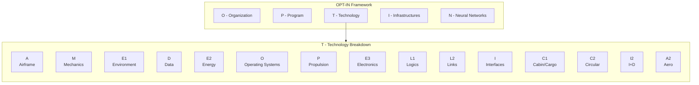

# OPT-IN Framework
### Amedeo Pelliccia's Development and Documentation Methodology for the AMPEL360 Program

**OPT-IN** is a structured, certifiable framework for the concurrent development and documentation of complex aerospace systems. It is the single source of truth for the AMPEL360 aircraft, ensuring traceability, audit-readiness, and lifecycle coherence from initial design through in-service operations.

## 1. Core Structure
The framework is organized into five principal axes, each decomposed into subdomains that mirror ATA chapter logic for regulatory alignment and industry interoperability.

| Axis | Domain | Scope & Core ATA Chapters |
|:---:|:---|:---|
| **O** | **Organization** | Governance, airworthiness, maintenance policies, and high-level program rules. |
| **P** | **Program** | Aircraft-level configuration, geometry, ground handling, and servicing specifications. |
| **T** | **Technology** | All on-board systems, organized by the `A-M-E-D-E-O-P-E-L-I-C-C-I-A₂` taxonomy. |
| **I** | **Infrastructures** | Ground support, airport interfaces, supply chains, and flight simulators. |
| **N** | **Neural Networks**| Data lineage, traceability, and AI/ML models for the Digital Product Passport. |

### The 14-Folder Subsystem Skeleton
Every component and system indexed within the OPT-IN framework is developed and documented using a standard, 14-folder lifecycle skeleton. This ensures that every part of the aircraft follows the same rigorous path from concept to in-service management.

1.  `01_OVERVIEW`
2.  `02_SAFETY`
3.  `03_REQUIREMENTS`
4.  `04_DESIGN`
5.  `05_INTERFACES`
6.  `06_ENGINEERING` (Analysis, Models, Simulations)
7.  `07_V_AND_V` (Verification & Validation)
8.  `08_PROTOTYPING`
9.  `09_PRODUCTION_PLANNING`
10. `10_CERTIFICATION`
11. `11_OPERATIONS_AND_MAINTENANCE`
12. `12_ASSETS_MANAGEMENT` (Spares, Tooling, Logistics)
13. `13_SUBSYSTEMS_AND_COMPONENTS` (Recursive decomposition)
14. `14_META_GOVERNANCE` (Sidecars, Schemas, CI rules)

---

## 2. Methodological Principles
1.  **ATA-Anchored Documentation:** Every technical artifact is indexed by ATA chapter to ensure interoperability with iSpec 2200 and S1000D deliverables.
2.  **Cross-Referenced Traceability:** Logical, thermal, and energy interfaces are explicitly documented through secondary ATA references.
3.  **Provisional Subjects:** Emerging technologies live under provisional codes until validated by formal standards review.
4.  **Bidirectional Linking:** Development repositories and technical manuals share identifiers, ensuring commits and documentation remain synchronized.
5.  **Audit Readiness by Design:** Every artifact traces back to a requirement and classification entry, guaranteeing a continuous chain of certification evidence.

---

## 3. Framework Overview

