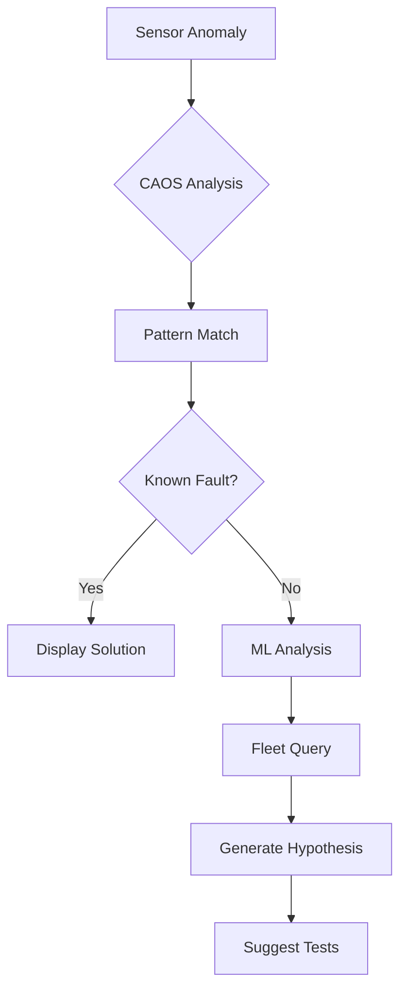

# CAOS Diagnostic Process
## DMC-AMPEL360-A-52-10-01-00A-912A-D

**Issue:** 001  
**Issue Date:** 2025-11-03  
**Information Code:** 912 (CAOS-Enhanced Diagnostics)  
**Classification:** Unclassified  
**Applicable to:** AMPEL360 BWB H2 Hy-E Q100 INTEGRA

---

## 1. GENERAL

This process data module provides CAOS-enhanced diagnostic procedures for Door L1 Forward.

---

## 2. REQUIREMENTS

### 2.1 Prerequisites
- CAOS connectivity active
- Digital twin synchronized
- Sensor data streaming

### 2.2 Tools
- CAOS diagnostic tablet
- AR headset (optional)
- Standard tools per [DMC-AMPEL360-A-00-00-00-00A-040A-D](../../Common_Information_Repository/Tools_Equipment/DMC-AMPEL360-A-00-00-00-00A-040A-D_Tools.csv)

### 2.3 Personnel Qualifications
- Licensed aircraft maintenance technician
- CAOS system training (Level 1 minimum)
- Door systems familiarization

### 2.4 Safety Requirements
- Aircraft power OFF unless specifically required
- Door warning placards installed
- Area clear of personnel during power tests
- Fire extinguisher available

---

## 3. DIAGNOSTIC PROCESS

### 3.1 Automatic Fault Detection



#### 3.1.1 Anomaly Detection
CAOS continuously monitors all sensor data for anomalies:
- Statistical outliers (>3 standard deviations)
- Trend deviations (unexpected rate of change)
- Pattern breaks (deviation from normal operational profile)
- Cross-sensor correlations (inconsistent readings)

When an anomaly is detected:
1. CAOS logs the event with timestamp and sensor data
2. Digital twin is updated with anomaly marker
3. Pattern matching algorithm searches fault database
4. If match found (>85% confidence), solution is displayed
5. If no match, machine learning analysis is initiated

#### 3.1.2 Known Fault Database
The CAOS system maintains a database of known faults:
- Fault code (unique identifier)
- Symptom pattern (sensor signatures)
- Root cause (component or condition)
- Resolution procedure (DMC reference)
- Success rate (historical effectiveness)
- Fleet occurrence rate (how common)

Example Known Fault:
```
Fault Code: 52-10-01-F-001
Description: Seal pressure degradation
Symptom: Gradual increase in seal pressure loss rate
Root Cause: Seal compression set
Resolution: DMC-AMPEL360-A-52-10-01-00A-540A-D (seal adjustment)
            or DMC-AMPEL360-A-52-10-01-00A-020A-D (seal replacement)
Success Rate: 94% (adjustment), 100% (replacement)
Fleet Occurrence: 2.3 per 10,000 flight hours
```

---

### 3.2 Manual Diagnostic Request

#### 3.2.1 Access CAOS Dashboard
1. Power on CAOS diagnostic tablet
2. Connect to aircraft WiFi network
3. Launch CAOS application
4. Select aircraft tail number
5. Navigate to Door L1 Forward diagnostics

#### 3.2.2 Dashboard Overview
The CAOS dashboard displays:
- Real-time sensor readings (color-coded status)
- Historical trends (selectable time range)
- Active alerts and warnings
- Upcoming maintenance items
- Digital twin status indicator

#### 3.2.3 Run Diagnostic Sequence

**Basic Diagnostic:**
```
CAOS> DIAG 52-10-01 --basic
Running basic diagnostic...
[===       ] 30% Sensor check
[======    ] 60% Functional verification
[==========] 100% Complete

Results:
- Latch System: OPTIMAL
- Seal Pressure: NORMAL
- Actuation: NORMAL
- Sensors: CALIBRATED

Status: SERVICEABLE
Next scheduled maintenance: 45 flight hours
```

**Full Diagnostic:**
```
CAOS> DIAG 52-10-01 --full
Running comprehensive diagnostic...
[===========] 100% Complete

Results:
- Latch System: OPTIMAL
  - All 8 latches engaged
  - Engagement force: Within limits
  - Position sensors: Functional
  
- Seal Pressure: DEGRADED (87%)
  - Forward seal: 92% effectiveness
  - Aft seal: 81% effectiveness ⚠️
  - Upper seal: 88% effectiveness
  - Lower seal: 89% effectiveness
  
- Actuation: NORMAL
  - Opening time: 4.2 seconds
  - Closing force: Within limits
  - Power consumption: Normal
  
- Sensors: CALIBRATED
  - All sensors responding
  - Calibration current
  - No drift detected

Recommendation: Schedule seal inspection
Priority: MEDIUM (within 100 flight hours)
Reference: DMC-AMPEL360-A-52-10-01-00A-720A-D
Estimated Time: 2 hours
Required Parts: Possible seal replacement (P/N 52-10-01-SEAL-AFT)
```

**Focused Diagnostic:**
```
CAOS> DIAG 52-10-01 --system seal
Running seal system diagnostic...

Seal Pressure Test Results:
Location    | Pressure | Effectiveness | Trend      | Status
------------|----------|---------------|------------|--------
Forward     | 8.9 psi  | 92%          | Stable     | OK
Aft         | 7.8 psi  | 81%          | Declining  | CAUTION
Upper       | 8.5 psi  | 88%          | Stable     | OK
Lower       | 8.6 psi  | 89%          | Stable     | OK

Issue Detected: Aft seal degradation
Degradation Rate: 1.2% per 100 flight hours
Predicted Failure: 1,583 flight hours (current: 412 flight hours)
Recommended Action: Inspect and adjust within 100 flight hours
                   Replace if adjustment insufficient
```

---

### 3.3 Digital Twin Analysis

#### 3.3.1 Accessing Digital Twin
1. From CAOS dashboard, select "Digital Twin"
2. Choose visualization mode:
   - 3D Model View (interactive 3D representation)
   - Sensor Overlay (sensor locations and readings)
   - Stress Map (structural stress distribution)
   - History Replay (replay past events)

#### 3.3.2 Compare Actual vs. Simulated
The digital twin runs parallel simulations based on:
- Current flight conditions
- Door operational state
- Environmental factors
- Component conditions

Comparison analysis identifies:
- **Green:** Actual matches prediction (within 5%)
- **Yellow:** Minor deviation (5-15%)
- **Red:** Significant deviation (>15%) - investigation required

Example Comparison:
```
Parameter          | Actual  | Predicted | Deviation | Status
-------------------|---------|-----------|-----------|--------
Latch Force        | 285 lbf | 280 lbf   | +1.8%     | Green
Seal Pressure Fwd  | 8.9 psi | 9.1 psi   | -2.2%     | Green
Seal Pressure Aft  | 7.8 psi | 9.0 psi   | -13.3%    | Yellow ⚠️
Opening Time       | 4.2 sec | 4.1 sec   | +2.4%     | Green
Vibration Level    | 0.3g    | 0.3g      | 0.0%      | Green
```

#### 3.3.3 Identify Deviations
When deviations are identified:
1. CAOS highlights the affected component in 3D view
2. Historical data is displayed to show trend
3. Similar deviations from fleet are shown
4. Probable causes are ranked by likelihood
5. Recommended diagnostic steps are provided

#### 3.3.4 Predict Failure Timeline
Using the digital twin's predictive models:
```
Component: Aft Door Seal
Current Condition: 81% effectiveness
Degradation Rate: 1.2% per 100 FH (based on trend)
Failure Threshold: 70% effectiveness
Predicted Failure: 1,583 flight hours from now
Confidence: 92%

Recommended Action:
- Inspect: Within 100 FH (Medium priority)
- Replace: Before 1,000 FH (if adjustment fails)
- Monitor: Continue CAOS monitoring (automatic)
```

---

### 3.4 Fleet Learning Integration

#### 3.4.1 Query Fleet Database
CAOS automatically queries the fleet database for similar faults:
```
CAOS> FLEET QUERY --symptom seal_degradation --component aft_seal

Fleet Query Results:
Total Aircraft in Fleet: 47
Similar Faults Found: 23 occurrences
Time Period: Last 24 months

Common Patterns:
1. Aft seal degradation (23 cases)
   - Average onset: 3,500 flight hours
   - Root cause: Compression set (18 cases)
   - Root cause: Installation error (5 cases)
   
2. Successful Resolutions:
   - Adjustment only: 12 cases (52% success)
   - Seal replacement: 23 cases (100% success)
   - Average repair time: 2.3 hours

3. Fleet Recommendation:
   - Attempt adjustment first (if condition >75%)
   - Replace if adjustment fails or condition <75%
   - Use updated seal (P/N 52-10-01-SEAL-AFT-02 Rev B)
   - Apply updated torque specification (35 in-lbs)
```

#### 3.4.2 Identify Successful Resolutions
Fleet data shows which solutions have been most effective:
```
Resolution Success Rates (Aft Seal Degradation):

1. Seal Replacement (Rev B): 100% success, 0% recurrence
   - Parts: P/N 52-10-01-SEAL-AFT-02 Rev B
   - Labor: 2.3 hours average
   - Cost: $450 parts + labor
   - DMC: DMC-AMPEL360-A-52-10-01-00A-540A-D

2. Seal Adjustment + Retorque: 52% success, 38% recurrence
   - Parts: None
   - Labor: 0.8 hours average
   - Cost: Labor only
   - DMC: DMC-AMPEL360-A-52-10-01-00A-540A-D
   - Note: Effective only when condition >75%

3. Seal Replacement (Rev A): 91% success, 12% recurrence
   - Parts: P/N 52-10-01-SEAL-AFT-01 Rev A (obsolete)
   - Note: Superseded by Rev B (SB 52-10-01-002)
```

#### 3.4.3 Propose Optimized Solutions
Based on fleet learning, CAOS proposes the optimal solution:
```
Recommended Solution Path:

Step 1: Inspect seal condition
        DMC: DMC-AMPEL360-A-52-10-01-00A-720A-D
        Time: 0.5 hours

Step 2: Measure seal compression
        Specification: 0.080" - 0.095" compressed thickness
        Current condition: 81% effectiveness suggests ~0.075" (below spec)

Step 3: Replace seal (recommended over adjustment)
        Reason: Condition below 85% threshold
        Parts: P/N 52-10-01-SEAL-AFT-02 Rev B
        DMC: DMC-AMPEL360-A-52-10-01-00A-530A-D (removal)
              DMC-AMPEL360-A-52-10-01-00A-540A-D (installation)
        Time: 2.3 hours (fleet average)
        Success Rate: 100% (fleet data)

Step 4: Verify repair
        DMC: DMC-AMPEL360-A-52-10-01-00A-711A-D (leak test)
        Time: 0.5 hours
        
Total Estimated Time: 3.3 hours
Total Estimated Cost: $450 parts + 3.3 hours labor
Success Probability: 100% (based on fleet data)
Recurrence Risk: Minimal (<1% with Rev B seal)
```

---

## 4. CAOS ALERTS

### 4.1 Alert Levels

| Alert Level | Action | S1000D Update | Color Code |
|------------|--------|---------------|------------|
| INFO | Log only | None | Blue |
| CAUTION | Schedule maintenance | Update DMC-*-019A-D | Yellow |
| WARNING | Immediate inspection | Create new task | Orange |
| CRITICAL | Ground aircraft | Issue SB | Red |

### 4.2 Alert Examples

#### INFO Alert
```
Alert: Door cycle count milestone
Type: INFO
Message: Door L1 Forward has reached 15,000 cycles
Action: Log milestone, continue monitoring
DMC Update: None
```

#### CAUTION Alert
```
Alert: Seal degradation trending
Type: CAUTION
Message: Aft seal effectiveness declining (81%)
Action: Schedule inspection within 100 flight hours
DMC Update: DMC-AMPEL360-A-52-10-01-00A-019A-D (add task)
Priority: Medium
```

#### WARNING Alert
```
Alert: Latch engagement anomaly
Type: WARNING
Message: Latch #3 engagement force below threshold
Action: Inspect before next flight
DMC Update: Create unscheduled maintenance task
Priority: High
```

#### CRITICAL Alert
```
Alert: Seal failure detected
Type: CRITICAL
Message: Forward seal pressure loss exceeds limits
Action: Aircraft not airworthy - ground immediately
DMC Update: Issue emergency service bulletin
Priority: Critical - Immediate action required
```

---

## 5. REPORTING

All CAOS diagnostics automatically:
- Update maintenance records
- Feed reliability database
- Trigger S1000D updates
- Notify engineering

### 5.1 Diagnostic Report Format
```
CAOS Diagnostic Report
Report ID: CAOS-52-10-01-20251103-001
Aircraft: N12345 (SN: AMPEL360-042)
Date: 2025-11-03 14:32 UTC
Technician: [Maintenance Technician ID]
Location: [Airport Code]

System: Door L1 Forward (ATA 52-10-01)
Diagnostic Type: Full

Findings:
1. Aft seal degradation (81% effectiveness)
   - Cause: Normal wear (compression set)
   - Action: Replace seal
   - Priority: Medium (within 100 FH)
   - Parts: P/N 52-10-01-SEAL-AFT-02 Rev B
   - DMC: DMC-AMPEL360-A-52-10-01-00A-540A-D

2. All other systems nominal
   - Latch system: Optimal
   - Actuator: Normal
   - Sensors: Calibrated

Recommendations:
- Schedule seal replacement within 100 flight hours
- Continue CAOS monitoring (automatic)
- No operational restrictions

Digital Twin Status: Synchronized
Fleet Learning: 23 similar cases reviewed
Confidence Level: 92%

Approvals Required: None (routine maintenance)
Estimated Downtime: 3.3 hours
Estimated Cost: $450 parts + labor

Next Diagnostic: Automatic (continuous monitoring)
Manual Diagnostic: After seal replacement (verify repair)
```

### 5.2 Engineering Notification
For significant findings, CAOS automatically notifies engineering:
```
To: engineering@ampel360.com
Subject: CAOS Alert - Aft Seal Degradation Pattern (Fleet-wide)
Priority: Medium

Summary:
CAOS has identified a pattern of aft seal degradation across the fleet.
23 occurrences in 47 aircraft over 24 months.

Pattern Analysis:
- Average onset: 3,500 flight hours
- Degradation rate: 1.2% per 100 FH
- Root cause: Compression set (78% of cases)

Current Mitigation:
- Replacement with Rev B seal (100% effective)
- Updated in DMC-AMPEL360-A-52-10-01-00A-540A-D
- Service Bulletin SB 52-10-01-002 issued

Recommendation:
- Consider design improvement for next production batch
- Evaluate alternative seal material
- Update MSG-3 analysis (accelerated inspection for early detection)

Fleet Impact:
- 23 aircraft affected
- No safety impact (detected early via CAOS)
- Average repair: 3.3 hours, $450 parts

CAOS Contribution:
- Early detection (avg 1,000 FH before failure)
- Reduced unscheduled maintenance (predictive)
- Improved reliability (fleet learning)
```

---

## 6. RELATED DATA MODULES

### 6.1 CAOS System
- [DMC-AMPEL360-A-52-10-01-00A-100A-D](../Descriptive/DMC-AMPEL360-A-52-10-01-00A-100A-D_CAOS_Overview.md) (CAOS Overview)
- [DMC-AMPEL360-A-52-10-01-00A-913A-D](DMC-AMPEL360-A-52-10-01-00A-913A-D_Digital_Twin_Analysis.md) (Digital Twin Analysis)
- [DMC-AMPEL360-A-52-10-01-00A-914A-D](DMC-AMPEL360-A-52-10-01-00A-914A-D_Predictive_Alerts.md) (Predictive Alerts)
- [DMC-AMPEL360-A-52-10-01-00A-022A-D](../Maintenance_Planning/DMC-AMPEL360-A-52-10-01-00A-022A-D_Reliability_Data.md) (Reliability Data)

### 6.2 Manual Troubleshooting
- [DMC-AMPEL360-A-52-10-01-00A-910A-D](DMC-AMPEL360-A-52-10-01-00A-910A-D_Troubleshooting.md) (Manual Troubleshooting)
- [DMC-AMPEL360-A-52-10-01-00A-911A-D](DMC-AMPEL360-A-52-10-01-00A-911A-D_Fault_Isolation.md) (Fault Isolation)

### 6.3 Maintenance Procedures
- [DMC-AMPEL360-A-52-10-01-00A-540A-D](../Procedural/DMC-AMPEL360-A-52-10-01-00A-540A-D_Adjustment_Rigging.md) (Adjustment/Rigging)
- [DMC-AMPEL360-A-52-10-01-00A-720A-D](../Procedural/DMC-AMPEL360-A-52-10-01-00A-720A-D_Visual_Inspection.md) (Visual Inspection)
- [DMC-AMPEL360-A-52-10-01-00A-711A-D](../Procedural/DMC-AMPEL360-A-52-10-01-00A-711A-D_Leak_Test.md) (Leak Test)

### 6.4 Planning Documents
- [DMC-AMPEL360-A-52-10-01-00A-019A-D](../Maintenance_Planning/DMC-AMPEL360-A-52-10-01-00A-019A-D_Maintenance_Schedule.md) (Maintenance Schedule)
- [DMC-AMPEL360-A-52-10-01-00A-021A-D](../Maintenance_Planning/DMC-AMPEL360-A-52-10-01-00A-021A-D_CAOS_Intervals.md) (CAOS Intervals)

---

## 7. REVISION HISTORY

| Issue | Date | Changes | Approved By |
|-------|------|---------|-------------|
| 001 | 2025-11-03 | Initial release | Chief Engineer |

---

**Prepared by:** AMPEL360 CAOS Integration Team  
**Approved by:** Chief Digital Officer & Director of Maintenance  
**Next Review:** 2026-05-03

---

*This data module is part of the S1000D-compliant CAOS-enabled documentation system for AMPEL360 aircraft.*
