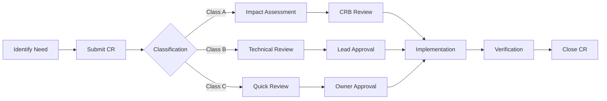

# Change Control Process
## Door L1 Forward Documentation

### 1. CHANGE CLASSIFICATION

| Class | Impact | Approval Level | Timeline |
|-------|--------|----------------|----------|
| A | Major (safety/structural) | CRB + Chief Engineer | 10 days |
| B | Moderate (functional) | Lead Engineer | 5 days |
| C | Minor (editorial) | Document Owner | 2 days |
| D | Administrative | Auto-approved | Immediate |

### 2. CHANGE REQUEST PROCESS



### 3. CHANGE REQUEST FORM

```markdown
CR Number: CR-52-10-01-YYYY-NNN
Date: YYYY-MM-DD
Requestor: Name/ID
Classification: [A/B/C/D]

DESCRIPTION:
[What needs to change and why]

JUSTIFICATION:
[Business/Technical rationale]

IMPACT ANALYSIS:
- Safety: [High/Medium/Low/None]
- Cost: [Estimate]
- Schedule: [Days impact]
- Other systems: [List affected]

PROPOSED SOLUTION:
[Detailed change description]

ALTERNATIVES CONSIDERED:
[Other options evaluated]

APPROVALS:
- Technical: ___________
- Quality: ____________
- Safety: _____________
- Program: ____________
```

### 4. CONFIGURATION BASELINE

Current Baseline: v1.0-CONCEPTUAL
- Established: 2025-11-03
- Components: 475 documents
- Status: ACTIVE

Next Baseline: v2.0-PDR
- Target: 2026-Q1
- Requirement: FEA complete

### 5. CHANGE REQUEST WORKFLOW

#### Submission
1. Requestor identifies need for change
2. Completes CR form with all required information
3. Submits to Document Control

#### Classification
Document Control reviews and classifies:
- **Class A:** Safety-critical, structural, certification impact
- **Class B:** Functional changes, performance impact
- **Class C:** Editorial, formatting, minor corrections
- **Class D:** Administrative, non-technical

#### Review and Approval
- **Class A:** Full CRB review, impact assessment, Chief Engineer approval
- **Class B:** Technical review by Lead Engineer
- **Class C:** Document Owner review and approval
- **Class D:** Automatic approval by Document Control

#### Implementation
1. Approved changes assigned to responsible engineer
2. Changes implemented in documentation
3. Version control updated
4. Affected stakeholders notified

#### Verification
1. Quality review of implemented changes
2. Cross-reference verification
3. Compliance check
4. Final approval

#### Closure
1. CR marked as complete
2. Lessons learned captured
3. Metrics updated
4. Archive CR package

### 6. CHANGE REVIEW BOARD (CRB)

#### Composition
- Program Manager (Chair)
- Chief Engineer
- Lead Design Engineer
- Safety Engineer
- Quality Manager
- Certification Engineer

#### Meeting Schedule
- Regular meetings: Weekly
- Emergency meetings: As required for Class A changes

#### Decision Authority
- Approve/Reject change requests
- Prioritize implementation
- Allocate resources
- Manage baselines

### 7. METRICS AND REPORTING

#### Key Metrics
- Change request volume by class
- Average approval time by class
- Change implementation time
- Change rejection rate
- Impact on schedule/budget

#### Reporting
- Weekly CR status report
- Monthly metrics dashboard
- Quarterly trend analysis
- Annual process review

### 8. TOOLS AND SYSTEMS

- **Document Management:** Git repository with branch strategy
- **CR Tracking:** CSV-based tracking system
- **Approval Workflow:** Electronic signature system
- **Notification:** Automated email alerts
- **Metrics:** Dashboard with real-time data

### 9. TRAINING REQUIREMENTS

All personnel involved in change management must complete:
- Change control process training (4 hours)
- Document classification training (2 hours)
- Tool training (2 hours)
- Annual refresher training (1 hour)

### 10. CONTINUOUS IMPROVEMENT

The change control process is reviewed annually and updated based on:
- Lessons learned
- Industry best practices
- Regulatory changes
- Technology improvements
- Stakeholder feedback
