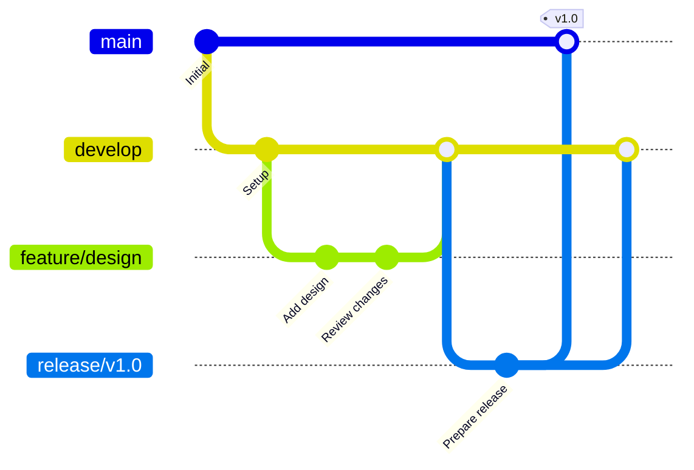

# Branch Strategy
## Version Control and Development Workflow

### Branch Types

#### 1. Main Branch (main)
- **Purpose**: Production-ready, approved documentation
- **Protection**: Requires approval before merge
- **Access**: All team members (read), Document Control (write)

#### 2. Development Branch (develop)
- **Purpose**: Integration branch for ongoing development
- **Protection**: Requires review before merge
- **Access**: All developers

#### 3. Feature Branches (feature/*)
- **Purpose**: New documentation or major updates
- **Naming**: `feature/<folder>/<description>`
- **Examples**: 
  - `feature/design/seal-specification`
  - `feature/requirements/load-cases`
- **Lifecycle**: Created from develop, merged back to develop

#### 4. Release Branches (release/*)
- **Purpose**: Preparation for baseline release
- **Naming**: `release/v<major>.<minor>`
- **Examples**: `release/v1.0`, `release/v2.0-PDR`
- **Lifecycle**: Created from develop, merged to main and develop

#### 5. Hotfix Branches (hotfix/*)
- **Purpose**: Critical corrections to released documents
- **Naming**: `hotfix/<issue-id>/<description>`
- **Examples**: `hotfix/DOC-001/correct-material-spec`
- **Lifecycle**: Created from main, merged to main and develop

### Workflow



### Merge Requirements

#### Feature → Develop
- [ ] Code/document review completed
- [ ] Validation checks passed
- [ ] No merge conflicts
- [ ] Updated change log

#### Develop → Release
- [ ] All features complete
- [ ] Quality review passed
- [ ] Version number assigned
- [ ] Release notes prepared

#### Release → Main
- [ ] Final approval obtained
- [ ] All reviews closed
- [ ] Tagged with version
- [ ] Baseline established

#### Hotfix → Main
- [ ] Emergency approval obtained
- [ ] Critical issue documented
- [ ] Immediate merge required
- [ ] Stakeholders notified

### Naming Conventions

```
feature/     - New features or documents
bugfix/      - Non-critical corrections
hotfix/      - Critical corrections
release/     - Release preparation
docs/        - Documentation-only changes
refactor/    - Restructuring without content change
```

### Best Practices

1. **Keep branches short-lived** - Merge within 1-2 weeks
2. **Update frequently** - Pull from develop daily
3. **Clear descriptions** - Use descriptive branch names
4. **Clean history** - Squash commits before merging
5. **Test before merge** - Run validation scripts

### Branch Protection Rules

#### Main Branch
- Require pull request reviews (2 approvers)
- Require status checks to pass
- Require branches to be up to date
- Restrict who can push
- Require signed commits

#### Develop Branch
- Require pull request reviews (1 approver)
- Require status checks to pass
- Allow force pushes for maintainers only

### Tag Strategy

Format: `v<major>.<minor>.<patch>-<phase>`

Examples:
- `v1.0.0-CONCEPTUAL`
- `v2.0.0-PDR`
- `v3.0.0-CDR`
- `v4.0.0-PRODUCTION`

### Conflict Resolution

1. Communicate with document owner
2. Understand both changes
3. Merge manually if needed
4. Test merged version
5. Get review of resolution
