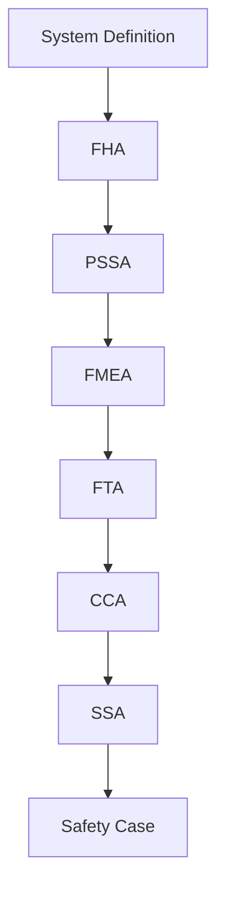

# Safety Assessment Plan - Door L3 Aft Emergency Exit

**Document ID:** AMPEL360-52-20-01-SAP  
**Version:** 0.1  
**Date:** 2025-11-04  
**Classification:** Safety Critical

## 1. INTRODUCTION

### 1.1 Purpose
Define the safety assessment approach for the L3 Aft Emergency Exit to demonstrate compliance with CS 25.1309 and achieve probability targets for catastrophic failure conditions.

### 1.2 Scope
Comprehensive safety assessment covering normal operation, emergency activation, and all failure modes affecting evacuation capability.

## 2. SAFETY OBJECTIVES

### 2.1 Quantitative Objectives
| Failure Condition | Classification | Probability Target | Per Flight Hour |
|------------------|----------------|-------------------|-----------------|
| Loss of emergency exit function | Catastrophic | <10⁻⁹ | Extremely Improbable |
| Inadvertent opening in flight | Catastrophic | <10⁻⁹ | Extremely Improbable |
| Delayed opening (>8 sec) | Hazardous | <10⁻⁷ | Extremely Remote |
| Slide deployment failure | Hazardous | <10⁻⁷ | Extremely Remote |
| Partial opening | Major | <10⁻⁵ | Remote |

### 2.2 Qualitative Objectives
- No single failure prevents emergency opening
- Manual override always available
- Clear and intuitive operation under stress
- Robust against passenger misuse
- Tolerant of maintenance errors

## 3. ASSESSMENT METHODOLOGY

### 3.1 Process Flow

### 3.2 Analysis Tools
- **FHA:** Functional Hazard Assessment
- **PSSA:** Preliminary System Safety Assessment
- **FMEA:** Failure Modes and Effects Analysis
- **FTA:** Fault Tree Analysis
- **CCA:** Common Cause Analysis
- **SSA:** System Safety Assessment

## 4. SYSTEM ARCHITECTURE FOR SAFETY

### 4.1 Independence Principles
1. **Mechanical independence** from electrical system
2. **Dual activation paths** (power/manual)
3. **Dissimilar redundancy** where practical
4. **Physical separation** of critical components

### 4.2 Design Assurance Levels

| Function | DAL | Rationale |
|----------|-----|-----------|
| Emergency opening | A | Catastrophic if lost |
| Slide deployment | B | Hazardous if lost |
| Position sensing | C | Major if lost |
| Health monitoring | D | Minor if lost |
| CAOS features | E | No effect on safety |

## 5. SAFETY ANALYSIS SCHEDULE

### 5.1 Phase 1: Preliminary Assessment (Q1 2025)
- [ ] System definition complete
- [ ] FHA complete
- [ ] PSSA complete
- [ ] Initial safety requirements

### 5.2 Phase 2: Detailed Analysis (Q2 2025)
- [ ] FMEA complete
- [ ] FTA complete
- [ ] CCA complete
- [ ] Design requirements finalized

### 5.3 Phase 3: System Safety Assessment (Q3 2025)
- [ ] SSA complete
- [ ] Test results integrated
- [ ] Safety case documented
- [ ] Certification basis established

### 5.4 Phase 4: Certification (Q4 2025)
- [ ] Compliance demonstration
- [ ] Regulatory approval
- [ ] Production release
- [ ] Continued operational safety

## 6. SAFETY REQUIREMENTS TRACEABILITY

### 6.1 Requirements Sources
- CS 25.1309 - System safety
- CS 25.803 - Emergency evacuation
- CS 25.807 - Emergency exits
- CS 25.810 - Emergency egress assist
- CS 25.813 - Emergency exit access

### 6.2 Traceability Matrix
All safety requirements must be traceable to:
- Source regulation/standard
- Design implementation
- Verification method
- Test evidence

## 7. RISK MANAGEMENT

### 7.1 Risk Acceptance Criteria
- Catastrophic: <10⁻⁹ per flight hour
- Hazardous: <10⁻⁷ per flight hour
- Major: <10⁻⁵ per flight hour
- Minor: No numeric constraint

### 7.2 Risk Mitigation Strategy
1. Design for fail-safe operation
2. Redundancy for critical functions
3. Independent monitoring
4. Regular inspection and maintenance
5. Crew training and procedures

## 8. CAOS INTEGRATION

### 8.1 Safety Enhancement
- Real-time health monitoring
- Predictive maintenance alerts
- Fleet-wide data analysis
- Digital twin simulation

### 8.2 Safety Assurance
- Continuous operational monitoring
- Automated anomaly detection
- Trend analysis and prediction
- Post-event investigation support

## 9. VERIFICATION AND VALIDATION

### 9.1 Analysis Validation
- Peer review of all safety analyses
- Independent verification
- Expert review panels
- Regulatory coordination

### 9.2 Testing Requirements
- Component-level testing
- System integration testing
- Full-scale evacuation demonstration
- Environmental qualification

## 10. DOCUMENTATION AND REPORTING

### 10.1 Required Documentation
- Safety Assessment Report
- FHA Report
- FMEA/FMECA Report
- FTA Report
- CCA Report
- Test Reports
- Certification Plan

### 10.2 Review and Approval
- Internal safety review board
- Engineering management
- Quality assurance
- Regulatory authority

## 11. LESSONS LEARNED

### 11.1 Industry Experience
Review of:
- Service bulletins
- Accident/incident reports
- Similar system performance
- BWB-specific considerations

### 11.2 Continuous Improvement
- Incorporate service experience
- Update analyses as needed
- Refine procedures
- Enhance training

## 12. CONCLUSION

This Safety Assessment Plan establishes a comprehensive framework for ensuring the L3 Aft Emergency Exit meets all safety objectives and regulatory requirements. The plan emphasizes independence, redundancy, and fail-safe design principles specific to the BWB configuration.

---

**Approval Status:** Draft - Pending Review

**Next Review Date:** 2025-11-18

**Document Owner:** Safety Engineering Team
