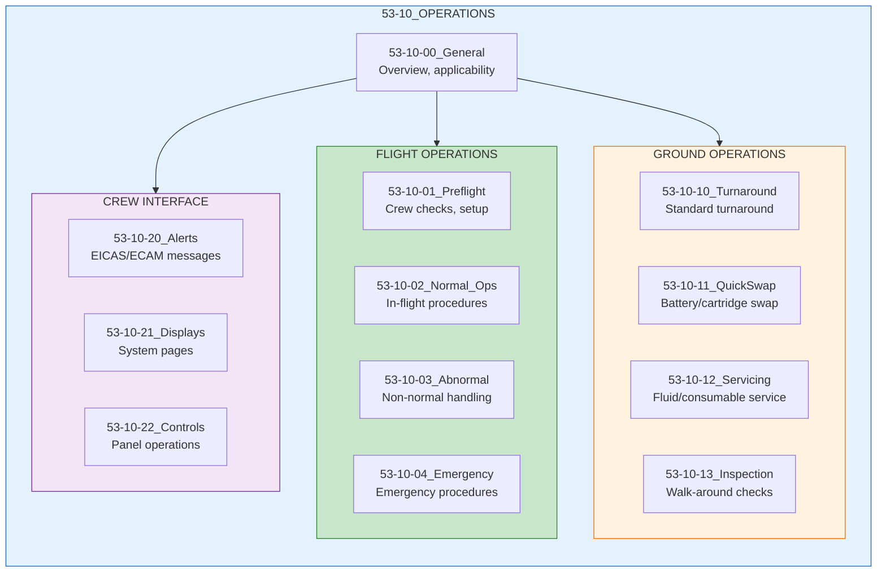
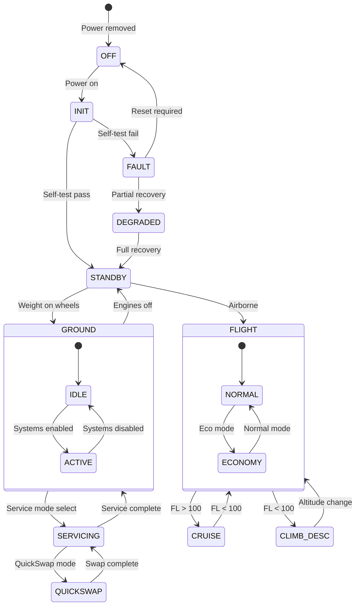
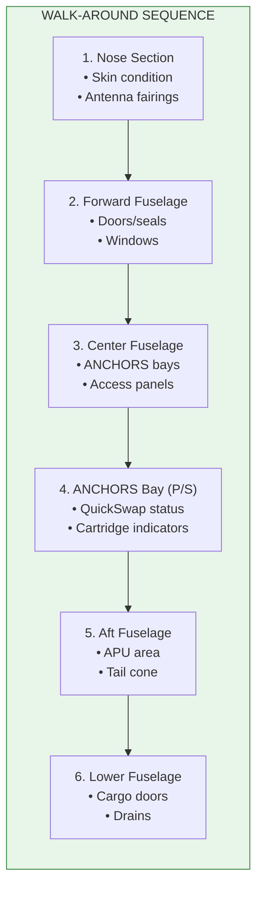
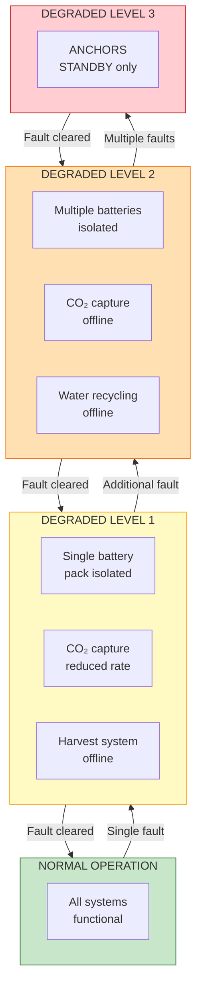
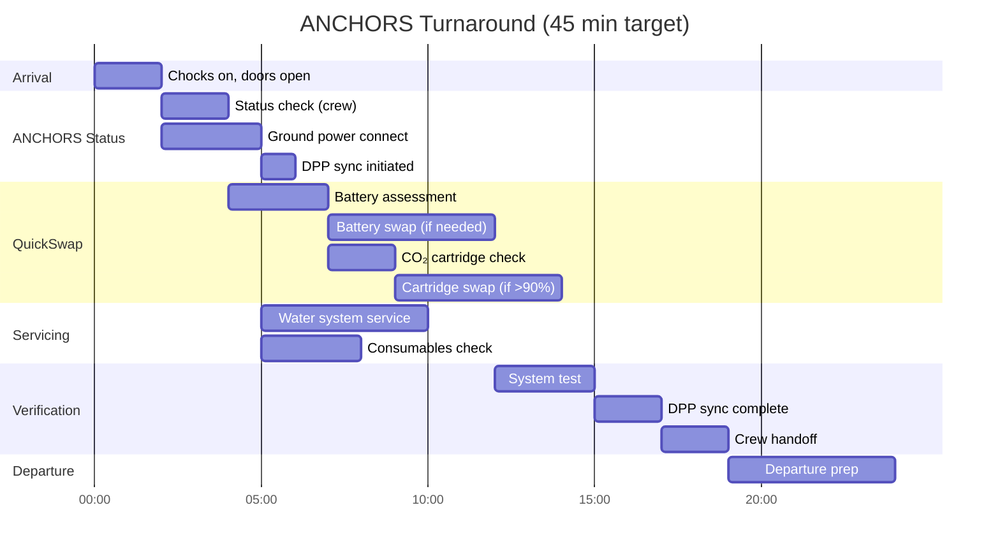
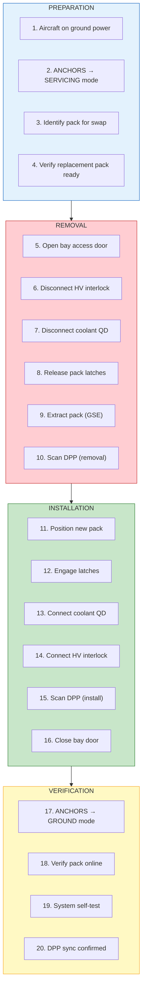
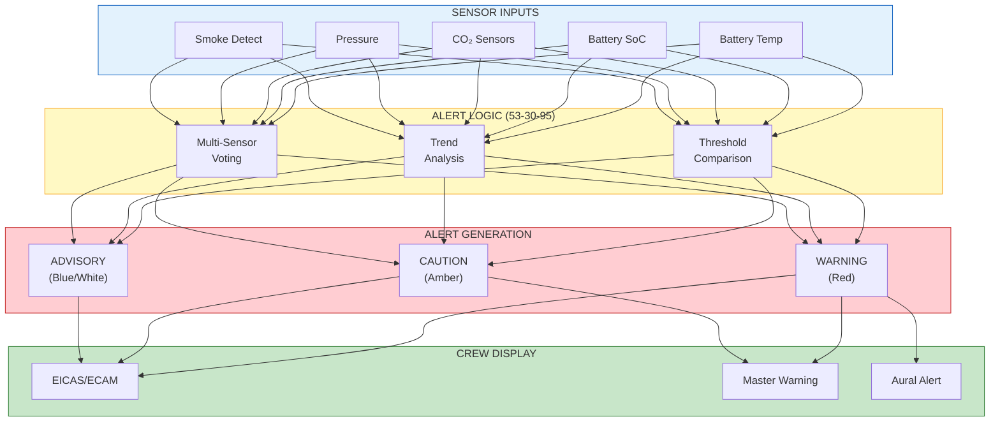

# ATA 53-10 — Fuselage Operations

| Field | Value |
|-------|-------|
| **Document ID** | ATA53-10-00-OPS-001 |
| **Version** | 1.1 |
| **Date** | 2025-11-26 |
| **Status** | DRAFT |
| **Classification** | OPERATIONAL |

---

<!--
MCP/Agent Header Prompt:
This document is the **operations spine** for ATA 53 — Fuselage.
Use it as the canonical reference for:
- how ANCHORS (53-30) and fuselage-related systems are **operated** (not designed),
- how **turnaround, QuickSwap, emergency and abnormal procedures** are structured and numbered under 53-10, and
- which **forms and checklists** (53-10-F-xxx) should be auto-generated or updated when new 53-30 features are added.
When creating or updating procedures, keep IDs and filenames consistent with the patterns and tables defined here.
-->

**Bucket definition:** 53-10 is the **Operations** bucket for ATA 53; it hosts operational scenarios, procedures, turnaround logic, and crew/GSE interactions for fuselage and ANCHORS systems, without duplicating the 01–14 lifecycle skeleton.

---

## Navigation

### Breadcrumb
`AMPEL360-BWB-H2-Hy-E` / `OPT-IN_FRAMEWORK` / `T-TECHNOLOGY` / `A-AIRFRAME` / `ATA_53-FUSELAGE` / `53-10_OPERATIONS`

### ATA 53 Root Buckets

The following root buckets are mandatory for ATA 53; buckets marked "N/A" must still exist in the filesystem but may contain a short "not currently applicable" note. **Do not remove any bucket.**

| Bucket | Name | Path | Status |
|--------|------|------|--------|
| **53-00** | General | [`../53-00_GENERAL/`](../53-00_GENERAL/) | Active |
| **53-10** | **Operations** | **This bucket** | **Active** |
| **53-20** | Subsystems | [`../53-20_SUBSYSTEMS/`](../53-20_SUBSYSTEMS/) | Active |
| **53-30** | ANCHORS (Circularity) | [`../53-30_ANCHORS/`](../53-30_ANCHORS/) | Active |
| **53-40** | Software | [`../53-40_SOFTWARE/`](../53-40_SOFTWARE/) | Active |
| **53-50** | Structures | [`../53-50_STRUCTURES/`](../53-50_STRUCTURES/) | Active |
| **53-60** | Storages | [`../53-60_STORAGES/`](../53-60_STORAGES/) | N/A |
| **53-70** | Propulsion | [`../53-70_PROPULSION/`](../53-70_PROPULSION/) | N/A |
| **53-80** | Energy | [`../53-80_ENERGY/`](../53-80_ENERGY/) | Active |
| **53-90** | Tables/Schemas | [`../53-90_TABLES_SCHEMAS/`](../53-90_TABLES_SCHEMAS/) | Active |

### Cross-ATA Operations References
| ATA | Operations Bucket | Relationship |
|-----|-------------------|--------------|
| 12 | Servicing | Ground servicing coordination |
| 21 | ECS Operations | Cabin environment |
| 24 | Electrical Operations | Power management |
| 28 | Fuel Operations | H₂ interface |
| 85 | Ground Support | GSE coordination |

---

## 1. Purpose

### 1.1 Scope

This bucket contains operational procedures, turnaround activities, and flight operations information for ATA 53 (Fuselage) systems, with particular emphasis on ANCHORS (53-30) circular systems operations.

**Coverage includes:**

- Pre-flight procedures
- In-flight operations
- Post-flight procedures
- Turnaround operations
- Abnormal/emergency procedures
- Crew interface and alerts
- Ground crew operations
- QuickSwap procedures (ANCHORS-specific)

### 1.2 Document Structure



---

## 2. Operational Overview

### 2.1 ATA 53 Systems Operational Summary

| System | Subsystem | Operational Mode | Crew Interaction |
|--------|-----------|------------------|------------------|
| **Fuselage Structure** | Primary | Passive | Walk-around inspection |
| **ANCHORS** | CO₂ Capture (53-30-20) | Automatic | Monitoring, mode selection |
| **ANCHORS** | Water Recycling (53-30-30) | Automatic | Monitoring |
| **ANCHORS** | Battery Loops (53-30-40) | Auto/Manual | SoH monitoring, swap initiation |
| **ANCHORS** | Harvesting (53-30-10) | Automatic | Monitoring |
| **ANCHORS** | Energy Renewables (53-30-80) | Automatic | Monitoring |

### 2.2 ANCHORS Operational States



### 2.3 Flight Phase Operations

| Phase | ANCHORS Mode | CO₂ Capture | Battery | Harvesting |
|-------|--------------|-------------|---------|------------|
| **Pre-flight** | STANDBY | OFF | Charging | OFF |
| **Taxi-out** | GROUND | WARM-UP | Discharging | OFF |
| **Takeoff** | CLIMB_DESC | REDUCED | High discharge | OFF |
| **Climb** | CLIMB_DESC | RAMPING | Moderate | LOW |
| **Cruise** | CRUISE | FULL | Balanced | FULL |
| **Descent** | CLIMB_DESC | REDUCED | Regen | LOW |
| **Approach** | CLIMB_DESC | REDUCED | Moderate | OFF |
| **Landing** | GROUND | COOL-DOWN | Regen | OFF |
| **Taxi-in** | GROUND | OFF | Charging | OFF |
| **Turnaround** | SERVICING | OFF | Swap/Charge | OFF |

---

## 3. Pre-Flight Procedures

### 3.1 Cockpit Preparation

**Procedure: 53-10-01-001 — ANCHORS System Setup**

| Step | Action | Expected Result | Notes |
|------|--------|-----------------|-------|
| 1 | Verify ANCHORS CB — IN | System powered | OVHD panel |
| 2 | Select ANCHORS → ON | INIT indication | MFD |
| 3 | Monitor self-test | PASS within 60 s | Auto sequence |
| 4 | Verify STANDBY mode | Green STANDBY | Status page |
| 5 | Check Battery SoH | All packs > 70% | Minimum dispatch |
| 6 | Check CO₂ cartridge | Fill level > 10% | Capacity available |
| 7 | Verify no faults | No amber/red | EICAS/ECAM |

### 3.2 Walk-Around Items

**Procedure: 53-10-01-002 — Fuselage/ANCHORS Exterior Check**



**ANCHORS Bay Inspection Items:**

| Item | Check | Accept Criteria | Action if Failed |
|------|-------|-----------------|------------------|
| QuickSwap indicator | Visual | GREEN | MEL/Defer |
| Battery bay door | Secure | Flush, latched | Secure/Report |
| CO₂ cartridge indicator | Visual | Fill > 10% | Replace cartridge |
| Ventilation grilles | Clear | Unobstructed | Clear debris |
| Leak indicators | Dry | No staining | Investigate |
| QR code readable | Scan | DPP accessible | Report |

### 3.3 Dispatch Requirements

| System | Dispatch Minimum | MEL Reference | Notes |
|--------|------------------|---------------|-------|
| ANCHORS Master | ON | 53-30-01 | Required |
| Battery Packs | ≥ 2 of 4 | 53-30-02 | Min 50% capacity |
| Battery SoH | ≥ 70% each | 53-30-03 | Per EU 2023/1542 |
| CO₂ Capture | Optional | 53-30-10 | Advisory only |
| Water Recycling | Optional | 53-30-11 | Advisory only |
| DPP Link | Required | 53-30-20 | Regulatory |

---

## 4. Normal Operations

### 4.1 In-Flight Monitoring

**Procedure: 53-10-02-001 — ANCHORS Cruise Monitoring**

| Parameter | Normal Range | Caution | Warning | Action |
|-----------|--------------|---------|---------|--------|
| Battery SoC | 30–90% | <20% or >95% | <10% or >98% | Adjust load |
| Battery Temp | 20–40°C | 40–50°C | >50°C | Reduce load |
| CO₂ Capture Rate | 5–10 kg/hr | <3 kg/hr | 0 kg/hr | Check system |
| Cabin CO₂ | 400–1000 ppm | 1000–1500 ppm | >1500 ppm | ECS priority |
| Cartridge Fill | 10–90% | >90% | >95% | Plan swap |
| ThermalBus Temp | 30–50°C | 50–60°C | >60°C | Reduce loads |

### 4.2 Mode Selection

**Procedure: 53-10-02-002 — ANCHORS Mode Control**

| Mode | Selection | Effect | Use Case |
|------|-----------|--------|----------|
| **AUTO** | Default | Full automatic operation | Normal ops |
| **ECO** | ANCHORS → ECO | Reduced power, max efficiency | Long haul |
| **MAX** | ANCHORS → MAX | Maximum capture/recovery | Short routes |
| **STBY** | ANCHORS → STBY | Minimal operation | MEL dispatch |

### 4.3 ECAM/EICAS System Page

```
┌─────────────────────────────────────────────────────────────┐
│                    ANCHORS SYSTEM PAGE                       │
├─────────────────────────────────────────────────────────────┤
│                                                             │
│  BATTERIES              CO₂ CAPTURE           WATER         │
│  ┌─────┐ ┌─────┐       ┌─────────┐          ┌─────┐        │
│  │ 85% │ │ 82% │       │ 7.2kg/h │          │ 92% │        │
│  │ 32°C│ │ 31°C│       │ CRUISE  │          │ OK  │        │
│  └──┬──┘ └──┬──┘       └────┬────┘          └──┬──┘        │
│     │       │               │                  │            │
│  ┌─────┐ ┌─────┐       ┌─────────┐          ┌─────┐        │
│  │ 78% │ │ 80% │       │ CART 45%│          │RECYC│        │
│  │ 33°C│ │ 32°C│       │ 38.5 kg │          │ ON  │        │
│  └─────┘ └─────┘       └─────────┘          └─────┘        │
│                                                             │
│  ENERGY HARVEST         THERMAL              DPP            │
│  ┌─────────┐           ┌─────────┐          ┌─────┐        │
│  │ +2.3 kW │           │ 42°C    │          │SYNC │        │
│  │ SOLAR+TH│           │ NOMINAL │          │ OK  │        │
│  └─────────┘           └─────────┘          └─────┘        │
│                                                             │
│  MODE: AUTO    STATUS: NORMAL    FLT: 4,521 kg CO₂ TOTAL   │
└─────────────────────────────────────────────────────────────┘
```

---

## 5. Abnormal Procedures

### 5.1 ANCHORS Caution Messages

**ECAM: ANCHORS BATT TEMP HI**

| Step | Action | Notes |
|------|--------|-------|
| 1 | ANCHORS BATT — CHECK | Identify affected pack |
| 2 | If TEMP > 50°C: BATT [X] — ISOL | Isolate pack |
| 3 | Monitor adjacent packs | Thermal propagation check |
| 4 | If stable: Continue with reduced capacity | — |
| 5 | If rising: ANCHORS — STBY | Full system standby |

**ECAM: ANCHORS CO2 SYS FAULT**

| Step | Action | Notes |
|------|--------|-------|
| 1 | CO2 CAPTURE — CHECK | Verify fault indication |
| 2 | CO2 CAPTURE — RESET | Attempt reset |
| 3 | If fault persists: CO2 — OFF | Manual shutdown |
| 4 | Cabin CO2 — MONITOR | ECS compensates |
| 5 | Report to maintenance | DPP auto-logged |

### 5.2 ANCHORS Advisory Messages

| Message | Meaning | Action |
|---------|---------|--------|
| ANCHORS CART FULL | CO₂ cartridge > 90% | Plan ground swap |
| ANCHORS BATT LOW | SoC < 20% | Reduce non-essential loads |
| ANCHORS DPP SYNC | Offline > 24 hr | Will sync on ground |
| ANCHORS HARVEST LOW | < 1 kW generation | Normal at night/overcast |
| ANCHORS WATER LOW | < 20% capacity | Advisory only |

### 5.3 Degraded Operations



---

## 6. Emergency Procedures

### 6.1 ANCHORS Battery Thermal Runaway

**ECAM: ANCHORS BATT FIRE**

| Step | Action | Notes |
|------|--------|-------|
| 1 | **ANCHORS MASTER — OFF** | Immediate isolation |
| 2 | **ANCHORS FIRE AGENT — DISCH** | If equipped |
| 3 | **Smoke/fumes — Crew O₂** | Protect crew |
| 4 | **Packs — Vent overboard** | Auto-activates |
| 5 | **Consider diversion** | Per SOP |
| 6 | **Notify cabin crew** | Prepare passengers |
| 7 | **Land ASAP** | Do not delay |

> **Reference:** 53-30-00-02_Thermal_Runaway_Mitigation.md

### 6.2 ANCHORS Bay Depressurization

**ECAM: ANCHORS BAY PRESS LOW**

| Step | Action | Notes |
|------|--------|-------|
| 1 | ANCHORS — CHECK | Verify indication |
| 2 | If confirmed: ANCHORS — STBY | Reduce activity |
| 3 | Cabin altitude — MONITOR | Check for cabin leak |
| 4 | If cabin affected: Emergency descent | Standard procedure |

### 6.3 CO₂ Release to Cabin

**ECAM: ANCHORS CO2 LEAK**

| Step | Action | Notes |
|------|--------|-------|
| 1 | **CO2 ISOL VALVE — CLOSE** | Isolate source |
| 2 | **ANCHORS CO2 — OFF** | Stop capture |
| 3 | **ECS — MAX FLOW** | Dilute CO₂ |
| 4 | **Cabin CO₂ — MONITOR** | Must stay < 5000 ppm |
| 5 | If > 5000 ppm: **Crew O₂** | Protect crew |
| 6 | **Notify cabin** | Passenger awareness |

> **Reference:** 53-30-00-02_H2_CO2_Safety_Provisions.md

---

## 7. Turnaround Operations

### 7.1 Standard Turnaround Timeline



> **Cross-reference:** See also [`ATA_02-OPERATIONS_INFORMATION/02-20_Subsystems/02-20-14_Ground_Ops_Management/02-20-14-002_Turnaround_Orchestration.md`](../../ATA_02-OPERATIONS_INFORMATION/02-20_Subsystems/02-20-14_Ground_Ops_Management/02-20-14-002_Turnaround_Orchestration.md) for network-level turnaround integration.

### 7.2 Turnaround Checklist

**Form: 53-10-10-001 — ANCHORS Turnaround**

| Item | Check | Result | Initials |
|------|-------|--------|----------|
| **ARRIVAL** | | | |
| ANCHORS status from crew | Faults/deferred items | ☐ | |
| Ground power connected | ANCHORS on ground power | ☐ | |
| DPP sync | Automatic, verify initiated | ☐ | |
| **BATTERY ASSESSMENT** | | | |
| Pack 1 SoH/SoC | ___% / ___% | ☐ | |
| Pack 2 SoH/SoC | ___% / ___% | ☐ | |
| Pack 3 SoH/SoC | ___% / ___% | ☐ | |
| Pack 4 SoH/SoC | ___% / ___% | ☐ | |
| Swap required? | Yes / No | ☐ | |
| **CO₂ CARTRIDGE** | | | |
| Cartridge fill level | ___% | ☐ | |
| Swap required? (>90%) | Yes / No | ☐ | |
| Minerite offloaded | ___ kg | ☐ | |
| **SERVICING** | | | |
| Water system | Level OK / Serviced | ☐ | |
| Filter status | OK / Replaced | ☐ | |
| **VERIFICATION** | | | |
| System self-test | PASS / FAIL | ☐ | |
| DPP sync complete | Yes / Pending | ☐ | |
| MEL items | None / Listed: ___ | ☐ | |
| **RELEASE** | | | |
| Crew briefed | Signature: ___ | ☐ | |

---

## 8. QuickSwap Procedures

### 8.1 Battery QuickSwap

**Procedure: 53-10-11-001 — QuickSwap Battery Exchange**



**Time Standard:** < 10 minutes per pack

**Safety Requirements:**

| Requirement | Specification | Reference |
|-------------|---------------|-----------|
| HV isolation verified | 0 V at connector | REQ-BAT-xxx |
| PPE worn | HV gloves, safety glasses | Ground ops SOP |
| GSE certified | QuickSwap dolly | ATA 85 |
| DPP scanned | Both removal and install | REQ-DPP-125 |

### 8.2 CO₂ Cartridge QuickSwap

**Procedure: 53-10-11-002 — QuickSwap CO₂ Cartridge**

| Step | Action | Time | Notes |
|------|--------|------|-------|
| 1 | Set ANCHORS → SERVICING | 10 s | Mode change |
| 2 | Depressurize cartridge bay | 30 s | Auto sequence |
| 3 | Open access panel | 15 s | Quick-release |
| 4 | Disconnect manifold QD | 10 s | Self-sealing |
| 5 | Release retention latches | 10 s | 4 latches |
| 6 | Extract cartridge (dolly) | 30 s | ~70 kg full |
| 7 | Scan DPP (removal) | 5 s | QR code |
| 8 | Position new cartridge | 30 s | Guide rails |
| 9 | Engage latches | 10 s | Auto-lock |
| 10 | Connect manifold QD | 10 s | Click confirms |
| 11 | Scan DPP (install) | 5 s | QR code |
| 12 | Close access panel | 15 s | — |
| 13 | Set ANCHORS → GROUND | 10 s | Mode change |
| 14 | Verify system status | 30 s | Self-test |
| **Total** | | **< 5 min** | Target |

**Minerite Handling:**

| Parameter | Requirement | Notes |
|-----------|-------------|-------|
| Cartridge mass (full) | ~70 kg | Dolly required |
| CO₂ content | ~30 kg equiv | Minerite form |
| Handling | Non-hazardous | TCLP compliant |
| Destination | Certified recycler | DPP tracked |

---

## 9. Crew Alerts Reference

### 9.1 EICAS/ECAM Message Catalog

| Level | Message | Condition | Action |
|-------|---------|-----------|--------|
| **WARNING** | ANCHORS BATT FIRE | Thermal runaway detected | Emergency proc |
| **WARNING** | ANCHORS CO2 LEAK | CO₂ in cabin > limit | Emergency proc |
| **CAUTION** | ANCHORS BATT TEMP HI | Pack > 50°C | Abnormal proc |
| **CAUTION** | ANCHORS BATT ISOL | Pack isolated | Reduced capacity |
| **CAUTION** | ANCHORS CO2 SYS FAULT | Capture system fault | Abnormal proc |
| **CAUTION** | ANCHORS BAY PRESS LOW | Bay pressure loss | Abnormal proc |
| **ADVISORY** | ANCHORS CART FULL | Cartridge > 90% | Plan swap |
| **ADVISORY** | ANCHORS BATT LOW | SoC < 20% | Monitor |
| **ADVISORY** | ANCHORS DPP SYNC | Offline > 24 hr | Ground sync |
| **ADVISORY** | ANCHORS HARVEST LOW | Generation < 1 kW | Normal (night) |
| **ADVISORY** | ANCHORS DEGRADED | System in degraded mode | Monitor |
| **STATUS** | ANCHORS STBY | System in standby | — |
| **STATUS** | ANCHORS ECO | Economy mode active | — |

### 9.2 Alert Logic Diagram



---

## 10. Ground Support Equipment

### 10.1 Required GSE

| GSE Item | Part Number | Use | ATA 85 Ref |
|----------|-------------|-----|------------|
| QuickSwap Battery Dolly | GSE-53-30-001 | Battery exchange | 85-10-xx |
| CO₂ Cartridge Dolly | GSE-53-30-002 | Cartridge exchange | 85-10-xx |
| ANCHORS Test Set | GSE-53-30-010 | System testing | 85-20-xx |
| DPP Scanner (handheld) | GSE-53-30-020 | QR/RFID scanning | 85-20-xx |
| HV Safety Kit | GSE-53-30-030 | HV isolation PPE | 85-30-xx |
| Coolant Service Cart | GSE-53-30-040 | Coolant top-up | 85-10-xx |

> **Cross-reference:** GSE CO₂ cartridge handling and containers interface are further detailed in [`85-30-05-002_Automated_CO2_Capture_Pilot_Container.md`](../../ATA_85-GROUND_SUPPORT/85-30_Circularity/85-30-05-002_Automated_CO2_Capture_Pilot_Container.md) (Circularity & Materials Domain).

### 10.2 GSE Interface Points

```
                    AIRCRAFT FUSELAGE (PORT SIDE)
    ┌─────────────────────────────────────────────────────────┐
    │                                                         │
    │    ┌─────────┐         ┌─────────┐         ┌─────────┐ │
    │    │ BATTERY │         │   CO₂   │         │  WATER  │ │
    │    │   BAY   │         │CARTRIDGE│         │ SERVICE │ │
    │    │         │         │   BAY   │         │  PANEL  │ │
    │    │ [QS-01] │         │ [QS-02] │         │ [SV-01] │ │
    │    └────┬────┘         └────┬────┘         └────┬────┘ │
    │         │                   │                   │       │
    └─────────┼───────────────────┼───────────────────┼───────┘
              │                   │                   │
              ▼                   ▼                   ▼
         Battery              Cartridge            Water
          Dolly                Dolly             Service
         GSE-001              GSE-002             Cart
```

---

## 11. Bucket Contents Index

### 11.1 Directory Structure

```
53-10_OPERATIONS/
├── 53-10-00-OPS_Overview.md              ← This document
├── README.md                              ← Short index
├── 53-10-01_Preflight/
│   ├── 53-10-01-001_ANCHORS_System_Setup.md
│   └── 53-10-01-002_Fuselage_ANCHORS_Exterior_Check.md
├── 53-10-02_Normal_Ops/
│   └── 53-10-02-001_ANCHORS_Cruise_Monitoring.md
├── 53-10-03_Abnormal_Procedures/
│   ├── 53-10-03-001_ANCHORS_BATT_TEMP_HI.md
│   └── 53-10-03-002_ANCHORS_CO2_SYS_FAULT.md
├── 53-10-04_Emergency_Procedures/
│   ├── 53-10-04-001_ANCHORS_BATT_FIRE.md
│   ├── 53-10-04-002_ANCHORS_BAY_PRESS_LOW.md
│   └── 53-10-04-003_ANCHORS_CO2_LEAK.md
├── 53-10-10_Turnaround_Operations/
│   └── 53-10-10-001_Standard_Turnaround.md
├── 53-10-11_QuickSwap_Procedures/
│   ├── 53-10-11-001_QuickSwap_Battery_Exchange.md
│   └── 53-10-11-002_QuickSwap_CO2_Cartridge.md
├── 53-10-12_Servicing_Procedures/
│   └── 53-10-12-001_Water_System_Service.md
├── 53-10-13_Inspection_Procedures/
│   └── 53-10-13-001_Walk_Around.md
├── 53-10-20_Alerts/
│   └── 53-10-20-001_EICAS_ECAM_Catalog.md
├── 53-10-21_Displays/
│   └── 53-10-21-001_ANCHORS_System_Page.md
├── 53-10-22_Controls/
│   └── 53-10-22-001_ANCHORS_Panel_Operations.md
└── FORMS/
    ├── 53-10-F-001_Turnaround_Checklist.pdf
    ├── 53-10-F-002_QuickSwap_Log.pdf
    └── 53-10-F-003_Discrepancy_Report.pdf
```

### 11.2 Current Documents

| Doc ID | Title | Version | Status |
|--------|-------|---------|--------|
| 53-10-00 | Operations Overview | 1.0 | This document |
| 53-10-01 | Pre-flight Procedures | TBD | Planned |
| 53-10-02 | Normal Operations | TBD | Planned |
| 53-10-03 | Abnormal Procedures | TBD | Planned |
| 53-10-04 | Emergency Procedures | TBD | Planned |
| 53-10-10 | Turnaround Operations | TBD | Planned |
| 53-10-11 | QuickSwap Procedures | TBD | Planned |
| 53-10-12 | Servicing Procedures | TBD | Planned |
| 53-10-20 | Alert Messages Catalog | TBD | Planned |

### 11.2 Related Forms

| Form ID | Title | Use |
|---------|-------|-----|
| 53-10-F-001 | ANCHORS Turnaround Checklist | Turnaround |
| 53-10-F-002 | QuickSwap Log | Battery/cartridge swap |
| 53-10-F-003 | Discrepancy Report | Fault reporting |

---

## Document Control

| Field | Value |
|-------|-------|
| **Document ID** | ATA53-10-00-OPS-001 |
| **Version** | 1.0 |
| **Date** | 2025-11-26 |
| **Status** | DRAFT |
| **Author** | AMPEL360 Operations WG |
| **Reviewer** | [To be assigned] |
| **Approver** | [To be assigned] |
| **Next Review** | [To be scheduled] |

### Revision History

| Rev | Date | Author | Description |
|-----|------|--------|-------------|
| 1.0 | 2025-11-26 | AI (Claude, Anthropic) | Initial operations document with ANCHORS procedures |
| 1.1 | 2025-11-26 | AI (Claude, Anthropic) | Added bucket definition, MCP header, directory structure, cross-references to ATA 02-20 and 85-30; ChatGPT review incorporated |

### AI Disclosure

- **Generated with assistance of:** AI (Claude, Anthropic), AI (ChatGPT, OpenAI)
- **Prompted by:** Amedeo Pelliccia
- **Status:** DRAFT — Subject to human review and approval
- **Human approver:** [To be completed]
- **Repository:** `AMPEL360-BWB-H2-Hy-E`
- **Last AI update:** 2025-11-26

---

## Quick Links

| Section | Jump |
|---------|------|
| [Overview](#2-operational-overview) | States, phases |
| [Pre-flight](#3-pre-flight-procedures) | Setup, walk-around |
| [Normal Ops](#4-normal-operations) | Monitoring, modes |
| [Abnormal](#5-abnormal-procedures) | Cautions, degraded |
| [Emergency](#6-emergency-procedures) | Fire, depressurization |
| [Turnaround](#7-turnaround-operations) | Timeline, checklist |
| [QuickSwap](#8-quickswap-procedures) | Battery, cartridge |
| [Alerts](#9-crew-alerts-reference) | EICAS/ECAM catalog |
| [GSE](#10-ground-support-equipment) | Equipment list |

---
  
*END OF DOCUMENT*
