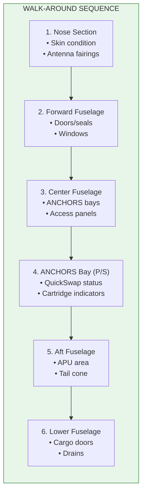

# 53-10-01-002 — Fuselage/ANCHORS Exterior Check

| Field | Value |
|-------|-------|
| **Document ID** | 53-10-01-002 |
| **Version** | 1.0 |
| **Date** | 2025-11-27 |
| **Status** | DRAFT |
| **Classification** | OPERATIONAL |

---

## 1. Purpose

This procedure defines the walk-around inspection items for fuselage and ANCHORS external components during pre-flight checks.

## 2. Scope

Applicable to all AMPEL360 BWB aircraft variants equipped with ANCHORS systems.

## 3. Walk-Around Sequence

## 4. ANCHORS Bay Inspection Items

| Item | Check | Accept Criteria | Action if Failed |
|------|-------|-----------------|------------------|
| QuickSwap indicator | Visual | GREEN | MEL/Defer |
| Battery bay door | Secure | Flush, latched | Secure/Report |
| CO₂ cartridge indicator | Visual | Fill > 10% | Replace cartridge |
| Ventilation grilles | Clear | Unobstructed | Clear debris |
| Leak indicators | Dry | No staining | Investigate |
| QR code readable | Scan | DPP accessible | Report |

## 5. Completion Criteria

- All external items inspected with no anomalies
- ANCHORS bay indicators in normal state
- DPP QR codes scannable and accessible

## 6. Related Documents

- [53-10-01-001_ANCHORS_System_Setup.md](./53-10-01-001_ANCHORS_System_Setup.md) — Cockpit preparation
- [53-10-13-001_Walk_Around.md](../53-10-13_Inspection_Procedures/53-10-13-001_Walk_Around.md) — Detailed walk-around

---

## Document Control

- Generated with the assistance of AI (GitHub Copilot), prompted by **Amedeo Pelliccia**.
- Status: **DRAFT** – Subject to human review and approval.
- Human approver: _[to be completed]_.
- Repository: `AMPEL360-BWB-H2-Hy-E`
- Last AI update: 2025-11-27.

---

*END OF DOCUMENT*
