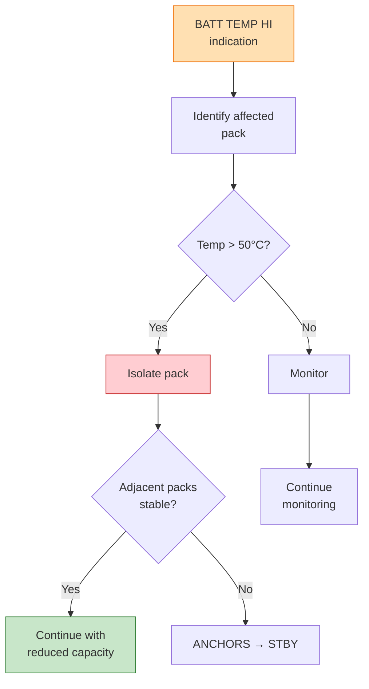

# 53-10-03-001 — ANCHORS BATT TEMP HI

| Field | Value |
|-------|-------|
| **Document ID** | 53-10-03-001 |
| **Version** | 1.0 |
| **Date** | 2025-11-27 |
| **Status** | DRAFT |
| **Classification** | OPERATIONAL |

---

## 1. Purpose

This procedure defines the crew response to ANCHORS battery high temperature caution messages.

## 2. ECAM/EICAS Message

**Message:** `ANCHORS BATT TEMP HI`
**Level:** CAUTION (Amber)
**Trigger:** Battery pack temperature > 50°C

## 3. Procedure

| Step | Action | Notes |
|------|--------|-------|
| 1 | ANCHORS BATT — CHECK | Identify affected pack |
| 2 | If TEMP > 50°C: BATT [X] — ISOL | Isolate pack |
| 3 | Monitor adjacent packs | Thermal propagation check |
| 4 | If stable: Continue with reduced capacity | — |
| 5 | If rising: ANCHORS — STBY | Full system standby |

## 4. Decision Logic

## 5. Notes

- Battery isolation reduces system capacity but maintains safe operation
- If multiple packs show elevated temperature, consider diversion
- DPP automatically logs all thermal events

## 6. Related Documents

- [53-10-04-001_ANCHORS_BATT_FIRE.md](../53-10-04_Emergency_Procedures/53-10-04-001_ANCHORS_BATT_FIRE.md) — Thermal runaway emergency
- [53-10-20-001_EICAS_ECAM_Catalog.md](../53-10-20_Alerts/53-10-20-001_EICAS_ECAM_Catalog.md) — Alert catalog

---

## Document Control

- Generated with the assistance of AI (GitHub Copilot), prompted by **Amedeo Pelliccia**.
- Status: **DRAFT** – Subject to human review and approval.
- Human approver: _[to be completed]_.
- Repository: `AMPEL360-BWB-H2-Hy-E`
- Last AI update: 2025-11-27.

---

*END OF DOCUMENT*
