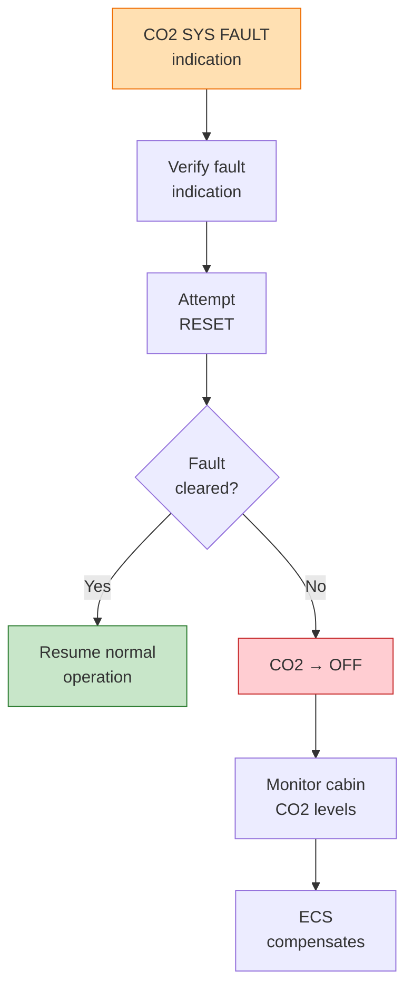

# 53-10-03-002 — ANCHORS CO2 SYS FAULT

| Field | Value |
|-------|-------|
| **Document ID** | 53-10-03-002 |
| **Version** | 1.0 |
| **Date** | 2025-11-27 |
| **Status** | DRAFT |
| **Classification** | OPERATIONAL |

---

## 1. Purpose

This procedure defines the crew response to ANCHORS CO₂ capture system fault caution messages.

## 2. ECAM/EICAS Message

**Message:** `ANCHORS CO2 SYS FAULT`
**Level:** CAUTION (Amber)
**Trigger:** CO₂ capture system malfunction detected

## 3. Procedure

| Step | Action | Notes |
|------|--------|-------|
| 1 | CO2 CAPTURE — CHECK | Verify fault indication |
| 2 | CO2 CAPTURE — RESET | Attempt reset |
| 3 | If fault persists: CO2 — OFF | Manual shutdown |
| 4 | Cabin CO2 — MONITOR | ECS compensates |
| 5 | Report to maintenance | DPP auto-logged |

## 4. Decision Logic

## 5. Notes

- CO₂ capture is an advisory system; loss does not affect airworthiness
- ECS will maintain cabin CO₂ within acceptable limits
- Report for ground maintenance at destination

## 6. Related Documents

- [53-10-04-003_ANCHORS_CO2_LEAK.md](../53-10-04_Emergency_Procedures/53-10-04-003_ANCHORS_CO2_LEAK.md) — CO₂ leak emergency
- [53-10-20-001_EICAS_ECAM_Catalog.md](../53-10-20_Alerts/53-10-20-001_EICAS_ECAM_Catalog.md) — Alert catalog

---

## Document Control

- Generated with the assistance of AI (GitHub Copilot), prompted by **Amedeo Pelliccia**.
- Status: **DRAFT** – Subject to human review and approval.
- Human approver: _[to be completed]_.
- Repository: `AMPEL360-BWB-H2-Hy-E`
- Last AI update: 2025-11-27.

---

*END OF DOCUMENT*
