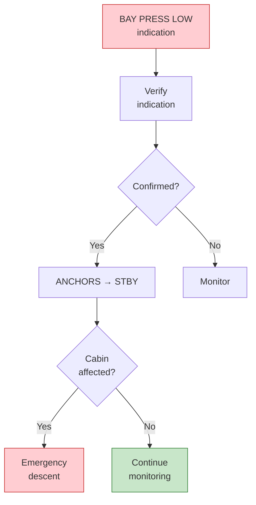

# 53-10-04-002 — ANCHORS BAY PRESS LOW

| Field | Value |
|-------|-------|
| **Document ID** | 53-10-04-002 |
| **Version** | 1.0 |
| **Date** | 2025-11-27 |
| **Status** | DRAFT |
| **Classification** | OPERATIONAL — EMERGENCY |

---

## 1. Purpose

This procedure defines the crew response to ANCHORS bay depressurization emergency.

## 2. ECAM/EICAS Message

**Message:** `ANCHORS BAY PRESS LOW`
**Level:** WARNING (Red) or CAUTION (Amber) depending on severity
**Trigger:** ANCHORS bay pressure below minimum threshold

## 3. Procedure

| Step | Action | Notes |
|------|--------|-------|
| 1 | ANCHORS — CHECK | Verify indication |
| 2 | If confirmed: ANCHORS — STBY | Reduce activity |
| 3 | Cabin altitude — MONITOR | Check for cabin leak |
| 4 | If cabin affected: Emergency descent | Standard procedure |

## 4. Decision Logic

## 5. Notes

- Bay depressurization may indicate structural issue
- Assess whether leak is contained to ANCHORS bay
- If cabin altitude rising, follow standard rapid descent procedure

## 6. Related Documents

- [53-10-04-001_ANCHORS_BATT_FIRE.md](./53-10-04-001_ANCHORS_BATT_FIRE.md) — Battery fire
- [53-10-20-001_EICAS_ECAM_Catalog.md](../53-10-20_Alerts/53-10-20-001_EICAS_ECAM_Catalog.md) — Alert catalog

---

## Document Control

- Generated with the assistance of AI (GitHub Copilot), prompted by **Amedeo Pelliccia**.
- Status: **DRAFT** – Subject to human review and approval.
- Human approver: _[to be completed]_.
- Repository: `AMPEL360-BWB-H2-Hy-E`
- Last AI update: 2025-11-27.

---

*END OF DOCUMENT*
