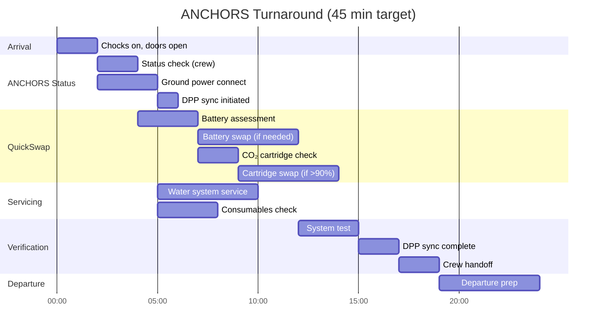

# 53-10-10-001 — Standard Turnaround

| Field | Value |
|-------|-------|
| **Document ID** | 53-10-10-001 |
| **Version** | 1.0 |
| **Date** | 2025-11-27 |
| **Status** | DRAFT |
| **Classification** | OPERATIONAL |

---

## 1. Purpose

This procedure defines the standard turnaround operations for ANCHORS systems.

## 2. Scope

Applicable to all standard turnarounds (target: 45 minutes).

## 3. Timeline

## 4. Turnaround Checklist

| Item | Check | Result | Initials |
|------|-------|--------|----------|
| **ARRIVAL** | | | |
| ANCHORS status from crew | Faults/deferred items | ☐ | |
| Ground power connected | ANCHORS on ground power | ☐ | |
| DPP sync | Automatic, verify initiated | ☐ | |
| **BATTERY ASSESSMENT** | | | |
| Pack 1 SoH/SoC | ___% / ___% | ☐ | |
| Pack 2 SoH/SoC | ___% / ___% | ☐ | |
| Pack 3 SoH/SoC | ___% / ___% | ☐ | |
| Pack 4 SoH/SoC | ___% / ___% | ☐ | |
| Swap required? | Yes / No | ☐ | |
| **CO₂ CARTRIDGE** | | | |
| Cartridge fill level | ___% | ☐ | |
| Swap required? (>90%) | Yes / No | ☐ | |
| Minerite offloaded | ___ kg | ☐ | |
| **SERVICING** | | | |
| Water system | Level OK / Serviced | ☐ | |
| Filter status | OK / Replaced | ☐ | |
| **VERIFICATION** | | | |
| System self-test | PASS / FAIL | ☐ | |
| DPP sync complete | Yes / Pending | ☐ | |
| MEL items | None / Listed: ___ | ☐ | |
| **RELEASE** | | | |
| Crew briefed | Signature: ___ | ☐ | |

## 5. Related Documents

- [53-10-11-001_QuickSwap_Battery_Exchange.md](../53-10-11_QuickSwap_Procedures/53-10-11-001_QuickSwap_Battery_Exchange.md) — Battery swap
- [53-10-11-002_QuickSwap_CO2_Cartridge.md](../53-10-11_QuickSwap_Procedures/53-10-11-002_QuickSwap_CO2_Cartridge.md) — Cartridge swap
- [53-10-F-001_Turnaround_Checklist.pdf](../FORMS/53-10-F-001_Turnaround_Checklist.pdf) — Printable form

---

## Document Control

- Generated with the assistance of AI (GitHub Copilot), prompted by **Amedeo Pelliccia**.
- Status: **DRAFT** – Subject to human review and approval.
- Human approver: _[to be completed]_.
- Repository: `AMPEL360-BWB-H2-Hy-E`
- Last AI update: 2025-11-27.

---

*END OF DOCUMENT*
