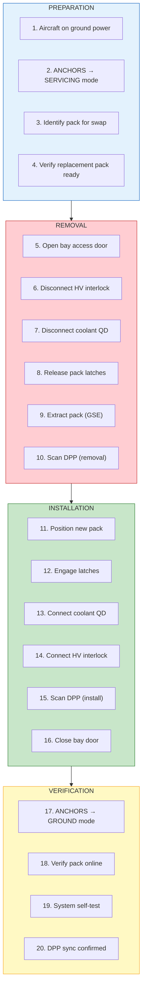

# 53-10-11-001 — QuickSwap Battery Exchange

| Field | Value |
|-------|-------|
| **Document ID** | 53-10-11-001 |
| **Version** | 1.0 |
| **Date** | 2025-11-27 |
| **Status** | DRAFT |
| **Classification** | OPERATIONAL |

---

## 1. Purpose

This procedure defines the QuickSwap battery exchange process for ANCHORS systems.

## 2. Scope

Applicable to all AMPEL360 BWB aircraft equipped with ANCHORS QuickSwap battery packs.

## 3. Time Standard

**Target:** < 10 minutes per pack

## 4. Procedure Flow

## 5. Safety Requirements

| Requirement | Specification | Reference |
|-------------|---------------|-----------|
| HV isolation verified | 0 V at connector | REQ-BAT-xxx |
| PPE worn | HV gloves, safety glasses | Ground ops SOP |
| GSE certified | QuickSwap dolly | ATA 85 |
| DPP scanned | Both removal and install | REQ-DPP-125 |

## 6. Required GSE

| GSE Item | Part Number | Use |
|----------|-------------|-----|
| QuickSwap Battery Dolly | GSE-53-30-001 | Battery exchange |
| HV Safety Kit | GSE-53-30-030 | HV isolation PPE |

## 7. Related Documents

- [53-10-10-001_Standard_Turnaround.md](../53-10-10_Turnaround_Operations/53-10-10-001_Standard_Turnaround.md) — Turnaround ops
- [53-10-F-002_QuickSwap_Log.pdf](../FORMS/53-10-F-002_QuickSwap_Log.pdf) — Swap log form

---

## Document Control

- Generated with the assistance of AI (GitHub Copilot), prompted by **Amedeo Pelliccia**.
- Status: **DRAFT** – Subject to human review and approval.
- Human approver: _[to be completed]_.
- Repository: `AMPEL360-BWB-H2-Hy-E`
- Last AI update: 2025-11-27.

---

*END OF DOCUMENT*
