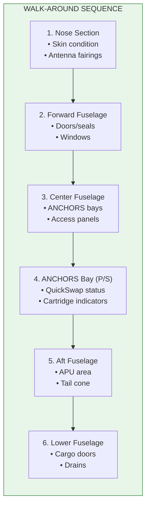

# 53-10-13-001 — Walk Around

| Field | Value |
|-------|-------|
| **Document ID** | 53-10-13-001 |
| **Version** | 1.0 |
| **Date** | 2025-11-27 |
| **Status** | DRAFT |
| **Classification** | OPERATIONAL |

---

## 1. Purpose

This procedure defines the detailed walk-around inspection items for fuselage and ANCHORS systems.

## 2. Scope

Applicable to all pre-flight and post-flight walk-around inspections.

## 3. Inspection Sequence

| Zone | Area | Items |
|------|------|-------|
| 1 | Nose Section | Skin condition, antenna fairings |
| 2 | Forward Fuselage | Doors/seals, windows |
| 3 | Center Fuselage | ANCHORS bays, access panels |
| 4 | ANCHORS Bay (P/S) | QuickSwap status, cartridge indicators |
| 5 | Aft Fuselage | APU area, tail cone |
| 6 | Lower Fuselage | Cargo doors, drains |

## 4. ANCHORS-Specific Items

| Item | Check | Accept Criteria | Action if Failed |
|------|-------|-----------------|------------------|
| QuickSwap indicator | Visual | GREEN | MEL/Defer |
| Battery bay door | Secure | Flush, latched | Secure/Report |
| CO₂ cartridge indicator | Visual | Fill > 10% | Replace cartridge |
| Ventilation grilles | Clear | Unobstructed | Clear debris |
| Leak indicators | Dry | No staining | Investigate |
| QR code readable | Scan | DPP accessible | Report |

## 5. Inspection Flow

## 6. Discrepancy Reporting

All discrepancies should be documented using form:
- [53-10-F-003_Discrepancy_Report.pdf](../FORMS/53-10-F-003_Discrepancy_Report.pdf)

## 7. Related Documents

- [53-10-01-002_Fuselage_ANCHORS_Exterior_Check.md](../53-10-01_Preflight/53-10-01-002_Fuselage_ANCHORS_Exterior_Check.md) — Preflight exterior check

---

## Document Control

- Generated with the assistance of AI (GitHub Copilot), prompted by **Amedeo Pelliccia**.
- Status: **DRAFT** – Subject to human review and approval.
- Human approver: _[to be completed]_.
- Repository: `AMPEL360-BWB-H2-Hy-E`
- Last AI update: 2025-11-27.

---

*END OF DOCUMENT*
