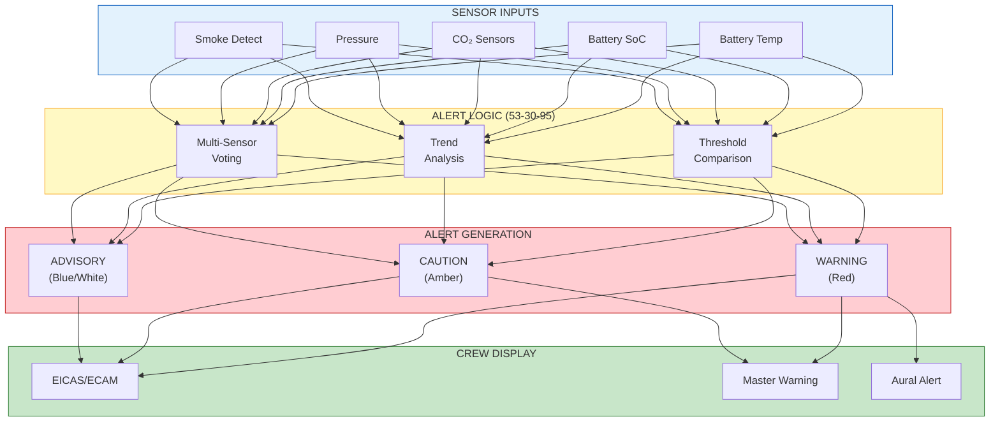

# 53-10-20-001 — EICAS/ECAM Catalog

| Field | Value |
|-------|-------|
| **Document ID** | 53-10-20-001 |
| **Version** | 1.0 |
| **Date** | 2025-11-27 |
| **Status** | DRAFT |
| **Classification** | OPERATIONAL |

---

## 1. Purpose

This document catalogs all EICAS/ECAM messages for ANCHORS systems.

## 2. Scope

Applicable to all ANCHORS-related crew alerts.

## 3. Message Catalog

| Level | Message | Condition | Action |
|-------|---------|-----------|--------|
| **WARNING** | ANCHORS BATT FIRE | Thermal runaway detected | [Emergency proc](../53-10-04_Emergency_Procedures/53-10-04-001_ANCHORS_BATT_FIRE.md) |
| **WARNING** | ANCHORS CO2 LEAK | CO₂ in cabin > limit | [Emergency proc](../53-10-04_Emergency_Procedures/53-10-04-003_ANCHORS_CO2_LEAK.md) |
| **CAUTION** | ANCHORS BATT TEMP HI | Pack > 50°C | [Abnormal proc](../53-10-03_Abnormal_Procedures/53-10-03-001_ANCHORS_BATT_TEMP_HI.md) |
| **CAUTION** | ANCHORS BATT ISOL | Pack isolated | Reduced capacity |
| **CAUTION** | ANCHORS CO2 SYS FAULT | Capture system fault | [Abnormal proc](../53-10-03_Abnormal_Procedures/53-10-03-002_ANCHORS_CO2_SYS_FAULT.md) |
| **CAUTION** | ANCHORS BAY PRESS LOW | Bay pressure loss | [Abnormal proc](../53-10-04_Emergency_Procedures/53-10-04-002_ANCHORS_BAY_PRESS_LOW.md) |
| **ADVISORY** | ANCHORS CART FULL | Cartridge > 90% | Plan swap |
| **ADVISORY** | ANCHORS BATT LOW | SoC < 20% | Monitor |
| **ADVISORY** | ANCHORS DPP SYNC | Offline > 24 hr | Ground sync |
| **ADVISORY** | ANCHORS HARVEST LOW | Generation < 1 kW | Normal (night) |
| **ADVISORY** | ANCHORS DEGRADED | System in degraded mode | Monitor |
| **STATUS** | ANCHORS STBY | System in standby | — |
| **STATUS** | ANCHORS ECO | Economy mode active | — |

## 4. Alert Logic

## 5. Related Documents

- [53-10-21-001_ANCHORS_System_Page.md](../53-10-21_Displays/53-10-21-001_ANCHORS_System_Page.md) — System page display
- [53-10-22-001_ANCHORS_Panel_Operations.md](../53-10-22_Controls/53-10-22-001_ANCHORS_Panel_Operations.md) — Panel operations

---

## Document Control

- Generated with the assistance of AI (GitHub Copilot), prompted by **Amedeo Pelliccia**.
- Status: **DRAFT** – Subject to human review and approval.
- Human approver: _[to be completed]_.
- Repository: `AMPEL360-BWB-H2-Hy-E`
- Last AI update: 2025-11-27.

---

*END OF DOCUMENT*
