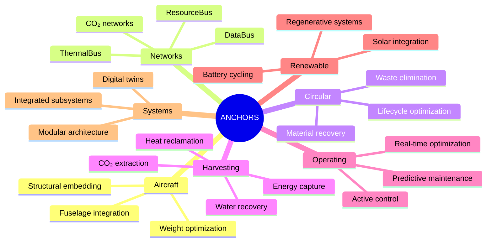
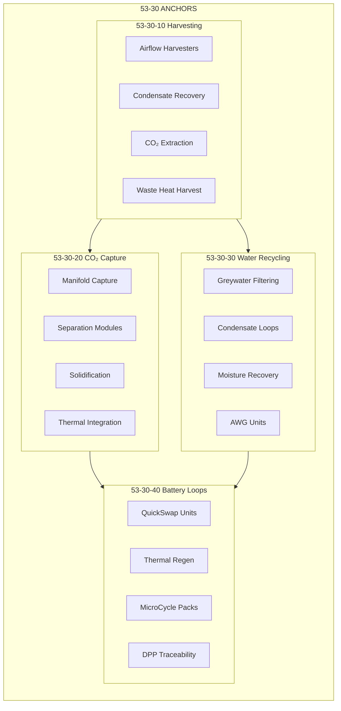
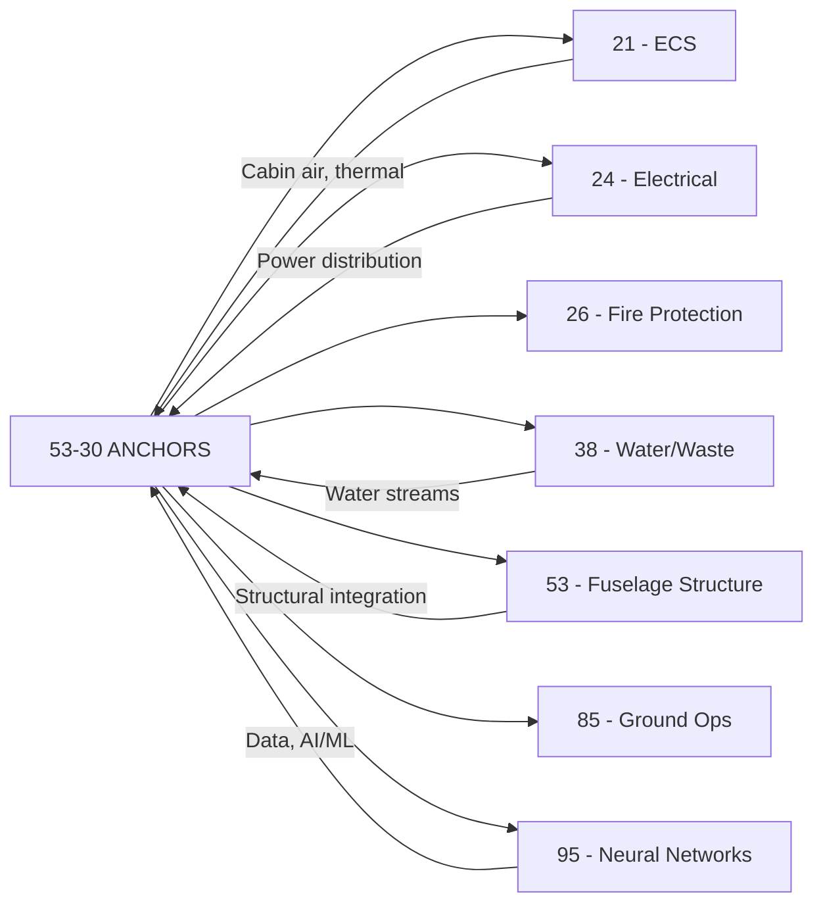

# 53-30-00-01 — ANCHORS General Definition

| Field              | Value                  |
| ------------------ | ---------------------- |
| **Document ID**    | ATA53-30-00-01-DEF-001 |
| **Version**        | 1.0                    |
| **Date**           | 2025-11-25             |
| **Status**         | DRAFT                  |
| **Classification** | Unclassified           |

---

## Repository Context

**Repository path:**  
`OPT-IN_FRAMEWORK/T-TECHNOLOGY_AMEDEOPELLICCIA-ON_BOARD_SYSTEMS/A-AIRFRAME/ATA_53-FUSELAGE/53-30_ANCHORS/53-30-00_GENERAL/53-30-00-01_Overview/53-30-00-01_ANCHORS_Definition.md`

**ATA banding:**

- ATA Chapter: **53 — Fuselage**
- Sub-Chapter: **53-30 — ANCHORS**
- Layer: **53-30-00_GENERAL / 53-30-00-01_Overview**

---

## Navigation

### Breadcrumb

`OPT-IN_FRAMEWORK` / `T-TECHNOLOGY` / `A-AIRFRAME` / `ATA_53-FUSELAGE` / `53-30_ANCHORS` / `53-30-00_GENERAL` / `53-30-00-01_Overview`

### Parent Documents

| Document               | Path                                                                       | Relationship    |
| ---------------------- | -------------------------------------------------------------------------- | --------------- |
| ATA 53 General Overview | `../../../53-00_GENERAL/53-00-00-01_Overview/53-00-00-01_Fuselage_Overview.md` | Chapter context |
| ANCHORS README         | `../../README.md`                                                          | Local parent    |

### Child / Related Documents

| Document                     | Path                                                                                         | Relationship         |
| ---------------------------- | -------------------------------------------------------------------------------------------- | -------------------- |
| Acronym Glossary (ANCHORS)   | `./53-30-00-01_Acronym_Glossary.md`                                                          | Local glossary       |
| System Architecture          | `./53-30-00-01_System_Architecture.md`                                                       | Architecture view    |
| Scope & Boundaries           | `./53-30-00-01_Scope_Boundaries.md`                                                          | Scope definition     |
| ANCHORS System Requirements  | `../53-30-00-03_Requirements/53-30-00-03_System_Requirements_Spec.md`                        | Requirements         |
| ANCHORS Safety Assessment    | `../53-30-00-02_Safety/53-30-00-02_Safety_Assessment_Plan.md`                                | Safety governance    |
| QuickSwap System Description | `../../53-30-40_Battery_Loops/53-30-40-01_QuickSwap_Units/53-30-40-01_System_Description.md` | Downstream system    |
| QuickSwap Requirements       | `../../53-30-40_Battery_Loops/53-30-40-01_QuickSwap_Units/53-30-40-01_Requirements.md`       | Derived requirements |

---

## 1. Purpose

The purpose of this document is to provide the **canonical definition** of the ANCHORS concept within ATA 53:

> **ANCHORS** — **A**ircraft **N**etworks, **C**ircular, **H**arvesting, **O**perating & **R**enewable **S**ystems

It establishes:

- The formal acronym expansion and semantic scope
- The philosophical and technical foundation for circular aviation systems
- The relationship to fuselage structure and other ATA chapters
- The governing principles for all ANCHORS subsystems

---

## 2. ANCHORS Definition

### 2.1 Formal Definition

**ANCHORS** are systems whose primary mission is **closing loops of matter, energy, or information** within the aircraft fuselage structure.

### 2.2 Semantic Breakdown

| Letter | Expansion   | Meaning                                                                 |
| ------ | ----------- | ----------------------------------------------------------------------- |
| **A**  | Aircraft    | Systems physically integrated into the aircraft structure              |
| **N**  | Networks    | Interconnected flows of matter, energy, data, and thermal resources    |
| **C**  | Circular    | Closed-loop design eliminating waste and maximizing resource reuse     |
| **H**  | Harvesting  | Active capture of energy, water, CO₂, and thermal resources            |
| **O**  | Operating   | Dynamically controlled systems with real-time optimization             |
| **R**  | Renewable   | Systems that regenerate, restore, or sustainably cycle resources       |
| **S**  | Systems     | Integrated, modular, digitally-traced subsystem architecture           |

---

## 3. Core Principles

### 3.1 Circularity First

All ANCHORS subsystems are designed to:

- **Eliminate waste** at every lifecycle stage
- **Recover materials** for reuse or high-value recycling
- **Track resources** via Digital Product Passport (DPP)
- **Optimize flows** in real-time during operation

### 3.2 Safety Primacy

> **All circularity features are subordinate to flight safety.**

- No ANCHORS function shall compromise airworthiness
- Safety-critical boundaries are defined in [53-30-00-02_Safety_Assessment_Plan.md](../53-30-00-02_Safety/53-30-00-02_Safety_Assessment_Plan.md)
- Failure modes are analyzed per [ARP4761](https://www.sae.org/standards/content/arp4761/)

### 3.3 Weight Consciousness

Every ANCHORS component must demonstrate:

- Net positive lifecycle value (energy saved > energy embodied)
- Mass penalty justified by circular benefit
- Structural integration efficiency

### 3.4 Modularity & Replaceability

- LRUs (Line-Replaceable Units) designed for rapid ground exchange
- Standardized interfaces enabling component evolution
- Ground-side circular processing integration

### 3.5 Digital Integration

- Full connectivity to [ATA 95 Neural Networks](../../../../../../N-NEURAL_NETWORKS_USERS_TRACEABILITY/ATA_95-DIGITAL_PRODUCT_PASSPORT_NEURAL_NETWORKS/)
- Real-time telemetry and predictive analytics
- Blockchain-anchored traceability for regulatory compliance

---

## 4. System Scope

ANCHORS encompasses four major subsystem families:

### 4.1 Harvesting Systems (53-30-10)

| Subsystem               | Function                                      | Primary Output           |
| ----------------------- | --------------------------------------------- | ------------------------ |
| Airflow Harvesters      | Capture kinetic energy from cabin airflow     | Electrical power         |
| Condensate Recovery     | Collect water from ECS condensation           | Potable/technical water  |
| Cabin CO₂ Extraction    | Remove CO₂ from cabin atmosphere              | Concentrated CO₂ stream  |
| Waste Heat Harvest      | Recover thermal energy from heat sources      | Thermal energy / power   |

### 4.2 CO₂ Capture & Conversion (53-30-20)

| Subsystem               | Function                                      | Primary Output           |
| ----------------------- | --------------------------------------------- | ------------------------ |
| Manifold Capture        | Collect CO₂ from distributed extraction points | Aggregated CO₂ flow      |
| Separation Modules      | Purify and concentrate CO₂                    | High-purity CO₂          |
| Solidification          | Convert CO₂ to solid mineral form             | Minerite cartridges      |
| Thermal Integration     | Manage process heat for efficiency            | Heat recovery            |

### 4.3 Water & Waste Recycling (53-30-30)

| Subsystem               | Function                                      | Primary Output           |
| ----------------------- | --------------------------------------------- | ------------------------ |
| Greywater Filtering     | Filter and treat lavatory/galley water        | Technical-grade water    |
| Condensate Loops        | Circulate and process condensate streams      | Recovered water          |
| Moisture Recovery       | Extract humidity from cabin air               | Additional water         |
| AWG Units               | Generate water from atmospheric moisture      | Potable water            |

### 4.4 Battery Loops (53-30-40)

| Subsystem               | Function                                      | Primary Output           |
| ----------------------- | --------------------------------------------- | ------------------------ |
| QuickSwap Units         | Modular battery exchange at gate              | Rapid energy replenishment |
| Thermal Regen Loops     | Heat recovery from battery thermal management | Recovered thermal energy |
| MicroCycle Packs        | Distributed small-format energy storage       | Localized power buffering |
| DPP Traceability        | Digital passport tracking for all batteries   | Lifecycle data stream    |

---

## 5. Regulatory Context

ANCHORS introduces novel systems requiring special certification consideration:

| Regulation           | Applicability                                  | Reference                                                                                      |
| -------------------- | ---------------------------------------------- | ---------------------------------------------------------------------------------------------- |
| EASA CS-25           | Large aeroplane airworthiness                  | [CS-25](https://www.easa.europa.eu/en/document-library/certification-specifications/cs-25)    |
| 14 CFR Part 25       | FAA equivalent requirements                    | [Part 25](https://www.ecfr.gov/current/title-14/chapter-I/subchapter-C/part-25)               |
| Special Conditions   | H₂/CO₂ handling, novel battery systems         | Per CRI negotiation                                                                           |
| EU Battery Regulation | Battery passport requirements                 | [Regulation (EU) 2023/1542](https://eur-lex.europa.eu/eli/reg/2023/1542)                      |
| SAE ARP4754A         | System development assurance                   | [ARP4754A](https://www.sae.org/standards/content/arp4754a/)                                   |
| SAE ARP4761          | Safety assessment methodology                  | [ARP4761](https://www.sae.org/standards/content/arp4761/)                                     |

---

## 6. Interface Summary

ANCHORS interfaces with multiple ATA chapters:

Full interface specifications: [53-30-00-05_ICD_Master.md](../53-30-00-05_Interfaces/53-30-00-05_ICD_Master.md)

---

## 7. Traceability

### 7.1 Requirements Traceability

| Requirement ID       | Description                              | Source                  |
| -------------------- | ---------------------------------------- | ----------------------- |
| REQ-53-30-001        | ANCHORS shall close material loops       | System-level objective  |
| REQ-53-30-002        | ANCHORS shall not degrade flight safety  | CS-25.1309 derivative   |
| REQ-53-30-003        | ANCHORS shall support DPP compliance     | EU Battery Regulation   |

Full requirements: [53-30-00-03_System_Requirements_Spec.md](../53-30-00-03_Requirements/53-30-00-03_System_Requirements_Spec.md)

### 7.2 Safety Traceability

All ANCHORS systems are subject to:

- Functional Hazard Assessment: [53-30-00-02_FHA_Functional_Hazard_Assessment.md](../53-30-00-02_Safety/53-30-00-02_FHA_Functional_Hazard_Assessment.md)
- PSSA: [53-30-00-02_PSSA_Preliminary_System_Safety.md](../53-30-00-02_Safety/53-30-00-02_PSSA_Preliminary_System_Safety.md)
- Hazard Log: [53-30-00-02_Hazard_Log.csv](../53-30-00-02_Safety/53-30-00-02_Hazard_Log.csv)

---

## 8. Open Items / TODO

- [ ] Complete detailed system architecture diagrams in ASSETS
- [ ] Define quantitative circularity targets (LCA metrics)
- [ ] Establish interface agreements with all connected ATA chapters
- [ ] Develop certification strategy for novel systems
- [ ] Finalize Special Conditions negotiation with EASA

---

## Document Control

- Generated with the assistance of AI (GitHub Copilot), prompted by **Amedeo Pelliccia**.
- Status: **DRAFT** — Subject to human review and approval.
- Human approver: _[to be completed]_.
- Repository: `AMPEL360-BWB-H2-Hy-E`
- Last AI update: 2025-11-26
