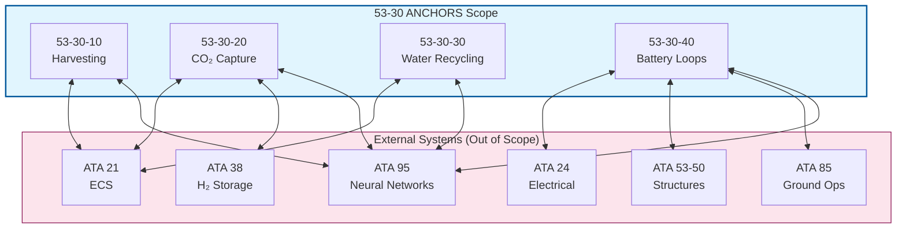
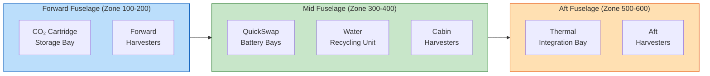
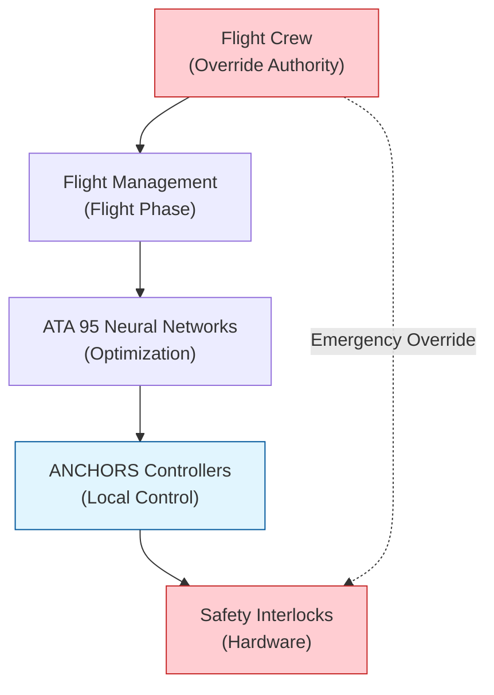

# 53-30-00-01 — ANCHORS Scope Boundaries

| Field | Value |
|-------|-------|
| **Document ID** | ATA53-30-00-01-SCP-001 |
| **Version** | 1.2 |
| **Date** | 2025-11-26 |
| **Status** | DRAFT |
| **Classification** | Unclassified |

---

## Navigation

### Breadcrumb
`AMPEL360-BWB-H2-Hy-E` / `OPT-IN_FRAMEWORK` / `T-TECHNOLOGY` / `A-AIRFRAME` / `ATA_53-FUSELAGE` / `53-30_ANCHORS` / `53-30-00_GENERAL` / `53-30-00-01_Overview`

### Parent Documents
| Document | Path | Relationship |
|----------|------|--------------|
| Fuselage Chapter Overview | [53-00-01_Overview/53-00-01_Overview.md](../../../53-00_GENERAL/53-00-01_Overview/53-00-01_Overview.md) | ATA 53 scope |
| OPT-IN Framework Standard | [/OPT-IN_FRAMEWORK/OPT-IN_Standard_v1.1.md](/OPT-IN_FRAMEWORK/OPT-IN_Standard_v1.1.md) | Framework definition |
| ANCHORS Definition | [./53-30-00-01_ANCHORS_Definition.md](./53-30-00-01_ANCHORS_Definition.md) | System definition |

### Sibling Documents (53-30-00-01_Overview)
| Document | Path | Content |
|----------|------|---------|
| ANCHORS Definition | [./53-30-00-01_ANCHORS_Definition.md](./53-30-00-01_ANCHORS_Definition.md) | What ANCHORS means |
| System Architecture | [./53-30-00-01_System_Architecture.md](./53-30-00-01_System_Architecture.md) | Architecture overview |
| **Scope Boundaries** | **This document** | What's in/out of scope |
| Acronym Glossary | [./53-30-00-01_Acronym_Glossary.md](./53-30-00-01_Acronym_Glossary.md) | Terminology |

### Child / Related Documents
| Document | Path | Relationship |
|----------|------|--------------|
| Safety Assessment Plan | [../53-30-00-02_Safety/53-30-00-02_Safety_Assessment_Plan.md](../53-30-00-02_Safety/53-30-00-02_Safety_Assessment_Plan.md) | Safety scope |
| System Requirements | [../53-30-00-03_Requirements/53-30-00-03_System_Requirements_Spec.md](../53-30-00-03_Requirements/53-30-00-03_System_Requirements_Spec.md) | Requirements baseline |
| ICD Master | [../53-30-00-05_Interfaces/53-30-00-05_ICD_Master.md](../53-30-00-05_Interfaces/53-30-00-05_ICD_Master.md) | Interface boundaries |

---

## 1. Purpose

This document defines the **scope boundaries** for the **53-30 ANCHORS** subsystem band within ATA Chapter 53 (Fuselage). It establishes:

- **What is included** in ANCHORS
- **What is excluded** from ANCHORS
- **Physical boundaries** within the fuselage structure
- **Functional boundaries** between ANCHORS and adjacent systems
- **Interface demarcation** with other ATA chapters

---

## 2. Scope Overview Diagram

---

## 3. Included Systems (In Scope)

### 3.1 Harvesting Systems (53-30-10)

| Component | Function | In Scope |
|-----------|----------|----------|
| Airflow Harvesters | Extract energy from cabin air circulation | ✅ Yes |
| Condensate Recovery | Collect moisture from ECS ducts | ✅ Yes |
| Cabin CO₂ Extraction | Capture CO₂ from cabin atmosphere | ✅ Yes |
| Waste Heat Harvest | Thermoelectric energy recovery | ✅ Yes |
| Local Controllers | Harvesting optimization | ✅ Yes |

### 3.2 CO₂ Capture & Conversion (53-30-20)

| Component | Function | In Scope |
|-----------|----------|----------|
| Manifold Capture | CO₂ collection from harvesting taps | ✅ Yes |
| Separation Modules | CO₂ purification | ✅ Yes |
| Solidification Cartridges | Minerite conversion | ✅ Yes |
| Thermal Integration | Heat management for CO₂ processes | ✅ Yes |
| Cartridge Handling | Swap mechanisms and storage | ✅ Yes |

### 3.3 Water/Waste Recycling (53-30-30)

| Component | Function | In Scope |
|-----------|----------|----------|
| Greywater Filtering | Lavatory water treatment | ✅ Yes |
| Condensate Loops | Moisture recirculation | ✅ Yes |
| Moisture Recovery | Cabin humidity extraction | ✅ Yes |
| AWG Units | Atmospheric water generation | ✅ Yes |
| Water Quality Monitoring | Purity sensors and control | ✅ Yes |

### 3.4 Battery Loops (53-30-40)

| Component | Function | In Scope |
|-----------|----------|----------|
| QuickSwap Units | Rapid battery exchange bays | ✅ Yes |
| Thermal Regen Loops | Battery cooling with heat recovery | ✅ Yes |
| MicroCycle Packs | Distributed energy storage | ✅ Yes |
| DPP Traceability | Digital passport tracking | ✅ Yes |
| BMS Integration | Battery management coordination | ✅ Yes |

---

## 4. Excluded Systems (Out of Scope)

| System | ATA Chapter | Reason for Exclusion |
|--------|-------------|---------------------|
| Primary Flight Controls | ATA 27 | Safety-critical, separate certification |
| Propulsion Systems | ATA 71-80 | Engine manufacturer responsibility |
| Emergency Oxygen | ATA 35 | Dedicated safety system |
| Fire Protection | ATA 26 | Independent safety system |
| Passenger Entertainment | ATA 44 | Convenience, not circularity |
| Galley Systems | ATA 25 | Separate equipment scope |
| Landing Gear | ATA 32 | Structural/mechanical separate |
| External Fuel Systems | ATA 28 | Primary aircraft systems |

### 4.1 Scope Boundary Exceptions

Some systems interface with ANCHORS but responsibility is shared:

| Interface Area | ANCHORS Responsibility | External Responsibility |
|---------------|------------------------|------------------------|
| ECS Duct Taps | Tap fitting and sensor | Duct structure (ATA 21) |
| Electrical Bus | Load management | Bus infrastructure (ATA 24) |
| Structural Mounts | Equipment brackets | Primary structure (ATA 53-50) |
| Ground Connectors | Quick-disconnect | GSE equipment (ATA 85) |

---

## 5. Physical Boundaries

### 5.1 Zonal Allocation

### 5.2 Physical Envelope

| Zone | Station Range | Equipment | Mass Budget |
|------|--------------|-----------|-------------|
| Zone 100-200 | STA 0 – STA 800 | CO₂ storage, forward harvesters | 85 kg |
| Zone 300-400 | STA 800 – STA 1600 | Battery bays, water recycling | 220 kg |
| Zone 500-600 | STA 1600 – STA 2400 | Thermal integration, aft harvesters | 95 kg |
| **Total** | — | — | **400 kg** |

### 5.3 Structural Interface Points

| Interface ID | Location | Type | Load (kg) |
|-------------|----------|------|-----------|
| SIP-001 | Floor beam FR 12 | QuickSwap bay mount | 80 |
| SIP-002 | Floor beam FR 14 | QuickSwap bay mount | 80 |
| SIP-003 | Cargo floor FR 8 | CO₂ cartridge rack | 45 |
| SIP-004 | Aft pressure bulkhead | Thermal HX mount | 35 |
| SIP-005 | Crown panel Sec 41 | Harvester brackets | 15 |

---

## 6. Functional Boundaries

### 6.1 Operating Modes

| Mode | ANCHORS Active | External Dependency |
|------|----------------|---------------------|
| **Ground Idle** | DPP sync only | Ground power (ATA 24) |
| **Ground Circularity** | Full swap ops | GSE (ATA 85), Ground power |
| **Taxi** | Standby | Aircraft power |
| **Climb** | Harvesting active | ECS (ATA 21) |
| **Cruise** | Full operation | ECS, Electrical, NN (ATA 95) |
| **Descent** | Reduced harvesting | ECS |
| **Emergency** | Safe shutdown | All ANCHORS isolated |

### 6.2 Control Authority Boundaries

---

## 7. Interface Demarcation

### 7.1 Data Interface Boundaries

| Data Flow | ANCHORS Side | External Side | Protocol |
|-----------|-------------|---------------|----------|
| Optimization commands | Receive & execute | Generate (ATA 95) | ARINC 664 |
| Sensor telemetry | Generate & send | Receive (ATA 95) | ARINC 664 |
| DPP records | Generate & store | Sync (Ground) | Blockchain anchor |
| Power demand | Request | Allocate (ATA 24) | CAN bus |

### 7.2 Fluid Interface Boundaries

| Fluid | ANCHORS Boundary | External Boundary |
|-------|-----------------|-------------------|
| Cabin air (CO₂) | Extraction tap | ECS duct (ATA 21) |
| Condensate | Collection point | ECS drain (ATA 21) |
| Coolant | HX secondary side | TMS primary (ATA 21) |
| Greywater | Filter inlet | Lavatory drain (ATA 38) |

---

## 8. Certification Scope

### 8.1 Applicable Regulations

| Regulation | Scope Element | ANCHORS Applicability |
|------------|--------------|----------------------|
| [CS 25.1309](https://www.easa.europa.eu/en/document-library/certification-specifications/cs-25) | Equipment/systems | All ANCHORS functions |
| [CS 25.863](https://www.easa.europa.eu/en/document-library/certification-specifications/cs-25) | Flammable fluid fire protection | Battery loops, thermal fluids |
| [CS 25.1713](https://www.easa.europa.eu/en/document-library/certification-specifications/cs-25) | Fire containment | Battery bays |
| [EU 2023/1542](https://eur-lex.europa.eu/eli/reg/2023/1542) | Battery Regulation | DPP, circularity tracking |

### 8.2 Certification Boundaries

- **ANCHORS Type Certificate**: Covers all 53-30 equipment and functions
- **Integration TC**: Covers interfaces with aircraft systems
- **Equipment TSO/ETSO**: Individual LRUs as applicable

---

## 9. Traceability

| Requirement ID | Scope Element | Reference |
|---------------|---------------|-----------|
| REQ-53-30-SCP-001 | Harvesting systems in scope | This document §3.1 |
| REQ-53-30-SCP-002 | CO₂ capture in scope | This document §3.2 |
| REQ-53-30-SCP-003 | Water recycling in scope | This document §3.3 |
| REQ-53-30-SCP-004 | Battery loops in scope | This document §3.4 |
| REQ-53-30-SCP-005 | Primary controls excluded | This document §4 |
| REQ-53-30-SCP-006 | Zonal mass budgets | This document §5.2 |

---

## Document Control

- Generated with the assistance of AI (GitHub Copilot), prompted by **Amedeo Pelliccia**.
- Status: **DRAFT** — Subject to human review and approval.
- Human approver: _[to be completed]_.
- Repository: `AMPEL360-BWB-H2-Hy-E`
- Last AI update: 2025-11-26

---

*END OF DOCUMENT*
