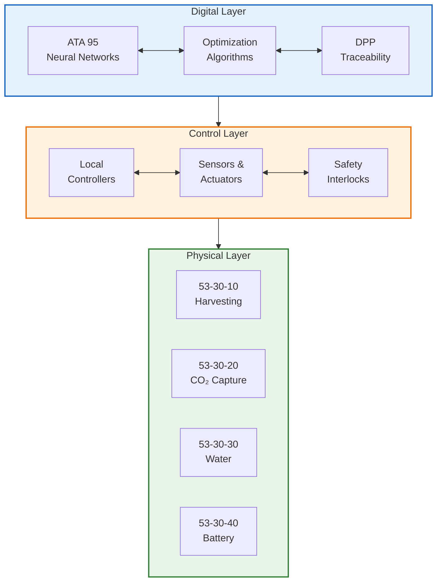
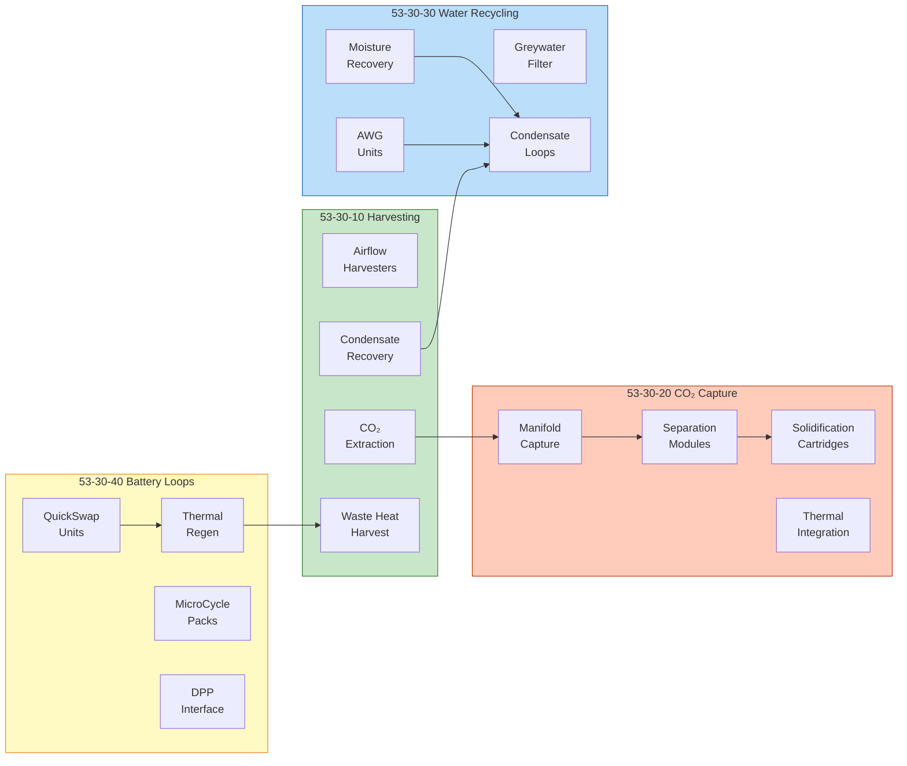
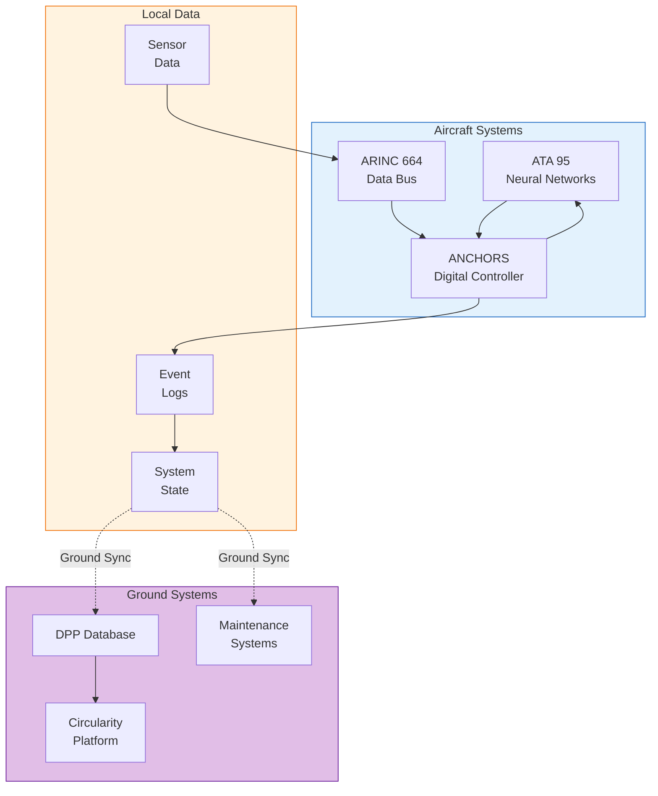
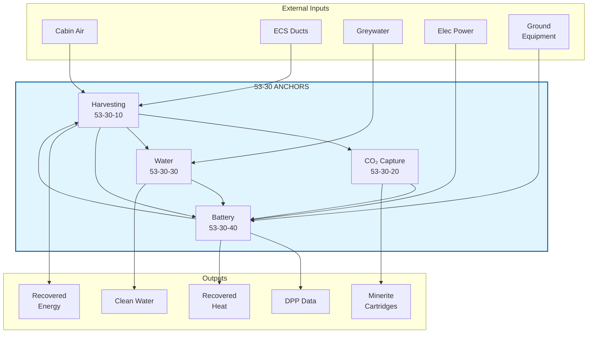
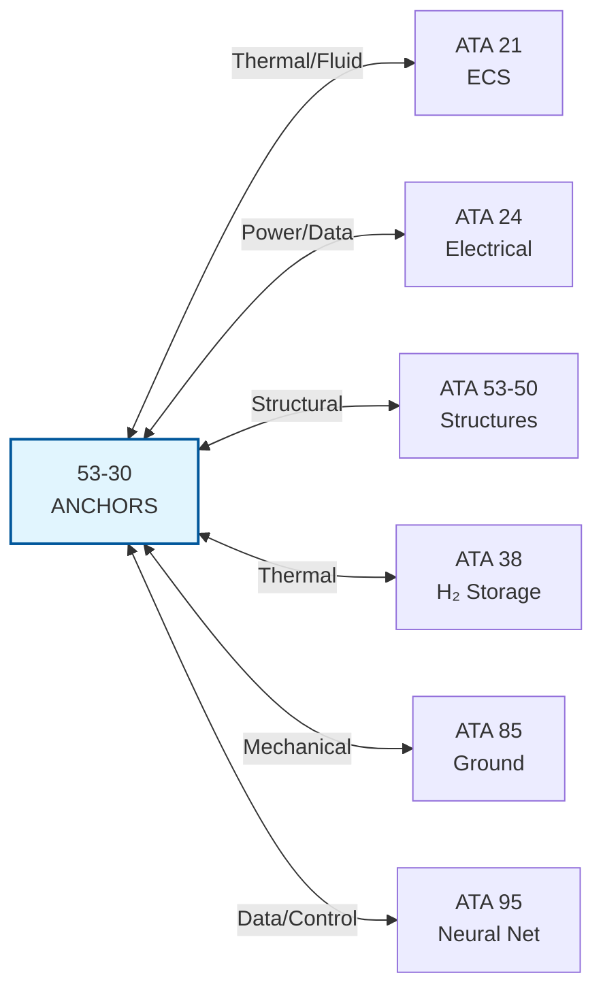
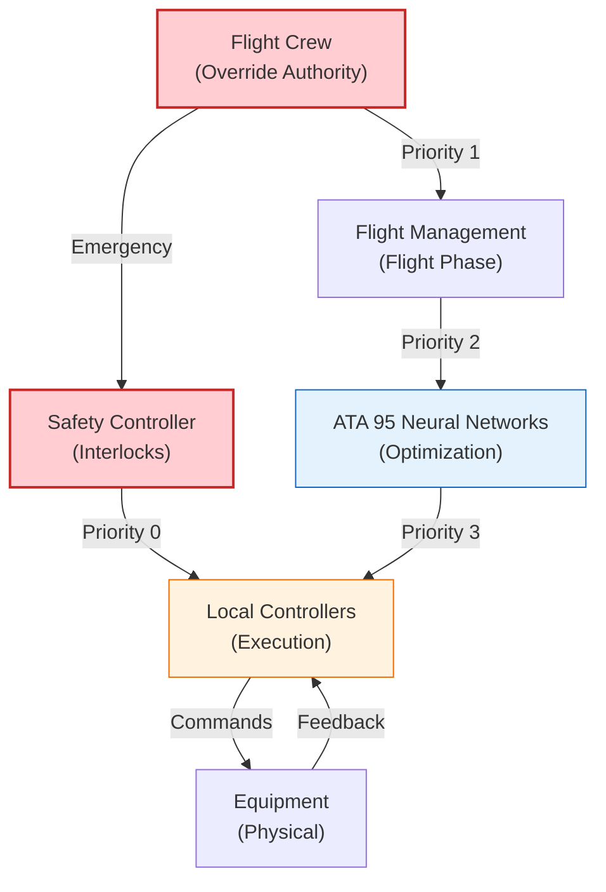

# 53-30-00-01 — ANCHORS System Architecture

| Field | Value |
|-------|-------|
| **Document ID** | ATA53-30-00-01-ARC-001 |
| **Version** | 1.1 |
| **Date** | 2025-11-26 |
| **Status** | DRAFT |
| **Classification** | Unclassified |

---

## Navigation

### Breadcrumb
`AMPEL360-BWB-H2-Hy-E` / `OPT-IN_FRAMEWORK` / `T-TECHNOLOGY` / `A-AIRFRAME` / `ATA_53-FUSELAGE` / `53-30_ANCHORS` / `53-30-00_GENERAL` / `53-30-00-01_Overview`

### Parent Documents
| Document | Path | Relationship |
|----------|------|--------------|
| ANCHORS Definition | [./53-30-00-01_ANCHORS_Definition.md](./53-30-00-01_ANCHORS_Definition.md) | System definition |
| Scope Boundaries | [./53-30-00-01_Scope_Boundaries.md](./53-30-00-01_Scope_Boundaries.md) | Scope definition |
| OPT-IN Framework | [/OPT-IN_FRAMEWORK/OPT-IN_Standard_v1.1.md](/OPT-IN_FRAMEWORK/OPT-IN_Standard_v1.1.md) | Framework standard |

### Sibling Documents (53-30-00-01_Overview)
| Document | Path | Content |
|----------|------|---------|
| ANCHORS Definition | [./53-30-00-01_ANCHORS_Definition.md](./53-30-00-01_ANCHORS_Definition.md) | What ANCHORS means |
| **System Architecture** | **This document** | How it's structured |
| Scope Boundaries | [./53-30-00-01_Scope_Boundaries.md](./53-30-00-01_Scope_Boundaries.md) | What's in/out |
| Acronym Glossary | [./53-30-00-01_Acronym_Glossary.md](./53-30-00-01_Acronym_Glossary.md) | Terminology |

### Child / Related Documents
| Document | Path | Relationship |
|----------|------|--------------|
| Design Description | [../53-30-00-04_Design/53-30-00-04_Design_Description.md](../53-30-00-04_Design/53-30-00-04_Design_Description.md) | Detailed design |
| ICD Master | [../53-30-00-05_Interfaces/53-30-00-05_ICD_Master.md](../53-30-00-05_Interfaces/53-30-00-05_ICD_Master.md) | Interface definitions |
| Safety Assessment | [../53-30-00-02_Safety/53-30-00-02_Safety_Assessment_Plan.md](../53-30-00-02_Safety/53-30-00-02_Safety_Assessment_Plan.md) | Safety architecture |

---

## 1. Purpose

This document defines the **system architecture** for the **53-30 ANCHORS** subsystem band. It establishes:

- **Architectural principles** governing ANCHORS design
- **Layered architecture** (Physical, Control, Digital)
- **Subsystem decomposition** and interactions
- **Interface architecture** with external systems
- **Control philosophy** and authority hierarchy

---

## 2. Architecture Overview

---

## 3. Architectural Principles

### 3.1 Core Principles

| Principle | Description | Implementation |
|-----------|-------------|----------------|
| **Modularity** | Each subsystem is self-contained | LRU design, standardized interfaces |
| **Fail-Safe** | Failures default to safe state | Hardware interlocks, redundancy |
| **Circularity** | Close material/energy loops | Recovery, reuse, regeneration |
| **Digital Twin** | Full traceability | DPP integration, real-time sync |
| **Weight Efficiency** | Minimize mass penalty | Multi-function integration |

### 3.2 Design Standards

| Standard | Application | Reference |
|----------|-------------|-----------|
| [ARP4754A](https://www.sae.org/standards/content/arp4754a/) | System development | Development assurance |
| [ARP4761](https://www.sae.org/standards/content/arp4761/) | Safety assessment | FHA, PSSA, SSA |
| [DO-178C](https://www.rtca.org/products/do-178c/) | Software | DAL allocation |
| [DO-254](https://www.rtca.org/products/do-254/) | Hardware | Complex electronics |
| IEC 61508 | Functional safety | SIL allocation |

---

## 4. Layered Architecture

### 4.1 Physical Layer

### 4.2 Control Layer

| Controller | Function | Inputs | Outputs | Safety Level |
|------------|----------|--------|---------|--------------|
| HARV-CTRL | Harvesting optimization | ECS data, power status | Harvester commands | DAL D |
| CO2-CTRL | CO₂ capture management | CO₂ levels, thermal state | Valve positions, alerts | DAL C |
| WATER-CTRL | Water loop control | Quality sensors, flow | Pump commands, alerts | DAL D |
| BATT-CTRL | Battery thermal management | Cell temps, SoC, SoH | Cooling commands | DAL B |
| SAFETY-CTRL | Interlock coordination | All controllers | Emergency shutdown | DAL A |

### 4.3 Digital Layer

---

## 5. Subsystem Decomposition

### 5.1 Functional Block Diagram

### 5.2 Subsystem Specifications

| Subsystem | Components | Mass (kg) | Power (W) | Data Rate |
|-----------|------------|-----------|-----------|-----------|
| **53-30-10** Harvesting | 4 harvesters, controllers | 45 | 120 | 10 kbps |
| **53-30-20** CO₂ Capture | Manifold, separator, solidifier | 85 | 850 | 25 kbps |
| **53-30-30** Water | Filters, pumps, tanks | 55 | 180 | 15 kbps |
| **53-30-40** Battery | QuickSwap bays, thermal loops | 215 | 450 | 100 kbps |
| **Total** | — | **400** | **1600** | **150 kbps** |

---

## 6. Interface Architecture

### 6.1 External Interfaces

### 6.2 Interface Control Documents

| ICD | External System | Interface Type | Status | Document |
|-----|-----------------|----------------|--------|----------|
| ICD-001 | ATA 21 ECS | Thermal, Fluid, Data | Active | [53-30-00-05_ICD_21-00_ECS.md](../53-30-00-05_Interfaces/53-30-00-05_ICD_21-00_ECS.md) |
| ICD-002 | ATA 24 Electrical | Power, Data | Active | [53-30-00-05_ICD_24-80_Electrical_Power.md](../53-30-00-05_Interfaces/53-30-00-05_ICD_24-80_Electrical_Power.md) |
| ICD-003 | ATA 53-50 Structures | Structural | Active | [53-30-00-05_ICD_53-50_Structures.md](../53-30-00-05_Interfaces/53-30-00-05_ICD_53-50_Structures.md) |
| ICD-004 | ATA 38 H₂ Storage | Thermal | Active | [53-30-00-05_ICD_38-60_H2_Storage.md](../53-30-00-05_Interfaces/53-30-00-05_ICD_38-60_H2_Storage.md) |
| ICD-005 | ATA 85 Ground | Mechanical, Data | Active | [53-30-00-05_ICD_85-30_Ground_Circularity.md](../53-30-00-05_Interfaces/53-30-00-05_ICD_85-30_Ground_Circularity.md) |
| ICD-006 | ATA 95 Neural Networks | Data, Control | Active | [53-30-00-05_ICD_95-40_Neural_Networks.md](../53-30-00-05_Interfaces/53-30-00-05_ICD_95-40_Neural_Networks.md) |

---

## 7. Control Philosophy

### 7.1 Control Hierarchy

### 7.2 Operating Modes

| Mode | Trigger | Active Systems | Optimization |
|------|---------|----------------|--------------|
| **GROUND_IDLE** | Engines off, no GSE | DPP sync only | None |
| **GROUND_CIRC** | GSE connected | QuickSwap, cartridge swap | Manual |
| **TAXI** | Taxi power | Standby | Minimal |
| **CLIMB** | Climb phase | Harvesting active | ATA 95 |
| **CRUISE** | Cruise phase | Full operation | ATA 95 full |
| **DESCENT** | Descent phase | Reduced harvesting | ATA 95 |
| **EMERGENCY** | Emergency signal | Safe shutdown | None |

### 7.3 Safety Interlocks

| Interlock | Trigger Condition | Action | Reset |
|-----------|-------------------|--------|-------|
| BATT_OVERHEAT | Cell T > 60°C | Isolate battery, max cooling | Manual after inspection |
| CO2_LEAK | CO₂ > 5000 ppm in bay | Shut isolation valves, vent | Manual after check |
| WATER_CONTAM | Quality out of spec | Bypass to dump | Auto after quality OK |
| HARV_OVERLOAD | Power > 150% rated | Reduce harvesting | Auto after load normal |
| STRUCT_STRESS | Load > 90% limit | Alert crew, reduce ops | Manual |

---

## 8. Data Architecture

### 8.1 Data Bus Configuration

| Bus | Protocol | Bandwidth | Latency | Systems |
|-----|----------|-----------|---------|---------|
| Primary | ARINC 664 | 100 Mbps | < 10 ms | All controllers |
| Secondary | CAN 2.0B | 1 Mbps | < 5 ms | Sensors, actuators |
| Safety | Dedicated | 10 Mbps | < 2 ms | Safety interlocks |
| DPP | Ethernet | 1 Gbps | < 100 ms | Ground sync |

### 8.2 Data Flow Rates

| Data Type | Source | Destination | Rate | Priority |
|-----------|--------|-------------|------|----------|
| Sensor telemetry | All sensors | Controllers | 10 Hz | Normal |
| Control commands | Controllers | Actuators | 20 Hz | High |
| Safety status | Safety CTRL | All | 50 Hz | Critical |
| DPP records | All | DPP store | 1 Hz | Low |
| Optimization | ATA 95 | Controllers | 1 Hz | Normal |

---

## 9. Traceability

| Requirement ID | Architecture Element | Reference |
|---------------|---------------------|-----------|
| REQ-53-30-ARC-001 | Three-layer architecture | This document §4 |
| REQ-53-30-ARC-002 | Modular subsystem design | This document §3.1 |
| REQ-53-30-ARC-003 | Safety interlock hierarchy | This document §7.3 |
| REQ-53-30-ARC-004 | Interface definitions | This document §6 |
| REQ-53-30-ARC-005 | Control philosophy | This document §7 |
| REQ-53-30-ARC-006 | Data bus architecture | This document §8 |

---

## Document Control

- Generated with the assistance of AI (GitHub Copilot), prompted by **Amedeo Pelliccia**.
- Status: **DRAFT** — Subject to human review and approval.
- Human approver: _[to be completed]_.
- Repository: `AMPEL360-BWB-H2-Hy-E`
- Last AI update: 2025-11-26

---

*END OF DOCUMENT*
