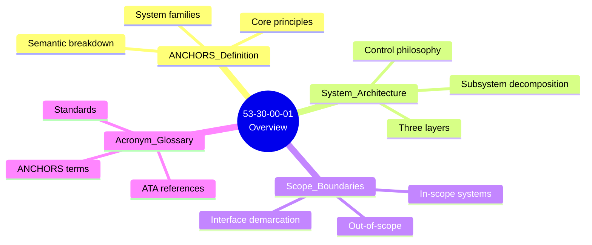
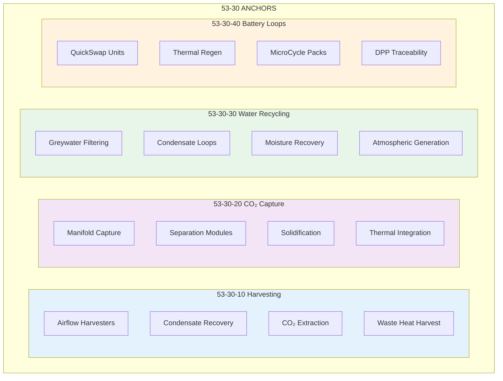

# 53-30-00-01 — ANCHORS General Overview

| Field              | Value                  |
| ------------------ | ---------------------- |
| **Document ID**    | ATA53-30-00-01-OVW-001 |
| **Version**        | 1.1                    |
| **Date**           | 2025-11-26             |
| **Status**         | DRAFT                  |
| **Classification** | Unclassified           |

---

## 0. Context

| Attribute       | Value                                                                                                                                            |
| --------------- | ------------------------------------------------------------------------------------------------------------------------------------------------ |
| **Path**        | `OPT-IN_FRAMEWORK/T-TECHNOLOGY_AMEDEOPELLICCIA-ON_BOARD_SYSTEMS/A-AIRFRAME/ATA_53-FUSELAGE/53-30_ANCHORS/53-30-00_GENERAL/53-30-00-01_Overview/` |
| **ATA Chapter** | 53 — Fuselage                                                                                                                                    |
| **Bucket**      | 30 — ANCHORS                                                                                                                                     |
| **Phase**       | 01 — Overview                                                                                                                                    |
| **Owner**       | AMPEL360 Circularity Systems WG                                                                                                                  |
| **Repository**  | `AMPEL360-BWB-H2-Hy-E`                                                                                                                           |

---

## Navigation

### Breadcrumb
`AMPEL360-BWB-H2-Hy-E` / `OPT-IN_FRAMEWORK` / `T-TECHNOLOGY` / `A-AIRFRAME` / `ATA_53-FUSELAGE` / `53-30_ANCHORS` / `53-30-00_GENERAL` / `53-30-00-01_Overview`

### Parent Documents
| Document | Path | Relationship |
|----------|------|--------------|
| ATA 53 Fuselage Overview | [`../../../53-00_GENERAL/53-00-00-01_Overview/`](../../../53-00_GENERAL/53-00-00-01_Overview/) | Chapter context |
| ANCHORS General | [`../`](../) | Parent directory |
| OPT-IN Framework | [`/OPT-IN_FRAMEWORK/`](/OPT-IN_FRAMEWORK/) | Framework standard |

### Child Documents (This Directory)
| Document | Path | Content |
|----------|------|---------|
| ANCHORS Definition | [`./53-30-00-01_ANCHORS_Definition.md`](./53-30-00-01_ANCHORS_Definition.md) | What ANCHORS means |
| System Architecture | [`./53-30-00-01_System_Architecture.md`](./53-30-00-01_System_Architecture.md) | How it's structured |
| Scope Boundaries | [`./53-30-00-01_Scope_Boundaries.md`](./53-30-00-01_Scope_Boundaries.md) | What's in/out |
| Acronym Glossary | [`./53-30-00-01_Acronym_Glossary.md`](./53-30-00-01_Acronym_Glossary.md) | Terminology |

### Sibling Directories (53-30-00_GENERAL)
| Directory | Path | Phase |
|-----------|------|-------|
| **01 — Overview** | **This directory** | **Current** |
| 02 — Safety | [`../53-30-00-02_Safety/`](../53-30-00-02_Safety/) | Safety assessment |
| 03 — Requirements | [`../53-30-00-03_Requirements/`](../53-30-00-03_Requirements/) | System requirements |
| 04 — Design | [`../53-30-00-04_Design/`](../53-30-00-04_Design/) | Design description |
| 05 — Interfaces | [`../53-30-00-05_Interfaces/`](../53-30-00-05_Interfaces/) | Interface control |
| 06 — Engineering | [`../53-30-00-06_Engineering/`](../53-30-00-06_Engineering/) | Analysis |
| 07 — V&V | [`../53-30-00-07_V_AND_V/`](../53-30-00-07_V_AND_V/) | Verification |

---

## 1. Purpose

This folder provides the **general overview layer** for ANCHORS systems within ATA 53 — Fuselage.

**ANCHORS** = **A**ircraft **N**etworks, **C**ircular, **H**arvesting, **O**perating & **R**enewable **S**ystems

It consolidates:

- The canonical **definition of ANCHORS** and its semantic breakdown
- The **system architecture** spanning harvesting, CO₂ capture, water recycling, and battery loops
- **Scope boundaries** defining what is included and excluded
- **Acronym glossary** for consistent terminology

This is the **entry point** for anyone needing to understand what ANCHORS means in the context of AMPEL360 BWB.

---

## 2. Document Set Overview



### Document Matrix

| File ID | Title | Purpose | Status |
|---------|-------|---------|--------|
| `53-30-00-01_ANCHORS_Definition.md` | ANCHORS Definition | Core definition, semantic breakdown, principles | ✅ Complete |
| `53-30-00-01_System_Architecture.md` | System Architecture | Three-layer architecture, subsystems, control | ✅ Complete |
| `53-30-00-01_Scope_Boundaries.md` | Scope Boundaries | In/out scope, zonal allocation, interfaces | ✅ Complete |
| `53-30-00-01_Acronym_Glossary.md` | Acronym Glossary | Terminology and abbreviations | 📝 Draft |

### Assets Subfolder

The `ASSETS/` subfolder contains diagrams referenced by these documents:

| Asset ID | Description | Format |
|----------|-------------|--------|
| `FIG-001` | ANCHORS Architecture Overview | SVG |
| `FIG-002` | System Context Diagram | SVG |
| `FIG-003` | OPT-IN Integration Map | SVG |

---

## 3. ANCHORS System Families



---

## 4. Relationship to ANCHORS Structure

This folder is part of the ANCHORS lifecycle documentation:

```
53-30_ANCHORS/
├── 53-30-00_GENERAL/
│   ├── 53-30-00-01_Overview/ ← This folder
│   ├── 53-30-00-02_Safety/
│   ├── 53-30-00-03_Requirements/
│   ├── 53-30-00-04_Design/
│   ├── 53-30-00-05_Interfaces/
│   ├── 53-30-00-06_Engineering/
│   ├── 53-30-00-07_V_AND_V/
│   ├── 53-30-00-08_Prototyping/
│   ├── 53-30-00-09_Production_Planning/
│   ├── 53-30-00-10_Certification/
│   ├── 53-30-00-11_EIS_Versions_Tags/
│   ├── 53-30-00-12_Services/
│   ├── 53-30-00-13_Subsystems_Components/
│   └── 53-30-00-14_Ops_Std_Sustain/
├── 53-30-10_Harvesting/
├── 53-30-20_CO2_Capture_Conversion/
├── 53-30-30_Water_Waste_Recycling/
└── 53-30-40_Battery_Loops/
```

---

## 5. Key Interfaces

| Interface | ATA | Document |
|-----------|-----|----------|
| Environmental Control | 21 | [`../53-30-00-05_Interfaces/53-30-00-05_ICD_21-00_ECS.md`](../53-30-00-05_Interfaces/53-30-00-05_ICD_21-00_ECS.md) |
| Electrical Power | 24 | [`../53-30-00-05_Interfaces/53-30-00-05_ICD_24-80_Electrical_Power.md`](../53-30-00-05_Interfaces/53-30-00-05_ICD_24-80_Electrical_Power.md) |
| Fuel / H₂ Systems | 28 | [`../53-30-00-05_Interfaces/53-30-00-05_ICD_28-00_Fuel.md`](../53-30-00-05_Interfaces/53-30-00-05_ICD_28-00_Fuel.md) |
| H₂ Storage | 38 | [`../53-30-00-05_Interfaces/53-30-00-05_ICD_38-60_H2_Storage.md`](../53-30-00-05_Interfaces/53-30-00-05_ICD_38-60_H2_Storage.md) |
| Structures | 53 | [`../53-30-00-05_Interfaces/53-30-00-05_ICD_53-50_Structures.md`](../53-30-00-05_Interfaces/53-30-00-05_ICD_53-50_Structures.md) |
| Ground Circularity | 85 | [`../53-30-00-05_Interfaces/53-30-00-05_ICD_85-30_Ground_Circularity.md`](../53-30-00-05_Interfaces/53-30-00-05_ICD_85-30_Ground_Circularity.md) |
| Neural Networks | 95 | [`../53-30-00-05_Interfaces/53-30-00-05_ICD_95-40_Neural_Networks.md`](../53-30-00-05_Interfaces/53-30-00-05_ICD_95-40_Neural_Networks.md) |

---

## 6. Status

| Attribute | Value |
|-----------|-------|
| **Phase** | Overview |
| **Lifecycle Position** | 01 of 14 |
| **Status** | DRAFT |
| **Completeness** | 95% |
| **Last Updated** | 2025-11-26 |

### Document Completion

| Document | Status | Completeness |
|----------|--------|--------------|
| ANCHORS Definition | ✅ Complete | 100% |
| System Architecture | ✅ Complete | 100% |
| Scope Boundaries | ✅ Complete | 100% |
| Acronym Glossary | 📝 Draft | 70% |
| ASSETS | 📝 Pending | 30% |

---

## Document Control

- Generated with the assistance of AI (GitHub Copilot), prompted by **Amedeo Pelliccia**.
- Status: **DRAFT** — Subject to human review and approval.
- Human approver: _[to be completed]_.
- Repository: `AMPEL360-BWB-H2-Hy-E`
- Last AI update: 2025-11-26

---

*END OF DOCUMENT*
