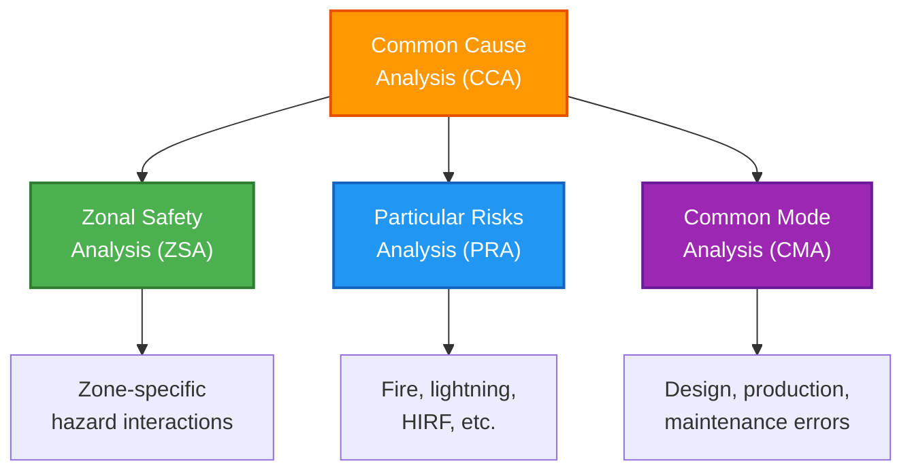
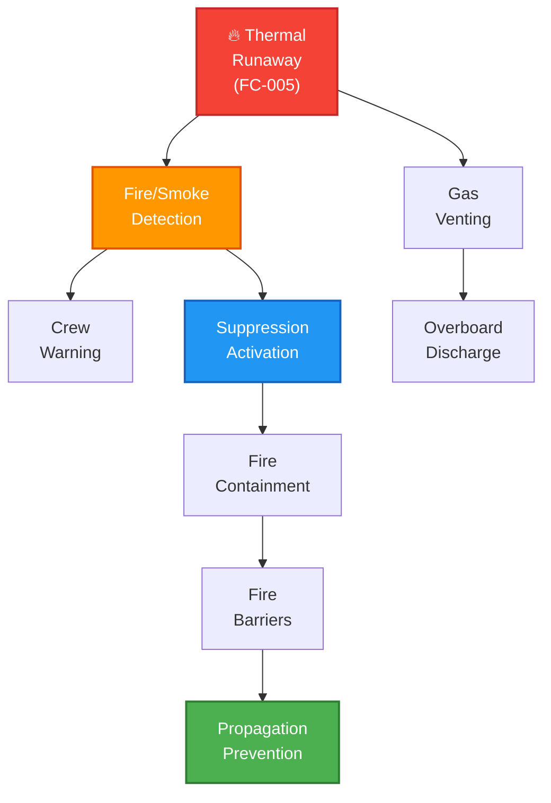

# 53-30-00-02 — Common Cause Analysis (CCA)

**Document ID:** 53-30-00-02-006  
**ATA Chapter:** 53 – Fuselage  
**Subsystem Band:** 53-30_ANCHORS — Aircraft Networks, Circular, Harvesting, Operating & Renewable Systems  
**Version:** 1.1  
**Date:** 2025-11-25  
**Status:** DRAFT  

---

## 1. Purpose

This document presents the **Common Cause Analysis (CCA)** for ANCHOR'S systems, identifying and mitigating potential common mode failures in accordance with:

- **SAE ARP4761** — *Guidelines and Methods for Conducting the Safety Assessment Process*  
  https://www.sae.org/standards/content/arp4761/
- **EASA CS-25.1309** — *Equipment, systems, and installations*  
  https://www.easa.europa.eu/en/document-library/certification-specifications/cs-25

---

## 2. Cross-Referenced Internal Documentation

- [53-30-00-02_FHA_Functional_Hazard_Assessment.md](./53-30-00-02_FHA_Functional_Hazard_Assessment.md)
- [53-30-00-02_PSSA_Preliminary_System_Safety.md](./53-30-00-02_PSSA_Preliminary_System_Safety.md)
- [53-30-00-02_Zonal_Safety_Analysis.md](./53-30-00-02_Zonal_Safety_Analysis.md)
- [53-30-00-02_Hazard_Log.csv](./53-30-00-02_Hazard_Log.csv)

### External Chapter References

- **ATA 26 – Fire Protection:** Fire detection and suppression coordination
- **ATA 21 – ECS:** Thermal and ventilation interfaces
- **ATA 24 – Electrical Power:** Power distribution common causes
- **ATA 95 – Neural Networks:** AI/ML common mode failures

---

## 3. CCA Methodology

The CCA follows ARP4761 and includes three complementary analyses:

---

## 4. Zonal Safety Analysis (ZSA) Summary

Full ZSA documentation: [53-30-00-02_Zonal_Safety_Analysis.md](./53-30-00-02_Zonal_Safety_Analysis.md)

### 4.1 ANCHORS Equipment Zonal Distribution

| Zone ID | Zone Description | ANCHORS Equipment | Adjacent Systems |
|---------|------------------|-------------------|------------------|
| 100 | Forward fuselage | CO₂ cartridge bay, water treatment, condensate manifold | Avionics, ECS ducting, forward cargo |
| 200 | Center fuselage | Battery swap bay, thermal loops, main controller | Floor structure, cargo hold, electrical bus |
| 300 | Aft fuselage | Energy harvesters, waste heat recovery, secondary controller | APU, tail structure, aft cargo |
| 400 | Wings | Interface connections only | Fuel, hydraulics, electrical |

### 4.2 Zone 100 — Forward Fuselage

| Item | Adjacent Systems | Potential Interaction | Mitigation |
|------|------------------|----------------------|------------|
| CO₂ cartridge storage | Avionics bays | Thermal proximity; CO₂ leak affecting electronics | Physical barriers; ventilation paths |
| Water treatment unit | Electrical bus | Fluid leak → electrical short | Drip trays; isolated routing |
| Condensate manifold | ECS ducting | Thermal interaction; condensate contamination | Thermal insulation; isolation valves |

### 4.3 Zone 200 — Center Fuselage (Critical)

| Item | Adjacent Systems | Potential Interaction | Mitigation |
|------|------------------|----------------------|------------|
| Battery swap bay | Floor structure | Thermal load; fire propagation | Thermal isolation; fire barriers |
| Thermal loops | ECS ducts | Heat transfer; coolant leak | Heat shields; leak detection |
| Main controller | Electrical power | EMI; power transients | Shielding; filtered power |

### 4.4 Zone 300 — Aft Fuselage

| Item | Adjacent Systems | Potential Interaction | Mitigation |
|------|------------------|----------------------|------------|
| Harvesting equipment | APU | Vibration; heat ingestion | Vibration isolation; thermal shielding |
| Waste heat recovery | Engine bleed | Thermal exceedance | Temperature limits; bypass |
| Integration controllers | Radio equipment | EMI interference | EMI shielding; filtering |

---

## 5. Particular Risks Analysis (PRA)

### 5.1 Fire Risk (Coordination with ATA 26)

**Primary Concern:** Battery thermal runaway (FC-005, FC-006)

| Risk Factor | ANCHORS Exposure | ATA 26 Interface | Mitigation |
|-------------|------------------|------------------|------------|
| Battery fire | High — lithium cells | Fire detection loops in Zone 200 | Cell isolation; suppression |
| Fire propagation | Medium — adjacent structure | Suppression agent coverage | Fire barriers; containment |
| Smoke generation | High — battery gases | Smoke detection; ventilation | Bay ventilation; crew warning |
| Toxic fumes | High — electrolyte gases | Crew protection provisions | Ventilation to exterior |

**ATA 26 Coordination Requirements:**

| Requirement ID | Description | Interface Document |
|----------------|-------------|-------------------|
| CCA-ATA26-001 | Fire detection coverage shall include battery bay Zone 200 | ICD-53-30-05 / ATA 26 |
| CCA-ATA26-002 | Suppression agent shall be compatible with lithium battery fires | ICD-53-30-05 / ATA 26 |
| CCA-ATA26-003 | Smoke detection shall trigger within 30 seconds of thermal runaway | ICD-53-30-05 / ATA 26 |
| CCA-ATA26-004 | Fire barrier rating shall prevent propagation for ≥ 15 minutes | ICD-53-30-05 / ATA 26 |

### 5.2 Explosion Risk

| Risk Factor | ANCHORS Exposure | Probability Concern | Mitigation |
|-------------|------------------|---------------------|------------|
| H₂ accumulation | Medium — if H₂ interface present | Hazardous | Dual containment; leak detection; ventilation |
| CO₂ overpressure | Low — cartridge design | Major | Pressure relief; burst disc |
| Battery gas venting | Medium — thermal runaway | Hazardous | Venting paths; spark isolation |

### 5.3 Lightning Risk

| Risk Factor | ANCHORS Exposure | Probability Concern | Mitigation |
|-------------|------------------|---------------------|------------|
| Direct strike | Low — internal equipment | N/A | Aircraft lightning protection |
| Induced transients | Medium — electronics | Major | Surge protection; bonding |
| Ignition of vented gases | Low | Hazardous | Safe discharge paths |

### 5.4 High-Intensity Radiated Fields (HIRF)

| Risk Factor | ANCHORS Exposure | Probability Concern | Mitigation |
|-------------|------------------|---------------------|------------|
| Controller upset | Medium — digital systems | Major | HIRF qualification; shielding |
| Sensor malfunction | Medium — monitoring systems | Major | HIRF qualification; redundancy |

### 5.5 Fluid Contamination

| Risk Factor | ANCHORS Exposure | Probability Concern | Mitigation |
|-------------|------------------|---------------------|------------|
| Coolant leak | Medium — thermal loops | Major | Leak detection; containment trays |
| Water contamination | Medium — recycling system | Major | Multi-barrier filtration; quality sensors |
| Cross-contamination | Low — isolated systems | Major | Physical separation; material compatibility |

---

## 6. Common Mode Analysis (CMA)

### 6.1 Design Errors

| CMA ID | Common Cause | Systems Affected | Mitigation Strategy |
|--------|--------------|------------------|---------------------|
| CMA-D-001 | Software design error | All controlled systems | DAL allocation per DO-178C; diverse coding |
| CMA-D-002 | Hardware design flaw | Redundant channels | Dissimilar hardware where required |
| CMA-D-003 | Specification error | All derived requirements | Requirements review; traceability |
| CMA-D-004 | AI/ML model error | ATA 95 monitoring functions | ML assurance per AMC 20-152A |

### 6.2 Manufacturing/Production Errors

| CMA ID | Common Cause | Systems Affected | Mitigation Strategy |
|--------|--------------|------------------|---------------------|
| CMA-M-001 | Batch defect (batteries) | Battery modules | Multi-supplier; lot segregation |
| CMA-M-002 | Assembly error | All LRUs | FAI process; acceptance test |
| CMA-M-003 | Material substitution | Structural components | Material traceability; incoming inspection |
| CMA-M-004 | Calibration error | Sensors | Calibration records; periodic verification |

### 6.3 Maintenance/Operational Errors

| CMA ID | Common Cause | Systems Affected | Mitigation Strategy |
|--------|--------------|------------------|---------------------|
| CMA-O-001 | Incorrect replacement | LRUs | Part number verification; BITE |
| CMA-O-002 | Missed inspection | All inspected items | Maintenance tracking; AMM clarity |
| CMA-O-003 | Improper cartridge handling | CO₂ cartridges | Training; handling procedures |
| CMA-O-004 | Battery mishandling | Battery modules | Handling equipment; procedures |
| CMA-O-005 | Coolant contamination | Thermal loops | Closed-loop servicing; fluid specification |

### 6.4 Environmental Common Causes

| CMA ID | Common Cause | Systems Affected | Mitigation Strategy |
|--------|--------------|------------------|---------------------|
| CMA-E-001 | Temperature exceedance | All thermal-sensitive | Environmental qualification; limits |
| CMA-E-002 | Vibration fatigue | Mechanical components | Vibration qualification; mounting design |
| CMA-E-003 | Corrosion | Fluid-contacting parts | Material selection; protective coatings |
| CMA-E-004 | Humidity/condensation | Electronics | Sealing; conformal coating |

---

## 7. Independence Assessment

### 7.1 Required Independence Matrix

| Failure Condition | Severity | Required Independence | Implementation |
|-------------------|----------|----------------------|----------------|
| FC-005 Battery thermal runaway | Hazardous | Dual independent cooling + detection | Two cooling loops; independent sensors |
| FC-006 Battery propagation | Hazardous | Physical + thermal barriers | Cell-level isolation; module containment |
| FC-003 CO₂ bay accumulation | Major | Detection + ventilation | Independent sensors; passive vent paths |
| FC-007 Water contamination | Major | Multi-barrier + bypass | 3-stage filtration; auto-bypass |
| FC-014 H₂ leak | Hazardous | Dual containment + detection | Nested containment; independent detectors |

### 7.2 Common Power Source Analysis

| Power Source | Systems Dependent | Common Cause Mitigation |
|--------------|-------------------|------------------------|
| Main AC bus | Controllers, pumps, sensors | Battery backup for critical functions |
| DC essential bus | Monitoring, detection | Independent battery reserve |
| Ground power | Swap mechanism | Manual override capability |

### 7.3 Common Software Analysis

| Software Component | Functions Using | DAL | Common Cause Mitigation |
|-------------------|-----------------|-----|------------------------|
| ANCHORS Main Controller | All active functions | C | Independent watchdog; reversionary mode |
| Battery Management SW | Battery monitoring | B | Diverse implementation; hardware backup |
| AI/NN Monitoring | Status/health prediction | D | Per AMC 20-152A; human oversight |

---

## 8. ATA 26 Fire Protection Coordination

### 8.1 Fire Protection Strategy for ANCHORS

| Protection Element | ANCHORS Application | ATA 26 Interface |
|-------------------|---------------------|------------------|
| Fire detection | Battery bay, CO₂ bay | Integrated detection loops |
| Smoke detection | Battery bay | Shared detection system |
| Fire suppression | Battery bay | Dedicated agent discharge |
| Fire barriers | All ANCHORS zones | Certified barrier materials |
| Ventilation | Battery gas venting | Coordinated overboard venting |

### 8.2 Fire Scenario Analysis

### 8.3 Coordination Status

| Coordination Item | ATA 26 Status | ANCHORS Status | Notes |
|-------------------|---------------|----------------|-------|
| Detection loop integration | TBD | Interface defined | Pending ATA 26 input |
| Suppression agent selection | TBD | Requirements specified | Must be Li-battery compatible |
| Barrier rating | TBD | 15 min specified | Pending structural analysis |
| Vent path approval | TBD | Routing proposed | Pending ATA 26 review |

---

## 9. Chapter-Level ATA 53 Safety Strategy Alignment

### 9.1 Fuselage Safety Objectives

ANCHOR'S integration must be consistent with ATA 53 (Fuselage) safety strategy:

| ATA 53 Objective | ANCHORS Compliance | Evidence |
|------------------|-------------------|----------|
| Structural integrity | Design loads verified | Structural analysis report |
| Fire/smoke protection | ATA 26 coordination | This CCA; ICD documentation |
| Pressurization integrity | No penetrations | Installation drawings |
| Emergency egress | No obstruction | Zonal analysis |

### 9.2 Cross-Reference to Chapter-Level Documents

- **ATA 53-00 System Safety Strategy:** [53-00-00-02_System_Safety_Strategy.md](../../../53-00_GENERAL/53-00-00-02_Safety/53-00-00-02_System_Safety_Strategy.md) *(placeholder)*
- **ATA 26 Fire Protection Strategy:** [26-00-00-02_Fire_Protection_Safety_Strategy.md](../../../../ATA_26-FIRE_PROTECTION/26-00_GENERAL/26-00-00-02_Safety/26-00-00-02_Fire_Protection_Safety_Strategy.md) *(placeholder)*

---

## 10. Open Actions

| Action ID | Description | Owner | Due Date | Status |
|-----------|-------------|-------|----------|--------|
| CCA-ACT-001 | Complete ATA 26 fire detection loop integration | TBD | TBD | Open |
| CCA-ACT-002 | Finalize suppression agent compatibility | TBD | TBD | Open |
| CCA-ACT-003 | Complete zonal drawings with ANCHORS equipment | TBD | TBD | Open |
| CCA-ACT-004 | Coordinate with ATA 53-00 fuselage safety strategy | TBD | TBD | Open |
| CCA-ACT-005 | Validate independence of battery cooling loops | TBD | TBD | Open |
| CCA-ACT-006 | Complete AI/ML common mode analysis per AMC 20-152A | TBD | TBD | Open |

---

## Document Control

- Generated with the assistance of AI (GitHub Copilot), prompted by **Amedeo Pelliccia**.
- Status: **DRAFT** — Subject to human review and approval.
- Human approver: _[to be completed]_.
- Repository: `AMPEL360-BWB-H2-Hy-E`
- Last AI update: 2025-11-25
