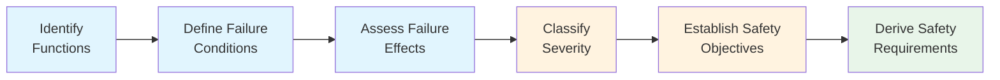

# 53-30-00-02 — Functional Hazard Assessment (FHA)

**Document ID:** 53-30-00-02-002  
**ATA Chapter:** 53 – Fuselage  
**Subsystem Band:** 53-30_ANCHORS — Aircraft Networks, Circular, Harvesting, Operating & Renewable Systems  
**Version:** 1.1  
**Date:** 2025-11-25  
**Status:** DRAFT  

---

## 1. Purpose

This document presents the **Functional Hazard Assessment (FHA)** for ANCHOR'S systems, identifying potential hazards and their severity classifications in accordance with:

- **SAE ARP4761** — *Guidelines and Methods for Conducting the Safety Assessment Process*  
  https://www.sae.org/standards/content/arp4761/
- **EASA CS-25.1309** — *Equipment, systems, and installations*  
  https://www.easa.europa.eu/en/document-library/certification-specifications/cs-25
- **14 CFR 25.1309** — *Equipment, systems, and installations*  
  https://www.ecfr.gov/current/title-14/chapter-I/subchapter-C/part-25

---

## 2. Cross-Referenced Internal Documentation

- [53-30-00-02_Safety_Assessment_Plan.md](./53-30-00-02_Safety_Assessment_Plan.md)
- [53-30-00-02_PSSA_Preliminary_System_Safety.md](./53-30-00-02_PSSA_Preliminary_System_Safety.md)
- [53-30-00-02_SSA_System_Safety_Assessment.md](./53-30-00-02_SSA_System_Safety_Assessment.md)
- [53-30-00-02_Hazard_Log.csv](./53-30-00-02_Hazard_Log.csv)
- [53-30-00-01_System_Architecture.md](../53-30-00-01_Overview/53-30-00-01_System_Architecture.md)

---

## 3. FHA Methodology

The FHA follows the ARP4761 process:

### 3.1 Flight Phase Definitions

| Phase Code | Phase Name | Description |
|------------|------------|-------------|
| GND | Ground | Pre-flight, taxi, post-flight |
| T/O | Takeoff | Takeoff roll to 1500 ft AGL |
| CLB | Climb | 1500 ft AGL to cruise altitude |
| CRZ | Cruise | Level flight at cruise altitude |
| DSC | Descent | Cruise to 1500 ft AGL |
| LDG | Landing | 1500 ft AGL to touchdown |
| ALL | All Phases | Applicable throughout flight |

---

## 4. Function Identification

### 4.1 ANCHOR'S Primary Functions

| Function ID | Function Description | Subsystem | Applicable Phases |
|-------------|----------------------|-----------|-------------------|
| F-53-30-001 | Provide auxiliary electrical power via cabin airflow harvesting | 53-30-10 Harvesting | ALL |
| F-53-30-002 | Capture CO₂ from cabin air for downstream processing | 53-30-10 Harvesting | CRZ, CLB, DSC |
| F-53-30-003 | Solidify and store captured CO₂ in cartridges | 53-30-20 CO₂ Capture | CRZ |
| F-53-30-004 | Recycle greywater for non-potable use | 53-30-30 Water | ALL |
| F-53-30-005 | Recover atmospheric moisture for water system | 53-30-30 Water | ALL |
| F-53-30-006 | Manage battery thermal conditions | 53-30-40 Battery | ALL |
| F-53-30-007 | Enable rapid battery module exchange | 53-30-40 Battery | GND |
| F-53-30-008 | Recover waste heat for cabin/system use | 53-30-10 Harvesting | ALL |
| F-53-30-009 | Separate CO₂ from mixed gas streams | 53-30-20 CO₂ Capture | CRZ |
| F-53-30-010 | Collect and transmit DPP traceability data | All | ALL |
| F-53-30-011 | Provide condensate collection from ECS | 53-30-10 Harvesting | ALL |
| F-53-30-012 | Manage thermal regeneration loops | 53-30-40 Battery | ALL |

### 4.2 Interface Functions

| Function ID | Function Description | Interface Partner | Applicable Phases |
|-------------|----------------------|-------------------|-------------------|
| F-53-30-I01 | Exchange thermal energy with ECS | ATA 21 | ALL |
| F-53-30-I02 | Supply auxiliary power to electrical bus | ATA 24 | ALL |
| F-53-30-I03 | Interface with H₂ storage thermal system | ATA 38 | ALL |
| F-53-30-I04 | Provide data to AI/NN monitoring systems | ATA 95 | ALL |
| F-53-30-I05 | Coordinate with fire protection system | ATA 26 | ALL |

---

## 5. Failure Condition Identification and Classification

### 5.1 Severity Classification Criteria (per CS-25.1309)

| Classification | Code | Description | Probability Objective |
|----------------|------|-------------|----------------------|
| **Catastrophic** | CAT | Failure conditions which would prevent continued safe flight and landing | < 1×10⁻⁹ per FH |
| **Hazardous** | HAZ | Large reduction in safety margins; physical distress or higher workload; serious or fatal injuries to small number of occupants | < 1×10⁻⁷ per FH |
| **Major** | MAJ | Significant reduction in safety margins or functional capabilities; physical discomfort; increased workload | < 1×10⁻⁵ per FH |
| **Minor** | MIN | Slight reduction in safety margins; slight increase in crew workload | < 1×10⁻³ per FH |
| **No Safety Effect** | NSE | No effect on operational capability or crew workload | No probability requirement |

### 5.2 Complete Failure Condition Table

| FC ID | Failure Condition | Function Ref | Effect on Aircraft/Crew | Effect on Occupants | Severity | Probability Objective | Phase |
|-------|-------------------|--------------|-------------------------|---------------------|----------|----------------------|-------|
| FC-001 | Total loss of energy harvesting | F-53-30-001 | Reduced auxiliary power; increased main generator load | None | MIN | < 1×10⁻³ | ALL |
| FC-002 | Partial loss of energy harvesting (> 50%) | F-53-30-001 | Slightly reduced auxiliary power | None | NSE | N/A | ALL |
| FC-003 | CO₂ accumulation in equipment bay | F-53-30-002, F-53-30-003 | Localized asphyxiation hazard; potential equipment damage | None (crew in bay) | MAJ | < 1×10⁻⁵ | ALL |
| FC-004 | Uncontrolled CO₂ release to cabin | F-53-30-003 | Elevated cabin CO₂; ECS compensates | Discomfort if prolonged | MAJ | < 1×10⁻⁵ | CRZ |
| FC-005 | Battery thermal runaway | F-53-30-006 | Fire/smoke in battery bay; potential propagation | Smoke in cabin; toxic fumes | HAZ | < 1×10⁻⁷ | ALL |
| FC-006 | Battery thermal runaway with propagation | F-53-30-006 | Uncontained fire; structural damage potential | Serious injury potential | HAZ | < 1×10⁻⁷ | ALL |
| FC-007 | Unsafe water delivered to cabin | F-53-30-004, F-53-30-005 | Contaminated water available | Health effects if consumed | MAJ | < 1×10⁻⁵ | ALL |
| FC-008 | Loss of water recycling | F-53-30-004 | Reduced water availability | Minor inconvenience | MIN | < 1×10⁻³ | ALL |
| FC-009 | Battery swap mechanism jam (ground) | F-53-30-007 | Extended turnaround time | None | NSE | N/A | GND |
| FC-010 | Structural impairment from ANCHORS | ALL | Reduced structural margins | None directly | MAJ | < 1×10⁻⁵ | ALL |
| FC-011 | Thermal damage to fuselage structure | F-53-30-006, F-53-30-012 | Localized structural degradation | None directly | MAJ | < 1×10⁻⁵ | ALL |
| FC-012 | Loss of thermal management | F-53-30-006 | Battery performance degradation | None | MIN | < 1×10⁻³ | ALL |
| FC-013 | Coolant leak in battery bay | F-53-30-012 | Fluid accumulation; slip hazard; potential short circuit | None | MAJ | < 1×10⁻⁵ | ALL |
| FC-014 | H₂ interface leak (if applicable) | F-53-30-I03 | Hydrogen accumulation; explosion risk | Serious injury potential | HAZ | < 1×10⁻⁷ | ALL |
| FC-015 | DPP data corruption | F-53-30-010 | Loss of traceability data | None | NSE | N/A | ALL |
| FC-016 | Erroneous ANCHORS status to crew | F-53-30-I04 | Misleading information; incorrect decisions | Increased workload | MAJ | < 1×10⁻⁵ | ALL |
| FC-017 | CO₂ cartridge overpressure | F-53-30-003 | Pressure relief activation; potential rupture | None if contained | MAJ | < 1×10⁻⁵ | CRZ |
| FC-018 | Loss of all ANCHORS functions | ALL | Complete circularity system loss | Minor environmental impact | MIN | < 1×10⁻³ | ALL |

---

## 6. Hazardous and Major Failure Condition Details

### 6.1 FC-005: Battery Thermal Runaway

**Severity:** Hazardous (HAZ)  
**Probability Objective:** P < 1×10⁻⁷ per flight hour

#### Effects Analysis

| Effect Category | Description |
|-----------------|-------------|
| **Primary Effect** | Single cell thermal runaway with heat, gas, and flame release |
| **Secondary Effect** | Smoke and toxic fumes generation |
| **Tertiary Effect** | Potential propagation to adjacent cells/modules |
| **Crew Effect** | Increased workload for emergency procedures |
| **Occupant Effect** | Smoke exposure; potential evacuation requirement |

#### Contributing Factors

| Factor | Mechanism | Mitigation Strategy |
|--------|-----------|---------------------|
| Manufacturing defect | Internal short circuit | Cell screening; quality control |
| Overcharge | Lithium plating | BMS monitoring; charge limits |
| External heating | Adjacent fire/heat source | Thermal isolation; zonal segregation |
| Mechanical damage | Impact/penetration | Structural protection |
| Cooling failure | Temperature exceedance | Dual cooling loops; detection |

#### Safety Requirements Derived

| DSR ID | Derived Safety Requirement | Verification Method |
|--------|---------------------------|---------------------|
| DSR-005-001 | Battery cells shall be thermally isolated to prevent propagation | Test (thermal propagation test) |
| DSR-005-002 | Cell-level temperature shall be monitored with < 5°C accuracy | Test + Inspection |
| DSR-005-003 | Cooling loop failure shall be detected within 5 seconds | Test |
| DSR-005-004 | Battery bay shall include automatic fire suppression | Test |
| DSR-005-005 | Thermal runaway shall be contained within battery module | Test (abuse testing) |
| DSR-005-006 | Battery bay ventilation shall safely vent gases overboard | Analysis + Test |

---

### 6.2 FC-003: CO₂ Accumulation in Equipment Bay

**Severity:** Major (MAJ)  
**Probability Objective:** P < 1×10⁻⁵ per flight hour

#### Effects Analysis

| Effect Category | Description |
|-----------------|-------------|
| **Primary Effect** | Elevated CO₂ concentration in confined bay |
| **Secondary Effect** | Personnel asphyxiation hazard during maintenance |
| **Tertiary Effect** | Potential equipment degradation |
| **Crew Effect** | Warning indication; procedure execution |
| **Occupant Effect** | None if bay is isolated from cabin |

#### Contributing Factors

| Factor | Mechanism | Mitigation Strategy |
|--------|-----------|---------------------|
| Cartridge seal failure | Slow leak | Seal inspection; leak detection |
| Connection loosening | Vibration | Torque specifications; lock features |
| Overpressure | Thermal excursion | Pressure relief valves |
| Handling damage | Ground operations | Procedures; training |

#### Safety Requirements Derived

| DSR ID | Derived Safety Requirement | Verification Method |
|--------|---------------------------|---------------------|
| DSR-003-001 | CO₂ concentration in bays shall be continuously monitored | Test |
| DSR-003-002 | Bay ventilation shall prevent CO₂ accumulation > 3% | Analysis + Test |
| DSR-003-003 | CO₂ alarm shall activate before concentration reaches 2% | Test |
| DSR-003-004 | Pressure relief shall prevent cartridge rupture | Test |
| DSR-003-005 | Cartridge connections shall be leak-tested before flight | Inspection |

---

### 6.3 FC-007: Unsafe Water Delivered to Cabin

**Severity:** Major (MAJ)  
**Probability Objective:** P < 1×10⁻⁵ per flight hour

#### Effects Analysis

| Effect Category | Description |
|-----------------|-------------|
| **Primary Effect** | Contaminated water in distribution system |
| **Secondary Effect** | Health effects if consumed |
| **Tertiary Effect** | Water system shutdown/isolation |
| **Crew Effect** | Warning; water system isolation |
| **Occupant Effect** | Gastrointestinal effects if consumed |

#### Safety Requirements Derived

| DSR ID | Derived Safety Requirement | Verification Method |
|--------|---------------------------|---------------------|
| DSR-007-001 | Water quality sensors shall monitor output continuously | Test |
| DSR-007-002 | Contamination detection shall trigger automatic bypass to dump | Test |
| DSR-007-003 | Multi-stage filtration shall provide barrier redundancy | Analysis |
| DSR-007-004 | Recycled water shall meet EPA/EASA potable water standards | Test |

---

### 6.4 FC-014: H₂ Interface Leak (If Applicable)

**Severity:** Hazardous (HAZ)  
**Probability Objective:** P < 1×10⁻⁷ per flight hour

#### Effects Analysis

| Effect Category | Description |
|-----------------|-------------|
| **Primary Effect** | Hydrogen accumulation in confined space |
| **Secondary Effect** | Flammable/explosive atmosphere formation |
| **Tertiary Effect** | Ignition → explosion/fire |
| **Crew Effect** | Emergency procedures; potential diversion |
| **Occupant Effect** | Serious injury if ignition occurs |

#### Safety Requirements Derived

| DSR ID | Derived Safety Requirement | Verification Method |
|--------|---------------------------|---------------------|
| DSR-014-001 | H₂ interfaces shall incorporate dual containment | Inspection |
| DSR-014-002 | H₂ leak detection shall activate before LFL reached | Test |
| DSR-014-003 | H₂ routing shall avoid ignition sources | Analysis |
| DSR-014-004 | Ventilation shall dilute any leak below 25% LFL | Analysis + Test |

---

## 7. Summary of Safety Objectives

### 7.1 Hazardous Failure Conditions (P < 1×10⁻⁷)

| FC ID | Failure Condition | Status |
|-------|-------------------|--------|
| FC-005 | Battery thermal runaway | Addressed in PSSA |
| FC-006 | Battery thermal runaway with propagation | Addressed in PSSA |
| FC-014 | H₂ interface leak | Addressed in H₂/CO₂ Safety Provisions |

### 7.2 Major Failure Conditions (P < 1×10⁻⁵)

| FC ID | Failure Condition | Status |
|-------|-------------------|--------|
| FC-003 | CO₂ accumulation in equipment bay | Addressed in PSSA |
| FC-004 | Uncontrolled CO₂ release to cabin | Addressed in PSSA |
| FC-007 | Unsafe water delivered to cabin | Addressed in PSSA |
| FC-010 | Structural impairment from ANCHORS | Addressed in Structural Analysis |
| FC-011 | Thermal damage to fuselage structure | Addressed in PSSA |
| FC-013 | Coolant leak in battery bay | Addressed in CCA |
| FC-016 | Erroneous ANCHORS status to crew | Addressed in HMI requirements |
| FC-017 | CO₂ cartridge overpressure | Addressed in Design |

---

## 8. Traceability

All failure conditions and derived safety requirements are traced in:

- **Hazard Log:** [53-30-00-02_Hazard_Log.csv](./53-30-00-02_Hazard_Log.csv)
- **PSSA:** [53-30-00-02_PSSA_Preliminary_System_Safety.md](./53-30-00-02_PSSA_Preliminary_System_Safety.md)
- **Verification Matrix:** [53-30-00-07_Verification_Matrix.csv](../53-30-00-07_V_AND_V/53-30-00-07_Verification_Matrix.csv)

---

## 9. Coordination with Other ATA Chapters

| ATA Chapter | Interface | FHA Consideration |
|-------------|-----------|-------------------|
| ATA 21 – ECS | Thermal integration; CO₂ capture interface | FC-003, FC-004 |
| ATA 24 – Electrical Power | Harvested power; battery integration | FC-001, FC-005 |
| ATA 26 – Fire Protection | Battery bay fire suppression | FC-005, FC-006 |
| ATA 38 – Water/Waste | Water recycling interface | FC-007, FC-008 |
| ATA 95 – Neural Networks | Monitoring data; AI/NN assurance | FC-016 |

---

## 10. Open Actions

| Action ID | Description | Owner | Due Date | Status |
|-----------|-------------|-------|----------|--------|
| FHA-ACT-001 | Validate FC-005 probability allocation with battery supplier | TBD | TBD | Open |
| FHA-ACT-002 | Confirm FC-014 H₂ interface scope with ATA 38 | TBD | TBD | Open |
| FHA-ACT-003 | Coordinate FC-005/FC-006 with ATA 26 Fire Protection | TBD | TBD | Open |
| FHA-ACT-004 | Complete FC-016 HMI assessment with ATA 95 | TBD | TBD | Open |
| FHA-ACT-005 | Update Hazard_Log.csv with all entries | Completed | 2025-11-25 | Done |

---

## Document Control

- Generated with the assistance of AI (GitHub Copilot), prompted by **Amedeo Pelliccia**.
- Status: **DRAFT** — Subject to human review and approval.
- Human approver: _[to be completed]_.
- Repository: `AMPEL360-BWB-H2-Hy-E`
- Last AI update: 2025-11-25
