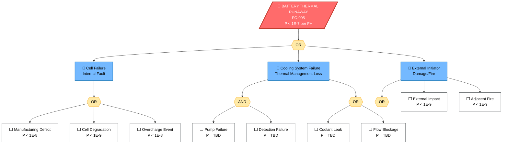
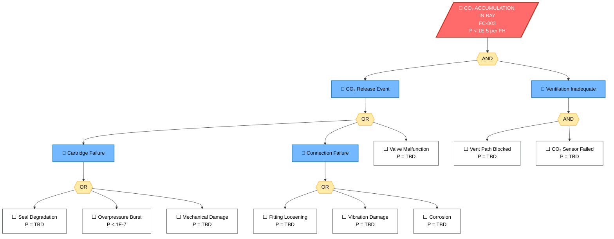
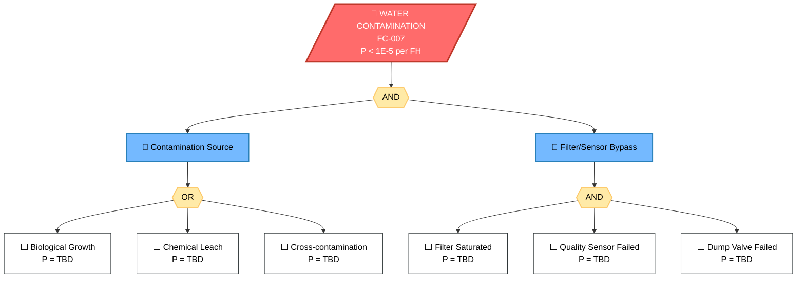

# 53-30-00-02 — Fault Tree Analysis

**Document ID:** 53-30-00-02-005  
**ATA Chapter:** 53 – Fuselage  
**Subsystem Band:** 53-30_ANCHORS — Aircraft Networks, Circular, Harvesting, Operating & Renewable Systems  
**Version:** 1.1  
**Date:** 2025-11-25  
**Status:** DRAFT  

---

## 1. Purpose

This document presents the Fault Tree Analysis (FTA) for critical ANCHORS failure conditions, supporting the quantitative safety assessment per:

- **SAE ARP4761** — *Guidelines and Methods for Conducting the Safety Assessment Process*  
  https://www.sae.org/standards/content/arp4761/
- **EASA CS-25.1309** — Safety assessment requirements  
  https://www.easa.europa.eu/en/document-library/certification-specifications/cs-25

---

## 2. Cross-Referenced Internal Documentation

- [53-30-00-02_FHA_Functional_Hazard_Assessment.md](./53-30-00-02_FHA_Functional_Hazard_Assessment.md)
- [53-30-00-02_PSSA_Preliminary_System_Safety.md](./53-30-00-02_PSSA_Preliminary_System_Safety.md)
- [53-30-00-02_SSA_System_Safety_Assessment.md](./53-30-00-02_SSA_System_Safety_Assessment.md)
- [53-30-00-02_Hazard_Log.csv](./53-30-00-02_Hazard_Log.csv)

---

## 3. FTA Methodology

Fault trees are developed per ARP4761 guidelines:

- **Top event:** Failure condition from FHA
- **Gates:** AND, OR, transfer gates
- **Basic events:** Component failures with failure rates
- **Quantification:** Probability budgets allocated per PSSA

---

## 4. FTA-001: Battery Thermal Runaway

### 4.1 Top Event

Battery thermal runaway in flight (FC-005)  
**Safety Objective:** P < 1×10⁻⁷ per flight hour

### 4.2 Fault Tree Diagram

### 4.3 Basic Event Probabilities

| Event ID | Event Description | Probability | Source | Status |
|----------|-------------------|-------------|--------|--------|
| BE-001 | Manufacturing defect | < 1E-8 | Supplier FMEA | TBD |
| BE-002 | Cell degradation | < 1E-9 | Life testing | TBD |
| BE-003 | Overcharge event | < 1E-8 | BMS analysis | TBD |
| BE-004 | Pump failure | TBD | Supplier data | Pending |
| BE-005 | Detection failure | TBD | System analysis | Pending |
| BE-006 | Coolant leak | TBD | Test data | Pending |
| BE-007 | Flow blockage | TBD | Analysis | Pending |
| BE-008 | External impact | < 1E-9 | Zonal analysis | TBD |
| BE-009 | Adjacent fire | < 1E-9 | Fire analysis | TBD |

---

## 5. FTA-002: CO₂ Accumulation in Bay

### 5.1 Top Event

Hazardous CO₂ concentration in equipment bay (FC-003)  
**Safety Objective:** P < 1×10⁻⁵ per flight hour (Major)

### 5.2 Fault Tree Diagram

### 5.3 Basic Event Probabilities

| Event ID | Event Description | Probability | Source | Status |
|----------|-------------------|-------------|--------|--------|
| BE-101 | Seal degradation | TBD | Material testing | Pending |
| BE-102 | Overpressure burst | < 1E-7 | Design analysis | TBD |
| BE-103 | Mechanical damage | TBD | Zonal analysis | Pending |
| BE-104 | Fitting loosening | TBD | Vibration test | Pending |
| BE-105 | Vibration damage | TBD | Fatigue analysis | Pending |
| BE-106 | Corrosion | TBD | Material analysis | Pending |
| BE-107 | Valve malfunction | TBD | Supplier data | Pending |
| BE-108 | Vent path blocked | TBD | Zonal analysis | Pending |
| BE-109 | CO₂ sensor failed | TBD | Supplier MTBF | Pending |

---

## 6. FTA-003: Water Contamination

### 6.1 Top Event

Unsafe water delivered to cabin (FC-007)  
**Safety Objective:** P < 1×10⁻⁵ per flight hour (Major)

### 6.2 Fault Tree Diagram

---

## 7. Minimal Cut Sets Summary

### 7.1 FTA-001 Minimal Cut Sets

| MCS ID | Events | Order | Probability | Notes |
|--------|--------|-------|-------------|-------|
| MCS-001 | Manufacturing defect | 1 | < 1E-8 | Single point failure |
| MCS-002 | Cell degradation | 1 | < 1E-9 | Latent failure mode |
| MCS-003 | Overcharge event | 1 | < 1E-8 | BMS-dependent |
| MCS-004 | Pump failure AND Detection failure | 2 | TBD | Two-point failure |
| MCS-005 | Coolant leak AND Detection failure | 2 | TBD | Two-point failure |
| MCS-006 | External impact | 1 | < 1E-9 | Zonal protection |

### 7.2 FTA-002 Minimal Cut Sets

| MCS ID | Events | Order | Probability | Notes |
|--------|--------|-------|-------------|-------|
| MCS-101 | Seal degradation AND Vent blocked AND Sensor failed | 3 | TBD | Three-point failure |
| MCS-102 | Connection failure AND Vent blocked AND Sensor failed | 3 | TBD | Three-point failure |
| MCS-103 | Overpressure AND Vent blocked | 2 | TBD | Design margin critical |

### 7.3 FTA-003 Minimal Cut Sets

| MCS ID | Events | Order | Probability | Notes |
|--------|--------|-------|-------------|-------|
| MCS-201 | Contamination AND Filter saturated AND Sensor failed AND Dump failed | 4 | TBD | Multi-barrier failure |

---

## 8. Sensitivity Analysis

### 8.1 Critical Parameters

| Parameter | Baseline | Range | Impact on Top Event |
|-----------|----------|-------|---------------------|
| Cell defect rate | 1E-8 | 1E-9 to 1E-7 | High |
| Cooling detection time | 5 s | 1 s to 30 s | Medium |
| CO₂ sensor reliability | TBD | TBD | Medium |
| Filter service interval | TBD | TBD | Low |

### 8.2 Importance Measures

To be completed after probability data collection.

---

## 9. Open Actions

| Action ID | Description | Owner | Due Date | Status |
|-----------|-------------|-------|----------|--------|
| FTA-ACT-001 | Obtain battery cell supplier FMEA data | TBD | TBD | Open |
| FTA-ACT-002 | Complete cooling system reliability analysis | TBD | TBD | Open |
| FTA-ACT-003 | Validate CO₂ sensor MTBF with supplier | TBD | TBD | Open |
| FTA-ACT-004 | Perform sensitivity analysis | TBD | TBD | Open |
| FTA-ACT-005 | Update cut set probabilities | TBD | TBD | Open |
| FTA-ACT-006 | Generate SVG exports for certification | TBD | TBD | Open |

---

## Document Control

- Generated with the assistance of AI (GitHub Copilot), prompted by **Amedeo Pelliccia**.
- Status: **DRAFT** — Subject to human review and approval.
- Human approver: _[to be completed]_.
- Repository: `AMPEL360-BWB-H2-Hy-E`
- Last AI update: 2025-11-25
