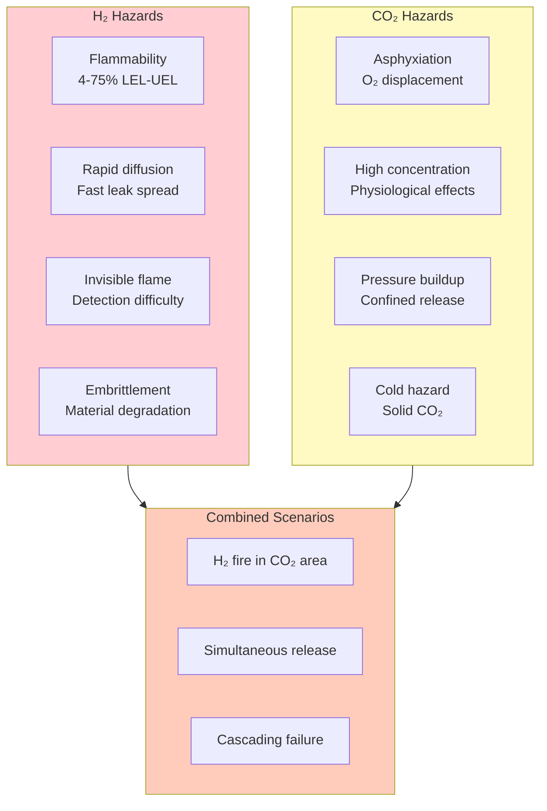
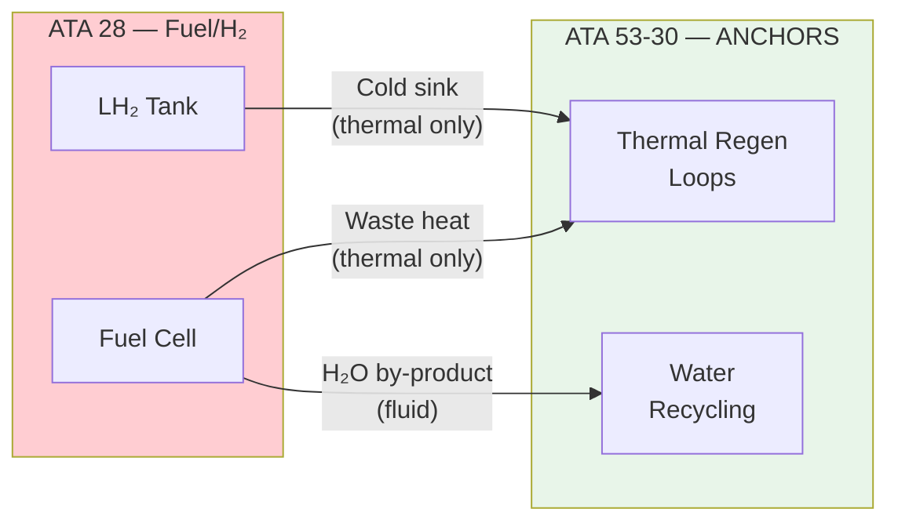
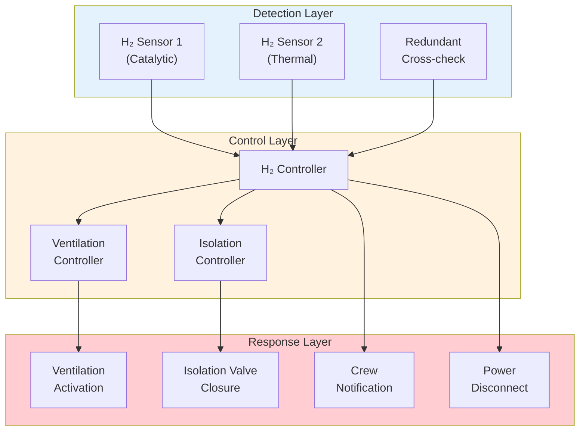
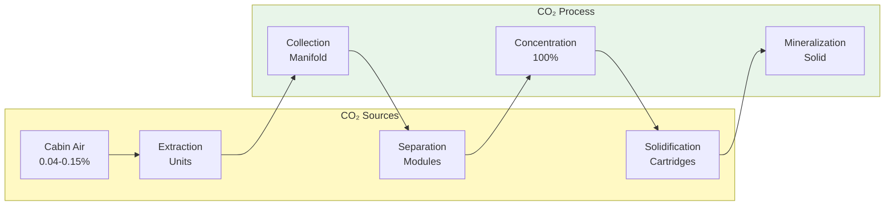
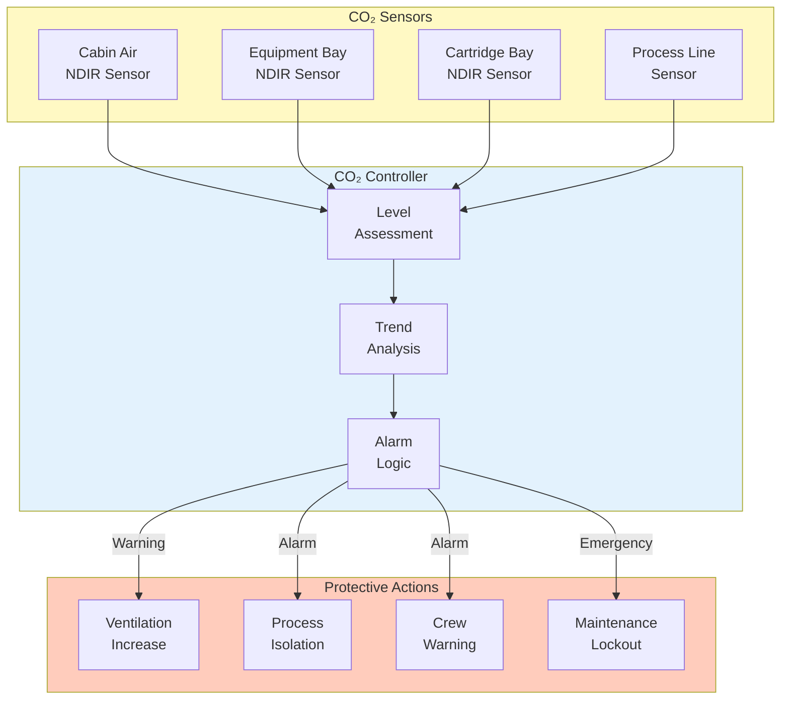
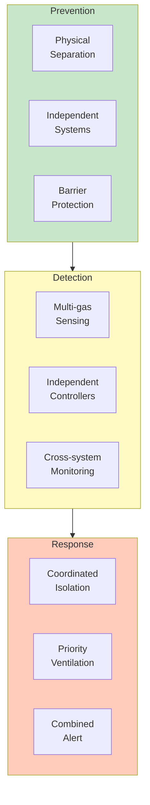
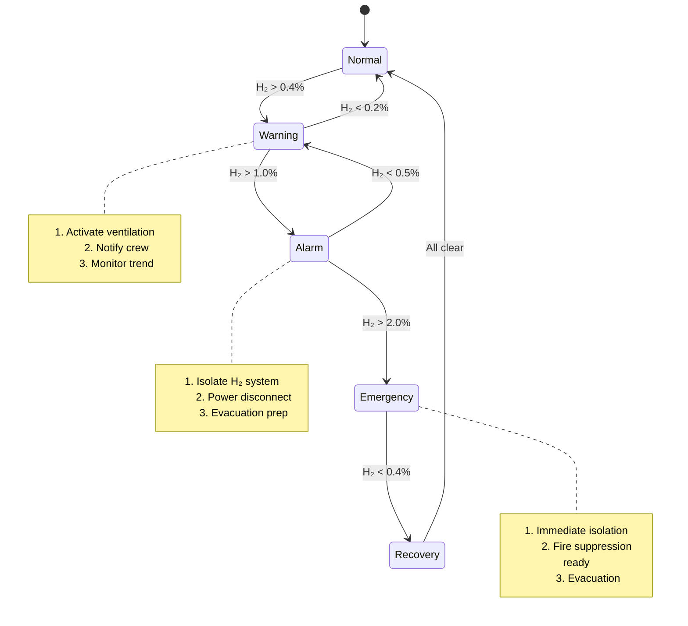
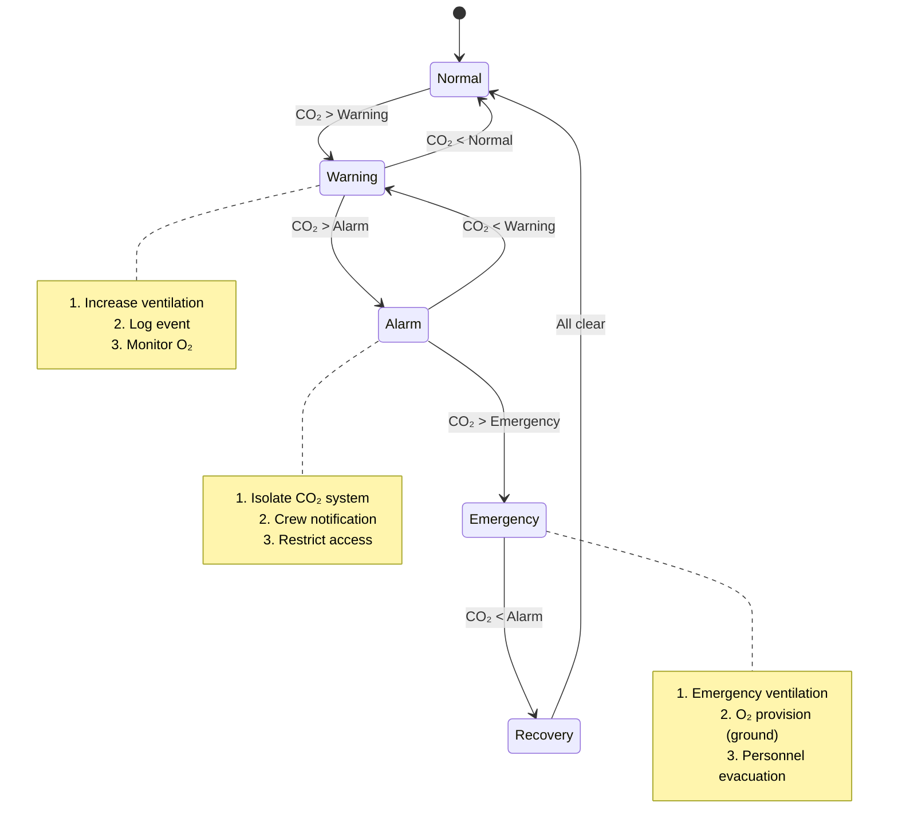

# 53-30-00-02 — H₂/CO₂ Safety Provisions

| Field | Value |
|-------|-------|
| **Document ID** | ATA53-30-00-02-SAF-008 |
| **Version** | 1.1 |
| **Date** | 2025-11-26 |
| **Status** | DRAFT |
| **Classification** | SAFETY-CRITICAL |

---

## Navigation

### Breadcrumb
`AMPEL360-BWB-H2-Hy-E` / `OPT-IN_FRAMEWORK` / `T-TECHNOLOGY` / `A-AIRFRAME` / `ATA_53-FUSELAGE` / `53-30_ANCHORS` / `53-30-00_GENERAL` / `53-30-00-02_Safety`

### Parent Documents
| Document | Path | Relationship |
|----------|------|--------------|
| ANCHORS Safety Assessment Plan | [`./53-30-00-02_Safety_Assessment_Plan.md`](./53-30-00-02_Safety_Assessment_Plan.md) | Parent safety plan |
| ANCHORS FHA | [`./53-30-00-02_FHA_Functional_Hazard_Assessment.md`](./53-30-00-02_FHA_Functional_Hazard_Assessment.md) | Hazard identification |
| System Architecture | [`../53-30-00-01_Overview/53-30-00-01_System_Architecture.md`](../53-30-00-01_Overview/53-30-00-01_System_Architecture.md) | System context |

### Sibling Documents (53-30-00-02_Safety)
| Document | Path | Content |
|----------|------|---------|
| Safety Assessment Plan | [`./53-30-00-02_Safety_Assessment_Plan.md`](./53-30-00-02_Safety_Assessment_Plan.md) | Safety process |
| FHA ANCHORS | [`./53-30-00-02_FHA_Functional_Hazard_Assessment.md`](./53-30-00-02_FHA_Functional_Hazard_Assessment.md) | Hazard assessment |
| PSSA ANCHORS | [`./53-30-00-02_PSSA_Preliminary_System_Safety.md`](./53-30-00-02_PSSA_Preliminary_System_Safety.md) | Preliminary safety |
| SSA ANCHORS | [`./53-30-00-02_SSA_System_Safety_Assessment.md`](./53-30-00-02_SSA_System_Safety_Assessment.md) | System safety |
| FTA Fault Trees | [`./53-30-00-02_FTA_Fault_Trees.md`](./53-30-00-02_FTA_Fault_Trees.md) | Fault analysis |
| CCA | [`./53-30-00-02_Common_Cause_Analysis.md`](./53-30-00-02_Common_Cause_Analysis.md) | Common cause |
| ZSA | [`./53-30-00-02_Zonal_Safety_Analysis.md`](./53-30-00-02_Zonal_Safety_Analysis.md) | Zonal safety |
| **H₂/CO₂ Safety** | **This document** | Gas safety |
| Thermal Runaway | [`./53-30-00-02_Thermal_Runaway_Mitigation.md`](./53-30-00-02_Thermal_Runaway_Mitigation.md) | Battery safety |

### Related External Documents
| Document | ATA | Relationship |
|----------|-----|--------------|
| H₂ Storage Safety | 38 | H₂ tank safety requirements |
| Fuel System Safety | 28 | Fuel cell safety |
| Fire Protection | 26 | Fire detection and suppression |
| ECS Safety | 21 | Cabin atmosphere safety |

---

## 1. Purpose

This document establishes **safety provisions for hydrogen (H₂) and carbon dioxide (CO₂) handling** within ANCHORS systems, addressing the unique hazards associated with these gases in the fuselage environment.

### Applicable Standards

| Standard | Title | Application |
|----------|-------|-------------|
| [CS 25.863](https://www.easa.europa.eu/en/document-library/certification-specifications/cs-25) | Flammable fluid fire protection | H₂ interface protection |
| [CS 25.869](https://www.easa.europa.eu/en/document-library/certification-specifications/cs-25) | Fire protection: systems | Fire barriers |
| [IEC 60079](https://www.iec.ch/) | Explosive atmospheres | ATEX/IECEx zones |
| [SAE AS6171](https://www.sae.org/) | H₂ fuel cell systems | H₂ safety requirements |
| [EN 13779](https://standards.cen.eu/) | Ventilation for buildings | CO₂ limits |
| [OSHA 1910.146](https://www.osha.gov/) | Permit-required confined spaces | CO₂ hazard limits |

---

## 2. Hazard Overview

---

## 3. Hydrogen Safety (Interface Systems)

### 3.1 H₂ Interface Points in ANCHORS

| Interface ID | Description | Type | H₂ Present | Safety Zone |
|--------------|-------------|------|------------|-------------|
| IF-H2-001 | LH₂ tank cold sink | Thermal | No (indirect) | Zone 2 |
| IF-H2-002 | FC heat exchanger | Thermal | No (indirect) | Zone 2 |
| IF-H2-003 | FC water drain | Fluid | No (downstream) | Non-hazardous |
| IF-H2-004 | Emergency vent path | Proximity | Potential | Zone 1 |

### 3.2 H₂ Safety Requirements

| Req ID | Requirement | Value | Standard | Verification |
|--------|-------------|-------|----------|--------------|
| H2-SAF-001 | Minimum separation from H₂ sources | ≥1.0 m | CS 25.863 | Inspection |
| H2-SAF-002 | Ventilation rate in H₂ zone | ≥10 ACH | IEC 60079-10-1 | Test |
| H2-SAF-003 | H₂ detection threshold | 0.4% (10% LEL) | SAE AS6171 | Test |
| H2-SAF-004 | Detection response time | <5 s | SAE AS6171 | Test |
| H2-SAF-005 | Isolation valve closure | <2 s | CS 25.863 | Test |
| H2-SAF-006 | Electrical equipment in Zone 1 | ATEX Ex ia | IEC 60079-11 | Inspection |
| H2-SAF-007 | Fire barrier rating | ≥F60 | CS 25.869 | Test |

### 3.3 H₂ Protection Architecture

### 3.4 H₂ Zone Classification

| Zone | Definition | ANCHORS Equipment |
|------|------------|-------------------|
| Zone 0 | Continuous H₂ presence | None (outside ANCHORS) |
| Zone 1 | Likely H₂ during normal operation | Emergency vent proximity |
| Zone 2 | Unlikely H₂ during normal operation | Thermal interface area |
| Non-hazardous | No H₂ expected | Main ANCHORS equipment |

---

## 4. Carbon Dioxide Safety

### 4.1 CO₂ Sources in ANCHORS

| Source | Concentration | Flow Rate | Location | Hazard Level |
|--------|---------------|-----------|----------|--------------|
| Cabin air extraction | 400-1500 ppm | 50 L/min | Zone 200 | Low |
| Separation module input | 5-15% | 10 L/min | Zone 300 | Medium |
| Separation module output | 95-100% | 2 L/min | Zone 300 | High |
| Solidification cartridge | Solid | N/A | Zone 400 | Medium |
| Process exhaust | Variable | 5 L/min | Vent system | Medium |

### 4.2 CO₂ Concentration Limits

| Location | Normal | Warning | Alarm | Emergency |
|----------|--------|---------|-------|-----------|
| Cabin (occupied) | <1000 ppm | 1500 ppm | 2000 ppm | 5000 ppm |
| Cabin (transient) | <1500 ppm | 2000 ppm | 5000 ppm | 10000 ppm |
| Equipment bay | <5000 ppm | 15000 ppm | 30000 ppm | 50000 ppm |
| Cartridge bay (maint.) | <5000 ppm | 10000 ppm | 30000 ppm | 50000 ppm |
| Cartridge bay (sealed) | N/A | N/A | 100000 ppm | N/A |

### 4.3 CO₂ Safety Requirements

| Req ID | Requirement | Value | Standard | Verification |
|--------|-------------|-------|----------|--------------|
| CO2-SAF-001 | Cabin CO₂ limit (continuous) | ≤1500 ppm | CS 25.831 | Test |
| CO2-SAF-002 | Equipment bay ventilation | ≥5 ACH | EN 13779 | Test |
| CO2-SAF-003 | CO₂ detection in process areas | ≥2 sensors | — | Inspection |
| CO2-SAF-004 | Detection response time | <10 s | — | Test |
| CO2-SAF-005 | Automatic isolation on alarm | <5 s | — | Test |
| CO2-SAF-006 | Cartridge bay entry warning | Visual + audible | OSHA 1910.146 | Inspection |
| CO2-SAF-007 | Emergency O₂ provision | Ground personnel | OSHA 1910.146 | Inspection |

### 4.4 CO₂ Monitoring Architecture

---

## 5. Combined H₂/CO₂ Scenarios

### 5.1 Scenario Analysis

| ID | Scenario | Initial Hazard | Escalation Risk | Combined Severity |
|----|----------|----------------|-----------------|-------------------|
| CMB-001 | H₂ leak near CO₂ system | H₂ ignition | Fire spreads to CO₂ bay | Hazardous |
| CMB-002 | CO₂ release in H₂ zone | Asphyxiation | Personnel incapacitated | Major |
| CMB-003 | Simultaneous release | Multiple hazards | Overwhelmed response | Hazardous |
| CMB-004 | Fire suppression interaction | Agent compatibility | Ineffective suppression | Major |
| CMB-005 | Thermal interface failure | Coolant leak | H₂ system impact | Major |

### 5.2 Combined Scenario Mitigation

| Mitigation | H₂ Scenario | CO₂ Scenario | Combined Scenario |
|------------|-------------|--------------|-------------------|
| Physical separation | ≥1.0 m from sources | ≥0.5 m from vents | ≥1.5 m between systems |
| Ventilation | Dedicated H₂ zone | Dedicated CO₂ zone | Separate systems |
| Detection | H₂ + fire sensors | CO₂ + O₂ sensors | All sensors |
| Isolation | H₂ system isolation | CO₂ system isolation | Both systems |
| Communication | H₂ alert | CO₂ alert | Combined alert |

---

## 6. Emergency Procedures

### 6.1 H₂ Detection Response

### 6.2 CO₂ High Concentration Response

---

## 7. Verification Requirements

### 7.1 Test Requirements

| Test ID | Description | Interfaces | Success Criteria |
|---------|-------------|------------|------------------|
| SAF-T-001 | H₂ detection response | H₂ sensors | Detection <5s, alarm <10s |
| SAF-T-002 | H₂ isolation response | Valves, controller | Isolation <2s |
| SAF-T-003 | CO₂ detection accuracy | CO₂ sensors | ±5% accuracy |
| SAF-T-004 | CO₂ ventilation effectiveness | Ventilation | <1500 ppm in 60s |
| SAF-T-005 | Combined scenario response | All systems | Coordinated within 30s |
| SAF-T-006 | Fire barrier effectiveness | Barriers | F60 rating maintained |

### 7.2 FHA Traceability

| FHA ID | Hazard | This Document | Mitigation |
|--------|--------|---------------|------------|
| FC-H2-001 | H₂ leak at interface | Section 3 | Detection, isolation, ventilation |
| FC-H2-002 | H₂ ignition | Section 3.3 | ATEX equipment, separation |
| FC-CO2-001 | CO₂ accumulation | Section 4 | Monitoring, ventilation |
| FC-CO2-002 | Asphyxiation | Section 4.3 | Detection, O₂ monitoring |
| FC-CMB-001 | Combined release | Section 5 | Coordinated response |

---

## 8. Open Items

| Item | Description | Owner | Due Date | Status |
|------|-------------|-------|----------|--------|
| OI-SAF-001 | Finalize H₂ zone boundaries | Safety WG | 2025-12-15 | Open |
| OI-SAF-002 | CO₂ sensor placement optimization | Systems WG | 2025-12-20 | Open |
| OI-SAF-003 | Combined scenario test plan | V&V WG | 2026-01-10 | Open |
| OI-SAF-004 | Coordinate with ATA 38 team | Integration | 2025-12-10 | Open |
| OI-SAF-005 | Ground personnel protection procedures | Ops WG | 2026-01-15 | Open |

---

## Document Control

- Generated with the assistance of AI (GitHub Copilot), prompted by **Amedeo Pelliccia**.
- Status: **DRAFT** — Subject to human review and approval.
- Human approver: _[to be completed]_.
- Repository: `AMPEL360-BWB-H2-Hy-E`
- Last AI update: 2025-11-26

---

*END OF DOCUMENT*
