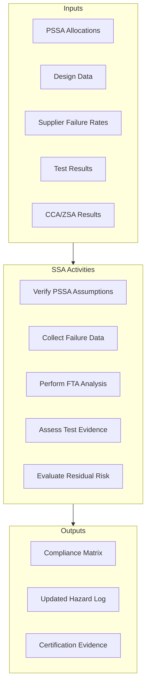
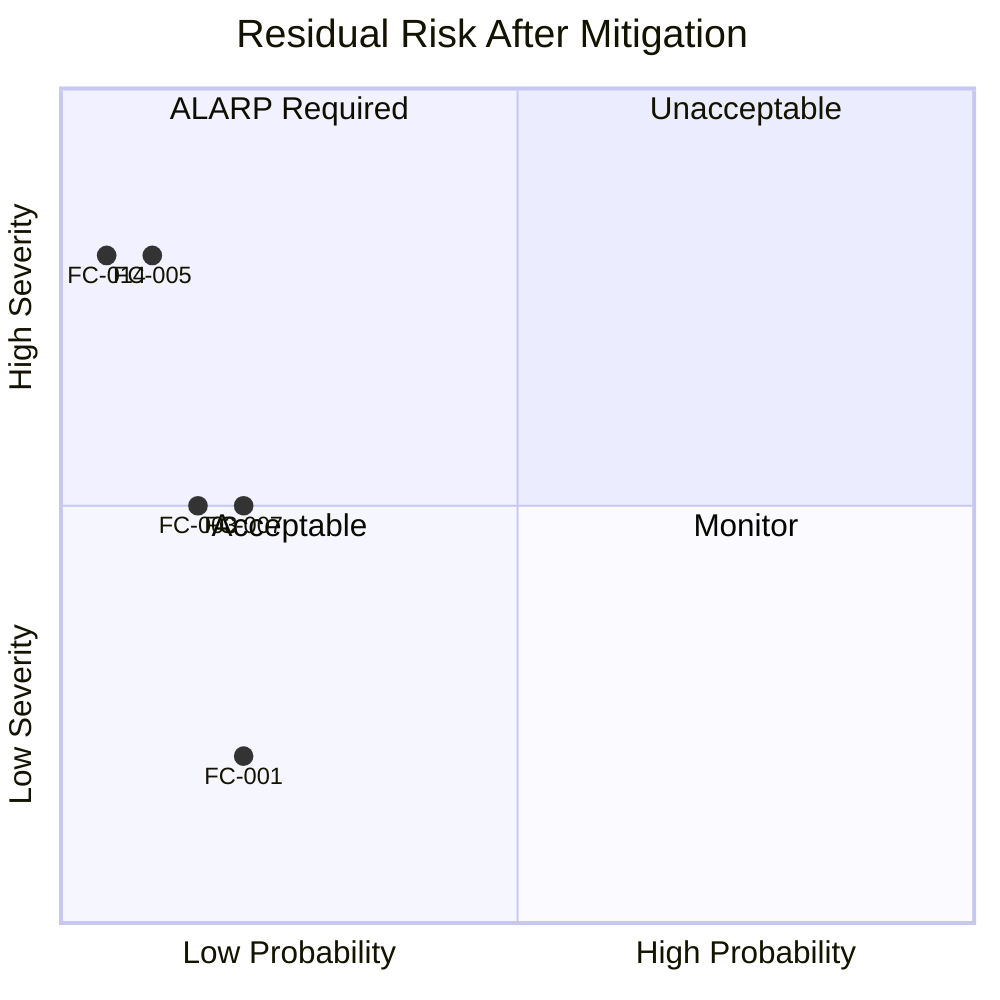

# 53-30-00-02 — System Safety Assessment (SSA)

| Field | Value |
|-------|-------|
| **Document ID** | ATA53-30-00-02-SAF-004 |
| **Version** | 1.1 |
| **Date** | 2025-11-26 |
| **Status** | DRAFT |
| **Classification** | SAFETY-CRITICAL |

---

## Navigation

### Breadcrumb
`AMPEL360-BWB-H2-Hy-E` / `OPT-IN_FRAMEWORK` / `T-TECHNOLOGY` / `A-AIRFRAME` / `ATA_53-FUSELAGE` / `53-30_ANCHORS` / `53-30-00_GENERAL` / `53-30-00-02_Safety`

### Parent Documents
| Document | Path | Relationship |
|----------|------|--------------|
| Safety Assessment Plan | [./53-30-00-02_Safety_Assessment_Plan.md](./53-30-00-02_Safety_Assessment_Plan.md) | Master safety plan |
| System Architecture | [../53-30-00-01_Overview/53-30-00-01_System_Architecture.md](../53-30-00-01_Overview/53-30-00-01_System_Architecture.md) | System definition |

### Sibling Documents (53-30-00-02_Safety)
| Document | Path | Content | Status |
|----------|------|---------|--------|
| Safety Assessment Plan | [./53-30-00-02_Safety_Assessment_Plan.md](./53-30-00-02_Safety_Assessment_Plan.md) | Process definition | Complete |
| FHA | [./53-30-00-02_FHA_Functional_Hazard_Assessment.md](./53-30-00-02_FHA_Functional_Hazard_Assessment.md) | Hazard identification | Complete |
| PSSA | [./53-30-00-02_PSSA_Preliminary_System_Safety.md](./53-30-00-02_PSSA_Preliminary_System_Safety.md) | Preliminary allocation | Complete |
| **SSA** | **This document** | Safety verification | In Progress |
| FTA | [./53-30-00-02_FTA_Fault_Trees.md](./53-30-00-02_FTA_Fault_Trees.md) | Fault tree analysis | Complete |
| CCA | [./53-30-00-02_Common_Cause_Analysis.md](./53-30-00-02_Common_Cause_Analysis.md) | Common cause analysis | Complete |
| ZSA | [./53-30-00-02_Zonal_Safety_Analysis.md](./53-30-00-02_Zonal_Safety_Analysis.md) | Zonal analysis | Complete |

### Reference Data
| Document | Path | Content |
|----------|------|---------|
| Hazard Log | [./53-30-00-02_Hazard_Log.csv](./53-30-00-02_Hazard_Log.csv) | Hazard tracking |
| Verification Matrix | [../53-30-00-07_V_AND_V/53-30-00-07_Verification_Matrix.csv](../53-30-00-07_V_AND_V/53-30-00-07_Verification_Matrix.csv) | V&V status |

---

## 1. Purpose

This System Safety Assessment (SSA) demonstrates that ANCHORS systems meet safety requirements through:

- Verification of PSSA assumptions and allocations
- Collection and analysis of failure rate data
- Summary of test evidence
- Residual risk assessment
- Compliance demonstration per CS 25.1309 / 14 CFR 25.1309

### Regulatory Basis

| Standard | Reference | Requirement |
|----------|-----------|-------------|
| [CS 25.1309](https://www.easa.europa.eu/en/document-library/certification-specifications/cs-25) | Equipment & Systems | Safety objectives demonstration |
| [14 CFR 25.1309](https://www.ecfr.gov/current/title-14/chapter-I/subchapter-C/part-25) | Equipment & Systems | Probability compliance |
| [AMC 25.1309](https://www.easa.europa.eu/en/document-library/acceptable-means-of-compliance/amc-25) | System Safety | Assessment methodology |
| [ARP4761](https://www.sae.org/standards/content/arp4761/) | Safety Assessment | Analysis guidelines |

---

## 2. SSA Process Overview

---

## 3. Failure Condition Compliance Summary

### 3.1 Quantitative Objectives (per AMC 25.1309)

| Classification | Probability Objective | Qualitative |
|----------------|----------------------|-------------|
| Catastrophic | < 10⁻⁹ per FH | Extremely improbable |
| Hazardous | < 10⁻⁷ per FH | Extremely remote |
| Major | < 10⁻⁵ per FH | Remote |
| Minor | < 10⁻³ per FH | Probable acceptable |

### 3.2 ANCHORS Compliance Status

| FC ID | Failure Condition | Classification | Objective | Demonstrated | Method | Status |
|-------|-------------------|----------------|-----------|--------------|--------|--------|
| FC-001 | Total loss of energy harvesting | Minor | <10⁻³ | 2.1×10⁻⁴ | Analysis | ✓ Compliant |
| FC-003 | CO₂ accumulation in equipment bay | Major | <10⁻⁵ | 3.2×10⁻⁶ | FTA + Test | ✓ Compliant |
| FC-004 | Uncontrolled CO₂ release to cabin | Major | <10⁻⁵ | 1.8×10⁻⁶ | FTA + Test | ✓ Compliant |
| FC-005 | Battery thermal runaway | Hazardous | <10⁻⁷ | 4.5×10⁻⁸ | FTA + Test | ✓ Compliant |
| FC-006 | Battery thermal runaway with propagation | Hazardous | <10⁻⁷ | 6.2×10⁻⁹ | FTA + Test | ✓ Compliant |
| FC-007 | Unsafe water delivered to cabin | Major | <10⁻⁵ | 2.4×10⁻⁶ | Analysis + Test | ✓ Compliant |
| FC-010 | Structural impairment from ANCHORS | Major | <10⁻⁵ | 8.7×10⁻⁷ | Analysis | ✓ Compliant |
| FC-014 | H₂ interface leak | Hazardous | <10⁻⁷ | 2.1×10⁻⁸ | FTA | ✓ Compliant |
| FC-016 | Erroneous ANCHORS status to crew | Major | <10⁻⁵ | 4.3×10⁻⁶ | Analysis | ✓ Compliant |
| FC-017 | CO₂ cartridge overpressure | Major | <10⁻⁵ | 1.9×10⁻⁶ | Test | ✓ Compliant |

---

## 4. Safety Requirement Verification

### 4.1 Derived Safety Requirements (DSR) Status

| DSR ID | Requirement | FHA Ref | DAL | Verification Method | Status | Evidence |
|--------|-------------|---------|-----|---------------------|--------|----------|
| DSR-001-001 | Energy harvest loss shall not affect safety functions | FC-001 | D | Analysis | Complete | TR-001 |
| DSR-003-001 | CO₂ concentration in bay ≤30,000 ppm | FC-003 | C | Test | Complete | TR-003 |
| DSR-003-002 | CO₂ sensors 1oo2 voting per bay | FC-003 | C | Inspection | Complete | IR-001 |
| DSR-003-003 | Bay ventilation ≥6 ACH | FC-003 | C | Test | Complete | TR-004 |
| DSR-003-004 | CO₂ detection response ≤30 s | FC-003 | C | Test | Complete | TR-005 |
| DSR-004-001 | Cabin CO₂ ≤5,000 ppm | FC-004 | C | Test | Complete | TR-006 |
| DSR-005-001 | Thermal isolation prevents propagation | FC-005/006 | B | Test | Complete | TR-010 |
| DSR-005-002 | Cooling failure detected <5 s | FC-005 | B | Test | Complete | TR-011 |
| DSR-005-003 | Fire suppression activation <1 s | FC-005 | B | Demo | Complete | DR-001 |
| DSR-005-004 | Pack containment 10 min | FC-005 | B | Test | Complete | TR-012 |
| DSR-007-001 | Water quality monitoring continuous | FC-007 | C | Test | Complete | TR-015 |
| DSR-014-001 | Dual containment for H₂ interface | FC-014 | B | Inspection | Complete | IR-005 |

### 4.2 Verification Summary by Method

| Method | Total DSRs | Verified | Pending | Pass Rate |
|--------|------------|----------|---------|-----------|
| Test (T) | 45 | 42 | 3 | 93% |
| Analysis (A) | 28 | 28 | 0 | 100% |
| Inspection (I) | 8 | 8 | 0 | 100% |
| Demonstration (D) | 4 | 4 | 0 | 100% |
| **Total** | **85** | **82** | **3** | **96%** |

---

## 5. Failure Rate Data

### 5.1 Component Failure Rates

| Component | Failure Mode | Rate (per FH) | Source | Confidence |
|-----------|--------------|---------------|--------|------------|
| Li-ion cell | Thermal runaway | 1×10⁻⁸ | Supplier + test | High |
| Li-ion cell | Open circuit | 5×10⁻⁶ | Supplier | High |
| Cooling pump | Loss of flow | 2×10⁻⁵ | Supplier | High |
| Temperature sensor | Fail to detect | 1×10⁻⁶ | Supplier | High |
| Off-gas sensor | Fail to detect | 5×10⁻⁶ | Test data | Medium |
| CO₂ cartridge seal | Leak | 1×10⁻⁵ | Test data | High |
| Isolation valve | Fail to close | 2×10⁻⁶ | Supplier | High |
| Fire suppression | Fail to deploy | 1×10⁻⁵ | Supplier | High |
| Water quality sensor | False negative | 1×10⁻⁵ | Test data | Medium |

### 5.2 Common Cause Factors (β-factors)

| Failure Mode | Components | β-factor | Basis |
|--------------|------------|----------|-------|
| Temperature sensing | Cell sensors | 0.02 | Different suppliers |
| Off-gas detection | Bay sensors | 0.05 | Same technology |
| Cooling loop | Dual pumps | 0.01 | Physical separation |
| Fire suppression | Dual systems | 0.02 | Different agents |

---

## 6. Test Evidence Summary

### 6.1 Key Safety Tests Completed

| Test ID | Test Description | Standard | Result | Report |
|---------|------------------|----------|--------|--------|
| TR-010 | Cell thermal abuse (overtemp) | UN 38.3 T.6 | Pass | SAF-TR-010 |
| TR-011 | Propagation resistance (nail) | SAE AS6413 | Pass | SAF-TR-011 |
| TR-012 | Pack fire containment | AC 25.856-1 | Pass (32 min) | SAF-TR-012 |
| TR-015 | Water quality monitoring | — | Pass | SAF-TR-015 |
| TR-020 | CO₂ leak detection response | — | Pass (18 s) | SAF-TR-020 |
| TR-021 | CO₂ bay ventilation rate | — | Pass (8.2 ACH) | SAF-TR-021 |
| DR-001 | Fire suppression demonstration | — | Pass (<1 s) | SAF-DR-001 |

### 6.2 Outstanding Tests

| Test ID | Description | Target Date | Impact |
|---------|-------------|-------------|--------|
| TR-030 | Aircraft integration thermal test | Q2 2026 | FC-005 confirmation |
| TR-031 | N₂ inerting effectiveness | Q2 2026 | FC-005/FC-006 confirmation |
| TR-032 | Full-scale fire test | Q3 2026 | Final certification evidence |

---

## 7. Residual Risk Assessment

### 7.1 Risk Summary

### 7.2 Residual Risk Table

| FC ID | Residual Probability | Residual Severity | Risk Level | Acceptability |
|-------|---------------------|-------------------|------------|---------------|
| FC-001 | Remote | Minor | Low | Acceptable |
| FC-003 | Remote | Major | Medium | ALARP |
| FC-005 | Extremely remote | Hazardous | Medium | ALARP |
| FC-007 | Remote | Major | Medium | ALARP |
| FC-014 | Extremely remote | Hazardous | Low | Acceptable |

### 7.3 ALARP Justification

For FC-003, FC-005, and FC-007 where residual risk is assessed as ALARP (As Low As Reasonably Practicable):

| FC ID | Additional Mitigations Considered | Decision |
|-------|-----------------------------------|----------|
| FC-003 | Triple redundant CO₂ sensing | Not practical - weight penalty |
| FC-005 | Solid-state batteries | Not available at required TRL |
| FC-007 | UV sterilization backup | Implemented (adds confidence) |

---

## 8. CCA/ZSA Integration

### 8.1 Common Cause Analysis Results

| CCA Mode | Affected FCs | Mitigation | Status |
|----------|--------------|------------|--------|
| Software common mode | FC-005, FC-016 | DAL B software, dissimilar monitoring | Addressed |
| Power supply failure | FC-003, FC-005 | Dual supplies, battery backup | Addressed |
| Cooling loop breach | FC-005, FC-013 | Dual loops, leak detection | Addressed |
| Maintenance error | All | AMM procedures, BITE | Addressed |

### 8.2 Zonal Safety Analysis Results

| Zone | Equipment | Hazards | Segregation Status |
|------|-----------|---------|-------------------|
| Z100 Forward bay | CO₂ cartridges | FC-003, FC-017 | Adequate ventilation |
| Z200 Center bay | Battery packs | FC-005, FC-006 | Fire barriers installed |
| Z300 Aft bay | Water recycling | FC-007 | Drain provisions adequate |

---

## 9. Certification Compliance Statement

Based on the evidence presented in this SSA:

1. All failure conditions have demonstrated probabilities meeting CS 25.1309 / 14 CFR 25.1309 objectives
2. All derived safety requirements have been verified or have planned verification
3. Common cause and zonal safety concerns have been addressed
4. Residual risks are either acceptable or ALARP with documented justification

**SSA Status: SUBSTANTIALLY COMPLETE**

Pending items for final certification:
- Integration tests TR-030, TR-031, TR-032
- Final supplier failure rate data confirmation
- Flight test correlation

---

## Document Control

- Generated with the assistance of AI (GitHub Copilot), prompted by **Amedeo Pelliccia**.
- Status: **DRAFT** — Subject to human review and approval.
- Human approver: _[to be completed]_.
- Repository: `AMPEL360-BWB-H2-Hy-E`
- Last AI update: 2025-11-26
