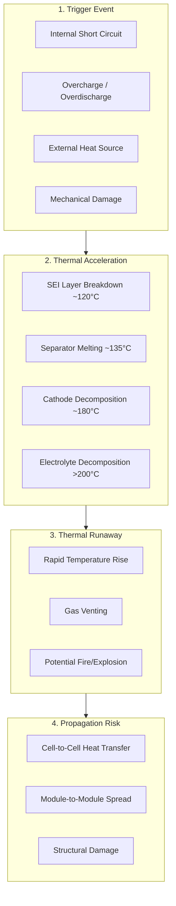
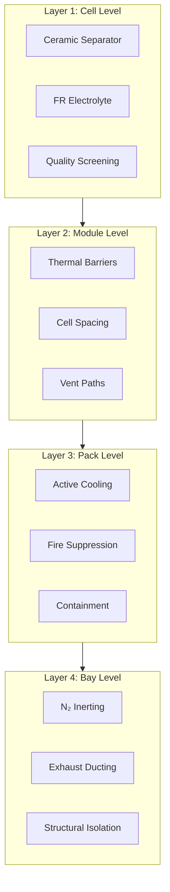
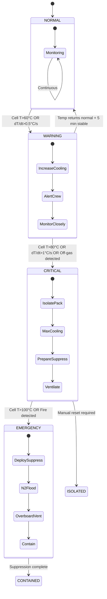

# 53-30-00-02 — Thermal Runaway Mitigation

| Field | Value |
|-------|-------|
| **Document ID** | ATA53-30-00-02-SAF-009 |
| **Version** | 1.1 |
| **Date** | 2025-11-26 |
| **Status** | DRAFT |
| **Classification** | SAFETY-CRITICAL |

---

## Navigation

### Breadcrumb
`AMPEL360-BWB-H2-Hy-E` / `OPT-IN_FRAMEWORK` / `T-TECHNOLOGY` / `A-AIRFRAME` / `ATA_53-FUSELAGE` / `53-30_ANCHORS` / `53-30-00_GENERAL` / `53-30-00-02_Safety`

### Parent Documents
| Document | Path | Relationship |
|----------|------|--------------|
| ANCHORS Safety Assessment Plan | [./53-30-00-02_Safety_Assessment_Plan.md](./53-30-00-02_Safety_Assessment_Plan.md) | Parent safety plan |
| ANCHORS FHA | [./53-30-00-02_FHA_Functional_Hazard_Assessment.md](./53-30-00-02_FHA_Functional_Hazard_Assessment.md) | Hazard identification |
| System Architecture | [../53-30-00-01_Overview/53-30-00-01_System_Architecture.md](../53-30-00-01_Overview/53-30-00-01_System_Architecture.md) | System context |

### Sibling Documents (53-30-00-02_Safety)
| Document | Path | Content |
|----------|------|---------|
| Safety Assessment Plan | [./53-30-00-02_Safety_Assessment_Plan.md](./53-30-00-02_Safety_Assessment_Plan.md) | Safety process |
| FHA | [./53-30-00-02_FHA_Functional_Hazard_Assessment.md](./53-30-00-02_FHA_Functional_Hazard_Assessment.md) | Hazard assessment |
| PSSA | [./53-30-00-02_PSSA_Preliminary_System_Safety.md](./53-30-00-02_PSSA_Preliminary_System_Safety.md) | Preliminary allocation |
| SSA | [./53-30-00-02_SSA_System_Safety_Assessment.md](./53-30-00-02_SSA_System_Safety_Assessment.md) | Safety verification |
| H₂/CO₂ Safety | [./53-30-00-02_H2_CO2_Safety_Provisions.md](./53-30-00-02_H2_CO2_Safety_Provisions.md) | Gas safety |
| **Thermal Runaway** | **This document** | Battery fire safety |
| CCA | [./53-30-00-02_Common_Cause_Analysis.md](./53-30-00-02_Common_Cause_Analysis.md) | Common cause analysis |
| ZSA | [./53-30-00-02_Zonal_Safety_Analysis.md](./53-30-00-02_Zonal_Safety_Analysis.md) | Zonal analysis |

---

## 1. Purpose

This document establishes thermal runaway **prevention**, **detection**, **containment**, and **mitigation** strategies for lithium-ion battery systems within ANCHORS Battery Loops (53-30-40).

### Regulatory Basis

| Standard | Reference | Requirement |
|----------|-----------|-------------|
| [CS 25.1353(c)](https://www.easa.europa.eu/en/document-library/certification-specifications/cs-25) | Storage batteries | Thermal runaway containment |
| [14 CFR 25.1353(c)](https://www.ecfr.gov/current/title-14/chapter-I/subchapter-C/part-25) | Storage batteries | No propagation requirement |
| [RTCA DO-311A](https://www.rtca.org/) | Rechargeable batteries | Minimum performance standard |
| [SAE AS6413](https://www.sae.org/standards/) | Battery safety | Design guidelines |

---

## 2. Thermal Runaway Overview

### 2.1 Mechanism

### 2.2 Temperature Profile

| Stage | Temperature | Phenomenon | Time to Next |
|-------|-------------|------------|--------------|
| Onset | 80-100°C | Early warning signs | Minutes |
| SEI breakdown | 120-130°C | Self-heating begins | 10-60 s |
| Separator failure | 135-150°C | Internal short circuit | 5-30 s |
| Thermal runaway | >180°C | Uncontrolled reaction | Seconds |
| Peak | 600-1000°C | Maximum temperature | N/A |

---

## 3. Multi-Layer Protection Architecture

### 3.1 Cell Level Prevention

| Strategy | Implementation | DSR Reference |
|----------|----------------|---------------|
| Separator shutdown | Ceramic-coated (Al₂O₃) separator | DSR-005-001 |
| Electrolyte stability | Flame-retardant additives (phosphate) | DSR-005-002 |
| Electrode design | Thermal stability optimized cathode | DSR-005-003 |
| Quality control | 100% cell inspection + OCV screening | DSR-005-004 |

### 3.2 Module Level Containment

| Strategy | Implementation | Specification |
|----------|----------------|---------------|
| Cell spacing | ≥5 mm air gap between cells | Thermal isolation |
| Thermal barriers | Intumescent material (≥4 mm) | >800°C rating |
| Venting provision | Directed gas release path | Away from personnel |
| Temperature monitoring | 1 sensor per 4 cells | NTC thermistor |

### 3.3 Pack Level Protection

| Strategy | Implementation | Response Time |
|----------|----------------|---------------|
| Thermal management | Dual-loop liquid cooling | <5 s ramp-up |
| Fire suppression | Integrated aerosol system | <1 s activation |
| Isolation | Fireproof enclosure | 30 min integrity |
| Ventilation | Controlled gas exhaust to overboard | Continuous |

### 3.4 Bay Level Integration

| Strategy | Implementation | Interface |
|----------|----------------|-----------|
| N₂ inerting | OBIGGS supply on thermal event | ICD 47-00 |
| Exhaust ducting | Dedicated overboard vent | ATA 53-50 structure |
| Structural isolation | Thermal barrier to fuselage | ATA 53-50 structure |

---

## 4. Detection Architecture

```mermaid
flowchart LR
    subgraph SENSORS["Detection Sensors"]
        S1[Cell Temperature]
        S2[Rate of Rise]
        S3[Off-Gas VOC]
        S4[Smoke Detector]
        S5[Bay Temperature]
    end
    
    subgraph BMS["Battery Management"]
        BMS1[Cell Monitoring]
        BMS2[Fault Detection]
        BMS3[State Estimation]
    end
    
    subgraph LOGIC["Control Logic"]
        L1[Warning Level]
        L2[Critical Level]
        L3[Emergency Level]
    end
    
    subgraph ACTION["Response"]
        A1[Cooling Increase]
        A2[Pack Isolation]
        A3[Suppression Deploy]
        A4[Crew Alert]
    end
    
    SENSORS --> BMS --> LOGIC --> ACTION
```

### 4.1 Detection Thresholds

| Parameter | Warning | Critical | Emergency | Response Time |
|-----------|---------|----------|-----------|---------------|
| Cell temperature | >60°C | >80°C | >100°C | ≤1 s |
| Temperature rise rate | >0.5°C/s | >1°C/s | >2°C/s | ≤2 s |
| Off-gas (VOC) | 10 ppm | 50 ppm | 100 ppm | ≤5 s |
| Smoke (obscuration) | 1%/m | 3%/m | 5%/m | ≤10 s |
| Bay temperature | >50°C | >70°C | >90°C | ≤5 s |

### 4.2 Sensor Redundancy

| Parameter | Architecture | Voting Logic |
|-----------|--------------|--------------|
| Cell temperature | 1 per 4 cells | 1oo2 (grouped) |
| Off-gas detection | 2 per bay | 1oo2 |
| Smoke detection | 2 per bay | 1oo2 |
| Bay temperature | 3 per bay | 2oo3 |

---

## 5. Response State Machine

### 5.1 Automatic Actions

| State | Trigger | Action | Time |
|-------|---------|--------|------|
| WARNING | T>60°C | Increase cooling rate 50% | <1 s |
| WARNING | dT/dt>0.5°C/s | Alert crew via EICAS | <2 s |
| CRITICAL | T>80°C | Isolate pack from bus | <1 s |
| CRITICAL | Off-gas | Activate bay ventilation | <3 s |
| EMERGENCY | T>100°C | Deploy aerosol suppression | <1 s |
| EMERGENCY | Fire detected | Command N₂ flood from OBIGGS | <5 s |

### 5.2 Flight Crew Procedures

| Alert Level | EICAS Message | Crew Action |
|-------------|---------------|-------------|
| Caution | `BATT TEMP HI` | Monitor, consider load reduction |
| Warning | `BATT THERMAL EVENT` | Isolate affected pack |
| Emergency | `BATT FIRE` | Execute QRH procedure, divert |

---

## 6. Propagation Resistance Requirements

### 6.1 Design Targets (per CS 25.1353(c))

| Level | Requirement | Target | Verification |
|-------|-------------|--------|--------------|
| Cell | Single cell runaway | No adjacent cell ignition for ≥5 min | Abuse test |
| Module | Module containment | No propagation to adjacent module | Propagation test |
| Pack | External fire protection | No external fire for ≥10 min | Fire test |
| Structure | Airframe protection | No structural damage | Integration test |

### 6.2 Thermal Barrier Specifications

| Location | Material | Thickness | Rating |
|----------|----------|-----------|--------|
| Cell-to-cell | Mica + intumescent | 2 mm | 800°C / 5 min |
| Module-to-module | Ceramic fiber | 5 mm | 1000°C / 10 min |
| Pack enclosure | Stainless steel + insulation | 3 mm steel + 10 mm | 1000°C / 30 min |
| Bay-to-structure | Fire barrier panel | 25 mm | Per AC 25.856-1 |

---

## 7. FHA Traceability

| Hazard ID | Description | Severity | Mitigation | This Document Section |
|-----------|-------------|----------|------------|----------------------|
| H-005 | Battery thermal runaway | Hazardous | Prevention + Detection + Suppression | §3, §4, §5 |
| H-006 | Thermal runaway propagation | Hazardous | Thermal barriers + Containment | §6 |
| H-011 | Thermal damage to structure | Major | Structural isolation + Barriers | §3.4, §6.2 |
| H-013 | Coolant leak in battery bay | Major | Leak detection + Isolation | §4 |

---

## 8. Verification Requirements

| Requirement | Test Type | Standard | Acceptance Criteria |
|-------------|-----------|----------|---------------------|
| Cell thermal abuse | Overtemperature test | UN 38.3 T.6 | No fire, no explosion |
| Propagation resistance | Nail penetration | SAE AS6413 | No propagation to 2nd cell |
| Pack fire containment | External fire test | AC 25.856-1 | 30 min integrity |
| Suppression effectiveness | Fire suppression test | DO-311A | Fire extinguished <30 s |
| N₂ inerting | O₂ depletion test | — | O₂ <8% in <60 s |

---

## Document Control

- Generated with the assistance of AI (GitHub Copilot), prompted by **Amedeo Pelliccia**.
- Status: **DRAFT** — Subject to human review and approval.
- Human approver: _[to be completed]_.
- Repository: `AMPEL360-BWB-H2-Hy-E`
- Last AI update: 2025-11-26
