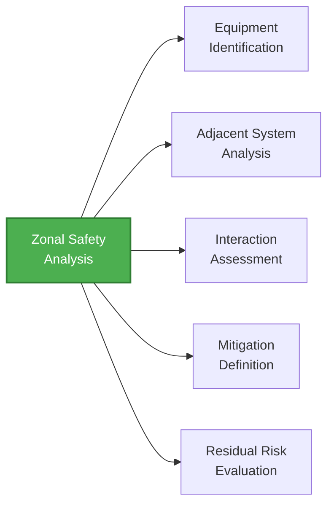

# 53-30-00-02 — Zonal Safety Analysis (ZSA)

**Document ID:** 53-30-00-02-007  
**ATA Chapter:** 53 – Fuselage  
**Subsystem Band:** 53-30_ANCHORS — Aircraft Networks, Circular, Harvesting, Operating & Renewable Systems  
**Version:** 1.1  
**Date:** 2025-11-25  
**Status:** DRAFT  

---

## 1. Purpose

This document presents the **Zonal Safety Analysis (ZSA)** for ANCHOR'S systems, examining installation safety within aircraft zones in accordance with:

- **SAE ARP4761** — *Guidelines and Methods for Conducting the Safety Assessment Process*  
  https://www.sae.org/standards/content/arp4761/
- **EASA CS-25.1309** — *Equipment, systems, and installations*
- **CS 25.863** — *Flammable fluid fire protection*
- **CS 25.869** — *Fire protection: other components*
- **CS 25.1713** — *Fire extinguishing systems*  
  https://www.easa.europa.eu/en/document-library/certification-specifications/cs-25

---

## 2. Cross-Referenced Internal Documentation

- [53-30-00-02_Common_Cause_Analysis.md](./53-30-00-02_Common_Cause_Analysis.md)
- [53-30-00-02_FHA_Functional_Hazard_Assessment.md](./53-30-00-02_FHA_Functional_Hazard_Assessment.md)
- [53-30-00-02_PSSA_Preliminary_System_Safety.md](./53-30-00-02_PSSA_Preliminary_System_Safety.md)
- [53-30-00-05_ICD_Master.md](../53-30-00-05_Interfaces/53-30-00-05_ICD_Master.md)

---

## 3. ZSA Methodology

The ZSA examines each aircraft zone where ANCHOR'S equipment is installed, assessing:

### 3.1 Zone Definition per ATA 100

| Zone ID | Zone Name | Fuselage Station Range | Description |
|---------|-----------|------------------------|-------------|
| 100 | Forward Fuselage | FS 0 – FS 400 | Cockpit, forward cargo, avionics |
| 200 | Center Fuselage | FS 400 – FS 1200 | Passenger cabin, cargo holds, wing box |
| 300 | Aft Fuselage | FS 1200 – FS 1600 | Aft cabin, APU bay, empennage attachment |
| 400 | Wings | N/A | Wing structure, fuel, systems |
| 500 | Empennage | N/A | Tail surfaces, control systems |

---

## 4. ANCHORS Equipment Zonal Distribution

### 4.1 Equipment Location Summary

| Zone ID | Zone Description | ANCHORS Equipment | Equipment IDs |
|---------|------------------|-------------------|---------------|
| 100 | Forward fuselage | CO₂ cartridge bay, water treatment, condensate manifold | LRU-53-30-001 to -005 |
| 200 | Center fuselage | Battery swap bay, thermal loops, main controller | LRU-53-30-010 to -025 |
| 300 | Aft fuselage | Energy harvesters, waste heat recovery, secondary controller | LRU-53-30-030 to -040 |
| 400 | Wings | Interface connections only | N/A |

### 4.2 Zonal Layout Diagram

```mermaid
flowchart LR
    subgraph Zone100["Zone 100 - Forward"]
        CO2["CO₂ Cartridge Bay"]
        WATER["Water Treatment"]
        COND["Condensate Manifold"]
    end
    
    subgraph Zone200["Zone 200 - Center"]
        BATT["Battery Swap Bay"]
        THERM["Thermal Loops"]
        CTRL["Main Controller"]
    end
    
    subgraph Zone300["Zone 300 - Aft"]
        HARV["Energy Harvesters"]
        HEAT["Waste Heat Recovery"]
        CTRL2["Secondary Controller"]
    end
    
    Zone100 --> Zone200
    Zone200 --> Zone300
    
    style Zone100 fill:#e3f2fd,stroke:#1976d2
    style Zone200 fill:#fff3e0,stroke:#f57c00
    style Zone300 fill:#e8f5e9,stroke:#388e3c
```

---

## 5. Zone 100 — Forward Fuselage

### 5.1 Equipment Installed

| Equipment ID | Equipment Description | Location | Weight (kg) |
|--------------|----------------------|----------|-------------|
| LRU-53-30-001 | CO₂ solidification cartridge bay (2 units) | Lower forward cargo | 45 |
| LRU-53-30-002 | Water recycling treatment module | Forward equipment bay | 25 |
| LRU-53-30-003 | Condensate collection manifold | Below floor | 8 |
| LRU-53-30-004 | CO₂ concentration sensor (bay) | Forward equipment bay | 0.5 |
| LRU-53-30-005 | Water quality sensor assembly | Forward equipment bay | 1.2 |

### 5.2 Adjacent Systems

| Adjacent System | ATA Chapter | Proximity | Interface Type |
|-----------------|-------------|-----------|----------------|
| Avionics bays | ATA 31 | < 1 m | Thermal, electrical |
| ECS ducting | ATA 21 | Direct | Thermal, fluid |
| Forward cargo | ATA 52 | Adjacent | Structural |
| Electrical panels | ATA 24 | < 2 m | Electrical |

### 5.3 Safety Consideration Matrix

| Consideration | Hazard Source | Risk Level | Assessment Basis |
|---------------|---------------|------------|------------------|
| Fire hazard | None identified | Low | No ignition sources; low energy density |
| Toxic fumes | CO₂ leak | Medium | FC-003 in FHA |
| Fluid leakage | Water system | Medium | FC-007 in FHA |
| Structural load | Equipment mass | Low | Lightweight components |
| Electromagnetic | None identified | Low | Passive/analog equipment |
| Temperature | Condensate freezing | Low | Heated manifold |

### 5.4 Mitigation Measures

| Hazard | Mitigation | Implementation | Verification |
|--------|------------|----------------|--------------|
| CO₂ concentration | Continuous monitoring | LRU-53-30-004 | Test |
| CO₂ accumulation | Ventilation to exterior | Vent path per ICD | Analysis + Test |
| Water leak | Drip trays and drain provisions | Installation design | Inspection |
| Thermal interaction | Insulation from avionics | Thermal barrier | Analysis |
| Cartridge overpressure | Pressure relief valve | Cartridge design | Test |

### 5.5 Zone 100 Installation Requirements

| Requirement ID | Requirement | Traces to |
|----------------|-------------|-----------|
| ZSA-100-001 | CO₂ sensors shall detect concentrations ≥ 1% | FC-003 |
| ZSA-100-002 | Bay ventilation shall prevent CO₂ > 3% | DSR-003-002 |
| ZSA-100-003 | Water system shall include containment provisions | FC-007 |
| ZSA-100-004 | Thermal isolation shall maintain < 40°C at avionics interface | ICD-ATA31 |

---

## 6. Zone 200 — Center Fuselage (Critical Zone)

### 6.1 Equipment Installed

| Equipment ID | Equipment Description | Location | Weight (kg) |
|--------------|----------------------|----------|-------------|
| LRU-53-30-010 | Battery quick-swap bay assembly | Floor level, center | 120 |
| LRU-53-30-011 | Battery module (per unit) | Quick-swap bay | 85 |
| LRU-53-30-012 | Thermal regeneration loop pump unit | Below floor | 15 |
| LRU-53-30-013 | Thermal loop heat exchanger | Below floor | 22 |
| LRU-53-30-014 | Main ANCHORS controller | Equipment rack | 8 |
| LRU-53-30-015 | Coolant reservoir | Below floor | 12 |
| LRU-53-30-016 | Battery temperature sensor array | In battery bay | 0.8 |
| LRU-53-30-017 | Fire detection sensor | In battery bay | 0.3 |
| LRU-53-30-018 | Suppression agent discharge | In battery bay | 5 |

### 6.2 Adjacent Systems

| Adjacent System | ATA Chapter | Proximity | Interface Type |
|-----------------|-------------|-----------|----------------|
| Floor structure | ATA 53 | Direct | Structural, thermal |
| Cargo hold | ATA 52 | Adjacent | Fire barrier |
| Electrical bus | ATA 24 | < 1 m | Electrical |
| ECS ducting | ATA 21 | < 2 m | Thermal |
| Passenger cabin | ATA 25 | Above | Fire, smoke barrier |

### 6.3 Safety Consideration Matrix

| Consideration | Hazard Source | Risk Level | Assessment Basis |
|---------------|---------------|------------|------------------|
| Fire hazard | Battery thermal runaway | **High** | FC-005, FC-006 in FHA |
| Toxic fumes | Battery failure gases | **High** | FC-005 in FHA |
| Fluid leakage | Coolant system | Medium | FC-013 in FHA |
| Structural load | Battery mass | **High** | 85 kg per module |
| Electromagnetic | Controller EMI | Medium | Standard EMC |
| Temperature | Heat rejection | Medium | Thermal analysis |

### 6.4 Mitigation Measures

| Hazard | Mitigation | Implementation | Verification |
|--------|------------|----------------|--------------|
| Thermal runaway | Cell-level thermal isolation | Battery module design | Abuse testing |
| Propagation | Module containment | Fire-resistant enclosure | Propagation test |
| Fire | Fire suppression system | LRU-53-30-018 | Fire test |
| Smoke | Smoke detection | LRU-53-30-017 | Test |
| Fumes | Bay ventilation overboard | Dedicated vent path | Analysis + Test |
| Coolant leak | Leak detection + containment | Sensors + drip tray | Test |
| Structural load | Reinforced floor structure | Structural design | Analysis |
| Thermal load | Heat shields | Thermal barriers | Analysis |

### 6.5 Zone 200 Installation Requirements

| Requirement ID | Requirement | Traces to |
|----------------|-------------|-----------|
| ZSA-200-001 | Battery bay shall include fire detection per CS 25.858 | FC-005 |
| ZSA-200-002 | Fire suppression agent shall discharge within 5 seconds of detection | FC-005 |
| ZSA-200-003 | Fire barrier shall provide minimum 15-minute containment | FC-006 |
| ZSA-200-004 | Ventilation shall safely vent thermal runaway gases overboard | DSR-005-006 |
| ZSA-200-005 | Coolant leak shall be detected within 30 seconds | FC-013 |
| ZSA-200-006 | Floor structure shall support 2.5× design load with ANCHORS | FC-010 |
| ZSA-200-007 | Temperature at floor interface shall not exceed 60°C | FC-011 |

### 6.6 Fire Protection Integration (ATA 26 Coordination)

| Fire Protection Element | ANCHORS Requirement | ATA 26 Interface |
|------------------------|---------------------|------------------|
| Detection loops | Cover battery bay + controller | Integrated with Zone 200 loops |
| Suppression agent | Halon replacement (Li-compatible) | Dedicated bottle |
| Fire barriers | 15-minute rating minimum | Certified materials |
| Smoke venting | Overboard discharge | Coordinated path |

---

## 7. Zone 300 — Aft Fuselage

### 7.1 Equipment Installed

| Equipment ID | Equipment Description | Location | Weight (kg) |
|--------------|----------------------|----------|-------------|
| LRU-53-30-030 | Airflow energy harvester array | Aft equipment bay | 18 |
| LRU-53-30-031 | Waste heat recovery heat exchanger | Near APU | 25 |
| LRU-53-30-032 | Waste heat thermoelectric module | Near APU | 8 |
| LRU-53-30-033 | Secondary ANCHORS controller | Aft equipment rack | 6 |
| LRU-53-30-034 | Harvested power conditioning unit | Aft equipment rack | 12 |

### 7.2 Adjacent Systems

| Adjacent System | ATA Chapter | Proximity | Interface Type |
|-----------------|-------------|-----------|----------------|
| APU | ATA 49 | < 3 m | Thermal, vibration |
| Tail structure | ATA 55 | Adjacent | Structural |
| Aft cargo | ATA 52 | Adjacent | Fire barrier |
| Radio equipment | ATA 23 | < 2 m | EMI |
| Hydraulics | ATA 29 | < 2 m | Fluid |

### 7.3 Safety Consideration Matrix

| Consideration | Hazard Source | Risk Level | Assessment Basis |
|---------------|---------------|------------|------------------|
| Fire hazard | None identified | Low | No ignition sources |
| Vibration | APU/engine proximity | Medium | Fatigue analysis |
| Temperature | Engine heat | Medium | Thermal analysis |
| Electromagnetic | Radio proximity | Medium | EMC analysis |
| Fluid contamination | Hydraulic proximity | Low | Separation |

### 7.4 Mitigation Measures

| Hazard | Mitigation | Implementation | Verification |
|--------|------------|----------------|--------------|
| Vibration | Isolation mounting | Anti-vibration mounts | Vibration test |
| Temperature | Thermal shielding | Heat shields | Analysis |
| EMI | Shielding and filtering | EMI enclosure | EMC test |
| Fluid exposure | Separation and sealing | Installation design | Inspection |

### 7.5 Zone 300 Installation Requirements

| Requirement ID | Requirement | Traces to |
|----------------|-------------|-----------|
| ZSA-300-001 | Equipment shall withstand APU vibration spectrum | Environmental qualification |
| ZSA-300-002 | Thermal shielding shall limit equipment temperature < 55°C | Component limits |
| ZSA-300-003 | EMI emissions shall not exceed DO-160 Category M | EMC requirement |
| ZSA-300-004 | Equipment shall be protected from hydraulic fluid spray | Installation design |

---

## 8. Zone 400 — Wings (Interface Only)

### 8.1 ANCHORS Interface Points

| Interface ID | Interface Description | Wing Location | Type |
|--------------|----------------------|---------------|------|
| IF-53-30-401 | Electrical power feed from wing bus | Wing root | Electrical |
| IF-53-30-402 | Data bus connection | Wing root | Data |
| IF-53-30-403 | Thermal interface (if applicable) | Wing root | Thermal |

### 8.2 Safety Considerations

No ANCHORS equipment is installed in Zone 400. Only electrical and data interfaces cross the wing-fuselage boundary.

| Consideration | Assessment |
|---------------|------------|
| Fire propagation | Interfaces sealed per ATA 53 |
| Fuel proximity | No ANCHORS in fuel zones |
| Lightning protection | Bonding per aircraft standard |

---

## 9. Consolidated Installation Safety Matrix

| Zone | Highest Risk Level | Critical Hazards | Primary Mitigations |
|------|-------------------|------------------|---------------------|
| 100 | Medium | CO₂ accumulation, water leak | Monitoring, ventilation, containment |
| 200 | **High** | Battery thermal runaway, fire | Detection, suppression, barriers, venting |
| 300 | Medium | Vibration, temperature, EMI | Isolation, shielding |
| 400 | Low | Interface integrity | Sealing, bonding |

---

## 10. Zonal Drawing Requirements

The following installation drawings shall be developed:

| Drawing ID | Description | Zone | Status |
|------------|-------------|------|--------|
| ZSA-DWG-100-001 | Zone 100 ANCHORS equipment layout | 100 | TBD |
| ZSA-DWG-100-002 | Zone 100 CO₂ bay ventilation | 100 | TBD |
| ZSA-DWG-200-001 | Zone 200 battery bay layout | 200 | TBD |
| ZSA-DWG-200-002 | Zone 200 fire protection integration | 200 | TBD |
| ZSA-DWG-200-003 | Zone 200 thermal loop routing | 200 | TBD |
| ZSA-DWG-300-001 | Zone 300 harvesting equipment layout | 300 | TBD |

---

## 11. Open Actions

| Action ID | Description | Owner | Due Date | Status |
|-----------|-------------|-------|----------|--------|
| ZSA-ACT-001 | Complete Zone 200 fire barrier design | TBD | TBD | Open |
| ZSA-ACT-002 | Finalize Zone 100 ventilation path design | TBD | TBD | Open |
| ZSA-ACT-003 | Complete thermal analysis for Zone 300 | TBD | TBD | Open |
| ZSA-ACT-004 | Develop zonal installation drawings | TBD | TBD | Open |
| ZSA-ACT-005 | Coordinate with ATA 26 for Zone 200 suppression | TBD | TBD | Open |
| ZSA-ACT-006 | Complete structural load analysis for Zone 200 | TBD | TBD | Open |

---

## Document Control

- Generated with the assistance of AI (GitHub Copilot), prompted by **Amedeo Pelliccia**.
- Status: **DRAFT** — Subject to human review and approval.
- Human approver: _[to be completed]_.
- Repository: `AMPEL360-BWB-H2-Hy-E`
- Last AI update: 2025-11-25
