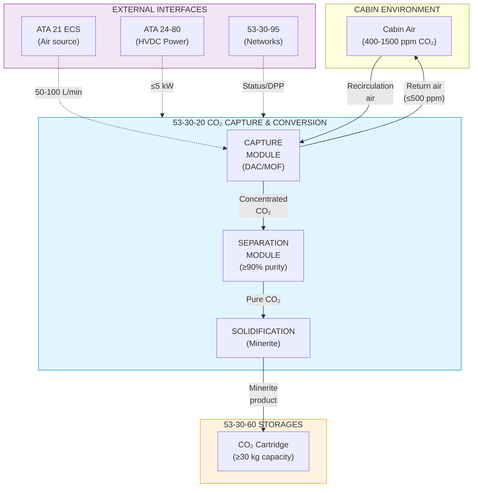
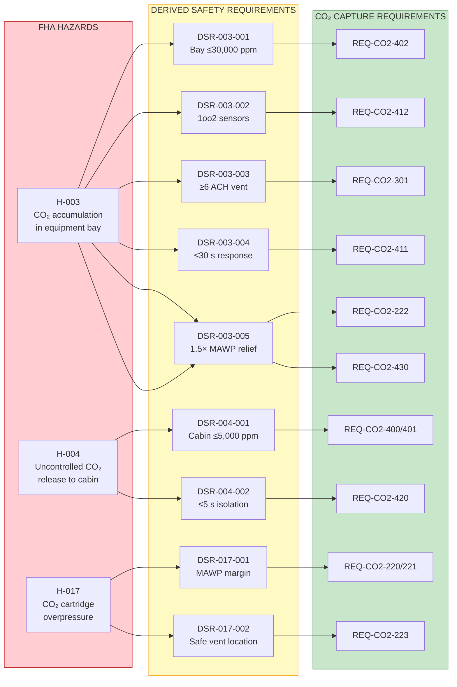

# 53-30-00-03 — CO₂ Capture Requirements

| Field | Value |
|-------|-------|
| **Document ID** | ATA53-30-00-03-REQ-004 |
| **Version** | 1.2 |
| **Date** | 2025-11-26 |
| **Status** | DRAFT |
| **Classification** | TECHNICAL |

---

## Navigation

### Breadcrumb
`AMPEL360-BWB-H2-Hy-E` / `OPT-IN_FRAMEWORK` / `T-TECHNOLOGY` / `A-AIRFRAME` / `ATA_53-FUSELAGE` / `53-30_ANCHORS` / `53-30-00_GENERAL` / `53-30-00-03_Requirements`

### Parent Documents
| Document | Path | Relationship |
|----------|------|--------------|
| ANCHORS System Requirements | [`./53-30-00-03_System_Requirements.md`](./53-30-00-03_System_Requirements.md) | Parent requirements |
| System Architecture | [`../53-30-00-01_Overview/53-30-00-01_System_Architecture.md`](../53-30-00-01_Overview/53-30-00-01_System_Architecture.md) | Architecture context |

### Sibling Documents (53-30-00-03_Requirements)
| Document | Path | Content |
|----------|------|---------|
| System Requirements | [`./53-30-00-03_System_Requirements.md`](./53-30-00-03_System_Requirements.md) | Top-level requirements |
| Harvesting Requirements | [`./53-30-00-03_Harvesting_Requirements.md`](./53-30-00-03_Harvesting_Requirements.md) | Band 10 |
| **CO₂ Capture Requirements** | **This document** | Band 20 |
| Water Recycling Requirements | [`./53-30-00-03_Water_Requirements.md`](./53-30-00-03_Water_Requirements.md) | Band 30 |
| Battery Loop Requirements | [`./53-30-00-03_Battery_Requirements.md`](./53-30-00-03_Battery_Requirements.md) | Band 40 |
| Circular Structure Requirements | [`./53-30-00-03_Circular_Structure_Requirements.md`](./53-30-00-03_Circular_Structure_Requirements.md) | Band 50 |

### Related Safety Documents
| Document | Path | Relationship |
|----------|------|--------------|
| Hazard Log | [`../53-30-00-02_Safety/ASSETS/DATA/53-30-00-02_Hazard_Log.csv`](../53-30-00-02_Safety/ASSETS/DATA/53-30-00-02_Hazard_Log.csv) | H-003, H-004, H-017 |
| DSR Register | [`../53-30-00-02_Safety/ASSETS/DATA/53-30-00-02_DSR_Register.csv`](../53-30-00-02_Safety/ASSETS/DATA/53-30-00-02_DSR_Register.csv) | DSR-003-xxx, DSR-004-xxx, DSR-017-xxx |
| H₂/CO₂ Safety Provisions | [`../53-30-00-02_Safety/53-30-00-02_H2_CO2_Safety_Provisions.md`](../53-30-00-02_Safety/53-30-00-02_H2_CO2_Safety_Provisions.md) | Safety mitigations |

### Related Interface Documents
| Document | Path | Relationship |
|----------|------|--------------|
| ICD 21-00 ECS | [`../53-30-00-05_Interfaces/53-30-00-05_ICD_21-00_ECS.md`](../53-30-00-05_Interfaces/53-30-00-05_ICD_21-00_ECS.md) | Air source interface |
| ICD 24-80 Electrical | [`../53-30-00-05_Interfaces/53-30-00-05_ICD_24-80_Electrical.md`](../53-30-00-05_Interfaces/53-30-00-05_ICD_24-80_Electrical.md) | Power interface (HVDC bus) |

---

## 1. Purpose

### 1.1 Scope

This document establishes requirements for CO₂ capture and conversion systems within ANCHORS (Band 20: 53-30-20). It covers:

- Capture performance requirements
- Separation and purification requirements
- Solidification (Minerite) requirements
- Storage and handling requirements
- Safety requirements (derived from FHA/PSSA)
- Interface requirements
- Environmental and operational requirements
- Verification requirements

Band 20 is allocated to **CO₂ capture and conversion** as per [ATA53-30-00-01-ADM-001 — ANCHORS Naming Convention & Directory Structure](../53-30_ANCHORS_Naming_Convention.md).

### 1.2 System Context

### 1.3 Applicable Standards

| Standard | Title | Application |
|----------|-------|-------------|
| CS 25.831 | Ventilation | Cabin CO₂ limits |
| CS 25.1309 | Equipment, Systems | Safety requirements |
| ASHRAE 62.1 | Ventilation for IAQ | Design guidance |
| ISO 16890 | Air Filters | Filtration requirements |

---

## 2. Capture Performance Requirements

### 2.1 Primary Capture Requirements

| Req ID | Requirement | Threshold | Target | Unit | Verification | Trace |
|--------|-------------|-----------|--------|------|--------------|-------|
| REQ-CO2-001 | CO₂ capture rate (cruise) | ≥ 50 | 75 | kg/flight | Test | SYS-001 |
| REQ-CO2-002 | Capture efficiency | ≥ 70 | 85 | % of cabin CO₂ | Test | SYS-001 |
| REQ-CO2-003 | Cabin CO₂ level (steady state) | ≤ 1500 | ≤ 1000 | ppm | Test | CS 25.831 |
| REQ-CO2-004 | System activation time | < 15 | < 10 | min | Test | OPS-001 |
| REQ-CO2-005 | Continuous operation duration | ≥ 12 | 16 | hours | Test | OPS-002 |

### 2.2 Operational Mode Requirements

| Req ID | Requirement | Description | Verification | Trace |
|--------|-------------|-------------|--------------|-------|
| REQ-CO2-010 | Ground mode | System operational on ground power | Test | OPS-003 |
| REQ-CO2-011 | Cruise mode | Full capture rate at FL350-FL410 | Test | OPS-004 |
| REQ-CO2-012 | Standby mode | < 100 W power consumption | Test | PWR-001 |
| REQ-CO2-013 | Degraded mode | ≥ 50% capture with single module failure | Analysis | SAF-001 |

### 2.3 Environmental Operating Requirements

| Req ID | Requirement | Range | Unit | Verification | Trace |
|--------|-------------|-------|------|--------------|-------|
| REQ-CO2-020 | Operating altitude | 0 – 43,000 | ft | Test | ENV-001 |
| REQ-CO2-021 | Cabin pressure range | 750 – 1013 | hPa | Test | ENV-002 |
| REQ-CO2-022 | Ambient temperature (bay) | -10 – +55 | °C | Test | ENV-003 |
| REQ-CO2-023 | Humidity tolerance | 10 – 95 | % RH | Test | ENV-004 |
| REQ-CO2-024 | Vibration | Per DO-160G Cat S | — | Test | ENV-005 |

---

## 3. Separation Requirements

### 3.1 Separation Module Performance

| Req ID | Requirement | Threshold | Target | Unit | Verification | Trace |
|--------|-------------|-----------|--------|------|--------------|-------|
| REQ-CO2-100 | CO₂ purity output | ≥ 90 | ≥ 95 | % | Test | SEP-001 |
| REQ-CO2-101 | Separation pressure | ≤ 2 | ≤ 1.5 | bar abs | Test | SEP-002 |
| REQ-CO2-102 | Energy consumption | ≤ 0.5 | ≤ 0.35 | kWh/kg CO₂ | Test | PWR-002 |
| REQ-CO2-103 | Sorbent lifetime | ≥ 5000 | ≥ 10000 | cycles | Test | MNT-001 |
| REQ-CO2-104 | Regeneration temperature | ≤ 120 | ≤ 100 | °C | Test | THM-001 |

### 3.2 Air Quality Requirements

| Req ID | Requirement | Threshold | Unit | Verification | Trace |
|--------|-------------|-----------|------|--------------|-------|
| REQ-CO2-110 | Return air CO₂ | ≤ 500 | ppm | Test | IAQ-001 |
| REQ-CO2-111 | Particulate release | ≤ PM2.5: 25 | µg/m³ | Test | IAQ-002 |
| REQ-CO2-112 | VOC release | ≤ 500 | µg/m³ | Test | IAQ-003 |
| REQ-CO2-113 | Odor | No perceptible odor | — | Test | IAQ-004 |

---

## 4. Solidification Requirements

### 4.1 Minerite Production

| Req ID | Requirement | Threshold | Target | Unit | Verification | Trace |
|--------|-------------|-----------|--------|------|--------------|-------|
| REQ-CO2-200 | Conversion efficiency | ≥ 95 | ≥ 98 | % | Test | SOL-001 |
| REQ-CO2-201 | Minerite stability | > 100 | > 1000 | years | Analysis | SOL-002 |
| REQ-CO2-202 | CO₂ content in Minerite | ≥ 40 | ≥ 44 | % by mass | Test | SOL-003 |
| REQ-CO2-203 | Leachate toxicity | Non-toxic (TCLP pass) | — | Test | SOL-004 |
| REQ-CO2-204 | Production rate | ≥ 5 | ≥ 8 | kg/hour | Test | SOL-005 |

### 4.2 Cartridge Requirements

| Req ID | Requirement | Threshold | Target | Unit | Verification | Trace |
|--------|-------------|-----------|--------|------|--------------|-------|
| REQ-CO2-210 | Cartridge capacity | ≥ 30 | ≥ 40 | kg CO₂ eq | Test | STG-001 |
| REQ-CO2-211 | Cartridge mass (full) | ≤ 80 | ≤ 70 | kg | Test | STG-002 |
| REQ-CO2-212 | Swap time (ground) | < 5 | < 3 | min | Demonstration | OPS-010 |
| REQ-CO2-213 | Cartridge lifetime | ≥ 500 | ≥ 1000 | cycles | Test | MNT-002 |
| REQ-CO2-214 | Fill level indication | ± 5 | ± 2 | % accuracy | Test | MON-001 |

### 4.3 Cartridge Safety Requirements

| Req ID | Requirement | Threshold | Unit | Verification | Trace |
|--------|-------------|-----------|------|--------------|-------|
| REQ-CO2-220 | MAWP (Maximum Allowable Working Pressure) | ≥ 3 | bar | Test | DSR-017-001 |
| REQ-CO2-221 | Burst pressure | ≥ 4.5 (1.5× MAWP) | bar | Test | DSR-017-001 |
| REQ-CO2-222 | Pressure relief activation | 3.0 ± 0.1 | bar | Test | DSR-003-005 |
| REQ-CO2-223 | Pressure relief vent direction | To safe location | — | Inspection | DSR-017-002 |
| REQ-CO2-224 | Drop test survival | 1.2 m onto concrete | — | Test | SAF-010 |

---

## 5. Storage Requirements

### 5.1 Cartridge Bay Requirements

| Req ID | Requirement | Threshold | Unit | Verification | Trace |
|--------|-------------|-----------|------|--------------|-------|
| REQ-CO2-300 | Bay capacity | ≥ 4 | cartridges | Inspection | STG-010 |
| REQ-CO2-301 | Bay ventilation rate | ≥ 6 | ACH | Test | DSR-003-003 |
| REQ-CO2-302 | Bay access | Ground crew accessible | — | Inspection | OPS-011 |
| REQ-CO2-303 | Retention mechanism | Withstand 9g forward | — | Test | STR-001 |
| REQ-CO2-304 | Thermal insulation | Bay temp ≤ 45°C | °C | Test | THM-010 |

### 5.2 Manifold Requirements

| Req ID | Requirement | Threshold | Unit | Verification | Trace |
|--------|-------------|-----------|------|--------------|-------|
| REQ-CO2-310 | Manifold pressure rating | ≥ 4 | bar | Test | STG-020 |
| REQ-CO2-311 | Connection type | Quick-disconnect, keyed | — | Inspection | STG-021 |
| REQ-CO2-312 | Leak rate (manifold) | ≤ 1 | cc/min | Test | STG-022 |
| REQ-CO2-313 | Isolation valve response | < 5 | s | Test | DSR-004-002 |

---

## 6. Safety Requirements

### 6.1 CO₂ Concentration Limits

| Req ID | Requirement | Threshold | Unit | Verification | Trace |
|--------|-------------|-----------|------|--------------|-------|
| REQ-CO2-400 | Cabin CO₂ (normal) | ≤ 5,000 | ppm | Test | DSR-004-001 |
| REQ-CO2-401 | Flight deck CO₂ | ≤ 5,000 | ppm | Test | DSR-004-001 |
| REQ-CO2-402 | Equipment bay CO₂ (continuous) | ≤ 30,000 | ppm | Test | DSR-003-001 |
| REQ-CO2-403 | Equipment bay CO₂ (15 min max) | ≤ 50,000 | ppm | Test | H-003 |

### 6.2 Detection Requirements

| Req ID | Requirement | Threshold | Unit | Verification | Trace |
|--------|-------------|-----------|------|--------------|-------|
| REQ-CO2-410 | CO₂ sensor accuracy | ± 100 | ppm | Test | DSR-003-002 |
| REQ-CO2-411 | Sensor response time (T90) | ≤ 30 | s | Test | DSR-003-004 |
| REQ-CO2-412 | Sensor redundancy | 1oo2 per zone | — | Inspection | DSR-003-002 |
| REQ-CO2-413 | Sensor self-test | Automatic, ≤ 1 hr interval | — | Test | MON-010 |
| REQ-CO2-414 | Low O₂ warning threshold | ≤ 19.5 | % | Test | H-003 |

### 6.3 Isolation and Protection

| Req ID | Requirement | Threshold | Unit | Verification | Trace |
|--------|-------------|-----------|------|--------------|-------|
| REQ-CO2-420 | Isolation valve close time | ≤ 5 | s | Test | DSR-004-002 |
| REQ-CO2-421 | Automatic isolation trigger | Bay CO₂ > 40,000 ppm | — | Test | H-003 |
| REQ-CO2-422 | Manual isolation | Flight deck control | — | Inspection | SAF-020 |
| REQ-CO2-423 | Fail-safe valve position | Closed on power loss | — | Test | SAF-021 |

### 6.4 Pressure Protection

| Req ID | Requirement | Threshold | Unit | Verification | Trace |
|--------|-------------|-----------|------|--------------|-------|
| REQ-CO2-430 | System pressure relief | 1.5× MAWP | bar | Test | DSR-003-005 |
| REQ-CO2-431 | Overpressure warning | At 90% MAWP | — | Test | MON-020 |
| REQ-CO2-432 | Burst disc/PRV | Redundant (2×) | — | Inspection | DSR-017-001 |

---

## 7. Interface Requirements

### 7.1 ECS Interface (ATA 21)

| Req ID | Requirement | Description | Verification | Trace |
|--------|-------------|-------------|--------------|-------|
| REQ-CO2-500 | Air source | Cabin recirculation air, 50–100 L/min | Analysis | ICD-21-001 |
| REQ-CO2-501 | Return air quality | Meet cabin air quality standards | Test | ICD-21-002 |
| REQ-CO2-502 | Pressure drop | ≤ 500 Pa through capture module | Test | ICD-21-003 |
| REQ-CO2-503 | ECS priority | CO₂ capture secondary to cabin conditioning | Analysis | ICD-21-004 |

### 7.2 Electrical Interface (ATA 24)

| Req ID | Requirement | Description | Verification | Trace |
|--------|-------------|-------------|--------------|-------|
| REQ-CO2-510 | Power supply voltage | 270 VDC (HVDC) or 115 VAC | Analysis | ICD-24-001 |
| REQ-CO2-511 | Peak power consumption | ≤ 5 kW | Test | ICD-24-002 |
| REQ-CO2-512 | Nominal power consumption | ≤ 3 kW | Test | ICD-24-003 |
| REQ-CO2-513 | Power quality | Per MIL-STD-704F | Test | ICD-24-004 |
| REQ-CO2-514 | Load shedding priority | Priority 3 (non-essential) | Analysis | ICD-24-005 |

### 7.3 Thermal Interface (53-30-95 ThermalBus)

| Req ID | Requirement | Description | Verification | Trace |
|--------|-------------|-------------|--------------|-------|
| REQ-CO2-520 | Waste heat output | ≤ 3 kW nominal | Test | ICD-THM-001 |
| REQ-CO2-521 | Heat rejection temperature | 40–60°C | Test | ICD-THM-002 |
| REQ-CO2-522 | ThermalBus connection | Compatible with 53-30-95-02 | Inspection | ICD-THM-003 |

### 7.4 Data Interface (53-30-95 Networks)

| Req ID | Requirement | Description | Verification | Trace |
|--------|-------------|-------------|--------------|-------|
| REQ-CO2-530 | Data bus | AFDX or CAN | Analysis | ICD-DAT-001 |
| REQ-CO2-531 | Status reporting rate | ≥ 1 Hz | Test | ICD-DAT-002 |
| REQ-CO2-532 | DPP data logging | All capture events | Test | ICD-DAT-003 |
| REQ-CO2-533 | Crew display integration | Via EICAS/ECAM | Demonstration | ICD-DAT-004 |

---

## 8. Reliability and Maintainability

### 8.1 Reliability Requirements

| Req ID | Requirement | Threshold | Unit | Verification | Trace |
|--------|-------------|-----------|------|--------------|-------|
| REQ-CO2-600 | MTBF (capture module) | ≥ 5,000 | FH | Analysis | REL-001 |
| REQ-CO2-601 | MTBF (solidification) | ≥ 3,000 | FH | Analysis | REL-002 |
| REQ-CO2-602 | Dispatch reliability | ≥ 99.5 | % | Analysis | REL-003 |

### 8.2 Maintainability Requirements

| Req ID | Requirement | Threshold | Unit | Verification | Trace |
|--------|-------------|-----------|------|--------------|-------|
| REQ-CO2-610 | Sorbent replacement interval | ≥ 2,000 | FH | Test | MNT-010 |
| REQ-CO2-611 | Sorbent replacement time | ≤ 30 | min | Demonstration | MNT-011 |
| REQ-CO2-612 | Module LRU replacement | ≤ 60 | min | Demonstration | MNT-012 |
| REQ-CO2-613 | BITE coverage | ≥ 95 | % faults | Test | MNT-013 |

---

## 9. Circularity Requirements

### 9.1 End-of-Life Requirements

| Req ID | Requirement | Description | Verification | Trace |
|--------|-------------|-------------|--------------|-------|
| REQ-CO2-700 | Sorbent recyclability | ≥ 80% recyclable by mass | Analysis | CIR-001 |
| REQ-CO2-701 | Cartridge reusability | ≥ 500 refill cycles | Test | CIR-002 |
| REQ-CO2-702 | Minerite end-use | Suitable for construction aggregate | Test | CIR-003 |
| REQ-CO2-703 | Material passport | Full material traceability in DPP | Inspection | CIR-004 |

### 9.2 Carbon Accounting

| Req ID | Requirement | Description | Verification | Trace |
|--------|-------------|-------------|--------------|-------|
| REQ-CO2-710 | Net CO₂ capture | Positive net capture per flight | Analysis | CIR-010 |
| REQ-CO2-711 | Embodied carbon reporting | Full LCA in DPP | Analysis | CIR-011 |
| REQ-CO2-712 | Third-party verification | Annual audit capability | Inspection | CIR-012 |

---

## 10. Verification Matrix

### 10.1 Verification Method Summary

| Method | Code | Count |
|--------|------|-------|
| Test | T | 52 |
| Analysis | A | 18 |
| Inspection | I | 12 |
| Demonstration | D | 6 |

> **Note:** The counts in §10.1 are a **snapshot**; the authoritative source of requirement IDs, methods, and status is `./ASSETS/DATA/53-30-00-03_VER-CO2_Matrix.csv`, maintained under configuration control.

### 10.2 Verification Status

| Category | Total Reqs | Verified | Pending |
|----------|------------|----------|---------|
| Capture Performance | 13 | 0 | 13 |
| Separation | 8 | 0 | 8 |
| Solidification | 14 | 0 | 14 |
| Storage | 9 | 0 | 9 |
| Safety | 16 | 0 | 16 |
| Interface | 16 | 0 | 16 |
| Reliability/Maintainability | 7 | 0 | 7 |
| Circularity | 6 | 0 | 6 |
| **Total** | **89** | **0** | **89** |

---

## 11. Traceability Matrix

### 11.1 Hazard → DSR → Requirement Traceability

### 11.2 Hazard Traceability Table

| Hazard ID | Description | Requirements |
|-----------|-------------|--------------|
| H-003 | CO₂ accumulation in equipment bay | REQ-CO2-400–403, REQ-CO2-410–414, REQ-CO2-420–423 |
| H-004 | Uncontrolled CO₂ release to cabin | REQ-CO2-400–401, REQ-CO2-420–423, REQ-CO2-500–503 |
| H-017 | CO₂ cartridge overpressure | REQ-CO2-220–224, REQ-CO2-430–432 |

### 11.3 DSR Traceability Table

| DSR ID | Requirement | CO₂ Capture Req |
|--------|-------------|-----------------|
| DSR-003-001 | Bay CO₂ ≤ 30,000 ppm | REQ-CO2-402 |
| DSR-003-002 | 1oo2 sensors per bay | REQ-CO2-412 |
| DSR-003-003 | Ventilation ≥ 6 ACH | REQ-CO2-301 |
| DSR-003-004 | Detection response ≤ 30 s | REQ-CO2-411 |
| DSR-003-005 | Pressure relief at 1.5× MAWP | REQ-CO2-222, REQ-CO2-430 |
| DSR-004-001 | Cabin CO₂ ≤ 5,000 ppm | REQ-CO2-400, REQ-CO2-401 |
| DSR-004-002 | Isolation ≤ 5 s | REQ-CO2-420 |
| DSR-017-001 | MAWP ≥ 1.5× operating | REQ-CO2-220, REQ-CO2-221 |
| DSR-017-002 | Relief vent to safe location | REQ-CO2-223 |

---

## 12. TODO — Work Package Allocation

### 12.1 Documents to Create

| Priority | Document | Path | Owner | Due |
|----------|----------|------|-------|-----|
| P1 | CO₂ Capture System Description | `../53-30-20_CO2_CAPTURE/53-30-20-00_System_Description.md` | Systems | TBD |
| P1 | Minerite Material Specification | `../53-30-20_CO2_CAPTURE/53-30-20-02_Minerite_Specification.md` | Materials | TBD |
| P2 | Sorbent Specification | `../53-30-20_CO2_CAPTURE/53-30-20-01_Sorbent_Specification.md` | Materials | TBD |
| P2 | Cartridge Design Spec | `../53-30-60_STORAGES_CONDUCTION/53-30-60-01_CO2_Cartridge.md` | Mechanical | TBD |

### 12.2 Data Files to Create

| Priority | File | Path | Owner | Due |
|----------|------|------|-------|-----|
| P1 | Requirements register (CSV) | `./ASSETS/DATA/53-30-00-03_REQ-CO2_Register.csv` | Systems | TBD |
| P2 | Verification matrix (CSV) | `./ASSETS/DATA/53-30-00-03_VER-CO2_Matrix.csv` | V&V | TBD |

### 12.3 Engineering Tasks

| Priority | Task | Output | Owner | Due |
|----------|------|--------|-------|-----|
| P1 | Sorbent trade study | Material selection | Materials | TBD |
| P1 | Capture rate sizing analysis | Performance baseline | Systems | TBD |
| P2 | Cartridge pressure vessel design | Stress analysis | Mechanical | TBD |
| P2 | Thermal integration analysis | Heat balance | Thermal | TBD |
| P3 | Minerite end-use qualification | Construction approval | Materials | TBD |

### 12.4 Open Issues

| ID | Issue | Impact | Owner | Status |
|----|-------|--------|-------|--------|
| OI-CO2-001 | Sorbent material not selected | REQ-CO2-103, REQ-CO2-610 | Materials | Open |
| OI-CO2-002 | Minerite stability verification method | REQ-CO2-201 | Materials | Open |
| OI-CO2-003 | ECS air allocation pending ATA 21 | REQ-CO2-500 | Systems | Open |
| OI-CO2-004 | Power budget allocation | REQ-CO2-511–513 | Electrical | Open |

---

## Document Control

| Field | Value |
|-------|-------|
| **Document ID** | ATA53-30-00-03-REQ-004 |
| **Version** | 1.1 |
| **Date** | 2025-11-26 |
| **Status** | DRAFT |
| **Author** | AMPEL360 Systems WG |
| **Reviewer** | [To be assigned] |
| **Approver** | [To be assigned] |
| **Next Review** | [To be scheduled] |

### Revision History

| Rev | Date | Author | Description |
|-----|------|--------|-------------|
| 1.0 | 2025-11-25 | AI (GitHub Copilot) | Initial requirements |
| 1.1 | 2025-11-26 | AI (Claude, Anthropic) | Added navigation, expanded requirements (17→89), interface requirements, circularity, safety traceability to H-003/H-004/H-017 and DSRs, verification matrix, TODO |
| 1.2 | 2025-11-26 | AI (Claude, Anthropic) | Converted ASCII diagrams to Mermaid; aligned ICD-24-80 (HVDC); corrected Band 60 path; added CSV source-of-truth note; ChatGPT review incorporated |

### AI Disclosure

- **Generated with assistance of:** AI (GitHub Copilot, Microsoft), AI (Claude, Anthropic), AI (ChatGPT, OpenAI)
- **Prompted by:** Amedeo Pelliccia
- **Status:** DRAFT — Subject to human review and approval
- **Human approver:** [To be completed]
- **Repository:** `AMPEL360-BWB-H2-Hy-E`
- **Last AI update:** 2025-11-26

---

## Quick Links

| Section | Jump |
|---------|------|
| [Navigation](#navigation) | Cross-references |
| [Capture Performance](#2-capture-performance-requirements) | REQ-CO2-001–025 |
| [Separation](#3-separation-requirements) | REQ-CO2-100–113 |
| [Solidification](#4-solidification-requirements) | REQ-CO2-200–224 |
| [Storage](#5-storage-requirements) | REQ-CO2-300–313 |
| [Safety](#6-safety-requirements) | REQ-CO2-400–432 |
| [Interfaces](#7-interface-requirements) | REQ-CO2-500–533 |
| [Reliability/Maintainability](#8-reliability-and-maintainability) | REQ-CO2-600–613 |
| [Circularity](#9-circularity-requirements) | REQ-CO2-700–712 |
| [Verification](#10-verification-matrix) | Status summary |
| [Traceability](#11-traceability-matrix) | Hazard/DSR mapping |
| [TODO](#12-todo--work-package-allocation) | Work packages |

---

*END OF DOCUMENT*
