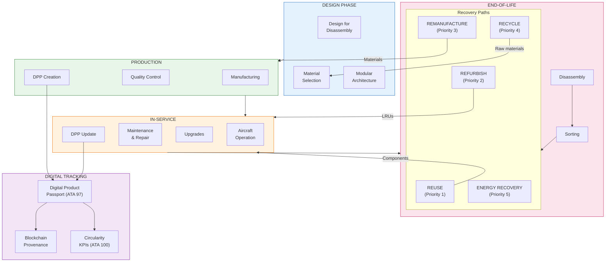
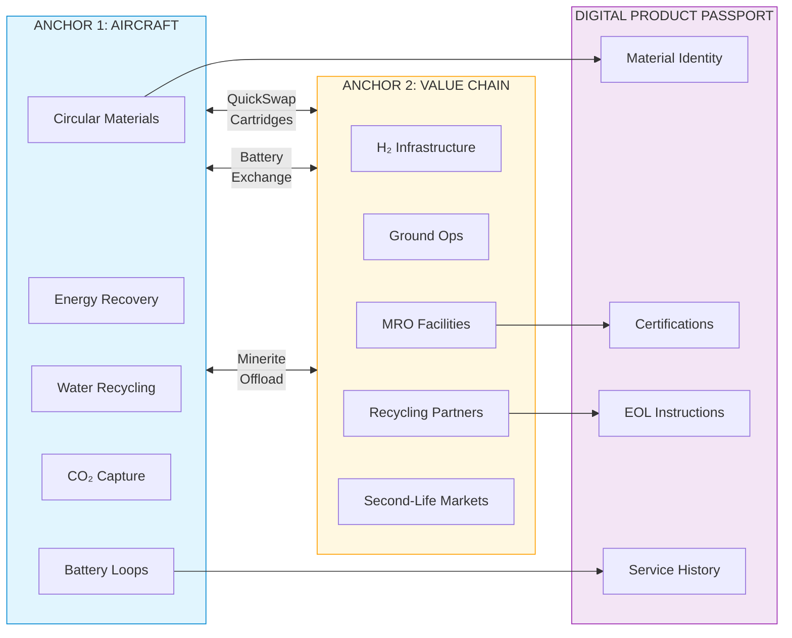
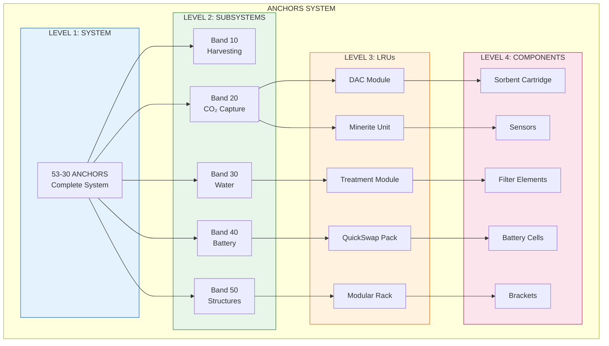
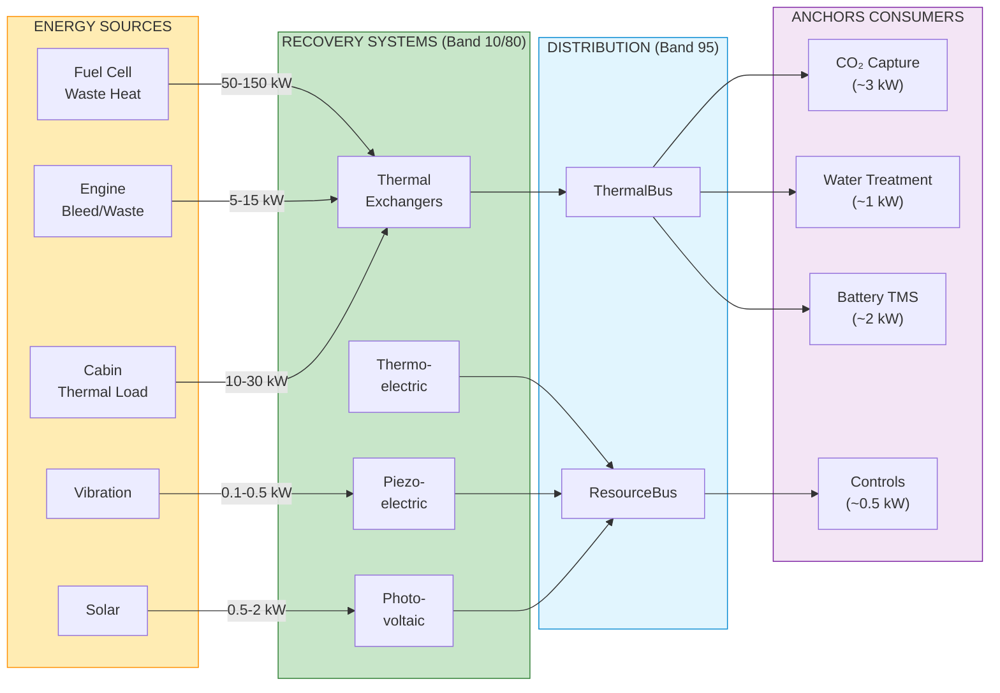
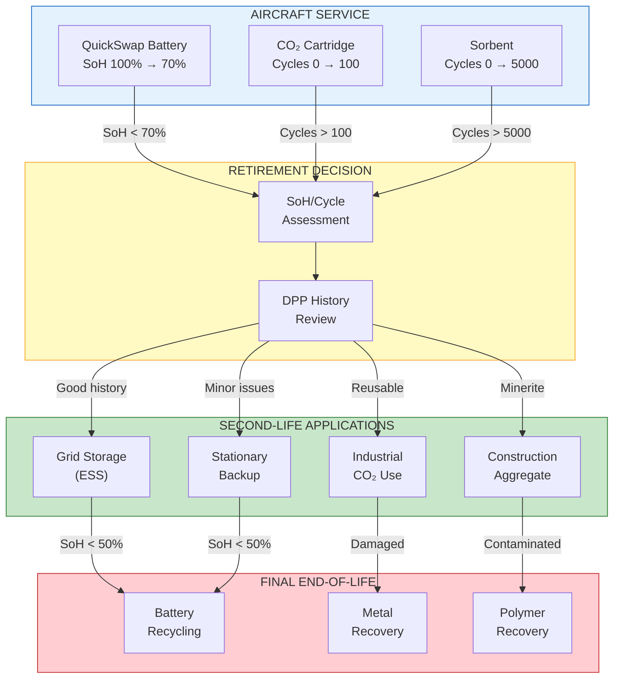
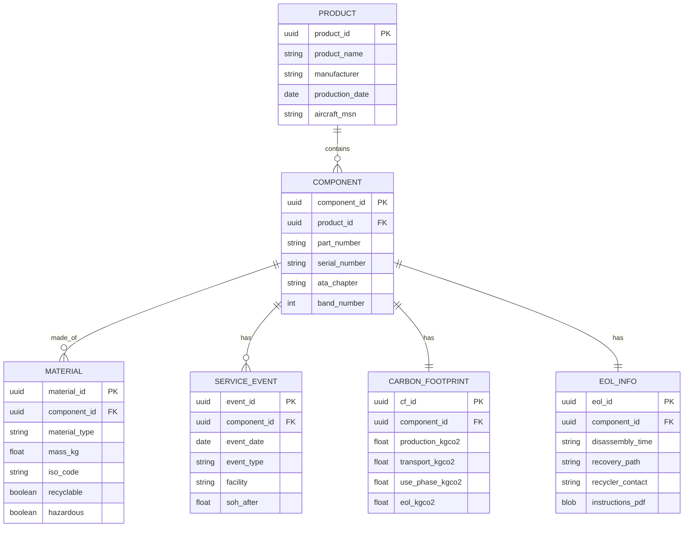
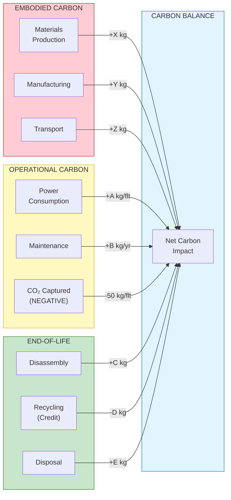

# 53-30-00-03 — Circularity Requirements

| Field | Value |
|-------|-------|
| **Document ID** | ATA53-30-00-03-REQ-002 |
| **Version** | 1.1 |
| **Date** | 2025-11-26 |
| **Status** | DRAFT |
| **Classification** | TECHNICAL |

---

## Navigation

### Breadcrumb
`AMPEL360-BWB-H2-Hy-E` / `OPT-IN_FRAMEWORK` / `T-TECHNOLOGY` / `A-AIRFRAME` / `ATA_53-FUSELAGE` / `53-30_ANCHORS` / `53-30-00_GENERAL` / `53-30-00-03_Requirements`

### Parent Documents
| Document | Path | Relationship |
|----------|------|--------------|
| ANCHORS System Requirements | [`./53-30-00-03_System_Requirements.md`](./53-30-00-03_System_Requirements.md) | Parent requirements |
| System Architecture | [`../53-30-00-01_Overview/53-30-00-01_System_Architecture.md`](../53-30-00-01_Overview/53-30-00-01_System_Architecture.md) | Architecture context |
| Naming Convention | [`../53-30_ANCHORS_Naming_Convention.md`](../53-30_ANCHORS_Naming_Convention.md) | Band definitions |

### Sibling Documents (53-30-00-03_Requirements)
| Document | Path | Content |
|----------|------|---------|
| System Requirements | [`./53-30-00-03_System_Requirements.md`](./53-30-00-03_System_Requirements.md) | Top-level requirements |
| **Circularity Requirements** | **This document** | Cross-cutting circularity |
| Harvesting Requirements | [`./53-30-00-03_Harvesting_Requirements.md`](./53-30-00-03_Harvesting_Requirements.md) | Band 10 |
| CO₂ Capture Requirements | [`./53-30-00-03_CO2_Capture_Requirements.md`](./53-30-00-03_CO2_Capture_Requirements.md) | Band 20 |
| Water Recycling Requirements | [`./53-30-00-03_Water_Requirements.md`](./53-30-00-03_Water_Requirements.md) | Band 30 |
| Battery Loop Requirements | [`./53-30-00-03_Battery_Requirements.md`](./53-30-00-03_Battery_Requirements.md) | Band 40 |
| Circular Structure Requirements | [`./53-30-00-03_Circular_Structure_Requirements.md`](./53-30-00-03_Circular_Structure_Requirements.md) | Band 50 |

### Related ANCHORS Documents
| Document | Path | Relationship |
|----------|------|--------------|
| DPP Schema | [`../53-30-90_DATA_SCHEMAS/53-30-90-01_DPP_Schema.md`](../53-30-90_DATA_SCHEMAS/53-30-90-01_DPP_Schema.md) | Data structure |
| Circular Structures | [`../53-30-50_CIRCULAR_STRUCTURES/`](../53-30-50_CIRCULAR_STRUCTURES/) | Band 50 implementation |
| ANCHORS Networks | [`../53-30-95_ANCHORS_NETWORKS/`](../53-30-95_ANCHORS_NETWORKS/) | ResourceBus integration |

### Cross-ATA Documents
| ATA | Document | Relationship |
|-----|----------|--------------|
| 97 | Digital Product Passport | DPP integration |
| 99 | Carbon Accounting | Emissions tracking |
| 100 | Circular Metrics | Circularity KPIs |

### Applicable Standards & Regulations
| Reference | Title | Application |
|-----------|-------|-------------|
| **EU ESPR** | Ecodesign for Sustainable Products Regulation | Product circularity requirements |
| **EU CSRD** | Corporate Sustainability Reporting Directive | Reporting requirements |
| **EU Taxonomy** | Sustainable Activities Classification | Investment alignment |
| **ISO 14040/44** | Life Cycle Assessment | LCA methodology |
| **ISO 14067** | Carbon Footprint of Products | CO₂ accounting |
| **ISO 59000 series** | Circular Economy (draft) | Circularity framework |
| **EN 45557** | Material Efficiency for Ecodesign | DfD methodology |
| **IEC 62474** | Material Declaration | Substance disclosure |
| **EU Battery Regulation** | 2023/1542 | Battery circularity |
| **REACH** | EC 1907/2006 | Hazardous substances |

---

## 1. Purpose

### 1.1 Scope

This document establishes circularity requirements for all ANCHORS systems (ATA 53-30), ensuring closed-loop material and energy flows aligned with EU sustainability regulations and aerospace certification requirements. It covers:

- Material circularity and recyclability
- Energy circularity and recovery
- Component reuse and refurbishment
- Design for Disassembly (DfD) requirements
- Digital Product Passport (DPP) integration
- Carbon accounting and reporting
- End-of-life management
- Regulatory compliance

These requirements apply **cross-cutting** to all ANCHORS bands (10, 20, 30, 40, 50, 60, 80, 90, 95) and must be flowed down to subsystem specifications.

### 1.2 Circularity Framework

### 1.3 ANCHORS Circularity Vision

ANCHORS embodies the **dual-anchor** sustainability model:

1. **ANCHOR 1 — Aircraft Integration:** Circular by design within the aircraft lifecycle
2. **ANCHOR 2 — Value Chain Integration:** Connected to external circular economy infrastructure

---

## 2. Material Circularity Requirements

### 2.1 Circularity Rate Requirements

| Req ID | Requirement | Threshold | Target | Unit | Verification | Trace |
|--------|-------------|-----------|--------|------|--------------|-------|
| REQ-CIR-001 | System Material Circularity Index (MCI) | ≥ 0.40 | ≥ 0.60 | — | Analysis | ESPR Art.5 |
| REQ-CIR-002 | Recycled content (by mass) | ≥ 25 | ≥ 40 | % | Inspection | ESPR Art.7 |
| REQ-CIR-003 | Recyclable content (by mass) | ≥ 60 | ≥ 80 | % | Analysis | ESPR Art.7 |
| REQ-CIR-004 | Reusable components (by count) | ≥ 50 | ≥ 70 | % | Analysis | EN 45557 |
| REQ-CIR-005 | Critical raw material reduction | ≥ 20 | ≥ 30 | % vs baseline | Analysis | ESPR Art.7(2)(h) |

### 2.2 Material Selection Requirements

| Req ID | Requirement | Description | Verification | Trace |
|--------|-------------|-------------|--------------|-------|
| REQ-CIR-010 | Hazardous substance elimination | REACH SVHC-free (unless certified exemption) | Certification | REACH Art.33 |
| REQ-CIR-011 | RoHS compliance | Compliant with EU 2011/65/EU | Certification | RoHS |
| REQ-CIR-012 | Conflict mineral free | DRC conflict-free certification | Certification | EU 2017/821 |
| REQ-CIR-013 | Material identification | All materials permanently marked with ISO codes | Inspection | ISO 11469 |
| REQ-CIR-014 | Bio-based content (where applicable) | ≥ 10% of polymer mass | Analysis | EN 16785 |

### 2.3 Material Declaration Requirements

| Req ID | Requirement | Description | Verification | Trace |
|--------|-------------|-------------|--------------|-------|
| REQ-CIR-020 | Full Material Declaration (FMD) | 100% mass accounted in DPP | Inspection | IEC 62474 |
| REQ-CIR-021 | Substance threshold reporting | All substances > 0.1% by mass | Analysis | REACH Art.33 |
| REQ-CIR-022 | Material passport linkage | Unique ID linked to DPP | Inspection | ATA 97 |
| REQ-CIR-023 | Supply chain traceability | Origin traceable to Tier 2 minimum | Inspection | ESPR Art.8 |

---

## 3. Design for Disassembly (DfD) Requirements

### 3.1 Disassembly Time Requirements

| Req ID | Requirement | Threshold | Target | Unit | Verification | Trace |
|--------|-------------|-----------|--------|------|--------------|-------|
| REQ-CIR-100 | LRU removal time | ≤ 30 | ≤ 15 | min | Demonstration | EN 45557 |
| REQ-CIR-101 | Module separation time | ≤ 60 | ≤ 30 | min | Demonstration | EN 45557 |
| REQ-CIR-102 | Battery pack extraction | ≤ 10 | ≤ 5 | min | Demonstration | EU 2023/1542 |
| REQ-CIR-103 | Full system disassembly | ≤ 8 | ≤ 4 | hours | Demonstration | EN 45557 |

### 3.2 Design Principles

| Req ID | Requirement | Description | Verification | Trace |
|--------|-------------|-------------|--------------|-------|
| REQ-CIR-110 | Fastener standardization | ≤ 5 fastener types per LRU | Inspection | EN 45557 |
| REQ-CIR-111 | Tool commonality | Standard aerospace tools only | Inspection | MNT-001 |
| REQ-CIR-112 | Non-destructive disassembly | 100% of valuable components | Demonstration | EN 45557 |
| REQ-CIR-113 | Material separation | Dissimilar materials mechanically separable | Demonstration | EN 45557 |
| REQ-CIR-114 | Joining method hierarchy | Mechanical > adhesive > welded | Analysis | EN 45557 |
| REQ-CIR-115 | Disassembly instructions | Included in DPP | Inspection | ESPR Art.8(2)(h) |

### 3.3 DfD Architecture

| Level | Disassembly Target | Recovery Path |
|-------|-------------------|---------------|
| **L1 System** | Aircraft removal | MRO facility |
| **L2 Subsystem** | Subsystem swap | MRO or line |
| **L3 LRU** | Quick replacement | Line maintenance |
| **L4 Component** | Refurbishment | Specialized facility |

---

## 4. Energy Circularity Requirements

### 4.1 Energy Recovery Requirements

| Req ID | Requirement | Threshold | Target | Unit | Verification | Trace |
|--------|-------------|-----------|--------|------|--------------|-------|
| REQ-CIR-200 | Waste heat recovery rate | ≥ 30 | ≥ 50 | % of available | Test | SYS-ENE-001 |
| REQ-CIR-201 | ThermalBus utilization | ≥ 70 | ≥ 85 | % capacity | Test | 53-30-95-02 |
| REQ-CIR-202 | Energy harvest contribution | ≥ 5 | ≥ 10 | kW average | Test | 53-30-80 |
| REQ-CIR-203 | Regenerative braking capture | ≥ 80 | ≥ 90 | % kinetic | Test | 53-30-40 |

### 4.2 Net Energy Balance

| Req ID | Requirement | Description | Verification | Trace |
|--------|-------------|-------------|--------------|-------|
| REQ-CIR-210 | Net energy contribution | Positive average over flight cycle | Analysis | SYS-ENE-002 |
| REQ-CIR-211 | Parasitic load minimization | ANCHORS load ≤ 2% aircraft total | Analysis | SYS-ENE-003 |
| REQ-CIR-212 | Standby power | ≤ 500 W total system | Test | SYS-ENE-004 |

### 4.3 Energy Flow Diagram

---

## 5. Component Reuse Requirements

### 5.1 Reuse and Refurbishment

| Req ID | Requirement | Threshold | Target | Unit | Verification | Trace |
|--------|-------------|-----------|--------|------|--------------|-------|
| REQ-CIR-300 | Battery second-life eligibility | ≥ 90 | 100 | % of packs | Test | EU 2023/1542 |
| REQ-CIR-301 | Battery SoH at retirement | ≥ 70 | ≥ 75 | % | Test | EU 2023/1542 |
| REQ-CIR-302 | Filter element regeneration | ≥ 5 | ≥ 10 | cycles | Test | MNT-010 |
| REQ-CIR-303 | CO₂ cartridge reuse | ≥ 100 | ≥ 500 | cycles | Test | REQ-CO2-213 |
| REQ-CIR-304 | Sorbent regeneration | ≥ 5,000 | ≥ 10,000 | cycles | Test | REQ-CO2-103 |
| REQ-CIR-305 | Structural bracket reuse | ≥ 3 | ≥ 5 | aircraft lives | Analysis | 53-30-50 |

### 5.2 Second-Life Pathways

| Req ID | Requirement | Description | Verification | Trace |
|--------|-------------|-------------|--------------|-------|
| REQ-CIR-310 | Battery second-life market | Compatible with ESS standards | Analysis | EU 2023/1542 |
| REQ-CIR-311 | Minerite construction use | Certified for aggregate | Certification | REQ-CO2-702 |
| REQ-CIR-312 | Component cascade | Documented downgrade path | Inspection | DPP |
| REQ-CIR-313 | Residual value tracking | DPP includes estimated value | Inspection | ATA 97 |

### 5.3 Second-Life Flow

---

## 6. Digital Product Passport (DPP) Requirements

### 6.1 DPP Content Requirements

| Req ID | Requirement | Description | Verification | Trace |
|--------|-------------|-------------|--------------|-------|
| REQ-CIR-400 | Material passport completeness | 100% of materials declared | Inspection | ESPR Art.8 |
| REQ-CIR-401 | Unique identifier | UUID per component, QR/RFID accessible | Inspection | ESPR Art.8(2)(a) |
| REQ-CIR-402 | Manufacturer information | Name, location, contact | Inspection | ESPR Art.8(2)(b) |
| REQ-CIR-403 | Material composition | Full FMD per IEC 62474 | Inspection | ESPR Art.8(2)(c) |
| REQ-CIR-404 | Carbon footprint | PCF per ISO 14067 | Analysis | ESPR Art.8(2)(d) |
| REQ-CIR-405 | Disassembly instructions | Step-by-step, illustrated | Inspection | ESPR Art.8(2)(h) |
| REQ-CIR-406 | Recycling information | Material streams, facilities | Inspection | ESPR Art.8(2)(i) |
| REQ-CIR-407 | Service history | All maintenance events | Inspection | ATA 97 |
| REQ-CIR-408 | SoH tracking | Real-time for batteries | Test | EU 2023/1542 |

### 6.2 DPP Technical Requirements

| Req ID | Requirement | Threshold | Unit | Verification | Trace |
|--------|-------------|-----------|------|--------------|-------|
| REQ-CIR-410 | Data retention | ≥ 15 | years post-EOL | Analysis | ESPR Art.8 |
| REQ-CIR-411 | Update latency | ≤ 24 | hours | Test | ATA 97 |
| REQ-CIR-412 | Access levels | 3 tiers (public/auth/owner) | Inspection | ESPR Art.8(4) |
| REQ-CIR-413 | Interoperability | EPCIS 2.0 compatible | Test | GS1 |
| REQ-CIR-414 | Blockchain anchor | Immutable provenance hash | Inspection | ATA 97 |

### 6.3 DPP Data Model

---

## 7. Carbon Accounting Requirements

### 7.1 Carbon Footprint Requirements

| Req ID | Requirement | Description | Verification | Trace |
|--------|-------------|-------------|--------------|-------|
| REQ-CIR-500 | Product Carbon Footprint (PCF) | Complete LCA per ISO 14067 | Analysis | ESPR Art.8(2)(d) |
| REQ-CIR-501 | Scope 1/2/3 coverage | All scopes included | Analysis | GHG Protocol |
| REQ-CIR-502 | Third-party verification | Annual audit | Certification | ISO 14064-3 |
| REQ-CIR-503 | Cradle-to-grave boundary | Production + use + EOL | Analysis | ISO 14044 |

### 7.2 Carbon Balance Requirements

| Req ID | Requirement | Threshold | Target | Unit | Verification | Trace |
|--------|-------------|-----------|--------|------|--------------|-------|
| REQ-CIR-510 | Net CO₂ capture per flight | ≥ 50 | ≥ 75 | kg CO₂ | Test | REQ-CO2-001 |
| REQ-CIR-511 | Lifecycle carbon payback | ≤ 500 | ≤ 300 | flights | Analysis | LCA |
| REQ-CIR-512 | Annual CO₂ offset per aircraft | ≥ 15 | ≥ 25 | tonnes | Analysis | SYS-ENV-001 |

### 7.3 Carbon Flow

---

## 8. End-of-Life Requirements

### 8.1 Waste Hierarchy Compliance

| Req ID | Requirement | Threshold | Target | Unit | Verification | Trace |
|--------|-------------|-----------|--------|------|--------------|-------|
| REQ-CIR-600 | Reuse rate | ≥ 30 | ≥ 50 | % by mass | Analysis | EU WFD |
| REQ-CIR-601 | Recycling rate | ≥ 50 | ≥ 70 | % by mass | Analysis | EU WFD |
| REQ-CIR-602 | Energy recovery | ≤ 15 | ≤ 10 | % by mass | Analysis | EU WFD |
| REQ-CIR-603 | Landfill | ≤ 5 | ≤ 2 | % by mass | Analysis | EU WFD |

### 8.2 Hazardous Waste Management

| Req ID | Requirement | Description | Verification | Trace |
|--------|-------------|-------------|--------------|-------|
| REQ-CIR-610 | Hazardous waste separation | 100% identified and segregated | Inspection | EU 2008/98/EC |
| REQ-CIR-611 | Battery waste handling | Per EU 2023/1542 | Certification | EU 2023/1542 |
| REQ-CIR-612 | Certified recyclers | All EOL to certified facilities | Inspection | EU 2008/98/EC |
| REQ-CIR-613 | Waste documentation | Full chain-of-custody | Inspection | EU 2008/98/EC |

### 8.3 Recycling Requirements

| Req ID | Requirement | Threshold | Unit | Verification | Trace |
|--------|-------------|-----------|------|--------------|-------|
| REQ-CIR-620 | Battery recycling efficiency | ≥ 70 | % by mass | Certification | EU 2023/1542 |
| REQ-CIR-621 | Lithium recovery | ≥ 50 | % | Certification | EU 2023/1542 |
| REQ-CIR-622 | Cobalt recovery | ≥ 90 | % | Certification | EU 2023/1542 |
| REQ-CIR-623 | Aluminum recovery | ≥ 95 | % | Analysis | Industry std |
| REQ-CIR-624 | Copper recovery | ≥ 95 | % | Analysis | Industry std |

---

## 9. Reporting and KPIs

### 9.1 Circularity KPIs

| Req ID | KPI | Calculation | Frequency | Trace |
|--------|-----|-------------|-----------|-------|
| REQ-CIR-700 | Material Circularity Index | (V × LU + W × EoL) / (V + W) | Annual | ISO 59020 |
| REQ-CIR-701 | Recycled Input Rate | Recycled mass / Total mass | Per batch | ESPR |
| REQ-CIR-702 | End-of-Life Recycling Rate | Recycled EOL / Total EOL | Annual | ESPR |
| REQ-CIR-703 | Carbon Circularity | CO₂ captured / Embodied CO₂ | Annual | Custom |
| REQ-CIR-704 | Energy Circularity | Recovered / Consumed | Flight | Custom |

### 9.2 Reporting Requirements

| Req ID | Requirement | Description | Verification | Trace |
|--------|-------------|-------------|--------------|-------|
| REQ-CIR-710 | CSRD alignment | Reporting per ESRS E5 | Inspection | CSRD |
| REQ-CIR-711 | EU Taxonomy alignment | Demonstrate substantial contribution | Analysis | EU Taxonomy |
| REQ-CIR-712 | Annual circularity report | Public disclosure | Inspection | ESPR |
| REQ-CIR-713 | DPP public access | Key data publicly accessible | Test | ESPR Art.8(4) |

---

## 10. Interface Requirements

### 10.1 Internal ANCHORS Interfaces

| Req ID | Interface | Description | Verification | Trace |
|--------|-----------|-------------|--------------|-------|
| REQ-CIR-800 | Band 50 → All | Circular structures enable DfD | Inspection | 53-30-50 |
| REQ-CIR-801 | Band 90 → All | DPP data schema integration | Test | 53-30-90 |
| REQ-CIR-802 | Band 95 → All | ResourceBus material tracking | Test | 53-30-95 |

### 10.2 External ATA Interfaces

| Req ID | Interface | Description | Verification | Trace |
|--------|-----------|-------------|--------------|-------|
| REQ-CIR-810 | ATA 97 (DPP) | Central DPP repository | Test | ICD-97-001 |
| REQ-CIR-811 | ATA 99 (Carbon) | Carbon accounting integration | Test | ICD-99-001 |
| REQ-CIR-812 | ATA 100 (Circular Metrics) | KPI reporting | Test | ICD-100-001 |
| REQ-CIR-813 | ATA 85 (Ground) | EOL/recycling coordination | Inspection | ICD-85-001 |

---

## 11. Verification Matrix

### 11.1 Verification Method Summary

| Method | Code | Count |
|--------|------|-------|
| Analysis | A | 32 |
| Test | T | 18 |
| Inspection | I | 28 |
| Demonstration | D | 5 |
| Certification | C | 8 |

> **Note:** The counts above are a **snapshot**; the authoritative source is `./ASSETS/DATA/53-30-00-03_VER-CIR_Matrix.csv`.

### 11.2 Verification Status

| Category | Total Reqs | Verified | Pending |
|----------|------------|----------|---------|
| Material Circularity | 14 | 0 | 14 |
| Design for Disassembly | 10 | 0 | 10 |
| Energy Circularity | 8 | 0 | 8 |
| Component Reuse | 10 | 0 | 10 |
| DPP | 15 | 0 | 15 |
| Carbon Accounting | 9 | 0 | 9 |
| End-of-Life | 12 | 0 | 12 |
| Reporting/KPIs | 9 | 0 | 9 |
| Interfaces | 7 | 0 | 7 |
| **Total** | **94** | **0** | **94** |

---

## 12. Regulatory Compliance Matrix

| Regulation | Article/Annex | ANCHORS Requirement | Status |
|------------|---------------|---------------------|--------|
| **ESPR** | Art.5 (Ecodesign) | REQ-CIR-001–005 | Pending |
| **ESPR** | Art.7 (Material) | REQ-CIR-002–005, 010–014 | Pending |
| **ESPR** | Art.8 (DPP) | REQ-CIR-400–414 | Pending |
| **EU Battery Reg** | Art.7 (Carbon) | REQ-CIR-500–512 | Pending |
| **EU Battery Reg** | Art.11 (DPP) | REQ-CIR-408 | Pending |
| **EU Battery Reg** | Art.71 (Recycling) | REQ-CIR-620–622 | Pending |
| **REACH** | Art.33 | REQ-CIR-010, 020–021 | Pending |
| **RoHS** | Full | REQ-CIR-011 | Pending |
| **CSRD** | ESRS E5 | REQ-CIR-710–713 | Pending |
| **EU Taxonomy** | Circular Economy | REQ-CIR-711 | Pending |
| **EU WFD** | Art.4 | REQ-CIR-600–603 | Pending |

---

## 13. TODO — Work Package Allocation

### 13.1 Documents to Create

| Priority | Document | Path | Owner | Due |
|----------|----------|------|-------|-----|
| P1 | DPP Schema Definition | `../53-30-90_DATA_SCHEMAS/53-30-90-01_DPP_Schema.md` | Data | TBD |
| P1 | Material Declaration Template | `../53-30-90_DATA_SCHEMAS/53-30-90-02_FMD_Template.md` | Materials | TBD |
| P2 | Disassembly Manual Template | `../53-30-50_CIRCULAR_STRUCTURES/53-30-50-00_DfD_Manual.md` | Design | TBD |
| P2 | Carbon Footprint Report Template | `../53-30-90_DATA_SCHEMAS/53-30-90-03_PCF_Template.md` | Sustainability | TBD |

### 13.2 Data Files to Create

| Priority | File | Path | Owner | Due |
|----------|------|------|-------|-----|
| P1 | Requirements register (CSV) | `./ASSETS/DATA/53-30-00-03_REQ-CIR_Register.csv` | Systems | TBD |
| P1 | Verification matrix (CSV) | `./ASSETS/DATA/53-30-00-03_VER-CIR_Matrix.csv` | V&V | TBD |
| P2 | Material database | `./ASSETS/DATA/53-30-00-03_MAT-CIR_Database.csv` | Materials | TBD |

### 13.3 Engineering Tasks

| Priority | Task | Output | Owner | Due |
|----------|------|--------|-------|-----|
| P1 | Material Circularity Index calculation | MCI baseline | Sustainability | TBD |
| P1 | LCA study initiation | PCF baseline | Sustainability | TBD |
| P2 | DfD trade study | Fastener/joint selection | Design | TBD |
| P2 | Second-life pathway definition | Partnership agreements | Business | TBD |
| P3 | CSRD reporting alignment | Report template | Legal | TBD |

### 13.4 Open Issues

| ID | Issue | Impact | Owner | Status |
|----|-------|--------|-------|--------|
| OI-CIR-001 | ESPR delegated acts not yet published | Final thresholds TBC | Regulatory | Open |
| OI-CIR-002 | Battery Regulation recycling targets evolving | REQ-CIR-620–622 | Regulatory | Open |
| OI-CIR-003 | DPP technical standards pending | Data format TBC | Data | Open |
| OI-CIR-004 | Second-life market partners not identified | REQ-CIR-310–313 | Business | Open |

---

## Document Control

| Field | Value |
|-------|-------|
| **Document ID** | ATA53-30-00-03-REQ-002 |
| **Version** | 1.1 |
| **Date** | 2025-11-26 |
| **Status** | DRAFT |
| **Author** | AMPEL360 Sustainability WG |
| **Reviewer** | [To be assigned] |
| **Approver** | [To be assigned] |
| **Next Review** | [To be scheduled] |

### Revision History

| Rev | Date | Author | Description |
|-----|------|--------|-------------|
| 1.0 | 2025-11-25 | AI (GitHub Copilot) | Initial requirements (14 reqs) |
| 1.1 | 2025-11-26 | AI (Claude, Anthropic) | Major expansion: 14→94 requirements; added EU regulatory alignment (ESPR, CSRD, Battery Reg, Taxonomy); DPP integration; Mermaid diagrams; carbon accounting; DfD architecture; second-life pathways; compliance matrix |

### AI Disclosure

- **Generated with assistance of:** AI (GitHub Copilot, Microsoft), AI (Claude, Anthropic), AI (ChatGPT, OpenAI)
- **Prompted by:** Amedeo Pelliccia
- **Status:** DRAFT — Subject to human review and approval
- **Human approver:** [To be completed]
- **Repository:** `AMPEL360-BWB-H2-Hy-E`
- **Last AI update:** 2025-11-26

---

## Quick Links

| Section | Jump |
|---------|------|
| [Navigation](#navigation) | Cross-references, regulations |
| [Circularity Framework](#12-circularity-framework) | Vision and architecture |
| [Material Circularity](#2-material-circularity-requirements) | REQ-CIR-001–023 |
| [Design for Disassembly](#3-design-for-disassembly-dfd-requirements) | REQ-CIR-100–115 |
| [Energy Circularity](#4-energy-circularity-requirements) | REQ-CIR-200–212 |
| [Component Reuse](#5-component-reuse-requirements) | REQ-CIR-300–313 |
| [DPP](#6-digital-product-passport-dpp-requirements) | REQ-CIR-400–414 |
| [Carbon Accounting](#7-carbon-accounting-requirements) | REQ-CIR-500–512 |
| [End-of-Life](#8-end-of-life-requirements) | REQ-CIR-600–624 |
| [Reporting/KPIs](#9-reporting-and-kpis) | REQ-CIR-700–713 |
| [Interfaces](#10-interface-requirements) | REQ-CIR-800–813 |
| [Verification](#11-verification-matrix) | Status summary |
| [Regulatory Compliance](#12-regulatory-compliance-matrix) | ESPR, CSRD, Battery Reg |
| [TODO](#13-todo--work-package-allocation) | Work packages |

---

*END OF DOCUMENT*
