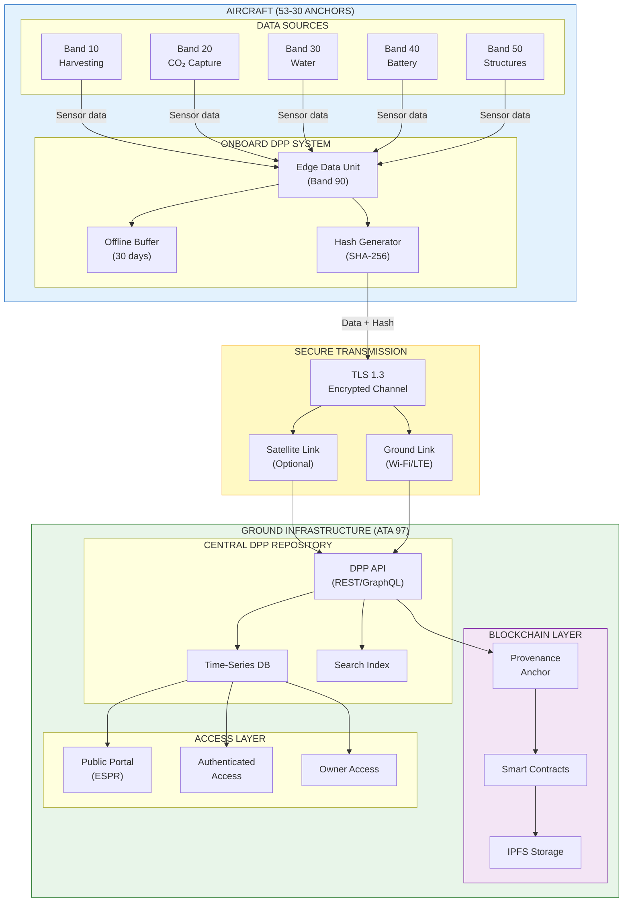
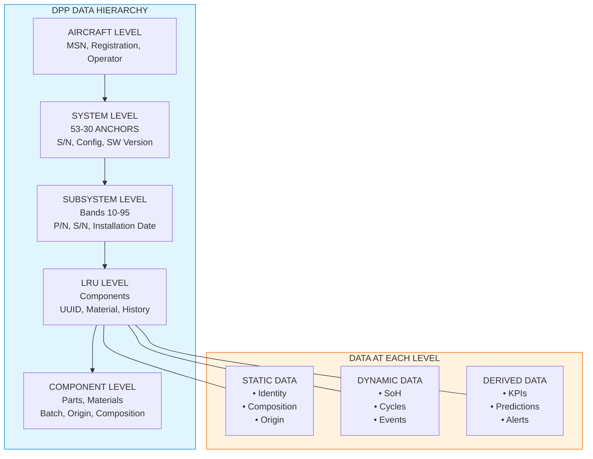
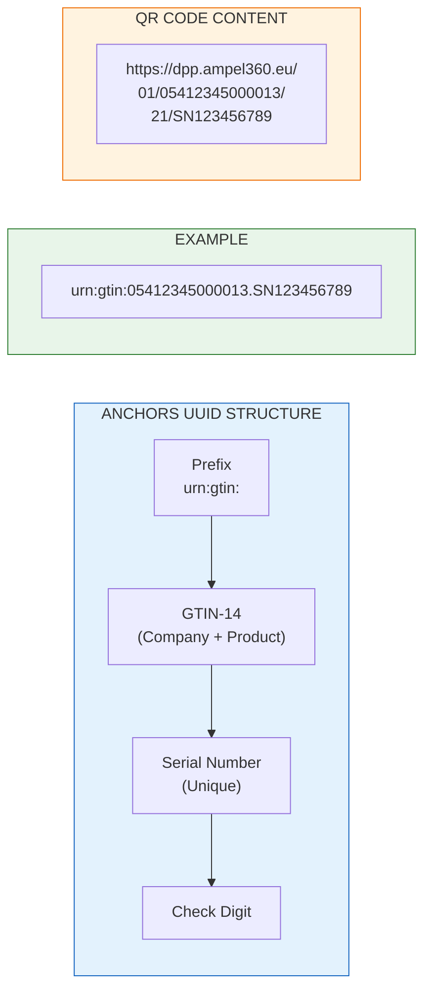
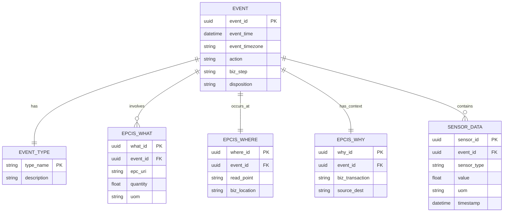
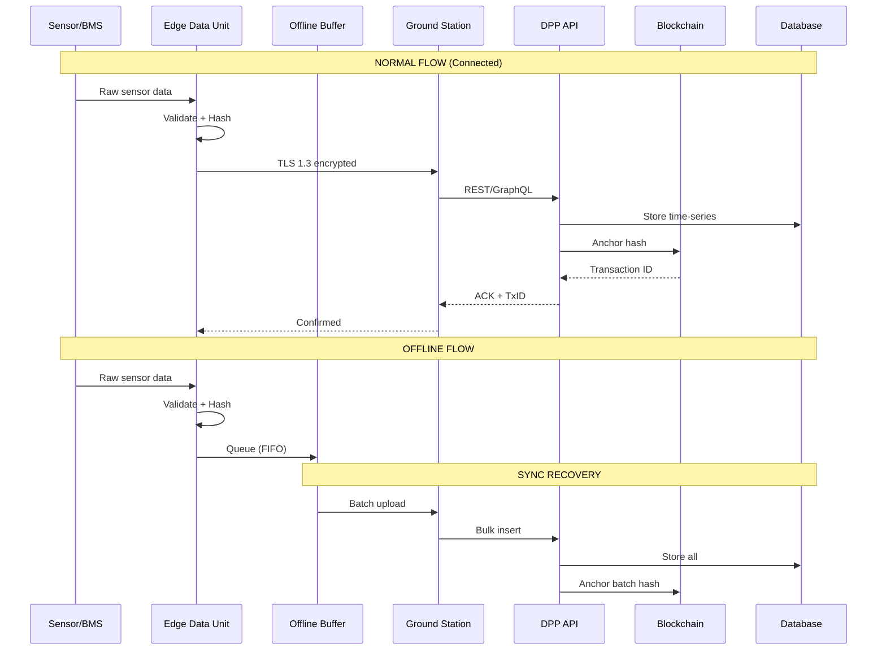
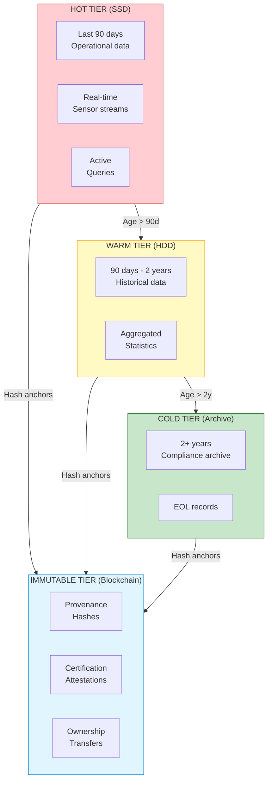
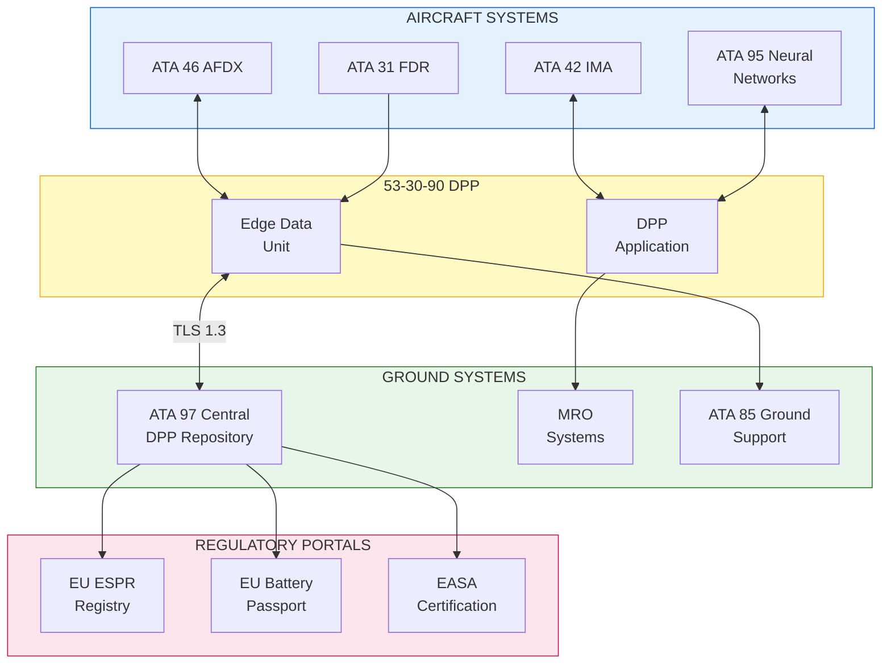

# 53-30-00-03 — DPP Traceability Requirements

| Field | Value |
|-------|-------|
| **Document ID** | ATA53-30-00-03-REQ-007 |
| **Version** | 1.1 |
| **Date** | 2025-11-26 |
| **Status** | DRAFT |
| **Classification** | TECHNICAL |

---

## Navigation

### Breadcrumb
`AMPEL360-BWB-H2-Hy-E` / `OPT-IN_FRAMEWORK` / `T-TECHNOLOGY` / `A-AIRFRAME` / `ATA_53-FUSELAGE` / `53-30_ANCHORS` / `53-30-00_GENERAL` / `53-30-00-03_Requirements`

### Parent Documents
| Document | Path | Relationship |
|----------|------|--------------|
| ANCHORS System Requirements | [`./53-30-00-03_System_Requirements.md`](./53-30-00-03_System_Requirements.md) | Parent requirements |
| Circularity Requirements | [`./53-30-00-03_Circularity_Requirements.md`](./53-30-00-03_Circularity_Requirements.md) | Circularity context |
| Naming Convention | [`../53-30_ANCHORS_Naming_Convention.md`](../53-30_ANCHORS_Naming_Convention.md) | Band definitions |

### Sibling Documents (53-30-00-03_Requirements)
| Document | Path | Content |
|----------|------|---------|
| System Requirements | [`./53-30-00-03_System_Requirements.md`](./53-30-00-03_System_Requirements.md) | Top-level requirements |
| Circularity Requirements | [`./53-30-00-03_Circularity_Requirements.md`](./53-30-00-03_Circularity_Requirements.md) | Circularity (cross-cutting) |
| **DPP Traceability Requirements** | **This document** | Digital Product Passport |
| CO₂ Capture Requirements | [`./53-30-00-03_CO2_Capture_Requirements.md`](./53-30-00-03_CO2_Capture_Requirements.md) | Band 20 |
| Battery Loop Requirements | [`./53-30-00-03_Battery_Requirements.md`](./53-30-00-03_Battery_Requirements.md) | Band 40 |

### Related ANCHORS Documents
| Document | Path | Relationship |
|----------|------|--------------|
| DPP Schema | [`../53-30-90_DATA_SCHEMAS/53-30-90-01_DPP_Schema.md`](../53-30-90_DATA_SCHEMAS/53-30-90-01_DPP_Schema.md) | Data structure definition |
| Event Catalog | [`../53-30-90_DATA_SCHEMAS/53-30-90-02_Event_Catalog.md`](../53-30-90_DATA_SCHEMAS/53-30-90-02_Event_Catalog.md) | Event types |
| ANCHORS Networks | [`../53-30-95_ANCHORS_NETWORKS/`](../53-30-95_ANCHORS_NETWORKS/) | Data transport |

### Cross-ATA Documents
| ATA | Document | Relationship |
|-----|----------|--------------|
| 95 | Neural Networks | AI/ML integration, data analytics |
| 97 | Digital Product Passport | Central DPP infrastructure |
| 31 | Indicating/Recording | Flight data recording |
| 46 | Information Systems | Aircraft data systems |

### Applicable Standards & Regulations
| Reference | Title | Application |
|-----------|-------|-------------|
| **EU ESPR** | Ecodesign for Sustainable Products Regulation | DPP mandatory requirements |
| **EU 2023/1542** | Battery Regulation | Battery passport requirements |
| **EPCIS 2.0** | GS1 Event Standard | Event data interchange |
| **GS1 Digital Link** | URI Structure | Product identification |
| **W3C DID** | Decentralized Identifiers | Identity management |
| **W3C VC** | Verifiable Credentials | Certification attestation |
| **ISO 22739** | Blockchain Terminology | Distributed ledger |
| **ARINC 834** | Aircraft Data Loading | Onboard data management |
| **DO-178C** | SW Airworthiness | DAL-C for DPP SW |
| **DO-326A** | Airborne Cyber Security | Security requirements |

---

## 1. Purpose

### 1.1 Scope

This document establishes Digital Product Passport (DPP) traceability requirements for all ANCHORS systems (ATA 53-30), ensuring:

- Cradle-to-grave component traceability
- EU ESPR and Battery Regulation compliance
- Blockchain-anchored provenance
- Real-time operational data capture
- Secure data transmission and storage
- Multi-stakeholder data access
- Integration with aircraft systems (ATA 95, 97)

These requirements apply to **Band 90 (Data & Schemas)** and have dependencies on all other bands for data generation.

### 1.2 DPP Architecture Overview



### 1.3 DPP Data Hierarchy



---

## 2. Identification Requirements

### 2.1 Unique Identifier Requirements

| Req ID | Requirement | Description | Verification | Trace |
|--------|-------------|-------------|--------------|-------|
| REQ-DPP-001 | Unique Product Identifier (UPI) | UUID v4 for each component | Inspection | ESPR Art.8(2)(a) |
| REQ-DPP-002 | GS1 Digital Link compliance | URI format per GS1 standard | Test | GS1 Digital Link |
| REQ-DPP-003 | QR code marking | ISO 18004 compliant, ≥ 20mm | Inspection | ESPR Art.8(3) |
| REQ-DPP-004 | RFID tagging (optional) | ISO 14443 or ISO 15693 | Test | Industry option |
| REQ-DPP-005 | Laser marking | Permanent UUID on metal parts | Inspection | MIL-STD-130 |

### 2.2 Identification Coverage

| Req ID | Requirement | Threshold | Unit | Verification | Trace |
|--------|-------------|-----------|------|--------------|-------|
| REQ-DPP-010 | LRU identification | 100 | % | Inspection | ESPR Art.8 |
| REQ-DPP-011 | SRU identification | 100 | % | Inspection | ESPR Art.8 |
| REQ-DPP-012 | Consumable identification | 100 | % | Inspection | EU 2023/1542 |
| REQ-DPP-013 | Structural part identification | 100 | % of Band 50 | Inspection | ESPR Art.8 |
| REQ-DPP-014 | Battery cell identification | 100 | % | Inspection | EU 2023/1542 Art.77 |

### 2.3 Identifier Structure



---

## 3. Data Capture Requirements

### 3.1 Static Data Requirements

| Req ID | Requirement | Description | Verification | Trace |
|--------|-------------|-------------|--------------|-------|
| REQ-DPP-100 | Manufacturer identity | Name, GLN, contact | Inspection | ESPR Art.8(2)(b) |
| REQ-DPP-101 | Production data | Date, location, batch, line | Inspection | ESPR Art.8(2)(c) |
| REQ-DPP-102 | Material composition | Full FMD per IEC 62474 | Analysis | ESPR Art.8(2)(c) |
| REQ-DPP-103 | Carbon footprint | PCF per ISO 14067 | Analysis | ESPR Art.8(2)(d) |
| REQ-DPP-104 | Certification data | Type cert, approvals, waivers | Inspection | Aerospace req |
| REQ-DPP-105 | Disassembly instructions | Step-by-step, illustrated | Inspection | ESPR Art.8(2)(h) |
| REQ-DPP-106 | Recycling information | Material streams, contacts | Inspection | ESPR Art.8(2)(i) |

### 3.2 Dynamic Data Requirements

| Req ID | Requirement | Threshold | Unit | Verification | Trace |
|--------|-------------|-----------|------|--------------|-------|
| REQ-DPP-110 | Flight hours accumulation | ± 0.1 | FH | Test | ATA 31 |
| REQ-DPP-111 | Cycle count | ± 1 | cycles | Test | ATA 31 |
| REQ-DPP-112 | Battery SoH | ± 2 | % | Test | EU 2023/1542 |
| REQ-DPP-113 | Battery SoC | ± 3 | % | Test | EU 2023/1542 |
| REQ-DPP-114 | Temperature history | ± 1 | °C | Test | Safety |
| REQ-DPP-115 | CO₂ captured cumulative | ± 1 | kg | Test | Carbon accounting |
| REQ-DPP-116 | Water processed cumulative | ± 0.5 | L | Test | Performance |

### 3.3 Event Data Requirements

| Req ID | Requirement | Description | Verification | Trace |
|--------|-------------|-------------|--------------|-------|
| REQ-DPP-120 | Installation event | Component installed, location, date | Inspection | EPCIS |
| REQ-DPP-121 | Removal event | Component removed, reason, date | Inspection | EPCIS |
| REQ-DPP-122 | Maintenance event | Task performed, findings, parts | Inspection | EPCIS |
| REQ-DPP-123 | Fault event | Fault code, severity, response | Test | EPCIS |
| REQ-DPP-124 | Calibration event | Parameters, results, next due | Inspection | EPCIS |
| REQ-DPP-125 | QuickSwap event | Battery/cartridge exchange | Test | ANCHORS-specific |
| REQ-DPP-126 | End-of-life event | Disposal path, recycler, date | Inspection | EPCIS |

### 3.4 Event Data Model (EPCIS 2.0)



---

## 4. Data Transmission Requirements

### 4.1 Transmission Frequency

| Req ID | Requirement | Threshold | Unit | Verification | Trace |
|--------|-------------|-----------|------|--------------|-------|
| REQ-DPP-200 | Minimum update frequency | 1 | per flight | Test | Operations |
| REQ-DPP-201 | Real-time critical events | ≤ 60 | seconds | Test | Safety |
| REQ-DPP-202 | Battery SoH update | Per charge cycle | — | Test | EU 2023/1542 |
| REQ-DPP-203 | Cumulative data sync | ≤ 24 | hours post-flight | Test | Operations |

### 4.2 Data Integrity

| Req ID | Requirement | Description | Verification | Trace |
|--------|-------------|-------------|--------------|-------|
| REQ-DPP-210 | Hash algorithm | SHA-256 minimum | Test | DO-326A |
| REQ-DPP-211 | Digital signature | ECDSA P-256 or RSA-2048 | Test | DO-326A |
| REQ-DPP-212 | Timestamp certification | RFC 3161 TSA | Test | Legal validity |
| REQ-DPP-213 | Data validation | JSON Schema validation | Test | Data quality |
| REQ-DPP-214 | Checksum verification | CRC-32 transport layer | Test | ARINC 834 |

### 4.3 Transmission Security

| Req ID | Requirement | Description | Verification | Trace |
|--------|-------------|-------------|--------------|-------|
| REQ-DPP-220 | Transport encryption | TLS 1.3 minimum | Analysis | DO-326A |
| REQ-DPP-221 | Certificate management | PKI with HSM | Analysis | DO-326A |
| REQ-DPP-222 | Mutual authentication | Client + server certs | Test | DO-326A |
| REQ-DPP-223 | Key rotation | ≤ 90 day validity | Analysis | Security policy |
| REQ-DPP-224 | Secure boot | Verified boot chain | Test | DO-326A |

### 4.4 Offline Capability

| Req ID | Requirement | Threshold | Unit | Verification | Trace |
|--------|-------------|-----------|------|--------------|-------|
| REQ-DPP-230 | Offline buffer duration | ≥ 30 | days | Test | Operations |
| REQ-DPP-231 | Buffer capacity | ≥ 1 | GB | Inspection | Design |
| REQ-DPP-232 | Data prioritization | Critical events first | Test | Operations |
| REQ-DPP-233 | Sync recovery | Automatic on reconnect | Test | Operations |
| REQ-DPP-234 | Buffer integrity | Protected against corruption | Test | DO-178C |

### 4.5 Data Flow Architecture



---

## 5. Data Storage Requirements

### 5.1 Retention Requirements

| Req ID | Requirement | Threshold | Unit | Verification | Trace |
|--------|-------------|-----------|------|--------------|-------|
| REQ-DPP-300 | Operational data retention | ≥ 25 | years | Analysis | Aerospace reg |
| REQ-DPP-301 | Post-EOL retention | ≥ 15 | years | Analysis | ESPR Art.8 |
| REQ-DPP-302 | Immutable provenance | Indefinite | — | Analysis | Blockchain |
| REQ-DPP-303 | Audit log retention | ≥ 10 | years | Analysis | GDPR/compliance |

### 5.2 Storage Architecture

| Req ID | Requirement | Description | Verification | Trace |
|--------|-------------|-------------|--------------|-------|
| REQ-DPP-310 | Time-series database | Optimized for sensor data | Test | Performance |
| REQ-DPP-311 | Document store | JSON-LD for static data | Test | ESPR |
| REQ-DPP-312 | IPFS integration | Content-addressed storage | Test | Decentralization |
| REQ-DPP-313 | Geographic redundancy | ≥ 3 regions | Inspection | Availability |
| REQ-DPP-314 | Backup frequency | ≤ 1 hour RPO | Test | DR policy |

### 5.3 Storage Tiers



---

## 6. Data Access Requirements

### 6.1 Access Control

| Req ID | Requirement | Description | Verification | Trace |
|--------|-------------|-------------|--------------|-------|
| REQ-DPP-400 | Role-based access control | RBAC with least privilege | Test | DO-326A |
| REQ-DPP-401 | Three-tier access model | Public/Authenticated/Owner | Test | ESPR Art.8(4) |
| REQ-DPP-402 | OAuth 2.0 / OIDC | Federated identity | Test | Industry std |
| REQ-DPP-403 | API key management | Rotatable, revocable | Test | Security |
| REQ-DPP-404 | Consent management | GDPR-compliant consent | Test | GDPR |

### 6.2 Access Tier Definitions

| Tier | Audience | Data Access | Authentication |
|------|----------|-------------|----------------|
| **Public** | Consumers, regulators | Product ID, carbon footprint, recyclability, basic specs | None |
| **Authenticated** | MRO, recyclers, supply chain | + Service history, material composition, disassembly | API key + certificate |
| **Owner** | Operator, OEM | + Full operational data, sensor streams, analytics | OAuth + MFA |

### 6.3 Query Performance

| Req ID | Requirement | Threshold | Unit | Verification | Trace |
|--------|-------------|-----------|------|--------------|-------|
| REQ-DPP-410 | Public query response | ≤ 2 | seconds | Test | UX |
| REQ-DPP-411 | Authenticated query response | ≤ 5 | seconds | Test | Operations |
| REQ-DPP-412 | Bulk export | ≤ 60 | seconds/1000 records | Test | Reporting |
| REQ-DPP-413 | Concurrent users | ≥ 1000 | — | Test | Scalability |
| REQ-DPP-414 | API availability | ≥ 99.9 | % | Analysis | SLA |

### 6.4 Audit Requirements

| Req ID | Requirement | Description | Verification | Trace |
|--------|-------------|-------------|--------------|-------|
| REQ-DPP-420 | Access logging | All queries logged | Test | Compliance |
| REQ-DPP-421 | Modification tracking | Full change history | Test | Audit |
| REQ-DPP-422 | Tamper evidence | Cryptographic proof | Test | Blockchain |
| REQ-DPP-423 | Export capability | Audit logs exportable | Test | Compliance |

---

## 7. Blockchain Provenance Requirements

### 7.1 Blockchain Architecture

| Req ID | Requirement | Description | Verification | Trace |
|--------|-------------|-------------|--------------|-------|
| REQ-DPP-500 | Blockchain type | Permissioned consortium | Analysis | Industry alignment |
| REQ-DPP-501 | Consensus mechanism | PBFT or equivalent | Analysis | Performance |
| REQ-DPP-502 | Smart contract platform | EVM-compatible | Test | Interoperability |
| REQ-DPP-503 | Node distribution | ≥ 5 independent operators | Inspection | Decentralization |

### 7.2 On-Chain Data

| Req ID | Requirement | Description | Verification | Trace |
|--------|-------------|-------------|--------------|-------|
| REQ-DPP-510 | Product identity anchor | UUID + creation timestamp | Test | Provenance |
| REQ-DPP-511 | Data hash anchoring | SHA-256 of off-chain data | Test | Integrity |
| REQ-DPP-512 | Certification attestation | W3C VC format | Test | W3C VC |
| REQ-DPP-513 | Ownership transfer | Current custodian record | Test | Chain of custody |
| REQ-DPP-514 | EOL disposition | Final status recording | Test | Circularity |

### 7.3 Smart Contract Functions

```mermaid
flowchart TB
    subgraph CONTRACTS["SMART CONTRACT SUITE"]
        direction TB
        
        subgraph IDENTITY["IDENTITY CONTRACT"]
            ID_REG["registerProduct()"]
            ID_GET["getIdentity()"]
            ID_VER["verifyAuthority()"]
        end
        
        subgraph PROVENANCE["PROVENANCE CONTRACT"]
            PRV_ADD["addEvent()"]
            PRV_HASH["anchorHash()"]
            PRV_VER["verifyChain()"]
        end
        
        subgraph CERTIFICATION["CERTIFICATION CONTRACT"]
            CERT_ISS["issueCertificate()"]
            CERT_REV["revokeCertificate()"]
            CERT_CHK["verifyCertificate()"]
        end
        
        subgraph OWNERSHIP["OWNERSHIP CONTRACT"]
            OWN_TRF["transferOwnership()"]
            OWN_GET["getCurrentOwner()"]
            OWN_HIS["getOwnershipHistory()"]
        end
    end
    
    subgraph EXTERNAL["EXTERNAL SYSTEMS"]
        DPP_API["DPP API"]
        CA["Certificate Authority"]
        REG["Regulatory Portal"]
    end
    
    DPP_API --> ID_REG & PRV_ADD & OWN_TRF
    CA --> CERT_ISS & CERT_REV
    REG --> ID_VER & CERT_CHK
    
    style CONTRACTS fill:#f3e5f5,stroke:#7b1fa2
    style EXTERNAL fill:#e8f5e9,stroke:#2e7d32
```



### 7.4 Blockchain Performance

| Req ID | Requirement | Threshold | Unit | Verification | Trace |
|--------|-------------|-----------|------|--------------|-------|
| REQ-DPP-520 | Transaction throughput | ≥ 100 | TPS | Test | Scalability |
| REQ-DPP-521 | Transaction finality | ≤ 5 | seconds | Test | Operations |
| REQ-DPP-522 | Gas cost optimization | ≤ 50,000 | gas/tx avg | Analysis | Cost |
| REQ-DPP-523 | Node sync time | ≤ 24 | hours (new node) | Test | Operations |

---

## 8. Integration Requirements

### 8.1 Aircraft System Integration

| Req ID | Requirement | Description | Verification | Trace |
|--------|-------------|-------------|--------------|-------|
| REQ-DPP-600 | ATA 95 Neural Networks | ML model data exchange | Test | ICD-95-001 |
| REQ-DPP-601 | ATA 31 Recording | Flight data integration | Test | ICD-31-001 |
| REQ-DPP-602 | ATA 46 Information | AFDX data bus interface | Test | ICD-46-001 |
| REQ-DPP-603 | ATA 42 IMA | Application hosting | Test | ICD-42-001 |

### 8.2 Ground System Integration

| Req ID | Requirement | Description | Verification | Trace |
|--------|-------------|-------------|--------------|-------|
| REQ-DPP-610 | ATA 97 DPP Repository | Central DPP sync | Test | ICD-97-001 |
| REQ-DPP-611 | ATA 85 Ground Ops | QuickSwap data exchange | Test | ICD-85-001 |
| REQ-DPP-612 | MRO systems | Maintenance data export | Test | Industry std |
| REQ-DPP-613 | Supply chain systems | Procurement integration | Test | Industry std |

### 8.3 Regulatory Integration

| Req ID | Requirement | Description | Verification | Trace |
|--------|-------------|-------------|--------------|-------|
| REQ-DPP-620 | EASA certification data | Type cert integration | Inspection | EASA |
| REQ-DPP-621 | EU DPP registry | ESPR compliance portal | Test | ESPR |
| REQ-DPP-622 | EU Battery passport | Battery Regulation portal | Test | EU 2023/1542 |
| REQ-DPP-623 | Carbon registry | Emissions reporting | Test | EU ETS |

### 8.4 Integration Architecture



---

## 9. Data Format Requirements

### 9.1 Standard Formats

| Req ID | Requirement | Format | Verification | Trace |
|--------|-------------|--------|--------------|-------|
| REQ-DPP-700 | Primary data format | JSON-LD | Inspection | ESPR |
| REQ-DPP-701 | Schema definition | JSON Schema Draft 2020-12 | Inspection | Interoperability |
| REQ-DPP-702 | Event format | EPCIS 2.0 JSON/JSON-LD | Inspection | GS1 |
| REQ-DPP-703 | Credential format | W3C Verifiable Credentials | Inspection | W3C VC |
| REQ-DPP-704 | Time format | ISO 8601 with timezone | Inspection | Interoperability |
| REQ-DPP-705 | Unit format | UN/CEFACT codes | Inspection | Interoperability |

### 9.2 ANCHORS-Specific Extensions

| Req ID | Requirement | Description | Verification | Trace |
|--------|-------------|-------------|--------------|-------|
| REQ-DPP-710 | Battery health schema | SoH, SoC, cycle, temp | Inspection | EU 2023/1542 |
| REQ-DPP-711 | CO₂ capture schema | Rate, cumulative, Minerite | Inspection | Carbon accounting |
| REQ-DPP-712 | Water quality schema | Volume, quality metrics | Inspection | Operations |
| REQ-DPP-713 | QuickSwap event schema | Swap type, location, duration | Inspection | ANCHORS-specific |

### 9.3 JSON-LD Context Example

```json
{
  "@context": {
    "@vocab": "https://schema.ampel360.eu/dpp/",
    "gtin": "https://gs1.org/voc/gtin",
    "epcis": "https://ref.gs1.org/epcis/",
    "vc": "https://www.w3.org/2018/credentials/v1",
    "anchors": "https://ampel360.eu/anchors/v1/",
    
    "productId": "gtin:gtin",
    "serialNumber": "anchors:serialNumber",
    "batteryHealth": {
      "@id": "anchors:batteryHealth",
      "@type": "anchors:BatteryHealthRecord"
    },
    "co2Captured": {
      "@id": "anchors:co2Captured",
      "@type": "xsd:decimal"
    }
  }
}
```

---

## 10. Software Requirements

### 10.1 Development Assurance

| Req ID | Requirement | Description | Verification | Trace |
|--------|-------------|-------------|--------------|-------|
| REQ-DPP-800 | Software DAL | DAL-C minimum | Analysis | DO-178C |
| REQ-DPP-801 | Security assurance | SAL-2 minimum | Analysis | DO-326A |
| REQ-DPP-802 | Coding standard | MISRA C or equivalent | Inspection | DO-178C |
| REQ-DPP-803 | Code coverage | MC/DC for DAL-C | Test | DO-178C |

### 10.2 Cyber Security

| Req ID | Requirement | Description | Verification | Trace |
|--------|-------------|-------------|--------------|-------|
| REQ-DPP-810 | Threat assessment | Per DO-326A | Analysis | DO-326A |
| REQ-DPP-811 | Vulnerability scanning | Quarterly minimum | Test | Security policy |
| REQ-DPP-812 | Penetration testing | Annual minimum | Test | Security policy |
| REQ-DPP-813 | Incident response | Documented procedure | Inspection | DO-326A |

---

## 11. Verification Matrix

### 11.1 Verification Method Summary

| Method | Code | Count |
|--------|------|-------|
| Test | T | 48 |
| Analysis | A | 22 |
| Inspection | I | 38 |
| Demonstration | D | 0 |

> **Note:** The counts above are a **snapshot**; the authoritative source is `./ASSETS/DATA/53-30-00-03_VER-DPP_Matrix.csv`.

### 11.2 Verification Status

| Category | Total Reqs | Verified | Pending |
|----------|------------|----------|---------|
| Identification | 10 | 0 | 10 |
| Data Capture | 18 | 0 | 18 |
| Transmission | 20 | 0 | 20 |
| Storage | 9 | 0 | 9 |
| Access | 15 | 0 | 15 |
| Blockchain | 13 | 0 | 13 |
| Integration | 12 | 0 | 12 |
| Data Format | 10 | 0 | 10 |
| Software | 8 | 0 | 8 |
| **Total** | **115** | **0** | **115** |

---

## 12. Regulatory Compliance Matrix

| Regulation | Article/Annex | DPP Requirement | Status |
|------------|---------------|-----------------|--------|
| **ESPR** | Art.8(2)(a) | REQ-DPP-001–005 | Pending |
| **ESPR** | Art.8(2)(b) | REQ-DPP-100 | Pending |
| **ESPR** | Art.8(2)(c) | REQ-DPP-101–102 | Pending |
| **ESPR** | Art.8(2)(d) | REQ-DPP-103 | Pending |
| **ESPR** | Art.8(2)(h) | REQ-DPP-105 | Pending |
| **ESPR** | Art.8(2)(i) | REQ-DPP-106 | Pending |
| **ESPR** | Art.8(3) | REQ-DPP-003 | Pending |
| **ESPR** | Art.8(4) | REQ-DPP-401 | Pending |
| **EU 2023/1542** | Art.77 | REQ-DPP-014 | Pending |
| **EU 2023/1542** | Art.78 | REQ-DPP-112–113, 710 | Pending |
| **GDPR** | Art.6,7 | REQ-DPP-404 | Pending |
| **DO-178C** | — | REQ-DPP-800–803 | Pending |
| **DO-326A** | — | REQ-DPP-810–813 | Pending |

---

## 13. TODO — Work Package Allocation

### 13.1 Documents to Create

| Priority | Document | Path | Owner | Due |
|----------|----------|------|-------|-----|
| P1 | DPP Schema Definition | `../53-30-90_DATA_SCHEMAS/53-30-90-01_DPP_Schema.md` | Data | TBD |
| P1 | Event Catalog | `../53-30-90_DATA_SCHEMAS/53-30-90-02_Event_Catalog.md` | Data | TBD |
| P1 | JSON-LD Context | `../53-30-90_DATA_SCHEMAS/ASSETS/DATA/anchors-context.jsonld` | Data | TBD |
| P2 | Blockchain Architecture | `../53-30-90_DATA_SCHEMAS/53-30-90-03_Blockchain_Architecture.md` | IT | TBD |
| P2 | API Specification | `../53-30-90_DATA_SCHEMAS/53-30-90-04_API_Specification.md` | IT | TBD |

### 13.2 Data Files to Create

| Priority | File | Path | Owner | Due |
|----------|------|------|-------|-----|
| P1 | Requirements register (CSV) | `./ASSETS/DATA/53-30-00-03_REQ-DPP_Register.csv` | Systems | TBD |
| P1 | Verification matrix (CSV) | `./ASSETS/DATA/53-30-00-03_VER-DPP_Matrix.csv` | V&V | TBD |
| P2 | JSON Schema files | `../53-30-90_DATA_SCHEMAS/ASSETS/SCHEMAS/*.json` | Data | TBD |

### 13.3 Engineering Tasks

| Priority | Task | Output | Owner | Due |
|----------|------|--------|-------|-----|
| P1 | Blockchain consortium evaluation | Technology selection | IT | TBD |
| P1 | GS1 registration | GTIN allocation | Supply Chain | TBD |
| P2 | Edge Data Unit specification | HW/SW requirements | Systems | TBD |
| P2 | ESPR delegated acts monitoring | Compliance tracking | Regulatory | TBD |
| P3 | DO-178C planning | PSAC for DPP SW | SW Assurance | TBD |

### 13.4 Open Issues

| ID | Issue | Impact | Owner | Status |
|----|-------|--------|-------|--------|
| OI-DPP-001 | ESPR DPP technical standards pending | Data format TBC | Regulatory | Open |
| OI-DPP-002 | Blockchain consortium not formed | REQ-DPP-503 | Business | Open |
| OI-DPP-003 | GS1 company prefix not assigned | REQ-DPP-002 | Supply Chain | Open |
| OI-DPP-004 | ATA 97 ICD not available | Integration | Systems | Open |

---

## Document Control

| Field | Value |
|-------|-------|
| **Document ID** | ATA53-30-00-03-REQ-007 |
| **Version** | 1.1 |
| **Date** | 2025-11-26 |
| **Status** | DRAFT |
| **Author** | AMPEL360 Data WG |
| **Reviewer** | [To be assigned] |
| **Approver** | [To be assigned] |
| **Next Review** | [To be scheduled] |

### Revision History

| Rev | Date | Author | Description |
|-----|------|--------|-------------|
| 1.0 | 2025-11-25 | AI (GitHub Copilot) | Initial requirements (13 reqs) |
| 1.1 | 2025-11-26 | AI (Claude, Anthropic) | Major expansion: 13→115 requirements; added EU ESPR/Battery Reg alignment; blockchain architecture; Mermaid diagrams (7); EPCIS 2.0 data model; smart contracts; access tiers; integration requirements; software DAL |

### AI Disclosure

- **Generated with assistance of:** AI (GitHub Copilot, Microsoft), AI (Claude, Anthropic), AI (ChatGPT, OpenAI)
- **Prompted by:** Amedeo Pelliccia
- **Status:** DRAFT — Subject to human review and approval
- **Human approver:** [To be completed]
- **Repository:** `AMPEL360-BWB-H2-Hy-E`
- **Last AI update:** 2025-11-26

---

## Quick Links

| Section | Jump |
|---------|------|
| [Navigation](#navigation) | Cross-references, standards |
| [Architecture](#12-dpp-architecture-overview) | System overview diagrams |
| [Identification](#2-identification-requirements) | REQ-DPP-001–014 |
| [Data Capture](#3-data-capture-requirements) | REQ-DPP-100–126 |
| [Transmission](#4-data-transmission-requirements) | REQ-DPP-200–234 |
| [Storage](#5-data-storage-requirements) | REQ-DPP-300–314 |
| [Access](#6-data-access-requirements) | REQ-DPP-400–423 |
| [Blockchain](#7-blockchain-provenance-requirements) | REQ-DPP-500–523 |
| [Integration](#8-integration-requirements) | REQ-DPP-600–623 |
| [Data Format](#9-data-format-requirements) | REQ-DPP-700–713 |
| [Software](#10-software-requirements) | REQ-DPP-800–813 |
| [Verification](#11-verification-matrix) | Status summary |
| [Compliance](#12-regulatory-compliance-matrix) | ESPR, Battery Reg |
| [TODO](#13-todo--work-package-allocation) | Work packages |

---

*END OF DOCUMENT*
