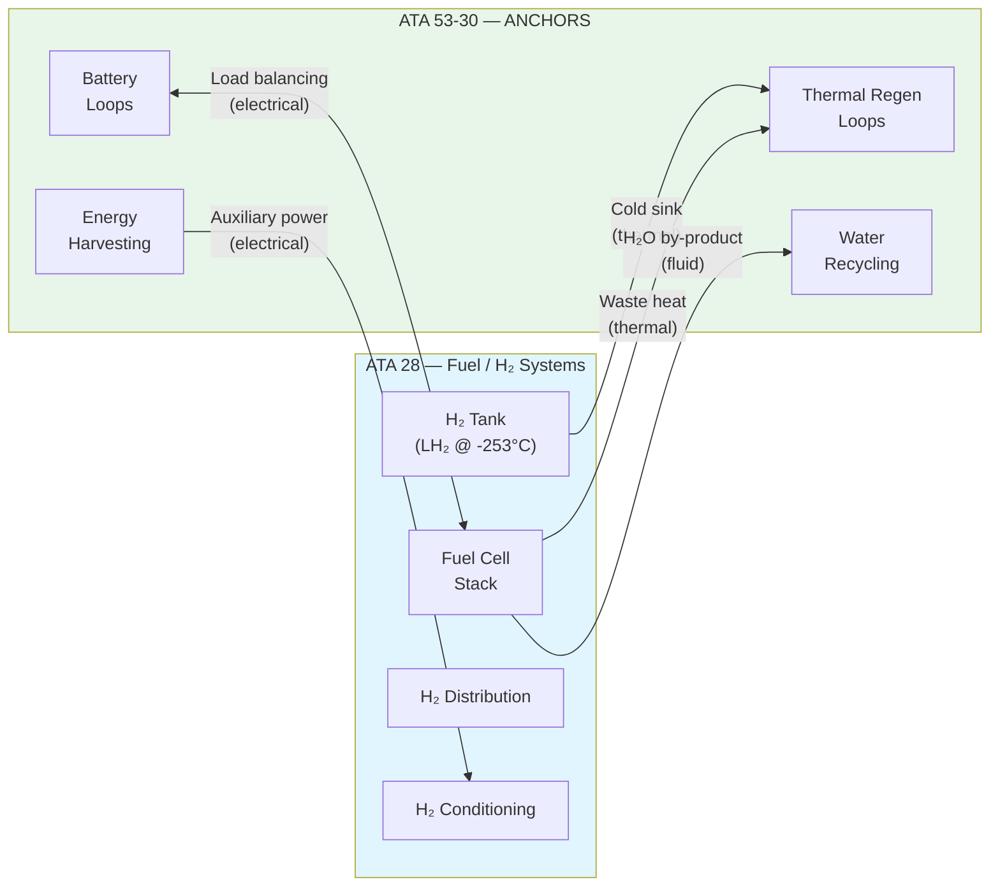
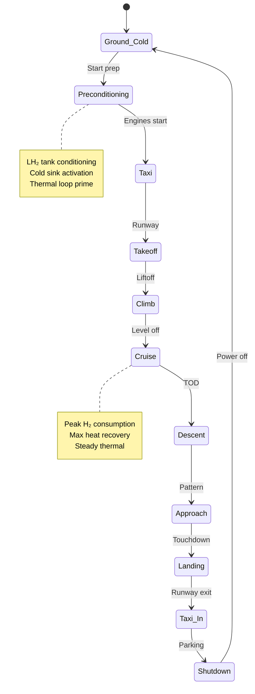

# ATA 53-30 ↔ ATA 28 — Integration & Interface Control

| Field | Value |
|-------|-------|
| **Document ID** | ATA53-30-00-05-ICD-28-00-001 |
| **Version** | 1.0 |
| **Date** | 2025-11-26 |
| **Status** | DRAFT |
| **Classification** | Unclassified |
| **From ATA** | 53-30 — ANCHORS (Aircraft Networks, Circular, Harvesting, Operating & Renewable Systems) |
| **To ATA** | 28 — Fuel / H₂ Energy Systems |
| **Domain** | Circularity & Energy Integration |
| **Axis (OPT-IN)** | T — Technology / I — Infrastructures |
| **Owner** | AMPEL360 Circularity Systems WG + Fuel/H₂ Systems WG |
| **Repository** | AMPEL360-BWB-H2-Hy-E |

---

## Navigation

### Breadcrumb
`AMPEL360-BWB-H2-Hy-E` / `OPT-IN_FRAMEWORK` / `T-TECHNOLOGY` / `A-AIRFRAME` / `ATA_53-FUSELAGE` / `53-30_ANCHORS` / `53-30-00_GENERAL` / `53-30-00-05_Interfaces`

### Sibling ICDs
| ICD | Path | Interface |
|-----|------|-----------|
| ICD 21-00 ECS | [`./53-30-00-05_ICD_21-00_ECS.md`](./53-30-00-05_ICD_21-00_ECS.md) | Cabin air, thermal |
| ICD 24-80 Electrical | [`./53-30-00-05_ICD_24-80_Electrical_Power.md`](./53-30-00-05_ICD_24-80_Electrical_Power.md) | Power distribution |
| **ICD 28-00 Fuel** | **This document** | H₂ by-products, thermal |
| ICD 38-60 H₂ Storage | [`./53-30-00-05_ICD_38-60_H2_Storage.md`](./53-30-00-05_ICD_38-60_H2_Storage.md) | Tank interfaces |
| ICD 53-50 Structures | [`./53-30-00-05_ICD_53-50_Structures.md`](./53-30-00-05_ICD_53-50_Structures.md) | Structural integration |
| ICD 85-30 Ground | [`./53-30-00-05_ICD_85-30_Ground_Circularity.md`](./53-30-00-05_ICD_85-30_Ground_Circularity.md) | Ground services |
| ICD 95-40 Neural Networks | [`./53-30-00-05_ICD_95-40_Neural_Networks.md`](./53-30-00-05_ICD_95-40_Neural_Networks.md) | AI/ML integration |

### Parent Documents
| Document | Path | Relationship |
|----------|------|--------------|
| ICD Master | [`./53-30-00-05_ICD_Master.md`](./53-30-00-05_ICD_Master.md) | Interface governance |
| ANCHORS System Architecture | [`../53-30-00-01_Overview/53-30-00-01_System_Architecture.md`](../53-30-00-01_Overview/53-30-00-01_System_Architecture.md) | System context |
| H₂/CO₂ Safety Provisions | [`../53-30-00-02_Safety/53-30-00-02_H2_CO2_Safety_Provisions.md`](../53-30-00-02_Safety/53-30-00-02_H2_CO2_Safety_Provisions.md) | Safety requirements |

---

## 1. Purpose

This Interface Control Document (ICD) defines the **physical, electrical, data, fluid, and thermal interfaces** between:

- **53-30 ANCHORS** — Circularity and resource recovery systems integrated into the fuselage
- **28-00 Fuel / H₂ Energy Systems** — Hydrogen storage, distribution, and fuel cell systems

The interface enables:
- Recovery of **waste heat** from H₂ storage and fuel cells for ANCHORS thermal loops
- **Water by-product** capture from fuel cell operation for water recycling
- **Thermal management** coordination between H₂ systems and battery loops
- **Energy flow** optimization between harvesting systems and fuel cells

---

## 2. Interface Overview

---

## 3. Interface Identification

### 3.1 Physical Interfaces

| Interface ID | Description | From | To | Type | Location |
|--------------|-------------|------|-----|------|----------|
| IF-28-001 | H₂ tank cold sink connection | H₂ Tank | Thermal Loop | Fluid | Zone 400 |
| IF-28-002 | Fuel cell heat exchanger | Fuel Cell | Thermal Loop | Fluid | Zone 300 |
| IF-28-003 | FC water by-product drain | Fuel Cell | Water Collection | Fluid | Zone 300 |
| IF-28-004 | Thermal expansion joint | H₂ Distribution | Structure | Mechanical | Zone 400 |
| IF-28-005 | Mounting bracket interface | FC Assembly | Fuselage | Mechanical | Zone 300 |

### 3.2 Electrical Interfaces

| Interface ID | Description | Voltage | Current | Connector | Standard |
|--------------|-------------|---------|---------|-----------|----------|
| IF-28-E01 | FC auxiliary power feed | 28 VDC | 15 A max | MIL-DTL-38999 | MIL-STD-704 |
| IF-28-E02 | Load balancing bus | 270 VDC | 50 A max | ARINC 600 | DO-160G |
| IF-28-E03 | H₂ sensor data | 5 VDC | 100 mA | M12 | IEC 61076 |
| IF-28-E04 | Emergency disconnect | 28 VDC | 2 A | Circular | SAE AS50151 |

### 3.3 Data Interfaces

| Interface ID | Description | Protocol | Rate | Bus |
|--------------|-------------|----------|------|-----|
| IF-28-D01 | H₂ tank status | ARINC 429 | 100 Hz | Label 310 |
| IF-28-D02 | FC operating parameters | CAN 2.0B | 500 kbps | CAN-B |
| IF-28-D03 | Thermal management requests | ARINC 664 | 10 ms | VL-1028 |
| IF-28-D04 | Water flow telemetry | CAN 2.0B | 100 kbps | CAN-C |

### 3.4 Fluid Interfaces

| Interface ID | Description | Medium | Pressure | Temp | Flow | Connector |
|--------------|-------------|--------|----------|------|------|-----------|
| IF-28-F01 | Cold sink coolant supply | 50% PGW | 3.5 bar | -40°C to +20°C | 5 L/min | AS4395 |
| IF-28-F02 | Cold sink coolant return | 50% PGW | 2.0 bar | +10°C to +40°C | 5 L/min | AS4395 |
| IF-28-F03 | FC heat exchanger supply | 50% PGW | 4.0 bar | +40°C to +70°C | 12 L/min | AS4395 |
| IF-28-F04 | FC heat exchanger return | 50% PGW | 2.5 bar | +50°C to +85°C | 12 L/min | AS4395 |
| IF-28-F05 | FC water by-product | H₂O (pure) | 0.5 bar | +30°C to +60°C | 0.5 L/min | AN832 |

### 3.5 Thermal Interfaces

| Interface ID | Description | Heat Flow | Temperature | Location |
|--------------|-------------|-----------|-------------|----------|
| IF-28-T01 | LH₂ tank cold sink | -15 kW (cooling) | -40°C nominal | Zone 400 |
| IF-28-T02 | FC waste heat recovery | +25 kW (heating) | +65°C nominal | Zone 300 |
| IF-28-T03 | H₂ line trace heating | +2 kW | Maintain >-20°C | Distribution |
| IF-28-T04 | Thermal barrier | Insulation | ΔT > 100°C | Tank interface |

---

## 4. Interface Requirements

### 4.1 From ANCHORS (53-30) to Fuel Systems (28)

| Req ID | Requirement | Rationale | Verification |
|--------|-------------|-----------|--------------|
| ICD-28-R001 | ANCHORS shall accept cold sink coolant at -40°C to +20°C | LH₂ cold recovery | Test |
| ICD-28-R002 | Thermal loops shall manage FC waste heat up to 30 kW | FC thermal management | Analysis + Test |
| ICD-28-R003 | Water recycling shall accept FC by-product water | Resource recovery | Test |
| ICD-28-R004 | Battery loops shall coordinate with FC power management | Load balancing | Test |
| ICD-28-R005 | Energy harvesting shall provide auxiliary power to H₂ conditioning | Efficiency | Analysis |

### 4.2 From Fuel Systems (28) to ANCHORS (53-30)

| Req ID | Requirement | Rationale | Verification |
|--------|-------------|-----------|--------------|
| ICD-28-R101 | H₂ systems shall provide cold sink connection per IF-28-F01/F02 | Thermal integration | Inspection |
| ICD-28-R102 | Fuel cells shall provide water by-product drain per IF-28-F05 | Water recovery | Test |
| ICD-28-R103 | H₂ systems shall provide operating data per IF-28-D01/D02 | Monitoring | Test |
| ICD-28-R104 | FC shall accept auxiliary power from ANCHORS per IF-28-E01 | Efficiency | Test |
| ICD-28-R105 | H₂ systems shall coordinate thermal requests per IF-28-D03 | Optimization | Analysis |

---

## 5. Interface Coordination

### 5.1 Operating Modes

### 5.2 Mode-Specific Interface States

| Mode | Cold Sink | Heat Recovery | Water Capture | Load Balance |
|------|-----------|---------------|---------------|--------------|
| Ground Cold | OFF | OFF | OFF | Standby |
| Preconditioning | ACTIVE | Warming | Ready | Charging |
| Taxi | ACTIVE | LOW | ACTIVE | Balancing |
| Takeoff | ACTIVE | HIGH | ACTIVE | Peak demand |
| Cruise | ACTIVE | MAX | ACTIVE | Optimized |
| Descent | REDUCED | MEDIUM | ACTIVE | Regenerating |
| Landing | REDUCED | LOW | ACTIVE | Balancing |
| Shutdown | OFF | Cooling | Draining | Standby |

---

## 6. Safety Considerations

### 6.1 Hydrogen Safety at Interface

| Hazard | Interface | Mitigation | FHA Ref |
|--------|-----------|------------|---------|
| H₂ leak at thermal connection | IF-28-F01/F02 | Double containment, leak detection | FC-H2-001 |
| H₂ ignition from electrical | IF-28-E01–E04 | ATEX/IECEx rated, physical separation | FC-H2-002 |
| Cryogenic burns | IF-28-T01 | Thermal barriers, insulation | FC-H2-003 |
| Over-pressure | IF-28-F03/F04 | Relief valves, pressure monitoring | FC-H2-004 |

### 6.2 Integration Safety Requirements

| Req ID | Requirement | Standard | Verification |
|--------|-------------|----------|--------------|
| ICD-28-S001 | H₂ interface zone shall be ventilated to 10 ACH minimum | CS 25.863 | Analysis + Test |
| ICD-28-S002 | Electrical interfaces in H₂ zone shall be ATEX rated | IEC 60079 | Inspection |
| ICD-28-S003 | Automatic isolation on H₂ detection > 0.5% | SAE AS6171 | Test |
| ICD-28-S004 | Thermal interface shall prevent ignition sources | CS 25.869 | Analysis |

---

## 7. Verification Requirements

### 7.1 Interface Verification Matrix

| Interface | Inspection | Analysis | Test | Demonstration |
|-----------|------------|----------|------|---------------|
| IF-28-001 | ✓ | ✓ | ✓ | |
| IF-28-002 | ✓ | ✓ | ✓ | |
| IF-28-003 | ✓ | | ✓ | |
| IF-28-E01–E04 | ✓ | ✓ | ✓ | |
| IF-28-D01–D04 | | ✓ | ✓ | |
| IF-28-F01–F05 | ✓ | ✓ | ✓ | |
| IF-28-T01–T04 | ✓ | ✓ | ✓ | |

### 7.2 Integration Test Requirements

| Test ID | Description | Interfaces | Success Criteria |
|---------|-------------|------------|------------------|
| IVT-28-001 | Cold sink thermal performance | IF-28-T01, IF-28-F01/F02 | ≥15 kW cooling at -40°C |
| IVT-28-002 | Heat recovery efficiency | IF-28-T02, IF-28-F03/F04 | ≥80% recovery at cruise |
| IVT-28-003 | Water by-product capture | IF-28-F05 | ≥90% capture rate |
| IVT-28-004 | Data bus integration | IF-28-D01–D04 | No data loss, <10ms latency |
| IVT-28-005 | Load balancing coordination | IF-28-E02 | Stable within ±5% |

---

## 8. Configuration Management

### 8.1 Interface Baseline

| Baseline | Date | Status | Description |
|----------|------|--------|-------------|
| ICD-28-BL-001 | 2025-11-26 | Current | Initial interface definition |
| ICD-28-BL-002 | TBD | Planned | Post-PDR updates |
| ICD-28-BL-003 | TBD | Planned | Post-CDR freeze |

### 8.2 Change Control

Changes to this ICD require approval from:
- ANCHORS System Lead
- Fuel/H₂ Systems Lead
- Integration Authority
- Safety Review Board (for safety-related changes)

---

## 9. Open Items

| Item | Description | Owner | Due Date | Status |
|------|-------------|-------|----------|--------|
| OI-28-001 | Finalize cold sink flow rates | Thermal WG | 2025-12-15 | Open |
| OI-28-002 | FC heat exchanger sizing confirmation | H₂ Systems | 2025-12-20 | Open |
| OI-28-003 | Water quality specification for by-product | Water WG | 2025-12-10 | Open |
| OI-28-004 | ARINC 664 VL assignment | Avionics | 2026-01-15 | Open |

---

## Document Control

- Generated with the assistance of AI (GitHub Copilot), prompted by **Amedeo Pelliccia**.
- Status: **DRAFT** — Subject to human review and approval.
- Human approver: _[to be completed]_.
- Repository: `AMPEL360-BWB-H2-Hy-E`
- Last AI update: 2025-11-26

---

*END OF DOCUMENT*
