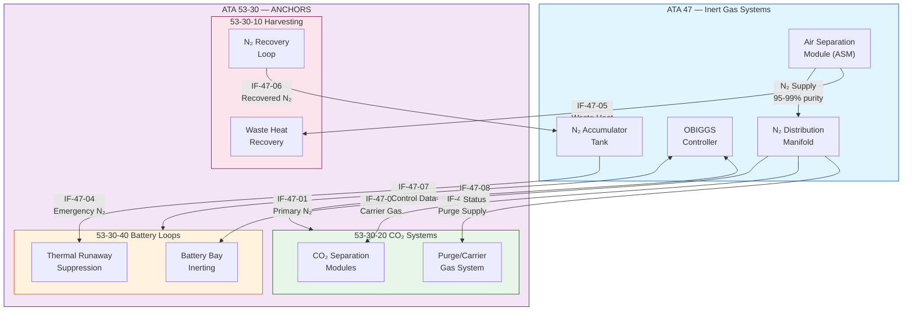
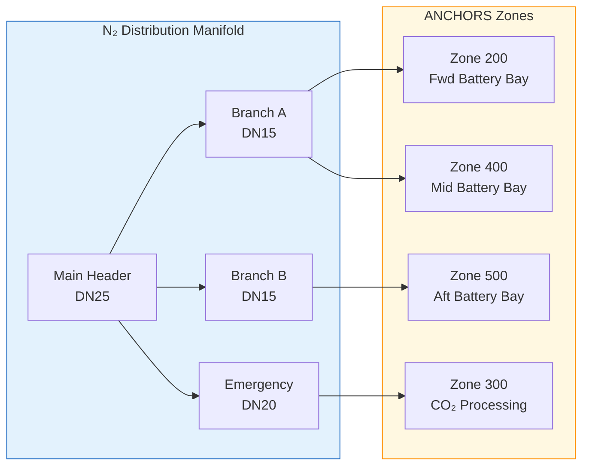
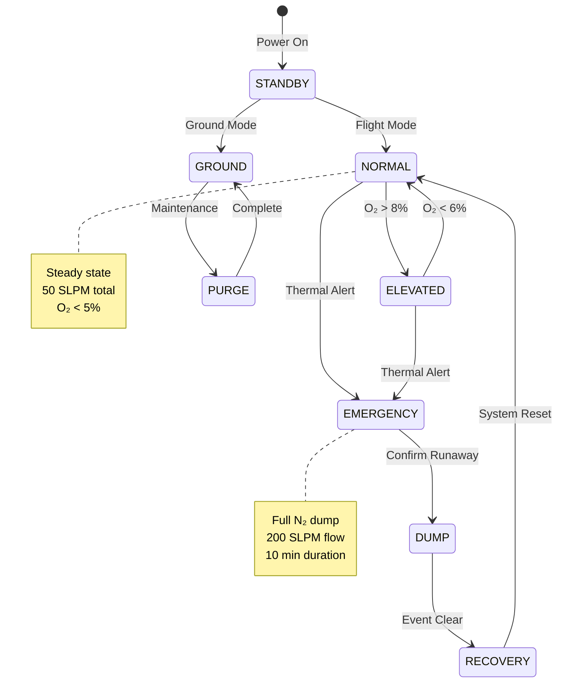
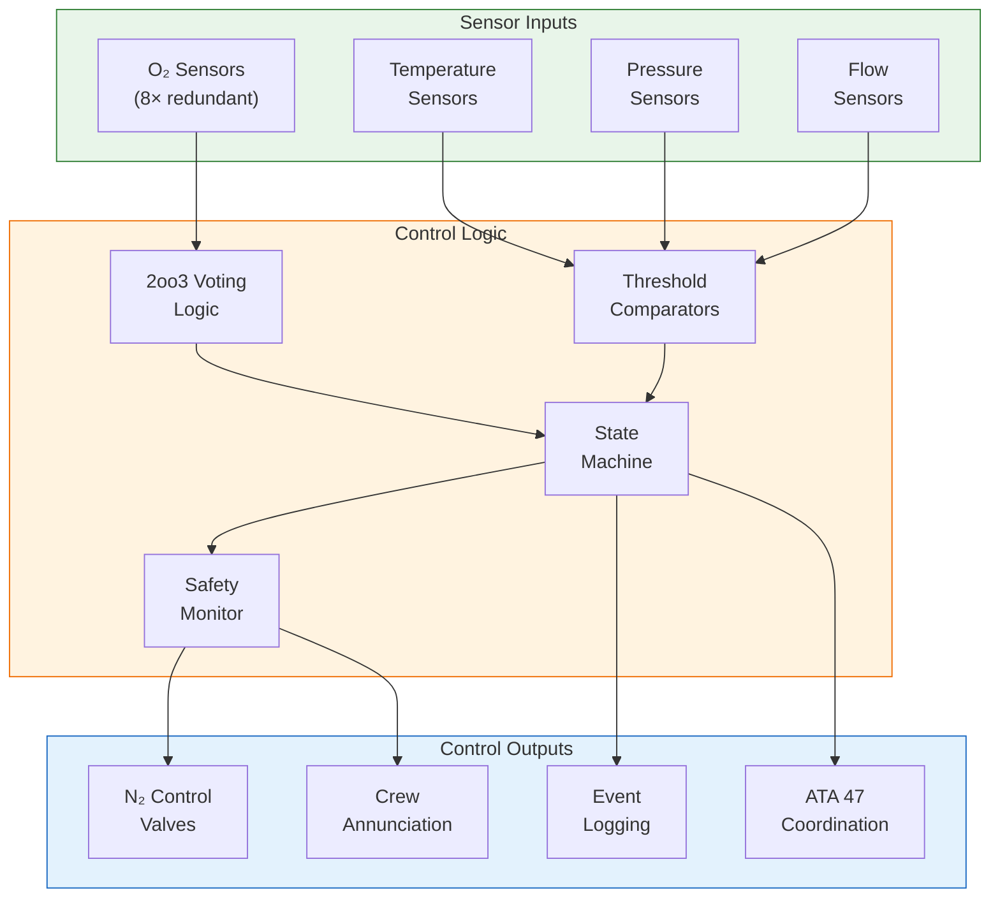
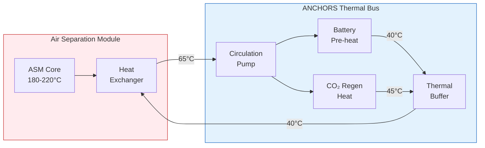
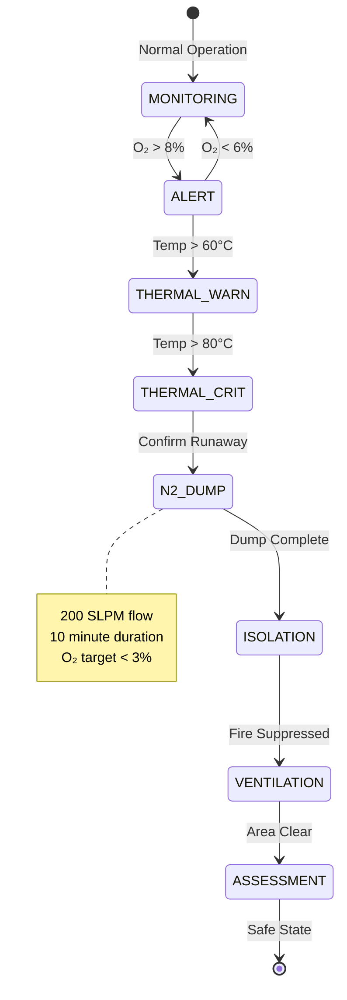

# ATA 53-30 ↔ ATA 47 — Integration & Interface Control

| Field | Value |
|-------|-------|
| **Document ID** | ATA53-30-00-05-ICD-47-00-001 |
| **Version** | 1.0 |
| **Date** | 2025-11-26 |
| **Status** | DRAFT |
| **Classification** | Unclassified |
| **From ATA** | 53-30 — ANCHORS (Aircraft Networks, Circular, Harvesting, Operating & Renewable Systems) |
| **To ATA** | 47 — Inert Gas / N₂ Systems (OBIGGS) |
| **Domain** | Safety Systems Integration & Energy Optimization |
| **Axis (OPT-IN)** | T — Technology |
| **Owner** | AMPEL360 Circularity Systems WG + Fuel Safety Systems WG |
| **Repository** | AMPEL360-BWB-H2-Hy-E |

---

## Navigation

### Breadcrumb
`AMPEL360-BWB-H2-Hy-E` / `OPT-IN_FRAMEWORK` / `T-TECHNOLOGY` / `A-AIRFRAME` / `ATA_53-FUSELAGE` / `53-30_ANCHORS` / `53-30-00_GENERAL` / `53-30-00-05_Interfaces`

### Sibling ICDs
| ICD | Path | Interface |
|-----|------|-----------|
| ICD 21-00 ECS | [`./53-30-00-05_ICD_21-00_ECS.md`](./53-30-00-05_ICD_21-00_ECS.md) | Cabin air, thermal |
| ICD 24-80 Electrical | [`./53-30-00-05_ICD_24-80_Electrical_Power.md`](./53-30-00-05_ICD_24-80_Electrical_Power.md) | Power distribution |
| ICD 28-00 Fuel | [`./53-30-00-05_ICD_28-00_Fuel.md`](./53-30-00-05_ICD_28-00_Fuel.md) | H₂ by-products |
| ICD 38-60 H₂ Storage | [`./53-30-00-05_ICD_38-60_H2_Storage.md`](./53-30-00-05_ICD_38-60_H2_Storage.md) | H₂ tank thermal |
| **ICD 47-00 Inert Gas** | **This document** | N₂/OBIGGS integration |
| ICD 53-50 Structures | [`./53-30-00-05_ICD_53-50_Structures.md`](./53-30-00-05_ICD_53-50_Structures.md) | Structural mounting |
| ICD 85-30 Ground | [`./53-30-00-05_ICD_85-30_Ground_Circularity.md`](./53-30-00-05_ICD_85-30_Ground_Circularity.md) | Ground services |
| ICD 95-40 Neural Networks | [`./53-30-00-05_ICD_95-40_Neural_Networks.md`](./53-30-00-05_ICD_95-40_Neural_Networks.md) | AI/ML integration |

### Parent Documents
| Document | Path | Relationship |
|----------|------|--------------|
| ANCHORS ICD Master | [`./53-30-00-05_ICD_Master.md`](./53-30-00-05_ICD_Master.md) | Master interface document |
| System Architecture | [`../53-30-00-01_Overview/53-30-00-01_System_Architecture.md`](../53-30-00-01_Overview/53-30-00-01_System_Architecture.md) | Architecture context |
| H₂/CO₂ Safety | [`../53-30-00-02_Safety/53-30-00-02_H2_CO2_Safety_Provisions.md`](../53-30-00-02_Safety/53-30-00-02_H2_CO2_Safety_Provisions.md) | Safety provisions |

---

## 1. Purpose

This Interface Control Document (ICD) defines the **physical, pneumatic, electrical, data, and safety interfaces** between:

- **ATA 53-30 ANCHORS** — Circularity and regenerative systems within the fuselage
- **ATA 47 Inert Gas Systems** — On-Board Inert Gas Generation System (OBIGGS) and N₂ distribution

The interface supports:
1. **Battery bay inerting** — N₂ supply for thermal runaway mitigation
2. **CO₂ separation by-product handling** — N₂ as carrier gas and purge medium
3. **H₂ zone inerting** — Coordination with fuel tank inerting
4. **Waste heat recovery** — Heat from OBIGGS air separation modules
5. **Circular gas recovery** — N₂ recirculation and purity monitoring

---

## 2. Interface Overview

---

## 3. Interface Register

### 3.1 Interface Summary Table

| IF ID | Interface Name | Type | From | To | Priority |
|-------|---------------|------|------|-----|----------|
| IF-47-01 | Primary N₂ Supply | Pneumatic | ATA 47 | Battery Bays | CRITICAL |
| IF-47-02 | CO₂ Carrier Gas | Pneumatic | ATA 47 | CO₂ Separation | HIGH |
| IF-47-03 | Purge Gas Supply | Pneumatic | ATA 47 | ANCHORS General | MEDIUM |
| IF-47-04 | Emergency N₂ Dump | Pneumatic | ATA 47 | Thermal Suppression | CRITICAL |
| IF-47-05 | ASM Waste Heat | Thermal | ATA 47 | Harvesting | MEDIUM |
| IF-47-06 | N₂ Recovery Return | Pneumatic | ANCHORS | ATA 47 | LOW |
| IF-47-07 | Inerting Control | Data | Both | Both | HIGH |
| IF-47-08 | Status/Health | Data | Both | Both | MEDIUM |
| IF-47-09 | Electrical Power | Electrical | ATA 24 | Both | HIGH |
| IF-47-10 | Physical Mounting | Mechanical | ATA 53 | Both | MEDIUM |

---

## 4. Physical Interfaces

### 4.1 N₂ Distribution Points

### 4.2 Connection Specifications

| Connection Point | Location | Connector Type | Size | Pressure Rating |
|-----------------|----------|---------------|------|-----------------|
| CP-47-01 | Zone 200 Fwd | AS4395 Quick-Disconnect | DN15 | 10 bar |
| CP-47-02 | Zone 400 Mid | AS4395 Quick-Disconnect | DN15 | 10 bar |
| CP-47-03 | Zone 500 Aft | AS4395 Quick-Disconnect | DN15 | 10 bar |
| CP-47-04 | Zone 300 CO₂ | MS33656 Flare | DN10 | 8 bar |
| CP-47-05 | Emergency Header | AN816 Boss | DN20 | 15 bar |
| CP-47-06 | Recovery Return | AS4395 Quick-Disconnect | DN10 | 3 bar |

### 4.3 Physical Envelope

| Parameter | Value | Tolerance | Notes |
|-----------|-------|-----------|-------|
| Manifold Length | 4,200 mm | ±50 mm | Main distribution |
| Branch Runs (typ) | 800 mm | ±25 mm | To each bay |
| Mounting Pitch | 400 mm | ±5 mm | Bracket spacing |
| Clearance to Structure | 50 mm | min | Thermal isolation |
| Total Dry Mass | 12.5 kg | ±1.0 kg | Manifold + fittings |

---

## 5. Pneumatic Interfaces

### 5.1 N₂ Supply Specifications

| Parameter | Normal | Emergency | Units | Standard |
|-----------|--------|-----------|-------|----------|
| Supply Pressure | 6.0 | 10.0 | bar | SAE AS8005 |
| Flow Rate (total) | 50 | 200 | SLPM | — |
| Purity (O₂ content) | <5% | <3% | vol% | MIL-PRF-27210 |
| Moisture Content | <50 | <50 | ppm | — |
| Temperature | 15–40 | 10–50 | °C | — |
| Response Time | — | <5 | s | Emergency dump |

### 5.2 N₂ Consumption by Zone

| Zone | Normal (SLPM) | Emergency (SLPM) | Duration | Purpose |
|------|---------------|------------------|----------|---------|
| Battery Bay Fwd | 15 | 80 | Continuous/10 min | Inerting/Suppression |
| Battery Bay Mid | 15 | 80 | Continuous/10 min | Inerting/Suppression |
| Battery Bay Aft | 10 | 40 | Continuous/10 min | Inerting/Suppression |
| CO₂ Processing | 8 | — | Continuous | Carrier gas |
| Purge General | 2 | — | Periodic | Maintenance purge |

### 5.3 Operating Modes

---

## 6. Electrical Interfaces

### 6.1 Power Requirements

| Equipment | Voltage | Current | Power | Redundancy |
|-----------|---------|---------|-------|------------|
| N₂ Control Valves (×6) | 28 VDC | 2.0 A each | 12 W each | Dual |
| O₂ Sensors (×8) | 28 VDC | 0.5 A each | 4 W each | Triple |
| Pressure Sensors (×4) | 28 VDC | 0.2 A each | 2 W each | Dual |
| Interface Controller | 28 VDC | 5.0 A | 140 W | Dual |
| **Total** | — | — | **~250 W** | — |

### 6.2 Connector Specifications

| Connector | Type | Pins | Function | Location |
|-----------|------|------|----------|----------|
| J47-01 | MIL-DTL-38999 III | 19 | Control valves | Zone 200 |
| J47-02 | MIL-DTL-38999 III | 19 | Control valves | Zone 400 |
| J47-03 | MIL-DTL-38999 III | 19 | Control valves | Zone 500 |
| J47-04 | MIL-DTL-38999 III | 37 | Sensors aggregate | Zone 300 |
| J47-05 | D38999/26WJ35SN | 100 | ARINC 429 data | Avionics bay |

---

## 7. Data Interfaces

### 7.1 ARINC 429 Interface

| Label | Parameter | Rate | Source | Destination |
|-------|-----------|------|--------|-------------|
| 350 | N₂ Supply Pressure | 12.5 Hz | ATA 47 | ANCHORS |
| 351 | N₂ Flow Rate | 12.5 Hz | ATA 47 | ANCHORS |
| 352 | O₂ Concentration Fwd | 25 Hz | ANCHORS | ATA 47 |
| 353 | O₂ Concentration Mid | 25 Hz | ANCHORS | ATA 47 |
| 354 | O₂ Concentration Aft | 25 Hz | ANCHORS | ATA 47 |
| 355 | Inerting Demand | 12.5 Hz | ANCHORS | ATA 47 |
| 356 | Emergency Trigger | 50 Hz | ANCHORS | ATA 47 |
| 357 | System Status | 12.5 Hz | Both | Both |

### 7.2 Discrete Signals

| Signal | Type | Function | Response Time |
|--------|------|----------|---------------|
| N2_AVAIL | Input | N₂ system ready | — |
| INERT_REQ | Output | Inerting request | <100 ms |
| EMERG_DUMP | Output | Emergency dump command | <50 ms |
| DUMP_ACK | Input | Dump acknowledged | <100 ms |
| O2_HIGH_WARN | Output | O₂ > 8% warning | <200 ms |
| O2_HIGH_FAULT | Output | O₂ > 12% fault | <100 ms |

### 7.3 Control Logic

---

## 8. Thermal Interfaces

### 8.1 ASM Waste Heat Recovery

| Parameter | Value | Units | Notes |
|-----------|-------|-------|-------|
| ASM Operating Temp | 180–220 | °C | Air separation |
| Available Heat | 2.5–4.0 | kW | Continuous |
| Coolant Interface | Glycol/Water | — | 50/50 mix |
| Coolant Flow | 5–8 | L/min | Variable |
| Coolant Temp In | 40 | °C | From ANCHORS |
| Coolant Temp Out | 65 | °C | To thermal bus |

### 8.2 Heat Recovery Integration

---

## 9. Safety Considerations

### 9.1 Hazard Cross-Reference

| Hazard ID | Description | FHA Ref | Mitigation | ATA 47 Role |
|-----------|-------------|---------|------------|-------------|
| HAZ-47-01 | Loss of N₂ supply | FC-005 | Redundant ASM, accumulator | Primary supplier |
| HAZ-47-02 | Insufficient inerting | FC-005 | O₂ monitoring, backup supply | Flow assurance |
| HAZ-47-03 | Asphyxiation risk | FC-018 | O₂ monitoring in crew areas | Leak detection coord |
| HAZ-47-04 | Over-pressure | FC-012 | Relief valves, pressure limits | Pressure regulation |
| HAZ-47-05 | N₂ leak in bay | FC-003 | Leak detection, ventilation | Supply isolation |

### 9.2 Safety Interlocks

| Interlock | Condition | Action | Reset |
|-----------|-----------|--------|-------|
| IL-47-01 | O₂ > 12% in battery bay | Emergency N₂ dump | Manual |
| IL-47-02 | N₂ pressure < 4 bar | Switch to accumulator | Auto |
| IL-47-03 | Thermal runaway detected | Full dump activation | Manual |
| IL-47-04 | Bay door open | N₂ supply isolation | Auto |
| IL-47-05 | Crew area O₂ < 19.5% | N₂ supply reduction | Auto |

### 9.3 Emergency Procedures

---

## 10. Regulatory Compliance

### 10.1 Applicable Standards

| Standard | Title | Applicability |
|----------|-------|---------------|
| [CS 25.1309](https://www.easa.europa.eu/en/document-library/certification-specifications/cs-25) | Equipment, Systems, Installations | Safety assessment |
| [CS 25.831](https://www.easa.europa.eu/en/document-library/certification-specifications/cs-25) | Ventilation | Crew/passenger O₂ |
| [CS 25.981](https://www.easa.europa.eu/en/document-library/certification-specifications/cs-25) | Fuel Tank Ignition Prevention | Inerting requirements |
| [14 CFR 25.981](https://www.ecfr.gov/current/title-14/chapter-I/subchapter-C/part-25) | Fuel Tank Ignition Prevention | FAA equivalent |
| SAE AS6401 | OBIGGS Performance | System design |
| MIL-PRF-27210 | Nitrogen, Technical | Gas purity |

### 10.2 Certification Approach

| Requirement | Method of Compliance | Evidence |
|-------------|---------------------|----------|
| N₂ purity | Analysis + Test | Gas chromatography |
| Flow adequacy | Analysis + Test | Flow bench testing |
| Emergency response | Test | Emergency dump test |
| O₂ monitoring accuracy | Test | Sensor calibration |
| System reliability | Analysis | FMEA, FTA |

---

## 11. Verification Requirements

### 11.1 Interface Verification Matrix

| IF ID | Verification Method | Test Level | Acceptance Criteria |
|-------|--------------------:|------------|---------------------|
| IF-47-01 | Test | System | Flow ≥ 50 SLPM @ 6 bar |
| IF-47-02 | Test | System | Flow ≥ 10 SLPM @ 4 bar |
| IF-47-03 | Test | System | Flow ≥ 5 SLPM @ 4 bar |
| IF-47-04 | Test | System | Flow ≥ 200 SLPM @ 10 bar |
| IF-47-05 | Analysis + Test | Component | ΔT ≥ 20°C |
| IF-47-06 | Test | System | Return flow ≥ 5 SLPM |
| IF-47-07 | Inspection + Test | Integration | ARINC 429 compliance |
| IF-47-08 | Test | Integration | Response < 100 ms |

### 11.2 Integration Test Requirements

| Test ID | Description | Configuration | Pass Criteria |
|---------|-------------|---------------|---------------|
| IVT-47-01 | Normal inerting | Full system | O₂ < 5% in 10 min |
| IVT-47-02 | Emergency dump | Full system | O₂ < 3% in 2 min |
| IVT-47-03 | Loss of primary N₂ | Degraded | Auto-switch to accumulator |
| IVT-47-04 | Heat recovery | Full system | Heat transfer ≥ 2.5 kW |
| IVT-47-05 | Control handover | Full system | Seamless ATA 47 coordination |
| IVT-47-06 | Leak detection | Simulated leak | Detection < 30 s |

---

## 12. Configuration Control

### 12.1 Interface Baselines

| Baseline | Date | Status | Description |
|----------|------|--------|-------------|
| ICD-47-00-BL-001 | 2025-11-26 | Current | Initial release |

### 12.2 Change Control

Changes to this ICD require:
1. Impact assessment on both ATA 47 and ATA 53-30 systems
2. Safety review per [SAP](../53-30-00-02_Safety/53-30-00-02_Safety_Assessment_Plan.md)
3. Joint approval from Circularity Systems WG and Fuel Safety Systems WG
4. Update to [ICD Master](./53-30-00-05_ICD_Master.md)

---

## 13. Open Items

| Item | Description | Owner | Target Date | Status |
|------|-------------|-------|-------------|--------|
| OI-47-01 | Finalize ASM heat recovery interface | Thermal WG | TBD | OPEN |
| OI-47-02 | N₂ purity sensor specification | ATA 47 Lead | TBD | OPEN |
| OI-47-03 | Emergency dump test procedure | V&V Team | TBD | OPEN |
| OI-47-04 | N₂ recovery loop sizing | ANCHORS WG | TBD | OPEN |

---

## Document Control

- Generated with the assistance of AI (GitHub Copilot), prompted by **Amedeo Pelliccia**.
- Status: **DRAFT** – Subject to human review and approval.
- Human approver: _[to be completed]_.
- Repository: `AMPEL360-BWB-H2-Hy-E`
- Last AI update: _2025-11-26_.

---

*END OF DOCUMENT*
