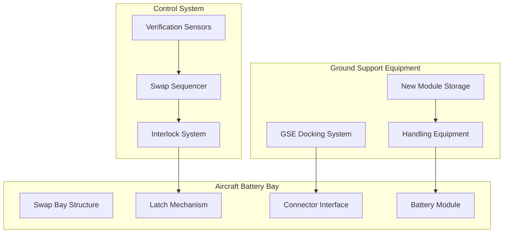
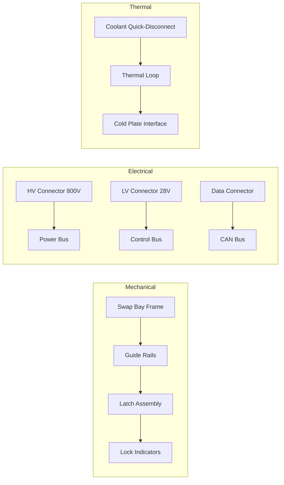
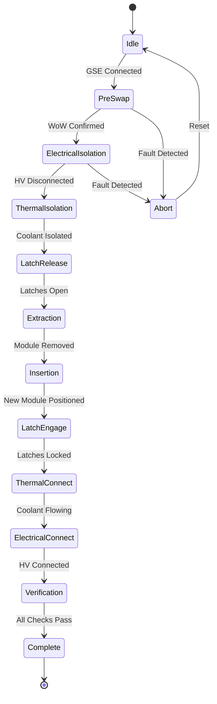

# 53-30-40-01 — QuickSwap Units System Description

| Field              | Value                  |
| ------------------ | ---------------------- |
| **Document ID**    | ATA53-30-40-01-SYS-001 |
| **Version**        | 1.2                    |
| **Date**           | 2025-11-25             |
| **Status**         | DRAFT                  |
| **Classification** | Unclassified           |

---

## Repository Context

**Repository path:**
`OPT-IN_FRAMEWORK/T-TECHNOLOGY_AMEDEOPELLICCIA-ON_BOARD_SYSTEMS/A-AIRFRAME/ATA_53-FUSELAGE/53-30_ANCHORS/53-30-40_Battery_Loops/53-30-40-01_QuickSwap_Units/53-30-40-01_System_Description.md`

**ATA banding:**

* ATA Chapter: **53 — Fuselage**
* Sub-Chapter: **53-30 — ANCHORS (Aircraft Networks, Circular, Harvesting, Operating & Renewable Systems)**
* System: **53-30-40 — Battery Loops**
* Subsystem: **53-30-40-01 — QuickSwap Units**

---

## Navigation

### Breadcrumb

`OPT-IN_FRAMEWORK` / `T-TECHNOLOGY` / `A-AIRFRAME` / `ATA_53-FUSELAGE` / `53-30_ANCHORS` / `53-30-40_Battery_Loops` / `53-30-40-01_QuickSwap_Units`

### Parent Documents

| Document               | Path                                                                 | Relationship        |
| ---------------------- | -------------------------------------------------------------------- | ------------------- |
| Battery Loops Overview | [53-30-40-00_Battery_Loop_Overview.md](../53-30-40-00_GENERAL/53-30-40-00_Battery_Loop_Overview.md) | Parent system       |
| ANCHORS Overview       | [53-30-00-01_ANCHORS_Definition.md](../../53-30-00_GENERAL/53-30-00-01_Overview/53-30-00-01_ANCHORS_Definition.md) | Chapter overview    |
| Safety Assessment Plan | [53-30-00-02_Safety_Assessment_Plan.md](../../53-30-00_GENERAL/53-30-00-02_Safety/53-30-00-02_Safety_Assessment_Plan.md) | Safety context      |

### Sibling Documents

| Document                  | Path                                                                           | Relationship   |
| ------------------------- | ------------------------------------------------------------------------------ | -------------- |
| Thermal Regen Loops       | [53-30-40-02_System_Description.md](../53-30-40-02_Thermal_Regen_Loops/53-30-40-02_System_Description.md) | Sibling system |
| MicroCycle Packs          | [53-30-40-03_System_Description.md](../53-30-40-03_MicroCycle_Packs/53-30-40-03_System_Description.md) | Sibling system |
| DPP Traceability          | [53-30-40-04_System_Description.md](../53-30-40-04_DPP_Traceability/53-30-40-04_System_Description.md) | Sibling system |

### Child Documents

| Document                 | Path                                             | Relationship          |
| ------------------------ | ------------------------------------------------ | --------------------- |
| Requirements             | [53-30-40-01_Requirements.md](./53-30-40-01_Requirements.md) | Subsystem requirements |
| Design Spec              | [53-30-40-01_Design_Spec.md](./53-30-40-01_Design_Spec.md) | Detailed design       |
| Maintenance Manual       | [53-30-40-01_Maintenance_Manual.md](./53-30-40-01_Maintenance_Manual.md) | Maintenance procedures |

---

## 1. System Description

The QuickSwap Unit system enables rapid ground replacement of battery modules, minimizing turnaround time while maximizing battery circularity. This system is fundamental to the ANCHORS regenerative philosophy, allowing batteries to be recycled, refurbished, and redeployed across the fleet.

### 1.1 Functional Overview

---

## 2. Design Concept

The QuickSwap system consists of:

- **Swap Bay**: Structural housing in fuselage floor with thermal insulation
- **Battery Module**: Standardized removable battery pack (compatible with MicroCycle Packs)
- **Latch Mechanism**: Positive-lock mechanical engagement with triple redundancy
- **Connector Interface**: High-power electrical + cooling connections
- **GSE Interface**: Ground equipment docking provisions per ATA 85-30

### 2.1 System Architecture

---

## 3. Swap Mechanism

| Feature | Specification | Notes |
|:--|:--|:--|
| Latch type | Power-assisted mechanical | Hydraulic backup |
| Lock verification | Triple-redundant sensors | Position + force + electrical |
| Emergency release | Manual mechanical backup | Cable-actuated |
| Alignment | Self-centering guides | ±5mm tolerance |
| Seal rating | IP67 | Environmental protection |

**Cross-reference:** [53-30-40-01_Swap_Mechanism.md](./ASSETS/53-30-40-01_Swap_Mechanism.md)

---

## 4. Connector Specification

| Parameter | Value | Unit | Standard |
|:--|:--|:--|:--|
| Voltage rating | 800 | VDC | IEC 62196-3 |
| Current capacity | 500 | A continuous | SAE J3068 |
| Peak current | 750 | A (30s) | — |
| Contact material | Silver-plated copper | — | MIL-DTL-38999 |
| Cycles to failure | > 10,000 | — | DO-160G |
| Mating force | < 50 | N | Ergonomic limit |

**Cross-reference:** [53-30-40-01_Connector_Specification.md](./ASSETS/53-30-40-01_Connector_Specification.md)

---

## 5. Interlock Logic

Safety interlocks prevent unsafe operations per [CS 25.1309](https://www.easa.europa.eu/en/document-library/certification-specifications/cs-25):

| Condition | Action | Severity |
|:--|:--|:--|
| Aircraft not on ground | Swap inhibited | Critical |
| Weight on wheels not confirmed | Swap inhibited | Critical |
| Electrical load > 10A | Disconnect before release | Major |
| Coolant flow active | Coolant isolation required | Minor |
| GSE not connected | Warning only (manual mode) | Advisory |
| Battery temp > 45°C | Cooling delay required | Major |

### 5.1 Interlock State Machine

**Cross-reference:** [53-30-40-01_Interlock_Logic.md](./ASSETS/53-30-40-01_Interlock_Logic.md)

---

## 6. Swap Time Analysis

| Operation | Time (s) | Cumulative (s) | Notes |
|:--|:--|:--|:--|
| GSE connection | 30 | 30 | Automated alignment |
| Electrical disconnect | 15 | 45 | Verified isolation |
| Coolant isolation | 10 | 55 | Quick-disconnect |
| Latch release | 10 | 65 | Power-assisted |
| Module extraction | 45 | 110 | Guided removal |
| Fresh module insertion | 45 | 155 | Guided insertion |
| Latch engagement | 10 | 165 | Auto-verify |
| Coolant connect | 10 | 175 | Leak check |
| Electrical connect | 15 | 190 | Continuity verify |
| GSE disconnect | 10 | 200 | — |
| **Total** | **200** | — | **3.3 min** |

**Target:** < 5 minutes for complete swap cycle

**Cross-reference:** [53-30-40-01_Swap_Time_Analysis.csv](./ASSETS/DATA/53-30-40-01_Swap_Time_Analysis.csv)

---

## 7. Interface Summary

| Interface | Partner System | Type | Document |
|:--|:--|:--|:--|
| ICD-001 | ATA 24-80 Electrical Power | Electrical | [53-30-00-05_ICD_24-80_Electrical_Power.md](../../53-30-00_GENERAL/53-30-00-05_Interfaces/53-30-00-05_ICD_24-80_Electrical_Power.md) |
| ICD-002 | Thermal Regen Loops | Thermal | [53-30-40-02_System_Description.md](../53-30-40-02_Thermal_Regen_Loops/53-30-40-02_System_Description.md) |
| ICD-003 | ATA 85-30 Ground Circularity | GSE | [53-30-00-05_ICD_85-30_Ground_Circularity.md](../../53-30-00_GENERAL/53-30-00-05_Interfaces/53-30-00-05_ICD_85-30_Ground_Circularity.md) |
| ICD-004 | DPP Traceability | Data | [53-30-40-04_System_Description.md](../53-30-40-04_DPP_Traceability/53-30-40-04_System_Description.md) |

---

## 8. Safety Considerations

| Hazard ID | Hazard | Mitigation | FHA Reference |
|:--|:--|:--|:--|
| H-QS-001 | Inadvertent release in flight | WoW interlock + triple verification | [FC-005](../../53-30-00_GENERAL/53-30-00-02_Safety/53-30-00-02_FHA_Functional_Hazard_Assessment.md) |
| H-QS-002 | Incomplete latch engagement | Position sensors + load sensors | [FC-005](../../53-30-00_GENERAL/53-30-00-02_Safety/53-30-00-02_FHA_Functional_Hazard_Assessment.md) |
| H-QS-003 | Electrical arc during swap | Verified isolation before mechanical release | [FC-012](../../53-30-00_GENERAL/53-30-00-02_Safety/53-30-00-02_FHA_Functional_Hazard_Assessment.md) |
| H-QS-004 | Coolant leak | Quick-disconnect with check valves | [FC-009](../../53-30-00_GENERAL/53-30-00-02_Safety/53-30-00-02_FHA_Functional_Hazard_Assessment.md) |

---

## 9. Verification Requirements

| Requirement ID | Requirement | Method | Status |
|:--|:--|:--|:--|
| VR-QS-001 | Swap cycle < 5 min | Test | Pending |
| VR-QS-002 | Latch endurance > 10,000 cycles | Test | Pending |
| VR-QS-003 | Connector contact resistance < 0.1 mΩ | Inspection | Pending |
| VR-QS-004 | Interlock logic per design | Analysis + Test | Pending |

**Cross-reference:** [53-30-00-07_Verification_Matrix.csv](../../53-30-00_GENERAL/53-30-00-07_V_AND_V/53-30-00-07_Verification_Matrix.csv)

---

## 10. Open Items / TODO

- [ ] Complete mechanism detailed design
- [ ] Prototype and test latch system
- [ ] Develop GSE specifications per ATA 85-30
- [ ] Coordinate with ground operations for swap procedures
- [ ] Validate connector durability per DO-160G

---

## Document Control

- Generated with the assistance of AI (GitHub Copilot), prompted by **Amedeo Pelliccia**.
- Status: **DRAFT** — Subject to human review and approval.
- Human approver: _[to be completed]_.
- Repository: `AMPEL360-BWB-H2-Hy-E`
- Last AI update: 2025-11-25
