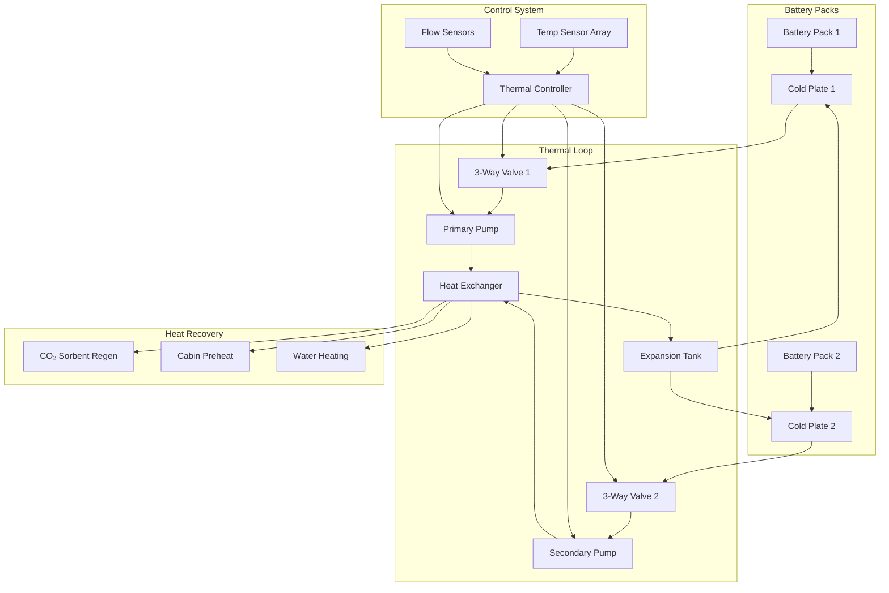
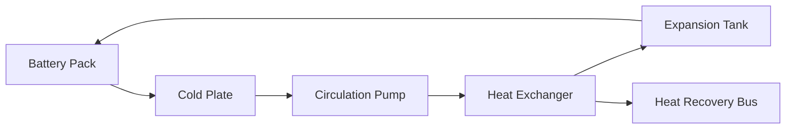
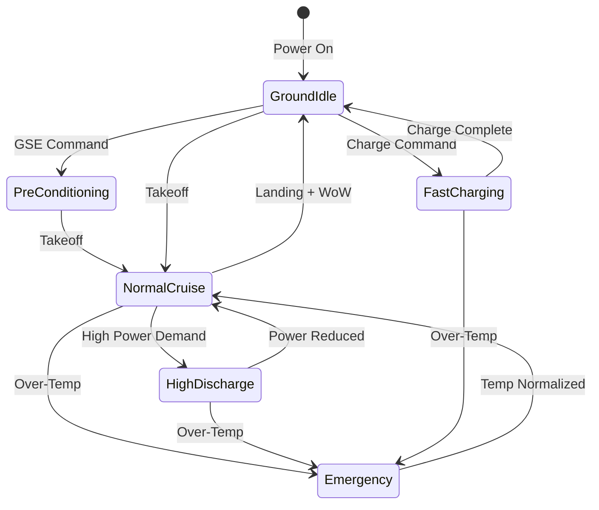
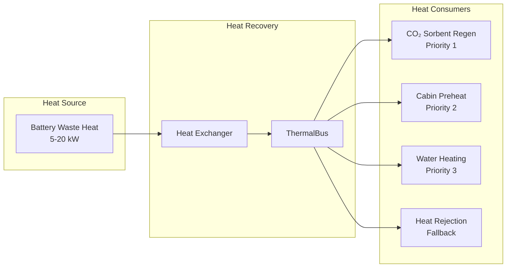

# 53-30-40-02 — Thermal Regen Loops System Description

| Field              | Value                  |
| ------------------ | ---------------------- |
| **Document ID**    | ATA53-30-40-02-SYS-001 |
| **Version**        | 1.2                    |
| **Date**           | 2025-11-25             |
| **Status**         | DRAFT                  |
| **Classification** | Unclassified           |

---

## Repository Context

**Repository path:**
`OPT-IN_FRAMEWORK/T-TECHNOLOGY_AMEDEOPELLICCIA-ON_BOARD_SYSTEMS/A-AIRFRAME/ATA_53-FUSELAGE/53-30_ANCHORS/53-30-40_Battery_Loops/53-30-40-02_Thermal_Regen_Loops/53-30-40-02_System_Description.md`

**ATA banding:**

* ATA Chapter: **53 — Fuselage**
* Sub-Chapter: **53-30 — ANCHORS (Aircraft Networks, Circular, Harvesting, Operating & Renewable Systems)**
* System: **53-30-40 — Battery Loops**
* Subsystem: **53-30-40-02 — Thermal Regen Loops**

---

## Navigation

### Breadcrumb

`OPT-IN_FRAMEWORK` / `T-TECHNOLOGY` / `A-AIRFRAME` / `ATA_53-FUSELAGE` / `53-30_ANCHORS` / `53-30-40_Battery_Loops` / `53-30-40-02_Thermal_Regen_Loops`

### Parent Documents

| Document               | Path                                                                 | Relationship        |
| ---------------------- | -------------------------------------------------------------------- | ------------------- |
| Battery Loops Overview | [53-30-40-00_Battery_Loop_Overview.md](../53-30-40-00_GENERAL/53-30-40-00_Battery_Loop_Overview.md) | Parent system       |
| ANCHORS Overview       | [53-30-00-01_ANCHORS_Definition.md](../../53-30-00_GENERAL/53-30-00-01_Overview/53-30-00-01_ANCHORS_Definition.md) | Chapter overview    |
| Safety Assessment Plan | [53-30-00-02_Safety_Assessment_Plan.md](../../53-30-00_GENERAL/53-30-00-02_Safety/53-30-00-02_Safety_Assessment_Plan.md) | Safety context      |

### Sibling Documents

| Document                  | Path                                                                           | Relationship   |
| ------------------------- | ------------------------------------------------------------------------------ | -------------- |
| QuickSwap Units           | [53-30-40-01_System_Description.md](../53-30-40-01_QuickSwap_Units/53-30-40-01_System_Description.md) | Sibling system |
| MicroCycle Packs          | [53-30-40-03_System_Description.md](../53-30-40-03_MicroCycle_Packs/53-30-40-03_System_Description.md) | Sibling system |
| DPP Traceability          | [53-30-40-04_System_Description.md](../53-30-40-04_DPP_Traceability/53-30-40-04_System_Description.md) | Sibling system |

---

## 1. Purpose

This document describes the Thermal Regeneration Loop system for battery thermal management, including active cooling, heat recovery, and emergency thermal protection within the ANCHORS regenerative framework.

---

## 2. System Overview

The Thermal Regeneration Loop provides:

- **Active cooling** for battery packs during all flight phases
- **Heat recovery** for aircraft circularity systems (CO₂ sorbent regeneration, cabin heating)
- **Emergency cooling** capability for thermal runaway prevention
- **Ground pre-conditioning** integration with GSE

### 2.1 Functional Block Diagram

---

## 3. Architecture

### 3.1 Primary Loop

### 3.2 Components Catalog

| Component | Part Number | Quantity | Function | Redundancy |
|:--|:--|:--|:--|:--|
| Cold plates | 53-30-40-02-CP-001 | 2 | Pack cooling | Dual |
| Circulation pump | 53-30-40-02-PMP-001 | 2 | Fluid flow | Active/Standby |
| Heat exchanger | 53-30-40-02-HX-001 | 1 | Heat rejection | Oversized |
| Expansion tank | 53-30-40-02-EXP-001 | 1 | Fluid reservoir | — |
| 3-way valves | 53-30-40-02-VLV-001 | 4 | Flow control | — |
| Temperature sensors | 53-30-40-02-TS-001 | 8 | Monitoring | Dual per zone |
| Flow sensors | 53-30-40-02-FS-001 | 2 | Flow verification | Dual |

---

## 4. Operating Modes

| Mode | Cooling Capacity (kW) | Heat Recovery | Pump Speed | Trigger |
|:--|:--|:--|:--|:--|
| Normal cruise | 5 | Active | 50% | Default flight mode |
| Fast charging | 15 | Active | 100% | SOC < 80% + ground |
| High discharge | 10 | Active | 80% | Power demand > 200 kW |
| Ground idle | 2 | Off | 20% | APU/GPU power |
| Emergency | 20 | Off | 100% | Temp > 50°C any cell |
| Pre-conditioning | 8 | Off | 60% | GSE command |

### 4.1 Mode Transition Logic

---

## 5. Heat Recovery

Recovered heat used for ANCHORS circularity functions:

| Priority | Consumer | Heat Demand (kW) | Temperature Requirement |
|:--|:--|:--|:--|
| Primary | CO₂ sorbent regeneration | 3–8 | > 80°C |
| Secondary | Cabin air preheating | 2–5 | > 40°C |
| Tertiary | Water heating | 1–3 | > 35°C |

**Recovery efficiency target:** ≥ 30% of battery waste heat

### 5.1 Heat Recovery Schematic

---

## 6. Safety Features

| Feature | Function | Safety Requirement |
|:--|:--|:--|
| Dual pumps | Redundancy | Single pump failure shall not degrade cooling > 50% |
| Low flow alarm | Pump failure detection | Response time < 5 s |
| High temp shutdown | Thermal protection | Automatic at 60°C cell temp |
| Bypass valve | Emergency cooling path | Fail-open design |
| Coolant leak detection | Environmental protection | Detection threshold < 100 mL/min |

### 6.1 Failure Mode Response

| Failure Mode | Detection | Response | Recovery |
|:--|:--|:--|:--|
| Primary pump failure | Flow sensor + pressure | Switch to secondary pump | Manual reset after landing |
| Coolant leak | Level sensor + wet detector | Isolate affected loop | Maintenance action |
| Sensor failure | Cross-check + range check | Use backup sensor | BITE indication |
| Valve stuck | Position feedback | Manual override available | Maintenance action |
| Over-temperature | Multi-sensor voting | Emergency cooling mode | Auto-recover when safe |

---

## 7. Interface Summary

| Interface | Partner System | Type | Document |
|:--|:--|:--|:--|
| ICD-001 | QuickSwap Units | Thermal + Mechanical | [53-30-40-01_System_Description.md](../53-30-40-01_QuickSwap_Units/53-30-40-01_System_Description.md) |
| ICD-002 | CO₂ Capture System | Thermal (heat recovery) | [53-30-20-00_CO2_System_Overview.md](../../53-30-20_CO2_Capture_Conversion/53-30-20-00_GENERAL/53-30-20-00_CO2_System_Overview.md) |
| ICD-003 | ATA 21 ECS | Thermal (cabin heat) | [53-30-00-05_ICD_21-00_ECS.md](../../53-30-00_GENERAL/53-30-00-05_Interfaces/53-30-00-05_ICD_21-00_ECS.md) |
| ICD-004 | Water Recycling | Thermal (water heating) | [53-30-30-00_Water_System_Overview.md](../../53-30-30_Water_Waste_Recycling/53-30-30-00_GENERAL/53-30-30-00_Water_System_Overview.md) |

---

## 8. Safety Considerations

| Hazard ID | Hazard | Mitigation | FHA Reference |
|:--|:--|:--|:--|
| H-TRL-001 | Loss of cooling leading to thermal runaway | Dual pumps + emergency bypass | [FC-005](../../53-30-00_GENERAL/53-30-00-02_Safety/53-30-00-02_FHA_Functional_Hazard_Assessment.md) |
| H-TRL-002 | Coolant leak in battery bay | Leak detection + isolation valves | [FC-009](../../53-30-00_GENERAL/53-30-00-02_Safety/53-30-00-02_FHA_Functional_Hazard_Assessment.md) |
| H-TRL-003 | Control system failure | Watchdog + safe mode defaults | [FC-011](../../53-30-00_GENERAL/53-30-00-02_Safety/53-30-00-02_FHA_Functional_Hazard_Assessment.md) |
| H-TRL-004 | Heat recovery malfunction | Isolated from safety-critical path | [FC-016](../../53-30-00_GENERAL/53-30-00-02_Safety/53-30-00-02_FHA_Functional_Hazard_Assessment.md) |

---

## 9. Verification Requirements

| Requirement ID | Requirement | Method | Status |
|:--|:--|:--|:--|
| VR-TRL-001 | Cooling capacity ≥ 20 kW in emergency mode | Test | Pending |
| VR-TRL-002 | Pump switchover < 2 s | Test | Pending |
| VR-TRL-003 | Heat recovery efficiency ≥ 30% | Analysis + Test | Pending |
| VR-TRL-004 | Leak detection response < 10 s | Test | Pending |
| VR-TRL-005 | Temperature control accuracy ± 2°C | Test | Pending |

**Cross-reference:** [53-30-00-07_Verification_Matrix.csv](../../53-30-00_GENERAL/53-30-00-07_V_AND_V/53-30-00-07_Verification_Matrix.csv)

---

## 10. Open Items / TODO

- [ ] Complete thermal analysis for all flight phases
- [ ] Finalize heat recovery integration with CO₂ system
- [ ] Prototype and test dual-pump switchover
- [ ] Validate coolant compatibility with all materials
- [ ] Coordinate with ATA 21 for cabin heat interface

---

## Document Control

- Generated with the assistance of AI (GitHub Copilot), prompted by **Amedeo Pelliccia**.
- Status: **DRAFT** — Subject to human review and approval.
- Human approver: _[to be completed]_.
- Repository: `AMPEL360-BWB-H2-Hy-E`
- Last AI update: 2025-11-25
