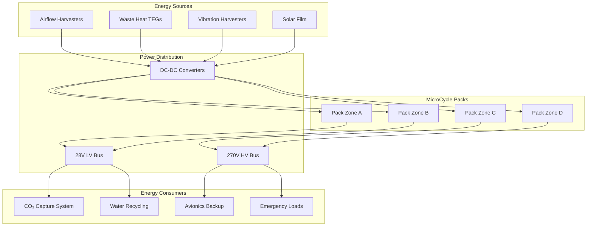
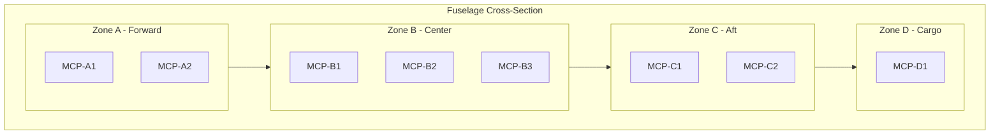
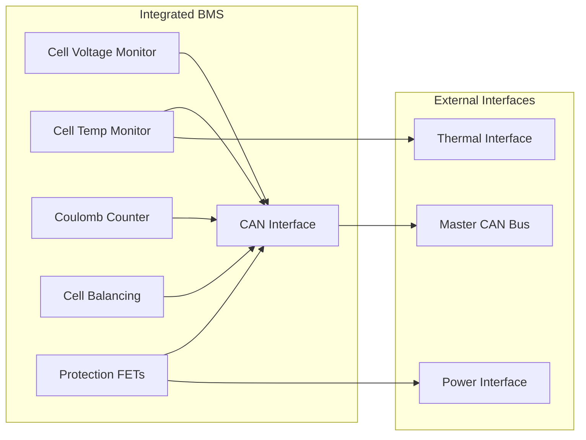
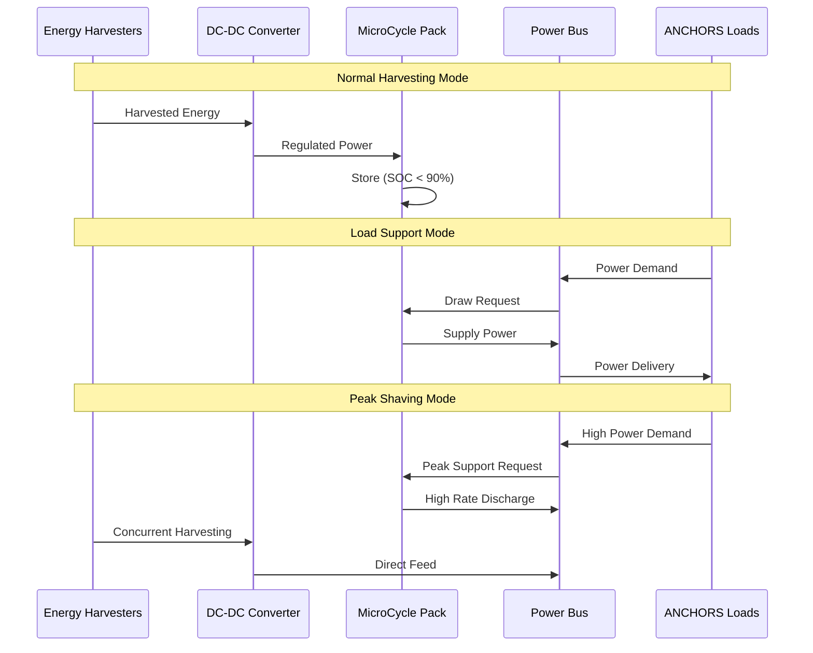

# 53-30-40-03 — MicroCycle Packs System Description

| Field              | Value                  |
| ------------------ | ---------------------- |
| **Document ID**    | ATA53-30-40-03-SYS-001 |
| **Version**        | 1.0                    |
| **Date**           | 2025-11-25             |
| **Status**         | DRAFT                  |
| **Classification** | Unclassified           |

---

## Repository Context

**Repository path:**
`OPT-IN_FRAMEWORK/T-TECHNOLOGY_AMEDEOPELLICCIA-ON_BOARD_SYSTEMS/A-AIRFRAME/ATA_53-FUSELAGE/53-30_ANCHORS/53-30-40_Battery_Loops/53-30-40-03_MicroCycle_Packs/53-30-40-03_System_Description.md`

**ATA banding:**

* ATA Chapter: **53 — Fuselage**
* Sub-Chapter: **53-30 — ANCHORS (Aircraft Networks, Circular, Harvesting, Operating & Renewable Systems)**
* System: **53-30-40 — Battery Loops**
* Subsystem: **53-30-40-03 — MicroCycle Packs**

---

## Navigation

### Breadcrumb

`OPT-IN_FRAMEWORK` / `T-TECHNOLOGY` / `A-AIRFRAME` / `ATA_53-FUSELAGE` / `53-30_ANCHORS` / `53-30-40_Battery_Loops` / `53-30-40-03_MicroCycle_Packs`

### Parent Documents

| Document               | Path                                                                 | Relationship        |
| ---------------------- | -------------------------------------------------------------------- | ------------------- |
| Battery Loops Overview | [53-30-40-00_Battery_Loop_Overview.md](../53-30-40-00_GENERAL/53-30-40-00_Battery_Loop_Overview.md) | Parent system       |
| ANCHORS Overview       | [53-30-00-01_ANCHORS_Definition.md](../../53-30-00_GENERAL/53-30-00-01_Overview/53-30-00-01_ANCHORS_Definition.md) | Chapter overview    |
| Safety Assessment Plan | [53-30-00-02_Safety_Assessment_Plan.md](../../53-30-00_GENERAL/53-30-00-02_Safety/53-30-00-02_Safety_Assessment_Plan.md) | Safety context      |

### Sibling Documents

| Document                  | Path                                                                           | Relationship   |
| ------------------------- | ------------------------------------------------------------------------------ | -------------- |
| QuickSwap Units           | [53-30-40-01_System_Description.md](../53-30-40-01_QuickSwap_Units/53-30-40-01_System_Description.md) | Sibling system |
| Thermal Regen Loops       | [53-30-40-02_System_Description.md](../53-30-40-02_Thermal_Regen_Loops/53-30-40-02_System_Description.md) | Sibling system |
| DPP Traceability          | [53-30-40-04_System_Description.md](../53-30-40-04_DPP_Traceability/53-30-40-04_System_Description.md) | Sibling system |

---

## 1. Purpose

This document describes the MicroCycle Packs system, which provides distributed, modular battery energy storage optimized for frequent charge-discharge cycles and seamless integration with the ANCHORS regenerative framework.

---

## 2. System Overview

MicroCycle Packs are small-format battery modules designed for:

- **High cycle life** (> 5,000 full cycles) for regenerative energy storage
- **Distributed installation** throughout the fuselage structure
- **Rapid energy buffering** for harvested energy from regenerative systems
- **Modular replacement** compatible with QuickSwap infrastructure

### 2.1 Functional Block Diagram

---

## 3. Design Concept

### 3.1 Pack Configuration

| Parameter | Value | Unit | Notes |
|:--|:--|:--|:--|
| Cell chemistry | LFP (LiFePO₄) | — | High cycle life |
| Nominal voltage | 25.6 | V | 8S configuration |
| Capacity | 50 | Ah | Per pack |
| Energy | 1.28 | kWh | Per pack |
| Weight | 12 | kg | Including BMS |
| Dimensions | 300 × 200 × 150 | mm | L × W × H |
| Cycle life | > 5,000 | cycles | @ 80% DoD |
| C-rate (charge) | 2C | — | 25 min to 80% |
| C-rate (discharge) | 3C | — | Peak |

### 3.2 Installation Zones

| Zone | Location | Pack Qty | Total Energy (kWh) | Primary Function |
|:--|:--|:--|:--|:--|
| A | Forward avionics bay | 2 | 2.56 | Avionics backup |
| B | Center fuselage | 3 | 3.84 | Harvesting buffer |
| C | Aft equipment bay | 2 | 2.56 | ANCHORS systems |
| D | Cargo bay floor | 1 | 1.28 | Emergency reserve |
| **Total** | — | **8** | **10.24** | — |

---

## 4. Battery Management System (BMS)

### 4.1 BMS Architecture

Each MicroCycle Pack includes an integrated BMS with:

### 4.2 BMS Functions

| Function | Specification | Safety Criticality |
|:--|:--|:--|
| Cell voltage monitoring | ± 5 mV accuracy | DAL C |
| Cell temperature monitoring | ± 1°C accuracy | DAL C |
| State of charge (SOC) | ± 3% accuracy | DAL D |
| State of health (SOH) | ± 5% accuracy | DAL D |
| Cell balancing | Passive, 100 mA | DAL D |
| Over-voltage protection | 3.65V per cell | DAL B |
| Under-voltage protection | 2.5V per cell | DAL B |
| Over-current protection | 4C limit | DAL B |
| Over-temperature protection | 55°C cutoff | DAL B |

---

## 5. Operating Modes

| Mode | Description | Charge Rate | Discharge Rate | Thermal |
|:--|:--|:--|:--|:--|
| Harvest Buffer | Accept regenerated energy | Up to 2C | — | Passive |
| Load Support | Supply ANCHORS loads | — | Up to 1C | Passive |
| Peak Shaving | High power demand support | — | Up to 3C | Active cooling |
| Standby | Maintain charge, minimal activity | Float | — | Passive |
| Emergency | Backup power provision | — | Up to 2C | Active cooling |
| Maintenance | Ground charging/diagnostics | 0.5C | — | GSE cooling |

### 5.1 Energy Flow Management

---

## 6. Integration with Harvesting Systems

| Harvester Type | Interface | Power Range | MCP Zone |
|:--|:--|:--|:--|
| Airflow harvesters | DC-DC 12V→28V | 50–200 W | B, C |
| Waste heat TEGs | DC-DC 5V→28V | 20–100 W | B |
| Vibration harvesters | DC-DC 5V→28V | 5–50 W | A, B, C |
| Solar film | DC-DC 48V→28V | 100–500 W | B, C |

**Cross-reference:** [53-30-10-00_Harvesting_Overview.md](../../53-30-10_Harvesting/53-30-10-00_GENERAL/53-30-10-00_Harvesting_Overview.md)

---

## 7. Safety Features

| Feature | Function | Activation |
|:--|:--|:--|
| Cell-level fusing | Isolate failed cells | Automatic on fault |
| Pack isolation contactor | Disconnect pack from bus | BMS command or manual |
| Thermal fuse | Emergency thermal protection | 70°C |
| Vent path | Controlled gas release | Pressure > 1.5 bar |
| Fire barrier | Contain thermal event | Passive |

### 7.1 Failure Mode Response

| Failure Mode | Detection | Response | Criticality |
|:--|:--|:--|:--|
| Cell over-voltage | BMS monitoring | Charge cutoff | Major |
| Cell under-voltage | BMS monitoring | Load disconnect | Major |
| Cell over-temperature | Temp sensors | Cooling + isolation | Hazardous |
| BMS communication loss | Watchdog timeout | Safe mode + isolation | Major |
| External short circuit | Current sensing | Fuse/contactor open | Hazardous |

---

## 8. Interface Summary

| Interface | Partner System | Type | Document |
|:--|:--|:--|:--|
| ICD-001 | Harvesting Systems | Electrical | [53-30-10-00_Harvesting_Overview.md](../../53-30-10_Harvesting/53-30-10-00_GENERAL/53-30-10-00_Harvesting_Overview.md) |
| ICD-002 | Thermal Regen Loops | Thermal | [53-30-40-02_System_Description.md](../53-30-40-02_Thermal_Regen_Loops/53-30-40-02_System_Description.md) |
| ICD-003 | QuickSwap Units | Mechanical (swap-compatible) | [53-30-40-01_System_Description.md](../53-30-40-01_QuickSwap_Units/53-30-40-01_System_Description.md) |
| ICD-004 | DPP Traceability | Data | [53-30-40-04_System_Description.md](../53-30-40-04_DPP_Traceability/53-30-40-04_System_Description.md) |
| ICD-005 | ATA 24-80 Electrical Power | Electrical | [53-30-00-05_ICD_24-80_Electrical_Power.md](../../53-30-00_GENERAL/53-30-00-05_Interfaces/53-30-00-05_ICD_24-80_Electrical_Power.md) |

---

## 9. Safety Considerations

| Hazard ID | Hazard | Mitigation | FHA Reference |
|:--|:--|:--|:--|
| H-MCP-001 | Cell thermal runaway | Cell fusing + fire barrier | [FC-005](../../53-30-00_GENERAL/53-30-00-02_Safety/53-30-00-02_FHA_Functional_Hazard_Assessment.md) |
| H-MCP-002 | BMS failure leading to overcharge | Redundant voltage sensing | [FC-011](../../53-30-00_GENERAL/53-30-00-02_Safety/53-30-00-02_FHA_Functional_Hazard_Assessment.md) |
| H-MCP-003 | Electrolyte leak | Sealed enclosure + leak detection | [FC-009](../../53-30-00_GENERAL/53-30-00-02_Safety/53-30-00-02_FHA_Functional_Hazard_Assessment.md) |
| H-MCP-004 | Loss of all MicroCycle energy | No single point failure affects > 50% | [FC-012](../../53-30-00_GENERAL/53-30-00-02_Safety/53-30-00-02_FHA_Functional_Hazard_Assessment.md) |

---

## 10. Verification Requirements

| Requirement ID | Requirement | Method | Status |
|:--|:--|:--|:--|
| VR-MCP-001 | Cycle life ≥ 5,000 @ 80% DoD | Test | Pending |
| VR-MCP-002 | Charge acceptance at 2C | Test | Pending |
| VR-MCP-003 | BMS response time < 100 ms | Test | Pending |
| VR-MCP-004 | Thermal runaway containment | Test | Pending |
| VR-MCP-005 | CAN communication reliability > 99.99% | Analysis + Test | Pending |

**Cross-reference:** [53-30-00-07_Verification_Matrix.csv](../../53-30-00_GENERAL/53-30-00-07_V_AND_V/53-30-00-07_Verification_Matrix.csv)

---

## 11. Open Items / TODO

- [ ] Complete cell selection and qualification testing
- [ ] Finalize BMS firmware requirements
- [ ] Prototype and test thermal runaway containment
- [ ] Validate harvesting integration efficiency
- [ ] Develop maintenance procedures for pack replacement

---

## Document Control

- Generated with the assistance of AI (GitHub Copilot), prompted by **Amedeo Pelliccia**.
- Status: **DRAFT** — Subject to human review and approval.
- Human approver: _[to be completed]_.
- Repository: `AMPEL360-BWB-H2-Hy-E`
- Last AI update: 2025-11-25
