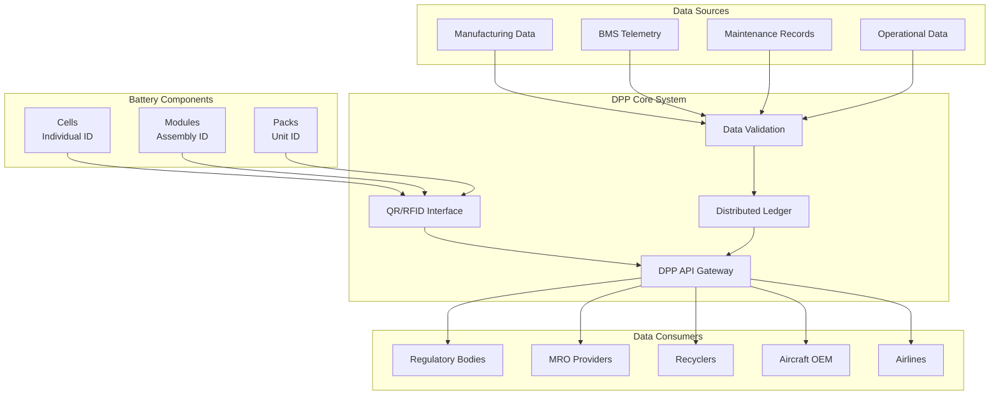
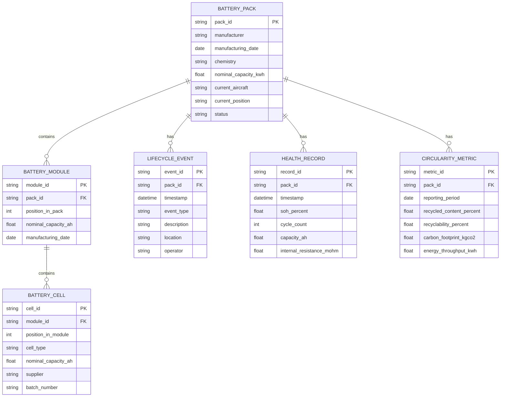
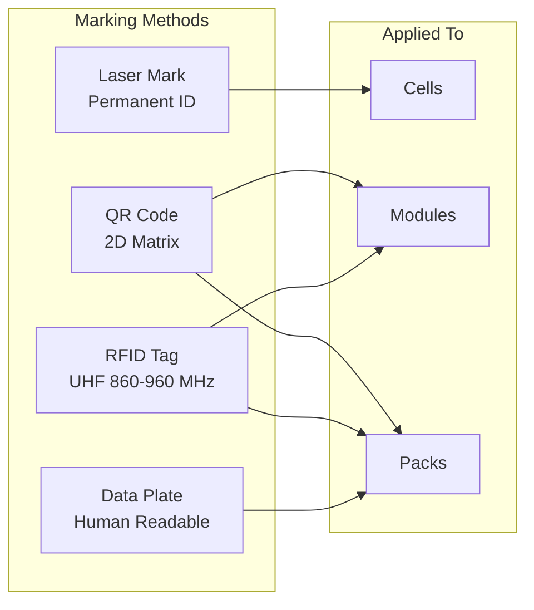
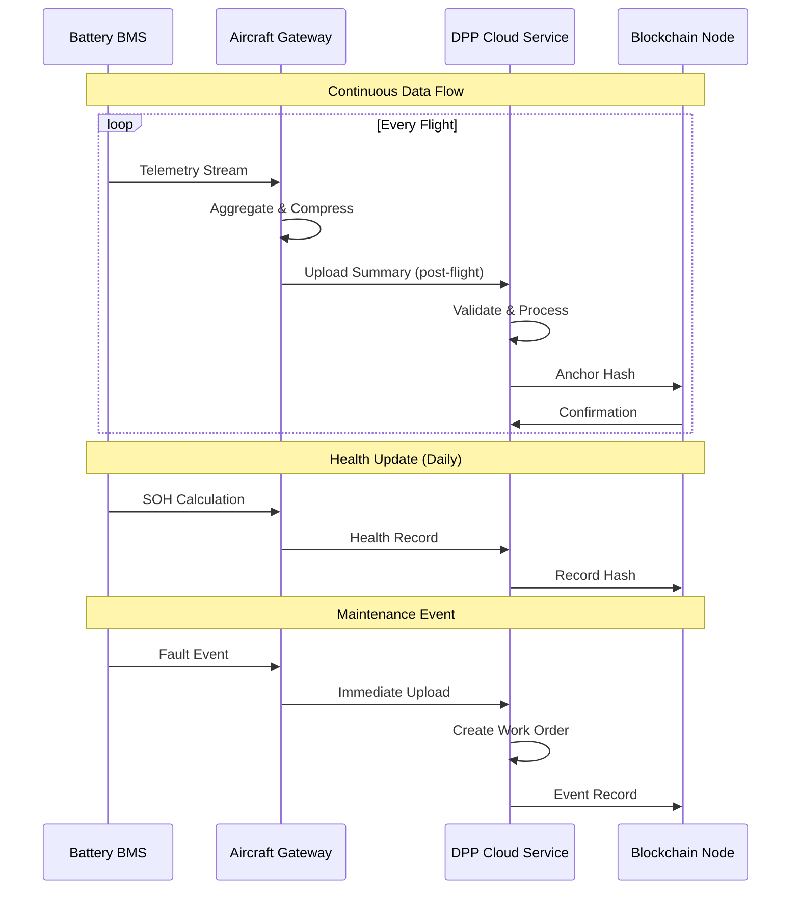
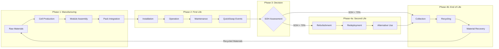

# 53-30-40-04 — DPP Traceability System Description

| Field              | Value                  |
| ------------------ | ---------------------- |
| **Document ID**    | ATA53-30-40-04-SYS-001 |
| **Version**        | 1.0                    |
| **Date**           | 2025-11-25             |
| **Status**         | DRAFT                  |
| **Classification** | Unclassified           |

---

## Repository Context

**Repository path:**
`OPT-IN_FRAMEWORK/T-TECHNOLOGY_AMEDEOPELLICCIA-ON_BOARD_SYSTEMS/A-AIRFRAME/ATA_53-FUSELAGE/53-30_ANCHORS/53-30-40_Battery_Loops/53-30-40-04_DPP_Traceability/53-30-40-04_System_Description.md`

**ATA banding:**

* ATA Chapter: **53 — Fuselage**
* Sub-Chapter: **53-30 — ANCHORS (Aircraft Networks, Circular, Harvesting, Operating & Renewable Systems)**
* System: **53-30-40 — Battery Loops**
* Subsystem: **53-30-40-04 — DPP Traceability**

---

## Navigation

### Breadcrumb

`OPT-IN_FRAMEWORK` / `T-TECHNOLOGY` / `A-AIRFRAME` / `ATA_53-FUSELAGE` / `53-30_ANCHORS` / `53-30-40_Battery_Loops` / `53-30-40-04_DPP_Traceability`

### Parent Documents

| Document               | Path                                                                 | Relationship        |
| ---------------------- | -------------------------------------------------------------------- | ------------------- |
| Battery Loops Overview | [53-30-40-00_Battery_Loop_Overview.md](../53-30-40-00_GENERAL/53-30-40-00_Battery_Loop_Overview.md) | Parent system       |
| ANCHORS Overview       | [53-30-00-01_ANCHORS_Definition.md](../../53-30-00_GENERAL/53-30-00-01_Overview/53-30-00-01_ANCHORS_Definition.md) | Chapter overview    |
| DPP Implementation     | [53-30-00-14_DPP_Implementation_Guide.md](../../53-30-00_GENERAL/53-30-00-14_Ops_Std_Sustain/53-30-00-14_DPP_Implementation_Guide.md) | DPP framework       |

### Sibling Documents

| Document                  | Path                                                                           | Relationship   |
| ------------------------- | ------------------------------------------------------------------------------ | -------------- |
| QuickSwap Units           | [53-30-40-01_System_Description.md](../53-30-40-01_QuickSwap_Units/53-30-40-01_System_Description.md) | Sibling system |
| Thermal Regen Loops       | [53-30-40-02_System_Description.md](../53-30-40-02_Thermal_Regen_Loops/53-30-40-02_System_Description.md) | Sibling system |
| MicroCycle Packs          | [53-30-40-03_System_Description.md](../53-30-40-03_MicroCycle_Packs/53-30-40-03_System_Description.md) | Sibling system |

---

## 1. Purpose

This document describes the Digital Product Passport (DPP) Traceability system for battery loops within the ANCHORS framework. The DPP enables full lifecycle traceability for battery components, supporting circularity goals, regulatory compliance, and sustainable operations.

---

## 2. System Overview

The DPP Traceability system provides:

- **Unique identification** of all battery components (cells, modules, packs)
- **Lifecycle data recording** from manufacture through end-of-life
- **Real-time health monitoring** integration with BMS data
- **Circularity metrics** tracking for sustainability reporting
- **Regulatory compliance** with [EU Battery Regulation 2023/1542](https://eur-lex.europa.eu/eli/reg/2023/1542)

### 2.1 DPP Architecture

---

## 3. Data Model

### 3.1 Battery Passport Schema

### 3.2 Data Categories

| Category | Description | Update Frequency | Retention |
|:--|:--|:--|:--|
| Manufacturing | Origin, materials, certifications | Once | Permanent |
| Installation | Aircraft, position, date | On change | Permanent |
| Health | SOH, SOC, cycles, resistance | Continuous | 10 years |
| Maintenance | Repairs, replacements, calibrations | On event | Permanent |
| Operational | Energy throughput, charge cycles | Daily summary | 5 years |
| Circularity | Carbon footprint, recycled content | Annual | Permanent |

---

## 4. Identification System

### 4.1 ID Structure

| Level | ID Format | Example | Encoding |
|:--|:--|:--|:--|
| Cell | `CELL-{MFG}-{DATE}-{SEQ}` | CELL-LGC-20250115-000123 | Laser marking |
| Module | `MOD-{MFG}-{DATE}-{SEQ}` | MOD-AMP-20250201-00045 | Label + RFID |
| Pack | `PACK-{ASSY}-{DATE}-{SEQ}` | PACK-AMPEL-20250315-0012 | Plate + QR + RFID |

### 4.2 Physical Marking

---

## 5. Data Integration

### 5.1 BMS Data Integration

| Data Point | Source | Frequency | DPP Field |
|:--|:--|:--|:--|
| Cell voltages | BMS CAN | 1 Hz | Health telemetry |
| Cell temperatures | BMS CAN | 1 Hz | Health telemetry |
| Pack current | BMS CAN | 10 Hz | Energy throughput |
| SOC | BMS calculation | 1 Hz | Operational state |
| SOH | BMS calculation | Daily | Health record |
| Cycle count | BMS counter | On cycle | Lifecycle data |
| Fault codes | BMS events | On event | Maintenance events |

### 5.2 Integration Flow

---

## 6. Circularity Tracking

### 6.1 Circularity Metrics

| Metric | Definition | Target | Unit |
|:--|:--|:--|:--|
| Recycled content | Mass fraction from recycled sources | ≥ 16% (2030) | % |
| Recyclability | Mass fraction recoverable at EoL | ≥ 95% | % |
| Carbon footprint | Lifecycle GHG emissions | ≤ 60 | kg CO₂eq/kWh |
| Second life potential | Remaining capacity for reuse | Report | % SOH |
| Energy throughput | Total energy cycled | Record | kWh |

### 6.2 Lifecycle Phases

---

## 7. Regulatory Compliance

### 7.1 EU Battery Regulation Alignment

| Requirement | Regulation Reference | DPP Implementation | Status |
|:--|:--|:--|:--|
| Carbon footprint declaration | Art. 7 | Embedded in passport | Planned 2027 |
| Recycled content | Art. 8 | Material composition data | Planned 2031 |
| Performance & durability | Art. 10 | SOH tracking, cycle data | Active |
| Removability & replaceability | Art. 11 | QuickSwap integration | Active |
| Collection & recycling info | Art. 12 | EoL procedures in DPP | Active |
| Battery passport | Art. 77 | Full implementation | Active |
| Due diligence | Art. 48-52 | Supply chain records | Active |

**Reference:** [EU Battery Regulation 2023/1542](https://eur-lex.europa.eu/eli/reg/2023/1542)

### 7.2 Aviation-Specific Requirements

| Requirement | Source | DPP Implementation |
|:--|:--|:--|
| Component traceability | [EASA Part 21](https://www.easa.europa.eu/en/document-library/regulations/commission-regulation-eu-no-7482012) | Unique ID, manufacturing records |
| Maintenance records | [EASA Part M](https://www.easa.europa.eu/en/document-library/regulations/commission-regulation-eu-no-12212012) | Lifecycle events, work orders |
| Airworthiness data | [CS-25.1529](https://www.easa.europa.eu/en/document-library/certification-specifications/cs-25) | ICA integration |

---

## 8. Interface Summary

| Interface | Partner System | Type | Document |
|:--|:--|:--|:--|
| ICD-001 | QuickSwap Units | Data (swap events) | [53-30-40-01_System_Description.md](../53-30-40-01_QuickSwap_Units/53-30-40-01_System_Description.md) |
| ICD-002 | MicroCycle Packs | Data (health telemetry) | [53-30-40-03_System_Description.md](../53-30-40-03_MicroCycle_Packs/53-30-40-03_System_Description.md) |
| ICD-003 | Aircraft Data Network | Data (upload/download) | ATA 42 Integration |
| ICD-004 | Ground Systems | Data (sync) | [53-30-00-05_ICD_85-30_Ground_Circularity.md](../../53-30-00_GENERAL/53-30-00-05_Interfaces/53-30-00-05_ICD_85-30_Ground_Circularity.md) |
| ICD-005 | ANCHORS DPP | Data (system-level) | [53-30-00-14_DPP_Implementation_Guide.md](../../53-30-00_GENERAL/53-30-00-14_Ops_Std_Sustain/53-30-00-14_DPP_Implementation_Guide.md) |

---

## 9. Security & Privacy

### 9.1 Data Security

| Aspect | Implementation |
|:--|:--|
| Data integrity | Blockchain anchoring of critical records |
| Access control | Role-based access (OEM, airline, MRO, regulator) |
| Encryption | TLS 1.3 in transit, AES-256 at rest |
| Audit trail | Immutable log of all access and changes |

### 9.2 Access Levels

| Role | Access Rights | Justification |
|:--|:--|:--|
| Regulatory authority | Full read | Compliance verification |
| Aircraft operator | Full read, operational write | Operational management |
| MRO provider | Maintenance read/write | Service execution |
| OEM | Manufacturing data, health analytics | Product support |
| Recycler | EoL data, material composition | Safe processing |

---

## 10. Verification Requirements

| Requirement ID | Requirement | Method | Status |
|:--|:--|:--|:--|
| VR-DPP-001 | Unique ID for 100% of components | Inspection | Pending |
| VR-DPP-002 | Data integrity via blockchain anchoring | Test | Pending |
| VR-DPP-003 | BMS data integration < 5 min latency | Test | Pending |
| VR-DPP-004 | Compliance with EU Battery Reg Art. 77 | Analysis | Pending |
| VR-DPP-005 | Access control per role matrix | Test | Pending |

**Cross-reference:** [53-30-00-07_Verification_Matrix.csv](../../53-30-00_GENERAL/53-30-00-07_V_AND_V/53-30-00-07_Verification_Matrix.csv)

---

## 11. Open Items / TODO

- [ ] Finalize blockchain platform selection
- [ ] Define API specifications for stakeholder access
- [ ] Develop QR/RFID reader integration with aircraft systems
- [ ] Coordinate with EU Battery Passport Consortium
- [ ] Establish data sharing agreements with recyclers

---

## Document Control

- Generated with the assistance of AI (GitHub Copilot), prompted by **Amedeo Pelliccia**.
- Status: **DRAFT** — Subject to human review and approval.
- Human approver: _[to be completed]_.
- Repository: `AMPEL360-BWB-H2-Hy-E`
- Last AI update: 2025-11-25
