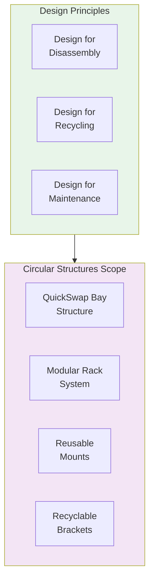

# 53-30-50-00 — Circular Structures Overview

| Field | Value |
|-------|-------|
| **Document ID** | ATA53-30-50-00-OVR-002 |
| **Version** | 1.0 |
| **Date** | 2025-11-26 |
| **Status** | DRAFT |

---

## Purpose

This document provides an overview of the Circular Structures subsystem (Band 50) within ANCHORS, defining the scope, key components, and design philosophy for all structural elements designed for circularity.

---

## Subsystem Description

The Circular Structures subsystem encompasses all physical structural elements that:

1. **Enable modularity** — Support rapid component replacement
2. **Facilitate disassembly** — Design for end-of-life material recovery
3. **Integrate traceability** — Carry Digital Product Passport data
4. **Support circularity** — Enable reuse, remanufacture, or high-value recycling

---

## Key Components

### 53-30-50-01: QuickSwap Bay Structure

Structural framework supporting the QuickSwap battery exchange system:

- **Primary function**: Provide secure mounting for battery modules
- **Key features**: Quick-release mechanisms, alignment guides, load distribution
- **Material**: Aluminum alloy (recyclable), composite brackets

### 53-30-50-02: Modular Rack System

Universal mounting system for ANCHORS LRUs:

- **Primary function**: Standardized mounting for all ANCHORS equipment
- **Key features**: Common interface, vibration isolation, thermal management
- **Material**: Aluminum extrusions, steel fasteners (mono-material where possible)

---

## Design Philosophy

### Design for Disassembly (DfD)

| Principle | Implementation |
|-----------|----------------|
| Reversible fasteners | Bolts/screws instead of adhesives |
| Accessible connections | Service panels, labeled connectors |
| Material identification | Embossed material codes |
| Separation ease | Snap-fit secondary only |

### Material Selection

| Material | Application | Recyclability |
|----------|-------------|---------------|
| Al 6061-T6 | Primary structure | 100% recyclable |
| Al 7075-T6 | High-stress areas | 100% recyclable |
| CFRP | Non-critical covers | Pyrolysis recovery |
| A286 Steel | Fasteners | 100% recyclable |

---

## Document Control

- **Generated with assistance of:** AI (GitHub Copilot)
- **Prompted by:** Amedeo Pelliccia
- **Status:** DRAFT
- **Last AI update:** 2025-11-26
