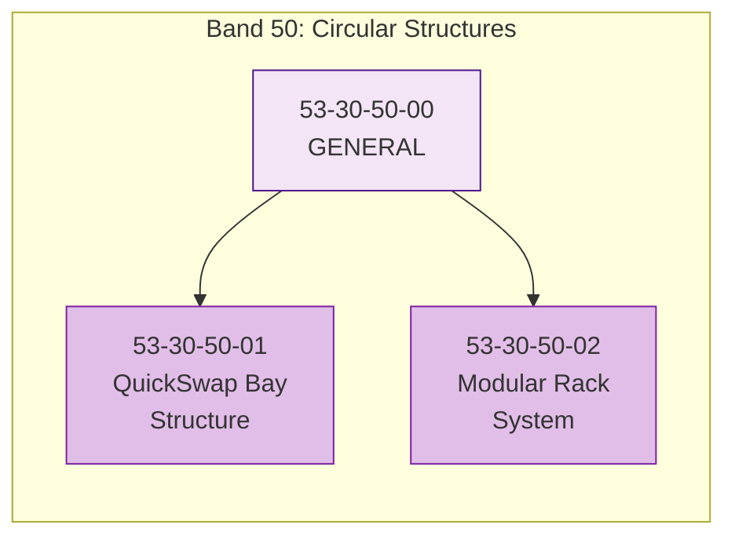
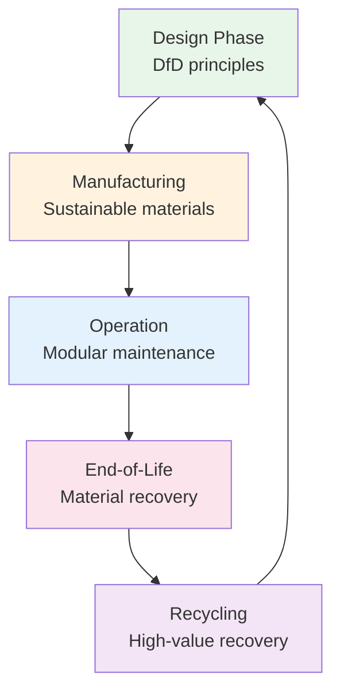

# 53-30-50 — Circular Structures

| Field | Value |
|-------|-------|
| **Document ID** | ATA53-30-50-00-OVR-001 |
| **Version** | 1.0 |
| **Date** | 2025-11-26 |
| **Status** | DRAFT |
| **Classification** | TECHNICAL |

---

## Overview

**Band 50 — Circular Structures** encompasses all structural elements within the ANCHORS system designed for circularity, reusability, and sustainable lifecycle management. These components form the physical backbone that enables modular integration, rapid maintenance, and end-of-life material recovery.

---

## Scope



### Components

| ID | Component | Description |
|----|-----------|-------------|
| **53-30-50-00** | General | Subsystem-level overview, requirements, interfaces |
| **53-30-50-01** | QuickSwap Bay Structure | Structural framework for battery QuickSwap system integration |
| **53-30-50-02** | Modular Rack System | Universal mounting and interface rack for ANCHORS LRUs |

---

## Design Principles

### 1. Design for Disassembly (DfD)

All circular structures follow DfD principles:

- **Reversible fasteners**: Bolted connections preferred over bonded joints
- **Material separation**: Mono-material components where possible
- **Access provisions**: Maintenance access integrated from initial design
- **Modularity**: Standardized interfaces enabling component replacement

### 2. Material Passport Integration

Each structural component carries Digital Product Passport (DPP) data:

- Material composition and source
- Manufacturing process and energy footprint
- Maintenance and repair history
- End-of-life recycling pathway

### 3. Lifecycle Optimization



---

## Interfaces

### Internal ANCHORS Interfaces

| Interface | Description | Reference |
|-----------|-------------|-----------|
| 53-30-40 | Battery Loops — QuickSwap mounting | [ICD 53-30-50 ↔ 40](../53-30-00_GENERAL/53-30-00-05_Interfaces/) |
| 53-30-60 | Storages — Cartridge bay integration | [ICD 53-30-50 ↔ 60](../53-30-00_GENERAL/53-30-00-05_Interfaces/) |
| 53-30-80 | Energy Renewables — Solar panel mounts | [ICD 53-30-50 ↔ 80](../53-30-00_GENERAL/53-30-00-05_Interfaces/) |

### External ATA Interfaces

| ATA | System | Interface Type |
|-----|--------|----------------|
| 53-00 | Fuselage Structure | Primary structural attachments |
| 85-00 | Ground Operations | Ground equipment docking interfaces |

---

## Directory Structure

```
53-30-50_Circular_Structures/
├── README.md
├── 53-30-50-00_GENERAL/
│   ├── 53-30-50-00_Overview.md
│   ├── 53-30-50-00_Requirements.md
│   └── 53-30-50-00_Interfaces.md
├── 53-30-50-01_QuickSwap_Bay_Structure/
│   ├── 53-30-50-01_System_Description.md
│   ├── 53-30-50-01_Requirements.md
│   └── 53-30-50-01_Design.md
└── 53-30-50-02_Modular_Rack_System/
    ├── 53-30-50-02_System_Description.md
    ├── 53-30-50-02_Requirements.md
    └── 53-30-50-02_Design.md
```

---

## Document Control

- **Generated with assistance of:** AI (GitHub Copilot)
- **Prompted by:** Amedeo Pelliccia
- **Status:** DRAFT — Subject to human review and approval
- **Repository:** `AMPEL360-BWB-H2-Hy-E`
- **Last AI update:** 2025-11-26
