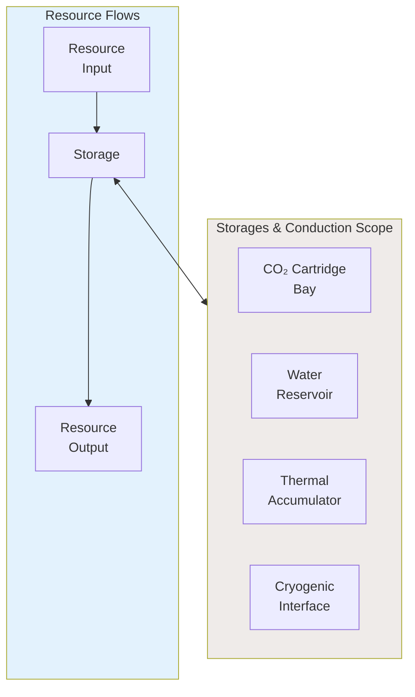
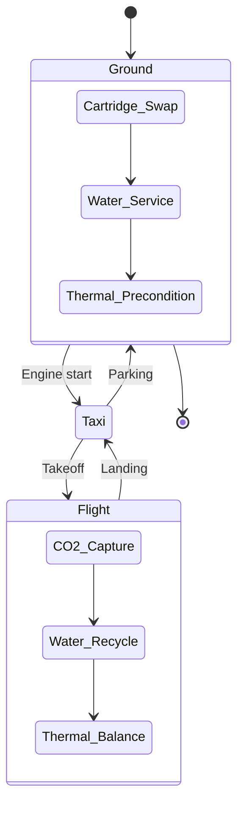

# 53-30-60-00 — Storages & Conduction Overview

| Field | Value |
|-------|-------|
| **Document ID** | ATA53-30-60-00-OVR-002 |
| **Version** | 1.0 |
| **Date** | 2025-11-26 |
| **Status** | DRAFT |

---

## Purpose

This document provides an overview of the Storages & Conduction subsystem (Band 60) within ANCHORS, defining the scope, key components, and operational principles for all storage vessels and thermal conduction systems.

---

## Subsystem Description

The Storages & Conduction subsystem manages:

1. **CO₂ Storage** — Solidified CO₂ (Minerite) cartridge management
2. **Water Storage** — Multi-grade water reservoirs
3. **Thermal Storage** — Heat accumulators for thermal management
4. **Conduction Networks** — Long-duration thermal loops

---

## Key Components

### 53-30-60-01: CO₂ Cartridge Bay

Storage and management system for Minerite cartridges:

- **Capacity**: 20 cartridges (100 kg CO₂-equivalent)
- **Interface**: Automated ground swap system
- **Monitoring**: Fill level, weight, integrity sensors

### 53-30-60-02: Water Reservoir

Multi-compartment water storage:

| Compartment | Capacity | Grade |
|-------------|----------|-------|
| Potable | 100 L | Drinking water |
| Technical | 150 L | Lavatory, cooling |
| Raw | 50 L | Untreated holding |

---

## Operational Modes

---

## Document Control

- **Generated with assistance of:** AI (GitHub Copilot)
- **Prompted by:** Amedeo Pelliccia
- **Status:** DRAFT
- **Last AI update:** 2025-11-26
