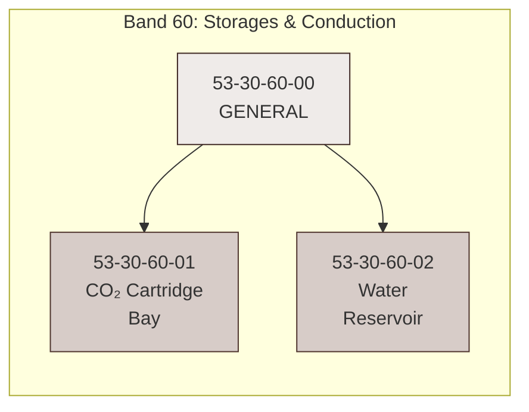
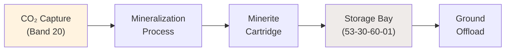
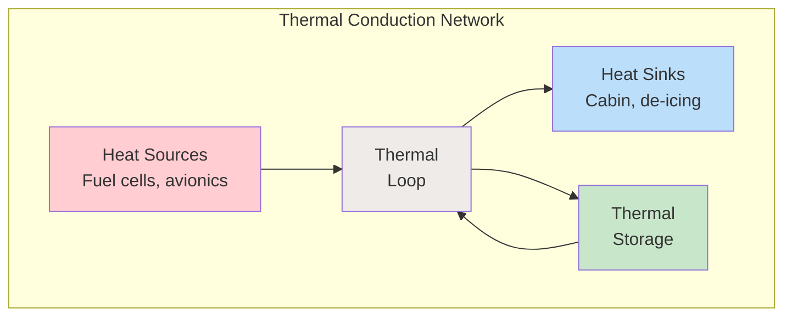

# 53-30-60 — Storages & Conduction

| Field | Value |
|-------|-------|
| **Document ID** | ATA53-30-60-00-OVR-001 |
| **Version** | 1.0 |
| **Date** | 2025-11-26 |
| **Status** | DRAFT |
| **Classification** | TECHNICAL |

---

## Overview

**Band 60 — Storages & Conduction** encompasses all storage vessels, reservoirs, manifolds, and thermal conduction systems within ANCHORS. This band manages the physical containment and distribution pathways for captured resources including CO₂ cartridges, water reservoirs, and thermal loops.

---

## Scope



### Components

| ID | Component | Description |
|----|-----------|-------------|
| **53-30-60-00** | General | Subsystem-level overview, requirements, interfaces |
| **53-30-60-01** | CO₂ Cartridge Bay | Storage bay for solidified CO₂ (Minerite) cartridges |
| **53-30-60-02** | Water Reservoir | Multi-grade water storage with thermal management |

---

## Storage Categories

### 1. CO₂ Storage

Captured CO₂ is converted to solid mineral form (Minerite) and stored in standardized cartridges:



- **Cartridge capacity**: 5 kg CO₂-equivalent per unit
- **Bay capacity**: 20 cartridges (100 kg total)
- **Ground interface**: Automated swap during turnaround

### 2. Water Storage

Multi-tier water storage system supporting circular water management:

| Tier | Grade | Source | Usage |
|------|-------|--------|-------|
| 1 | Potable | Condensate + treated greywater | Drinking, galley |
| 2 | Technical | Treated greywater | Lavatory flush, cooling |
| 3 | Raw | Untreated greywater | Holding for ground processing |

### 3. Thermal Conduction

Long-duration thermal loops for heat distribution and recovery:



---

## Cryogenic Interfaces

Band 60 includes interfaces for cryogenic systems:

| Interface | Temperature Range | Medium |
|-----------|-------------------|--------|
| LH₂ feed | -253°C | Liquid hydrogen |
| LN₂ backup | -196°C | Liquid nitrogen |
| Cryo-cooling | -150°C to -40°C | Helium/nitrogen mix |

---

## Interfaces

### Internal ANCHORS Interfaces

| Interface | Description | Reference |
|-----------|-------------|-----------|
| 53-30-20 | CO₂ Capture — Minerite cartridge output | [ICD 53-30-60 ↔ 20](../53-30-00_GENERAL/53-30-00-05_Interfaces/) |
| 53-30-30 | Water Recycling — Reservoir feed | [ICD 53-30-60 ↔ 30](../53-30-00_GENERAL/53-30-00-05_Interfaces/) |
| 53-30-50 | Circular Structures — Bay mounting | [ICD 53-30-60 ↔ 50](../53-30-00_GENERAL/53-30-00-05_Interfaces/) |
| 53-30-95 | ANCHORS Networks — ResourceBus | [ICD 53-30-60 ↔ 95](../53-30-00_GENERAL/53-30-00-05_Interfaces/) |

### External ATA Interfaces

| ATA | System | Interface Type |
|-----|--------|----------------|
| 28-00 | Fuel System | LH₂ cryogenic interface |
| 38-00 | Water/Waste | Water supply integration |
| 85-00 | Ground Operations | Cartridge swap, water service |

---

## Directory Structure

```
53-30-60_Storages_Conduction/
├── README.md
├── 53-30-60-00_GENERAL/
│   ├── 53-30-60-00_Overview.md
│   ├── 53-30-60-00_Requirements.md
│   └── 53-30-60-00_Interfaces.md
├── 53-30-60-01_CO2_Cartridge_Bay/
│   ├── 53-30-60-01_System_Description.md
│   ├── 53-30-60-01_Requirements.md
│   └── 53-30-60-01_Design.md
└── 53-30-60-02_Water_Reservoir/
    ├── 53-30-60-02_System_Description.md
    ├── 53-30-60-02_Requirements.md
    └── 53-30-60-02_Design.md
```

---

## Document Control

- **Generated with assistance of:** AI (GitHub Copilot)
- **Prompted by:** Amedeo Pelliccia
- **Status:** DRAFT — Subject to human review and approval
- **Repository:** `AMPEL360-BWB-H2-Hy-E`
- **Last AI update:** 2025-11-26
