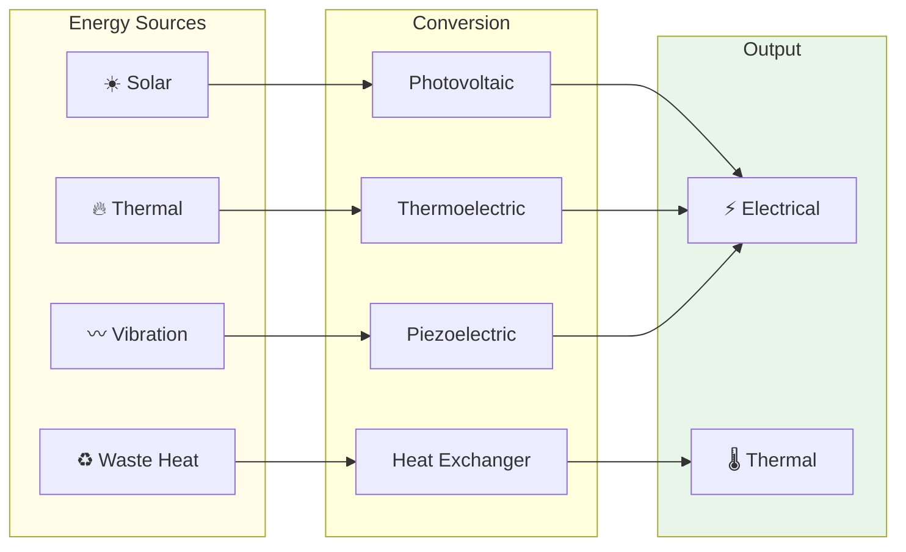

# 53-30-80-00 — Energy Renewables Overview

| Field | Value |
|-------|-------|
| **Document ID** | ATA53-30-80-00-OVR-002 |
| **Version** | 1.0 |
| **Date** | 2025-11-26 |
| **Status** | DRAFT |

---

## Purpose

This document provides an overview of the Energy Renewables subsystem (Band 80) within ANCHORS, defining the scope, key technologies, and energy contribution targets.

---

## Subsystem Description

The Energy Renewables subsystem captures ambient energy from:

1. **Solar radiation** — Photovoltaic cells on fuselage
2. **Thermal gradients** — Thermoelectric generators
3. **Mechanical vibration** — Piezoelectric/electromagnetic harvesters
4. **Waste heat** — Heat recovery exchangers

---

## Energy Contribution Summary

| Technology | Peak Power | Average (Cruise) | Annual Contribution |
|------------|------------|------------------|---------------------|
| Solar PV | 3.5 kW | 1.8 kW | 3,000 kWh |
| TEG | 1.0 kW | 0.8 kW | 1,400 kWh |
| Vibration | 35 W | 25 W | 40 kWh |
| **Total Electrical** | **4.5 kW** | **2.6 kW** | **4,440 kWh** |
| Heat Recovery | — | 2.0 kW (thermal) | — |

---

## Key Components

### 53-30-80-01: Solar Panel Array

| Parameter | Value |
|-----------|-------|
| Technology | Flexible III-V multi-junction |
| Efficiency | 28% (STC) |
| Area | 15 m² |
| Weight | 37.5 kg |

### 53-30-80-02: TEG Module

| Parameter | Value |
|-----------|-------|
| Type | Bismuth telluride (Bi₂Te₃) |
| Modules | 20 |
| ΔT | 180-230°C |
| Output | 50 W/module |

---

## Document Control

- **Generated with assistance of:** AI (GitHub Copilot)
- **Prompted by:** Amedeo Pelliccia
- **Status:** DRAFT
- **Last AI update:** 2025-11-26
